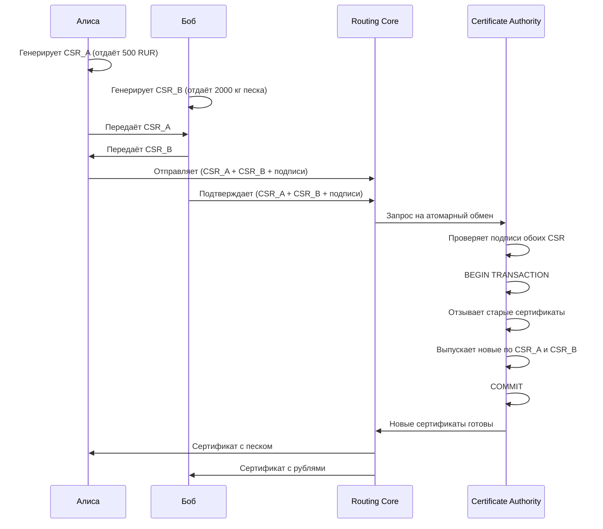
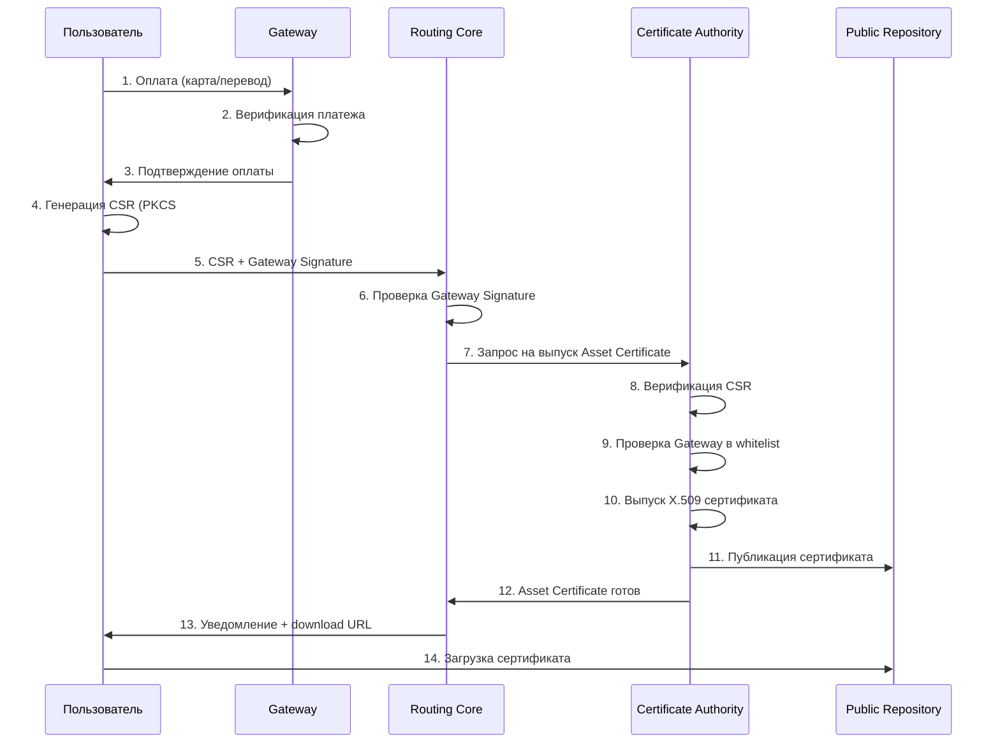
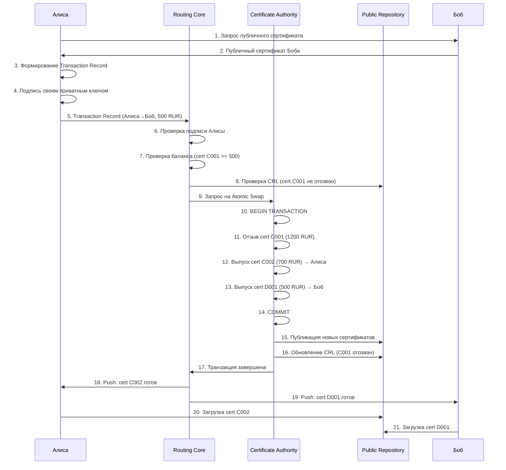
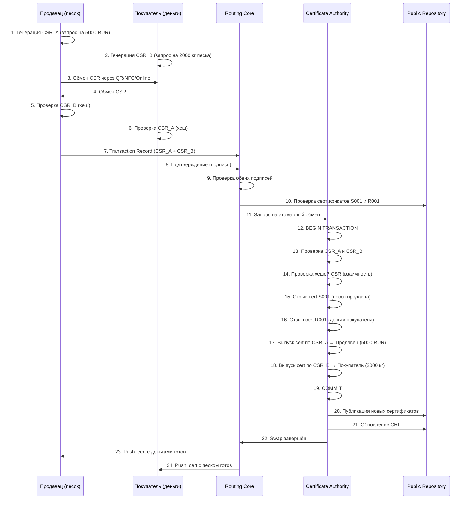
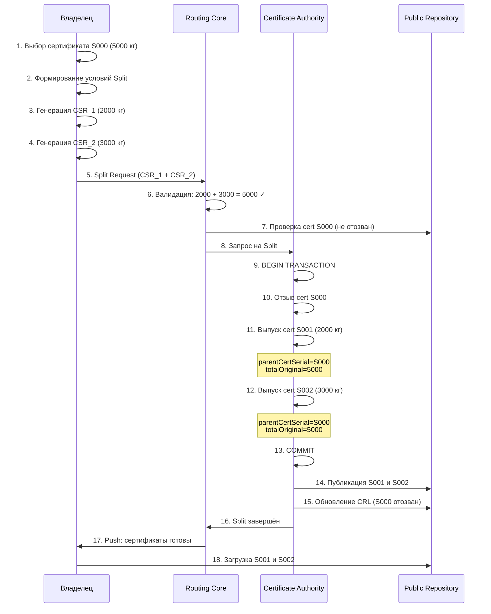
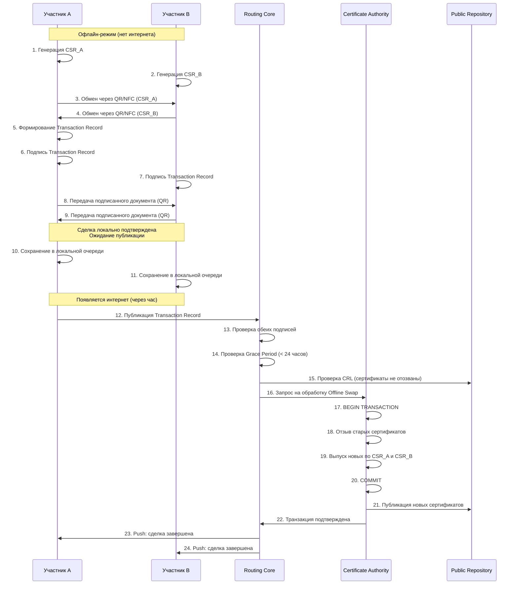

# 10. ТЕХНИЧЕСКИЕ ФОРМАТЫ

[↑ Вернуться к оглавлению](Home.md)


> Данный раздел описывает технические форматы данных TRS. Для понимания концептуальной роли X.509 в системе см. **раздел 6.1 Формат X.509 в TRS**. Практическое применение описанных форматов в клиринговых операциях см. **раздел 11 — Клиринг и Settlement**.

------------------------------------------------------------------------

## 10.1. Структура сертификата X.509 (пример)

Asset Certificate в TRS — это стандартный сертификат X.509 с дополнительными расширениями (OID) для описания активов.

### Базовая структура X.509

Сертификат состоит из трёх основных блоков:

**1. Данные сертификата (TBSCertificate):**

- Версия, серийный номер
- Алгоритм подписи
- Издатель (CA)
- Субъект (владелец актива)
- Срок действия
- Открытый ключ
- Расширения (Extensions)

**2. Алгоритм подписи:**

- ECDSA, RSA или EdDSA

**3. Подпись CA:**

- Криптографическая подпись всех данных сертификата

### Пример Asset Certificate (текстовый вид)

```
    Certificate:
        Data:
            Version: 3 (0x2)
            Serial Number: 
                a0:01:23:45:67:89:ab:cd
            Signature Algorithm: ecdsa-with-SHA256
            Issuer: CN=TRS CA, O=Treasures Routing System, C=NL
            Validity
                Not Before: Oct 13 12:00:00 2025 GMT
                Not After : Oct 13 12:00:00 2026 GMT
            Subject: CN=alice@example.com, O=TRS Client
            Subject Public Key Info:
                Public Key Algorithm: id-ecPublicKey
                    Public-Key: (256 bit)
                    pub:
                        04:8d:07:b8:c3:42:9e:f1:d0:5a:88:33:6f:12:45:
                        67:89:ab:cd:ef:01:23:45:67:89:ab:cd:ef:01:23:
                        45:67:89:ab:cd:ef:01:23:45:67:89:ab:cd:ef:01:
                        23:45:67:89:ab:cd:ef:01:23:45:67:89:ab:cd:ef
                    ASN1 OID: prime256v1
                    NIST CURVE: P-256
            X509v3 extensions:
                X509v3 Key Usage: critical
                    Digital Signature, Key Encipherment
                X509v3 Extended Key Usage:
                    TLS Web Client Authentication, Code Signing
                X509v3 Basic Constraints: critical
                    CA:FALSE
                X509v3 Subject Key Identifier:
                    8D:07:B8:C3:42:9E:F1:D0:5A:88:33:6F:12:45:67:89
                X509v3 Authority Key Identifier:
                    keyid:AB:CD:EF:01:23:45:67:89:AB:CD:EF:01:23:45:67:89
                X509v3 CRL Distribution Points:
                    Full Name:
                      URI:https://repo.trs/crl/latest.crl
                Authority Information Access:
                    OCSP - URI:https://ocsp.trs

                # === Расширения для активов (Custom OID) ===
                1.3.6.1.4.1.XXXXX.1.1 (Asset Information):
                    assetID: asset_5000_rur_001
                    assetType: RUR
                    quantity: 5000
                    totalOriginal: 5000
                    divisible: true
                    gatewayID: freepay.gateway
                    registrationTx: reg_67890
                    issuedAt: 2025-10-13T12:00:00Z
                    parentCertSerial: null
                    splitFrom: null

        Signature Algorithm: ecdsa-with-SHA256
             30:45:02:21:00:d4:8a:3c:7f:12:34:56:78:9a:bc:de:f0:12:
             34:56:78:9a:bc:de:f0:12:34:56:78:9a:bc:de:f0:12:34:56:
             78:02:20:5a:bc:de:f0:12:34:56:78:9a:bc:de:f0:12:34:56:
             78:9a:bc:de:f0:12:34:56:78:9a:bc:de:f0:12:34:56:78
```

### Структура расширения Asset Information

Произвольное расширение с OID `1.3.6.1.4.1.XXXXX.1.1` содержит ASN.1 структуру:

```
    DivisibleAsset ::= SEQUENCE {
        assetID         UTF8String,
        assetType       UTF8String,
        quantity        INTEGER,
        totalOriginal   INTEGER,
        divisible       BOOLEAN,
        gatewayID       UTF8String,
        registrationTx  UTF8String,
        issuedAt        GeneralizedTime,
        parentCertSerial UTF8String OPTIONAL,
        splitFrom       UTF8String OPTIONAL
    }
```
> Детальное описание полей расширения и примеры для разных типов активов см. **раздел 6.3. Расширения (OID) для типов активов**.

### Форматы представления

**PEM (текстовый):**

```
    -----BEGIN CERTIFICATE-----
    MIIDXTCCAkWgAwIBAgIJAKCBIzcVZ4mrMA0GCSqGSIb3DQEBCwUAMEUxCzAJBgNV
    BAYTAk5MMSgwJgYDVQQKDB9UcmVhc3VyZXMgUm91dGluZyBTeXN0ZW0xDDAKBgNV
    ...
    -----END CERTIFICATE-----
```

**DER (бинарный):**  
Используется для передачи в компактном виде (Offline режим, NFC).

**Текстовый dump:**  
Результат команды `openssl x509 -in cert.pem -text -noout`

### Сериализация ASN.1/DER

X.509 сертификаты внутренне представлены в формате ASN.1 (Abstract Syntax Notation One), а на уровне передачи кодируются в DER (Distinguished Encoding Rules) — бинарный формат.

**Преимущества DER:**

- Компактность — в 2-3 раза меньше PEM
- Детерминированность — одинаковый результат кодирования
- Скорость парсинга — бинарный формат быстрее текстового

**Применение в TRS:**

> DER-формат используется в **Offline Mode** и при передаче через **NFC** для минимизации размера данных. Подробнее см. **раздел 9.4 Биометрия, QR, NFC**.

**Пример декодирования DER:**

```
    # Конвертация PEM → DER
    openssl x509 -in cert.pem -outform DER -out cert.der

    # Просмотр ASN.1 структуры
    openssl asn1parse -in cert.der -inform DER -dump

    # Вывод (фрагмент):
        0:d=0  hl=4 l= 853 cons: SEQUENCE          
        4:d=1  hl=4 l= 573 cons:  SEQUENCE          
        8:d=2  hl=2 l=   3 cons:   cont [ 0 ]        
       10:d=3  hl=2 l=   1 prim:    INTEGER           :02
       13:d=2  hl=2 l=   8 prim:   INTEGER           :A001234567890ABC
       23:d=2  hl=2 l=  10 cons:   SEQUENCE          
       25:d=3  hl=2 l=   8 prim:    OBJECT            :ecdsa-with-SHA256
       35:d=2  hl=2 l=  52 cons:   SEQUENCE          
       37:d=3  hl=2 l=  11 cons:    SET               
       39:d=4  hl=2 l=   9 cons:     SEQUENCE          
       41:d=5  hl=2 l=   3 prim:      OBJECT            :countryName
       46:d=5  hl=2 l=   2 prim:      PRINTABLESTRING   :NL
       ...
```

**Извлечение конкретного расширения (Asset Information):**

```
    openssl asn1parse -in cert.der -inform DER -strparse 645

    # где 645 — смещение начала расширения (из предыдущего вывода)
    # Результат покажет декодированную ASN.1 структуру DivisibleAsset
```

**Размеры форматов:**

| Формат          | Размер сертификата | Применение                  |
|-----------------|--------------------|-----------------------------|
| PEM (текст)     | ~1.2 КБ            | Хранение, передача по HTTPS |
| DER (бинарный)  | ~850 байт          | NFC, QR-коды, Offline Mode  |
| JSON (описание) | ~2.5 КБ            | REST API, читаемость        |

------------------------------------------------------------------------

## 10.2. Форматы Transaction Record

Transaction Record — документ, описывающий условия операции между участниками системы.

> **Важно:** TRS **не привязана к конкретному формату** сериализации данных. Система использует стандартные PKI-механизмы, а выбор формата Transaction Record зависит от контекста применения.

### Базовый принцип

Любой формат подходит для TRS, если он поддерживает:  
1. ✅ **Структурированное описание данных** (участники, активы, условия)  
2. ✅ **Цифровые подписи** (для проверки подлинности)  
3. ✅ **Верификацию целостности** (хеширование содержимого)

### Подход 1: Чистый PKI (PKCS#10 + PKCS#7)

Основной подход TRS — использование стандартных PKI-структур без дополнительных форматов.

#### Принцип работы

**Atomic Swap через CSR:**



**Структура CSR (PKCS#10):**

```
    Certificate Request:
        Subject: CN=alice@example.com, O=TRS
        Subject Public Key Info:
            Public Key Algorithm: id-ecPublicKey
            Public-Key: (256 bit)
        Attributes:
            challengePassword: [пароль для отзыва]
        Requested Extensions:
            # Данные запрашиваемого актива
            1.3.6.1.4.1.XXXXX.1.1:
                assetType: SAND
                quantity: 2000
                divisible: true

            # Данные об обмене (для Atomic Swap)
            1.3.6.1.4.1.XXXXX.1.2 (Transaction Context):
                transactionType: ATOMIC_SWAP
                transactionID: tx_swap_002
                counterpartyID: bob@example.com
                counterpartyCSRHash: sha256:abc123...
                myGivesAssetSerial: R001
                myGivesQuantity: 5000
                myReceivesAssetType: SAND
                myReceivesQuantity: 2000

        Signature Algorithm: ecdsa-with-SHA256
            [подпись Алисы]
```

#### Преимущества чистого PKI-подхода

| Преимущество             | Описание                                                        |
|--------------------------|-----------------------------------------------------------------|
| **Полная совместимость** | Работает с любым PKI-стеком (OpenSSL, BoringSSL, LibreSSL)      |
| **Нет зависимостей**     | Не требует JSON/XML парсеров                                    |
| **Стандартизация**       | PKCS#10 (RFC 2986), PKCS#7 (RFC 2315) — международные стандарты |
| **Аппаратная поддержка** | Работает с HSM, TPM, смарт-картами                              |
| **Минимальный размер**   | Бинарный формат компактнее текстовых                            |

#### Недостатки

- Менее читаем для человека
- Сложнее отладка без специализированных инструментов
- Требует понимания ASN.1 структур

------------------------------------------------------------------------

### Подход 2: JSON + JWS (для REST API)

Для удобства интеграции с веб-интерфейсами и мобильными приложениями Routing Core может принимать Transaction Record в формате JSON с подписью JWS (RFC 7515).

> JSON используется как **удобная надстройка** над базовым PKI-подходом. Внутри системы всё равно используются X.509 сертификаты и CSR.

#### Структура Transaction Record (JSON)

**Базовые поля:**

| Поле           | Тип           | Обязательность | Описание                                                     |
|----------------|---------------|----------------|--------------------------------------------------------------|
| transaction_id | string (UUID) | ✓              | Уникальный идентификатор операции                            |
| timestamp      | ISO 8601      | ✓              | Время создания документа                                     |
| type           | enum          | ✓              | ASSET_TRANSFER, ATOMIC_SWAP, SPLIT, REGISTRATION, WITHDRAWAL |
| participants   | object/array  | ✓              | Данные участников операции                                   |
| mode           | enum          | -             | ONLINE (по умолчанию), OFFLINE                               |
| metadata       | object        | -             | Дополнительная информация (описание, теги)                   |

#### Пример 1: Asset Transfer (простой P2P)
```
    {
      "transaction_id": "tx_transfer_001",
      "timestamp": "2025-10-13T14:30:00Z",
      "type": "ASSET_TRANSFER",
      "mode": "ONLINE",

      "sender": {
        "client_id": "alice@example.com",
        "asset_cert_serial": "C001",
        "quantity": 500,
        "asset_type": "RUR",
        "signature": {
          "algorithm": "ES256",
          "value": "MEUCIQDx7sN3...",
          "cert_thumbprint": "sha256:8d07b8c3..."
        }
      },

      "receiver": {
        "client_id": "bob@example.com",
        "public_cert_pem": "-----BEGIN CERTIFICATE-----...",
        "signature": {
          "algorithm": "ES256",
          "value": "MEQCIAsYp2...",
          "cert_thumbprint": "sha256:5a3f9d2e..."
        }
      },

      "routing_core": {
        "processed_at": "2025-10-13T14:30:04Z",
        "new_certificates": {
          "sender_cert_serial": "C002",
          "sender_remaining": 700,
          "receiver_cert_serial": "D001",
          "receiver_received": 500
        },
        "revoked_certs": ["C001"]
      }
    }
```

#### Пример 2: Atomic Swap (встречный обмен)
```
    {
      "transaction_id": "tx_swap_002",
      "timestamp": "2025-10-13T15:00:00Z",
      "type": "ATOMIC_SWAP",
      "mode": "ONLINE",

      "party_a": {
        "client_id": "seller@example.com",
        "gives": {
          "asset_type": "SAND",
          "quantity": 2000,
          "cert_serial": "S001",
          "csr_base64": "MIICZjCCAU4CAQAwIjE..."
        },
        "receives": {
          "asset_type": "RUR",
          "quantity": 5000
        },
        "signature": {
          "algorithm": "ES256",
          "value": "MEUCIQC3T8...",
          "cert_thumbprint": "sha256:ab12cd34..."
        }
      },

      "party_b": {
        "client_id": "buyer@example.com",
        "gives": {
          "asset_type": "RUR",
          "quantity": 5000,
          "cert_serial": "R001",
          "csr_base64": "MIICZjCCAU4CAQAwIjE..."
        },
        "receives": {
          "asset_type": "SAND",
          "quantity": 2000
        },
        "signature": {
          "algorithm": "ES256",
          "value": "MEYCQYD7u9...",
          "cert_thumbprint": "sha256:ef56gh78..."
        }
      },

      "atomic_conditions": {
        "all_or_nothing": true,
        "timeout_seconds": 300,
        "counterparty_csr_hash_a": "sha256:abc123...",
        "counterparty_csr_hash_b": "sha256:def456..."
      }
    }
```

#### Пример 3: Asset Split (деление актива)
```
    {
      "transaction_id": "tx_split_003",
      "timestamp": "2025-10-13T16:00:00Z",
      "type": "SPLIT",
      "mode": "ONLINE",

      "owner": {
        "client_id": "alice@example.com",
        "source_cert_serial": "S000",
        "source_quantity": 5000,
        "asset_type": "SAND"
      },

      "split_parts": [
        {
          "part_id": "part_1",
          "quantity": 2000,
          "csr_base64": "MIICZjCCAU4CAQAwIjE...",
          "recipient": "alice@example.com"
        },
        {
          "part_id": "part_2",
          "quantity": 3000,
          "csr_base64": "MIICZjCCAU4CAQAwIjE...",
          "recipient": "alice@example.com"
        }
      ],

      "signature": {
        "algorithm": "ES256",
        "value": "MEQCIF3s8P...",
        "cert_thumbprint": "sha256:1a2b3c4d..."
      },

      "validation": {
        "sum_equals_original": true,
        "total_original_preserved": 5000
      }
    }
```

#### Пример 4: Offline Transaction (отложенная публикация)
```
    {
      "transaction_id": "tx_offline_004",
      "timestamp": "2025-10-13T17:00:00Z",
      "type": "OFFLINE_SWAP",
      "mode": "OFFLINE",

      "grace_period_hours": 24,
      "exchange_method": "QR_CODE",

      "device_info": {
        "device_a": "mobile_android_uuid_12345",
        "device_b": "mobile_ios_uuid_67890",
        "location": {
          "latitude": 52.3676,
          "longitude": 4.9041,
          "accuracy_meters": 10
        }
      },

      "participants": {
        "party_a": { 
          /* аналогично Atomic Swap */
        },
        "party_b": { 
          /* аналогично Atomic Swap */
        }
      },

      "offline_proof": {
        "mutual_signatures": true,
        "timestamp_signed": "2025-10-13T17:00:15Z",
        "nonce_a": "random_bytes_a",
        "nonce_b": "random_bytes_b"
      },

      "publication": {
        "published_at": null,
        "published_by": null,
        "routing_core_confirmed_at": null
      }
    }
```

#### Подписание JSON (JWS)

Для подписания JSON используется стандарт JWS (RFC 7515):

**Процесс:**  
1. JSON сериализуется в canonical form (RFC 8785)  
2. Вычисляется SHA-256 хеш  
3. Участник подписывает хеш приватным ключом из PKCS#12  
4. Подпись в формате base64 добавляется в поле “signature”

**Верификация:**  
1. Routing Core извлекает публичный ключ из сертификата участника  
2. Проверяет подпись относительно хеша JSON  
3. Проверяет статус сертификата через CRL/OCSP

> Детальное описание механизма подписания см. **раздел 8.2. Предотвращение double-spending**.

------------------------------------------------------------------------

### Подход 3: XML + XMLDSig (для корпоративных систем)

Для интеграции с legacy-системами и корпоративными ERP/CRM TRS поддерживает Transaction Record в формате XML с подписью XMLDSig (RFC 3275).

**Применение:**

- Интеграция с SAP, Oracle ERP
- SOAP-сервисы
- Системы электронного документооборота

**Пример структуры Transaction Record:**

```xml
<?xml version="1.0" encoding="UTF-8"?>
<TransactionRecord xmlns="urn:trs:transaction:1.0">
  <TransactionID>tx_transfer_001</TransactionID>
  <Timestamp>2025-10-13T14:30:00Z</Timestamp>
  <Type>ASSET_TRANSFER</Type>
  
  <Sender>
    <ClientID>alice@example.com</ClientID>
    <AssetCertSerial>C001</AssetCertSerial>
    <TransferQuantity>500</TransferQuantity>
    <AssetType>RUR</AssetType>
  </Sender>
  
  <Receiver>
    <ClientID>bob@example.com</ClientID>
    <PublicCertPEM>-----BEGIN CERTIFICATE-----...</PublicCertPEM>
  </Receiver>
  
  <Signature xmlns="http://www.w3.org/2000/09/xmldsig#">
    <SignedInfo>
      <CanonicalizationMethod Algorithm="http://www.w3.org/2001/10/xml-exc-c14n#"/>
      <SignatureMethod Algorithm="http://www.w3.org/2001/04/xmldsig-more#ecdsa-sha256"/>
      <Reference URI="">
        <Transforms>
          <Transform Algorithm="http://www.w3.org/2000/09/xmldsig#enveloped-signature"/>
        </Transforms>
        <DigestMethod Algorithm="http://www.w3.org/2001/04/xmlenc#sha256"/>
        <DigestValue>j6lwx3rvEPO0vKtMup4NbeVu8nk=</DigestValue>
      </Reference>
    </SignedInfo>
    <SignatureValue>
      MEUCIQDx7sN3k2vP8tF6lG9hJ4mR5qT7uV8wX0yZ1aB2cD3eF4gIhAJ5kL6mN7oP8qR9sT0uV1wX2yZ3aB4cD5eF6gH7iJ8k
    </SignatureValue>
    <KeyInfo>
      <X509Data>
        <X509Certificate>
          MIIDXTCCAkWgAwIBAgIJAKCBIzcVZ4mrMA0GCSqGSIb3DQEBCwUAMEUxCzAJBgNV
          BAYTAk5MMSgwJgYDVQQKDB9UcmVhc3VyZXMgUm91dGluZyBTeXN0ZW0xDDAKBgNV
          ...
        </X509Certificate>
      </X509Data>
    </KeyInfo>
  </Signature>
</TransactionRecord>
```


#### Структура XMLDSig (детально)

Цифровая подпись в XML состоит из четырёх основных элементов:

**1. SignedInfo — подписываемая информация**

- `CanonicalizationMethod` — метод канонизации XML (приведение к стандартному виду)
- `SignatureMethod` — алгоритм подписи (ECDSA-SHA256, RSA-SHA256)
- `Reference` — ссылка на подписываемые данные  
  * `Transforms` — преобразования (например, enveloped-signature)  
  * `DigestMethod` — алгоритм хеширования (SHA-256)  
  * `DigestValue` — хеш подписываемых данных (base64)

**2. SignatureValue — значение подписи**  
Результат подписания SignedInfo приватным ключом, закодированный в base64.

**3. KeyInfo — информация о ключе**

- `X509Data` — данные X.509 сертификата  
  * `X509Certificate` — публичный сертификат подписанта (для проверки)  
  * `X509IssuerSerial` — издатель и серийный номер (опционально)

**4. Object — дополнительные объекты (опционально)**  
Может содержать timestamp, контрподписи или другие метаданные.

**Процесс подписания XML:**
```
    1. Канонизация документа (приведение к стандартному виду)
    2. Вычисление SHA-256 хеша → DigestValue
    3. Формирование SignedInfo с DigestValue
    4. Канонизация SignedInfo
    5. Подпись SignedInfo приватным ключом → SignatureValue
    6. Добавление KeyInfo с публичным сертификатом
    7. Встраивание <Signature> в документ
```

**Проверка XMLDSig:**
```
    1. Извлечение SignedInfo из <Signature>
    2. Канонизация SignedInfo
    3. Извлечение публичного ключа из KeyInfo
    4. Проверка SignatureValue относительно канонизированного SignedInfo
    5. Извлечение DigestValue из Reference
    6. Вычисление хеша документа (без <Signature>)
    7. Сравнение вычисленного хеша с DigestValue
```

> XMLDSig обеспечивает целостность документа и невозможность подделки подписи, аналогично JWS для JSON и CMS для бинарных структур.

------------------------------------------------------------------------

### Подход 4: CBOR + COSE (для IoT и embedded)

Для устройств с ограниченными ресурсами (IoT, встроенные системы) используется компактный бинарный формат CBOR (RFC 8949) с подписью COSE (RFC 8152).

**Преимущества:**

- Минимальный размер данных (в 2-3 раза меньше JSON)
- Быстрый парсинг
- Поддержка бинарных данных без base64

**Размеры форматов (сравнение):**

| Формат        | Размер Transaction Record | Применение               |
|---------------|---------------------------|--------------------------|
| JSON + JWS    | ~2.5 КБ                   | REST API, веб-интерфейсы |
| XML + XMLDSig | ~4.0 КБ                   | Корпоративные системы    |
| CBOR + COSE   | ~1.2 КБ                   | IoT, NFC, embedded       |
| PKCS#10 (CSR) | ~0.8 КБ                   | Чистый PKI-подход        |

------------------------------------------------------------------------

### Выбор формата

> Routing Core автоматически определяет формат входящего Transaction Record и преобразует его в единую внутреннюю структуру. Клиентские приложения могут использовать любой удобный формат.

**Рекомендации:**

| Контекст                   | Рекомендуемый формат | Причина                        |
|----------------------------|----------------------|--------------------------------|
| Мобильные приложения       | JSON + JWS           | Читаемость, отладка, REST API  |
| Веб-интерфейс              | JSON + JWS           | Нативная поддержка JavaScript  |
| Корпоративные интеграции   | XML + XMLDSig        | Совместимость с ERP/CRM        |
| IoT / Embedded             | CBOR + COSE          | Компактность, скорость         |
| Максимальная совместимость | PKCS#10 + PKCS#7     | Стандарт PKI, нет зависимостей |
| Offline Mode (QR/NFC)      | CBOR или DER (CSR)   | Минимальный размер             |

------------------------------------------------------------------------

## 10.3. Mapping форматов

Соответствие полей между различными форматами представления данных в TRS.

> Независимо от выбранного формата (X.509, JSON, XML, CBOR), семантика полей остаётся единой. Routing Core автоматически преобразует форматы при необходимости. CBOR маппится аналогично JSON по ключам (бинарная сериализация тех же структур).

### Таблица соответствия основных полей

| Поле X.509 (OID)   | Поле JSON                           | Поле XML            | Комментарий                                      |
|--------------------|-------------------------------------|---------------------|--------------------------------------------------|
| `assetID`          | `asset_id`                          | `<AssetID>`         | Уникальный идентификатор актива                  |
| `assetType`        | `asset_type`                        | `<AssetType>`       | Тип актива (CURRENCY, COMMODITY, DIGITAL, RIGHT) |
| `assetSubtype`     | `asset_subtype`                     | `<AssetSubtype>`    | Подтип (USD, EUR, BTC, TRX, SAND, etc.)          |
| `unit`             | `unit`                              | `<Unit>`            | Единица измерения (RUR, USD, kg, units, BTC)     |
| `quantity`         | `quantity`                          | `<Quantity>`        | Объём или сумма актива                           |
| `totalOriginal`    | `total_original`                    | `<TotalOriginal>`   | Исходное количество при делении                  |
| `divisible`        | `divisible`                         | `<Divisible>`       | Возможность деления (boolean)                    |
| `gatewayID`        | `gateway_id`                        | `<GatewayID>`       | Идентификатор Gateway                            |
| `registrationTx`   | `registration_tx`                   | `<RegistrationTx>`  | ID транзакции регистрации                        |
| `issuedAt`         | `issued_at`                         | `<IssuedAt>`        | Время выпуска (ISO 8601)                         |
| `parentCertSerial` | `parent_cert_serial`                | `<ParentCert>`      | Серийный номер родительского сертификата         |
| `splitFrom`        | `split_from`                        | `<SplitFrom>`       | ID транзакции, при которой произошло деление     |
| Subject CN         | `client_id`                         | `<ClientID>`        | Идентификатор владельца                          |
| Serial Number      | `cert_serial` / `asset_cert_serial` | `<AssetCertSerial>` | Серийный номер сертификата                       |
| Not Before         | `valid_from`                        | `<ValidFrom>`       | Начало срока действия                            |
| Not After          | `expires_at`                        | `<ExpiresAt>`       | Окончание срока действия                         |

### Mapping для Transaction Record

| Элемент                         | X.509 (CSR Extensions)                      | JSON                                      | XML                                     |
|---------------------------------|---------------------------------------------|-------------------------------------------|-----------------------------------------|
| ID транзакции                   | `1.3.6.1.4.1.XXXXX.1.2:transactionID`       | `transaction_id`                          | `<TransactionID>`                       |
| Тип операции                    | `1.3.6.1.4.1.XXXXX.1.2:transactionType`     | `type`                                    | `<Type>`                                |
| Временная метка                 | `1.3.6.1.4.1.XXXXX.1.2:timestamp`           | `timestamp`                               | `<Timestamp>`                           |
| Отправитель                     | Subject CN (в CSR)                          | `sender.client_id`                        | `<Sender><ClientID>`                    |
| Получатель                      | `1.3.6.1.4.1.XXXXX.1.2:counterpartyID`      | `receiver.client_id`                      | `<Receiver><ClientID>`                  |
| Публичный сертификат получателя | —                                           | `receiver.public_cert_pem`                | `<Receiver><PublicCertPEM>`             |
| Сертификат отправителя          | Serial Number (в CSR)                       | `sender.asset_cert_serial`                | `<Sender><AssetCertSerial>`             |
| Количество передаваемое         | `1.3.6.1.4.1.XXXXX.1.2:transferQuantity`    | `sender.quantity`                         | `<Sender><Quantity>`                    |
| Хеш CSR контрагента             | `1.3.6.1.4.1.XXXXX.1.2:counterpartyCSRHash` | `atomic_conditions.counterparty_csr_hash` | `<CounterpartyCSRHash>`                 |
| Подпись отправителя (значение)  | Signature (в CSR)                           | `sender.signature.value`                  | `<Sender><Signature><SignatureValue>`   |
| Алгоритм подписи отправителя    | Signature Algorithm (в CSR)                 | `sender.signature.algorithm`              | `<Sender><Signature><Algorithm>`        |
| Thumbprint cert отправителя     | —                                           | `sender.signature.cert_thumbprint`        | `<Sender><Signature><CertThumbprint>`   |
| Подпись получателя (значение)   | —                                           | `receiver.signature.value`                | `<Receiver><Signature><SignatureValue>` |
| Алгоритм подписи получателя     | —                                           | `receiver.signature.algorithm`            | `<Receiver><Signature><Algorithm>`      |
| Thumbprint cert получателя      | —                                           | `receiver.signature.cert_thumbprint`      | `<Receiver><Signature><CertThumbprint>` |

> **Примечание:** `cert_thumbprint` — SHA-256 хеш X.509 сертификата участника (используется для быстрой верификации без передачи полного сертификата). `algorithm` указывает на алгоритм подписи: ES256 (ECDSA-SHA256), RS256 (RSA-SHA256), EdDSA и т.п.

### Mapping для Atomic Swap

**Party A (продавец песка):**

| Логическое поле         | X.509 CSR_A                          | JSON                                        | XML                                   |
|-------------------------|--------------------------------------|---------------------------------------------|---------------------------------------|
| Отдаёт актив            | `myGivesAssetSerial: S001`           | `party_a.gives.cert_serial`                 | `<PartyA><Gives><CertSerial>`         |
| Отдаёт тип              | `myGivesAssetType: SAND`             | `party_a.gives.asset_type`                  | `<PartyA><Gives><AssetType>`          |
| Отдаёт количество       | `myGivesQuantity: 2000`              | `party_a.gives.quantity`                    | `<PartyA><Gives><Quantity>`           |
| Получает тип            | `myReceivesAssetType: RUR`           | `party_a.receives.asset_type`               | `<PartyA><Receives><AssetType>`       |
| Получает количество     | `myReceivesQuantity: 5000`           | `party_a.receives.quantity`                 | `<PartyA><Receives><Quantity>`        |
| CSR для нового актива   | Весь CSR_A (DER)                     | `party_a.gives.csr_base64`                  | `<PartyA><Gives><CSR>`                |
| Хеш CSR_B контрагента   | `counterpartyCSRHash: sha256:abc...` | `atomic_conditions.counterparty_csr_hash_b` | `<CounterpartyCSRHashB>`              |
| Алгоритм подписи CSR_A  | Signature Algorithm (в CSR)          | `party_a.signature.algorithm`               | `<PartyA><Signature><Algorithm>`      |
| Подпись CSR_A           | Signature (в CSR)                    | `party_a.signature.value`                   | `<PartyA><Signature><SignatureValue>` |
| Thumbprint cert Party A | —                                    | `party_a.signature.cert_thumbprint`         | `<PartyA><Signature><CertThumbprint>` |

**Party B (покупатель):**

| Логическое поле         | X.509 CSR_B                          | JSON                                        | XML                                   |
|-------------------------|--------------------------------------|---------------------------------------------|---------------------------------------|
| Отдаёт актив            | `myGivesAssetSerial: R001`           | `party_b.gives.cert_serial`                 | `<PartyB><Gives><CertSerial>`         |
| Отдаёт тип              | `myGivesAssetType: RUR`              | `party_b.gives.asset_type`                  | `<PartyB><Gives><AssetType>`          |
| Отдаёт количество       | `myGivesQuantity: 5000`              | `party_b.gives.quantity`                    | `<PartyB><Gives><Quantity>`           |
| Получает тип            | `myReceivesAssetType: SAND`          | `party_b.receives.asset_type`               | `<PartyB><Receives><AssetType>`       |
| Получает количество     | `myReceivesQuantity: 2000`           | `party_b.receives.quantity`                 | `<PartyB><Receives><Quantity>`        |
| CSR для нового актива   | Весь CSR_B (DER)                     | `party_b.gives.csr_base64`                  | `<PartyB><Gives><CSR>`                |
| Хеш CSR_A контрагента   | `counterpartyCSRHash: sha256:def...` | `atomic_conditions.counterparty_csr_hash_a` | `<CounterpartyCSRHashA>`              |
| Алгоритм подписи CSR_B  | Signature Algorithm (в CSR)          | `party_b.signature.algorithm`               | `<PartyB><Signature><Algorithm>`      |
| Подпись CSR_B           | Signature (в CSR)                    | `party_b.signature.value`                   | `<PartyB><Signature><SignatureValue>` |
| Thumbprint cert Party B | —                                    | `party_b.signature.cert_thumbprint`         | `<PartyB><Signature><CertThumbprint>` |

> **Важно:** `counterparty_csr_hash_a` и `counterparty_csr_hash_b` — это SHA-256 хеш от DER-представления CSR (не от base64, а от сырых байтов). Формат: `sha256:hex_string`. Это обеспечивает взаимную верификацию — каждый участник подписывает хеш CSR контрагента, что гарантирует согласие с условиями обмена.

### Примеры конвертации

**X.509 OID → JSON:**
```
    # Расширение в сертификате:
    1.3.6.1.4.1.XXXXX.1.1:
      assetID: asset_5000_rur_001
      assetType: CURRENCY
      assetSubtype: RUR
      unit: RUR
      quantity: 5000
      divisible: true

    # Эквивалент в JSON:
    {
      "asset_id": "asset_5000_rur_001",
      "asset_type": "CURRENCY",
      "asset_subtype": "RUR",
      "unit": "RUR",
      "quantity": 5000,
      "divisible": true
    }
```

**JSON → XML:**
```
    # JSON:
    {
      "sender": {
        "client_id": "alice@example.com",
        "asset_cert_serial": "C001",
        "quantity": 500,
        "signature": {
          "algorithm": "ES256",
          "value": "MEUCIQDx7...",
          "cert_thumbprint": "sha256:8d07b8c3..."
        }
      }
    }

    # XML:
    <Sender>
      <ClientID>alice@example.com</ClientID>
      <AssetCertSerial>C001</AssetCertSerial>
      <Quantity>500</Quantity>
      <Signature>
        <Algorithm>ES256</Algorithm>
        <SignatureValue>MEUCIQDx7...</SignatureValue>
        <CertThumbprint>sha256:8d07b8c3...</CertThumbprint>
      </Signature>
    </Sender>
```

**CBOR → JSON (концептуально):**
```
    # CBOR (шестнадцатеричный dump):
    a5                                      # map(5)
       6a                                   # text(10)
          61737365745f74797065              # "asset_type"
       68                                   # text(8)
          43555252454e4359                  # "CURRENCY"
       6d                                   # text(13)
          61737365745f73756274797065        # "asset_subtype"
       63                                   # text(3)
          525552                            # "RUR"
       68                                   # text(8)
          7175616e74697479                  # "quantity"
       19 1388                              # unsigned(5000)
       69                                   # text(9)
          646976697369626c65                # "divisible"
       f5                                   # true

    # JSON эквивалент:
    {
      "asset_type": "CURRENCY",
      "asset_subtype": "RUR",
      "quantity": 5000,
      "divisible": true
    }
```

### Валидация при конвертации

Routing Core выполняет следующие проверки при преобразовании между форматами:

**Обязательные поля:**  
✓ Все обязательные поля присутствуют  
✓ Типы данных соответствуют спецификации  
✓ Значения в допустимых диапазонах

**Семантическая согласованность:**  
✓ `quantity` ≤ `totalOriginal` (для делимых активов)  
✓ Сумма `split_parts` = исходному `quantity`  
✓ Хеш CSR контрагента совпадает при Atomic Swap (SHA-256 от DER)  
✓ `cert_thumbprint` соответствует публичному сертификату участника

**Подписи:**  
✓ Формат подписи соответствует алгоритму (`algorithm`: ES256, RS256, EdDSA)  
✓ Подпись проверяется относительно публичного ключа  
✓ Сертификат подписанта не отозван (CRL/OCSP)  
✓ `cert_thumbprint` совпадает с SHA-256 хешом сертификата

> Mapping форматов обеспечивает универсальность TRS — клиенты могут использовать любой удобный формат, а система гарантирует семантическую целостность.

### Унификация терминов по количеству

> **Важно:** По всей документации TRS используется единое поле `quantity` для обозначения количества актива. Это применяется во всех форматах (X.509 OID, JSON, XML, CBOR) и всех операциях (Transfer, Split, Swap, Registration). Альтернативные названия (`amount`, `transfer_quantity`, `sum`) не используются для избежания путаницы.

------------------------------------------------------------------------

## 10.4. OpenSSL конфигурация

Примеры конфигурации OpenSSL для работы с TRS.

### Конфигурация CA

Файл `openssl-ca.cnf` для Certificate Authority:
```
    [ ca ]
    default_ca = CA_default

    [ CA_default ]
    dir               = /var/trs/ca
    certs             = $dir/certs
    crl_dir           = $dir/crl
    new_certs_dir     = $dir/newcerts
    database          = $dir/index.txt
    serial            = $dir/serial
    RANDFILE          = $dir/private/.rand

    private_key       = $dir/private/ca-key.pem
    certificate       = $dir/certs/ca-cert.pem

    crlnumber         = $dir/crlnumber
    crl               = $dir/crl/ca-crl.pem
    crl_extensions    = crl_ext
    default_crl_days  = 30

    default_md        = sha256
    name_opt          = ca_default
    cert_opt          = ca_default
    default_days      = 365
    preserve          = no
    policy            = policy_loose

    [ policy_loose ]
    countryName             = optional
    stateOrProvinceName     = optional
    localityName            = optional
    organizationName        = optional
    organizationalUnitName  = optional
    commonName              = supplied
    emailAddress            = optional

    [ req ]
    default_bits        = 2048
    default_md          = sha256
    default_keyfile     = private/ca-key.pem
    distinguished_name  = req_distinguished_name
    x509_extensions     = v3_ca
    string_mask         = utf8only

    [ req_distinguished_name ]
    countryName                     = Country Name (2 letter code)
    countryName_default             = NL
    stateOrProvinceName             = State or Province Name
    stateOrProvinceName_default     = North Holland
    localityName                    = Locality Name
    localityName_default            = Amsterdam
    organizationName                = Organization Name
    organizationName_default        = Treasures Routing System
    commonName                      = Common Name
    commonName_max                  = 64

    [ v3_ca ]
    subjectKeyIdentifier = hash
    authorityKeyIdentifier = keyid:always,issuer
    basicConstraints = critical, CA:true
    keyUsage = critical, digitalSignature, cRLSign, keyCertSign

    [ v3_client_cert ]
    basicConstraints = CA:FALSE
    nsCertType = client, email
    nsComment = "TRS Client Certificate"
    subjectKeyIdentifier = hash
    authorityKeyIdentifier = keyid,issuer
    keyUsage = critical, nonRepudiation, digitalSignature, keyEncipherment
    extendedKeyUsage = clientAuth, emailProtection
    crlDistributionPoints = URI:https://repo.trs/crl/latest.crl
    authorityInfoAccess = OCSP;URI:https://ocsp.trs

    [ v3_asset_cert ]
    basicConstraints = CA:FALSE
    subjectKeyIdentifier = hash
    authorityKeyIdentifier = keyid,issuer
    keyUsage = critical, digitalSignature
    crlDistributionPoints = URI:https://repo.trs/crl/latest.crl
    authorityInfoAccess = OCSP;URI:https://ocsp.trs

    # Расширение для активов
    1.3.6.1.4.1.XXXXX.1.1 = ASN1:SEQUENCE:asset_info

    [ asset_info ]
    assetID         = UTF8:asset_5000_rur_001
    assetType       = UTF8:RUR
    quantity        = INTEGER:5000
    totalOriginal   = INTEGER:5000
    divisible       = BOOLEAN:TRUE
    gatewayID       = UTF8:freepay.gateway
    registrationTx  = UTF8:reg_67890
    issuedAt        = UTCTIME:251013120000Z
```

### Генерация клиентского сертификата

**Шаг 1: Генерация приватного ключа клиента**
```
    openssl ecparam -genkey -name prime256v1 -out client-key.pem
```

**Шаг 2: Создание CSR**
```
    openssl req -new -key client-key.pem -out client-csr.pem 
      -subj "/CN=alice@example.com/O=TRS Client"
```

**Шаг 3: Подпись CSR через CA**
```
    openssl ca -config openssl-ca.cnf 
      -extensions v3_client_cert 
      -days 365 
      -in client-csr.pem 
      -out client-cert.pem
```

**Шаг 4: Создание PKCS#12 контейнера**
```
    openssl pkcs12 -export 
      -in client-cert.pem 
      -inkey client-key.pem 
      -certfile ca-cert.pem 
      -out client.p12 
      -passout pass:SecurePassword123
```

### Генерация Asset Certificate

**CSR для актива (с расширениями):**
```
    openssl req -new -key client-key.pem 
      -out asset-csr.pem 
      -subj "/CN=alice@example.com/O=TRS Asset" 
      -config <(cat <<EOF
    [ req ]
    distinguished_name = req_dn
    req_extensions = asset_ext

    [ req_dn ]
    CN = alice@example.com
    O = TRS Asset

    [ asset_ext ]
    1.3.6.1.4.1.XXXXX.1.1 = ASN1:SEQUENCE:asset_info

    [ asset_info ]
    assetID = UTF8:asset_5000_rur_001
    assetType = UTF8:RUR
    quantity = INTEGER:5000
    divisible = BOOLEAN:TRUE
    EOF
    )
```

**Подпись Asset CSR через CA:**
```
    openssl ca -config openssl-ca.cnf 
      -extensions v3_asset_cert 
      -days 365 
      -in asset-csr.pem 
      -out asset-cert.pem
```

### Проверка сертификата

**Просмотр содержимого:**
```
    openssl x509 -in asset-cert.pem -text -noout
```

**Проверка подписи CA:**
```
    openssl verify -CAfile ca-cert.pem asset-cert.pem
```

**Проверка через CRL:**
```
    openssl verify -CAfile ca-cert.pem -crl_check 
      -CRLfile crl/latest.crl asset-cert.pem
```

### Генерация и публикация CRL

**Отзыв сертификата:**
```
    openssl ca -config openssl-ca.cnf 
      -revoke asset-cert.pem 
      -crl_reason cessationOfOperation
```

**Генерация CRL:**
```
    openssl ca -config openssl-ca.cnf -gencrl -out crl/latest.crl
```

**Просмотр CRL:**
```
    openssl crl -in crl/latest.crl -text -noout
```

------------------------------------------------------------------------

## 10.5. Схемы процессов

Визуализация основных процессов TRS.

### Процесс Asset Registration (Cash-in)



### Процесс Asset Transfer (Online P2P)



### Процесс Atomic Swap (встречный обмен)



### Процесс Asset Split (деление актива)


### Процесс Offline Transaction (QR/NFC)



------------------------------------------------------------------------

## Итог раздела 10

Раздел описывает технические форматы данных, используемые в TRS.

**Ключевые выводы:**

- **X.509 сертификаты** — основа системы, стандартная структура с произвольными расширениями (OID)
- **ASN.1/DER сериализация** — компактный бинарный формат для Offline и NFC-транзакций
- **Transaction Record** — формат не привязан к JSON, поддерживаются любые структурированные форматы с подписями
- **Чистый PKI-подход** (PKCS#10 + PKCS#7) — основной механизм, максимальная совместимость
- **JSON + JWS** — удобная надстройка для REST API и веб-интерфейсов
- **XML + XMLDSig** — для корпоративных систем с детальной структурой подписи
- **CBOR + COSE** — компактный формат для IoT и embedded систем
- **Mapping форматов** — универсальная конвертация между X.509, JSON, XML и CBOR
- **OpenSSL** — универсальный инструмент для работы с сертификатами TRS
- **Mermaid-диаграммы** — наглядная визуализация процессов системы

Все форматы обеспечивают единую цель — проверяемый обмен активами через цифровые сертификаты и подписи.

> Практическое применение описанных форматов в клиринговых операциях, взаимозачётах и Settlement см. **раздел 11. БИЗНЕС-КЕЙСЫ**, где форматы используются для реальных бизнес-сценариев.


[↓ Перейти к следующему разделу](TRS_11.md)

[↑ Вернуться к оглавлению](Home.md)