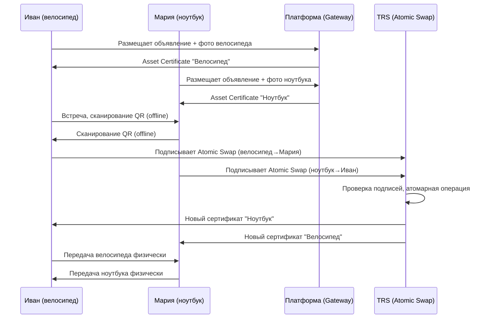
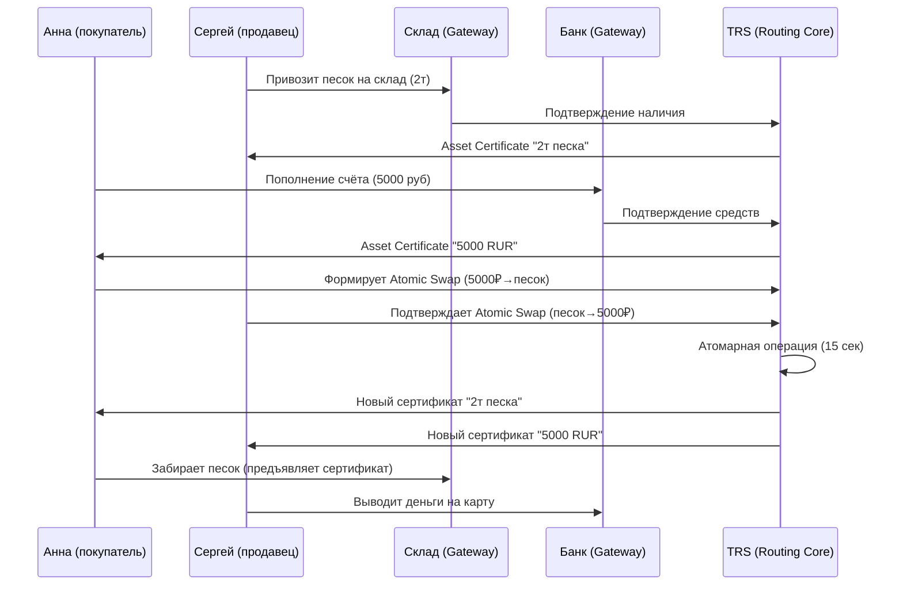
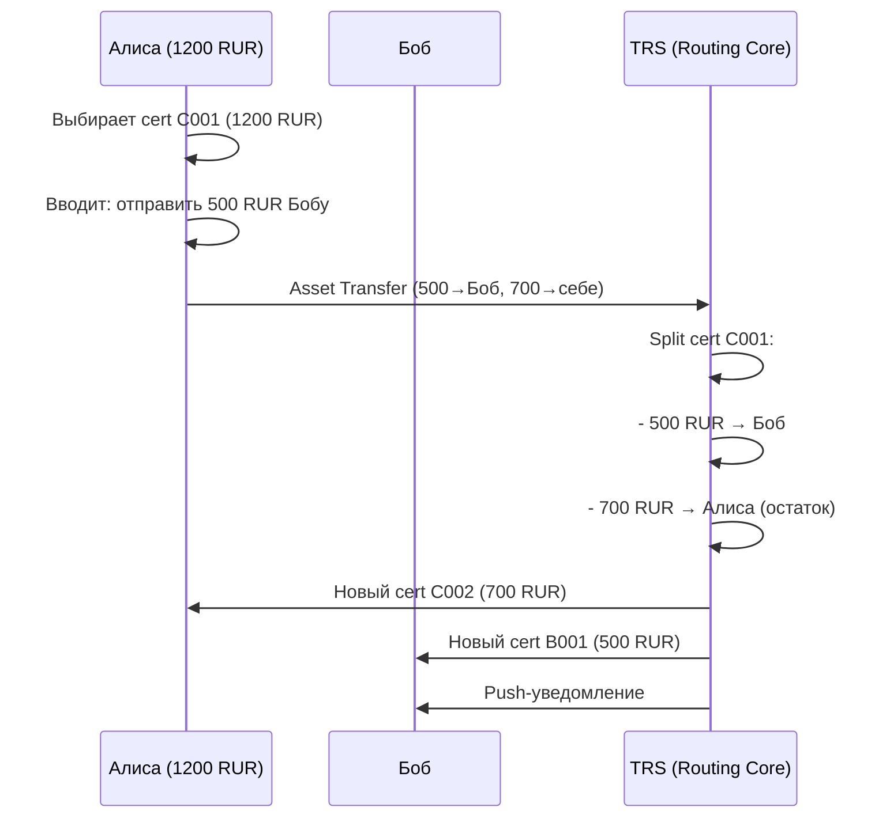
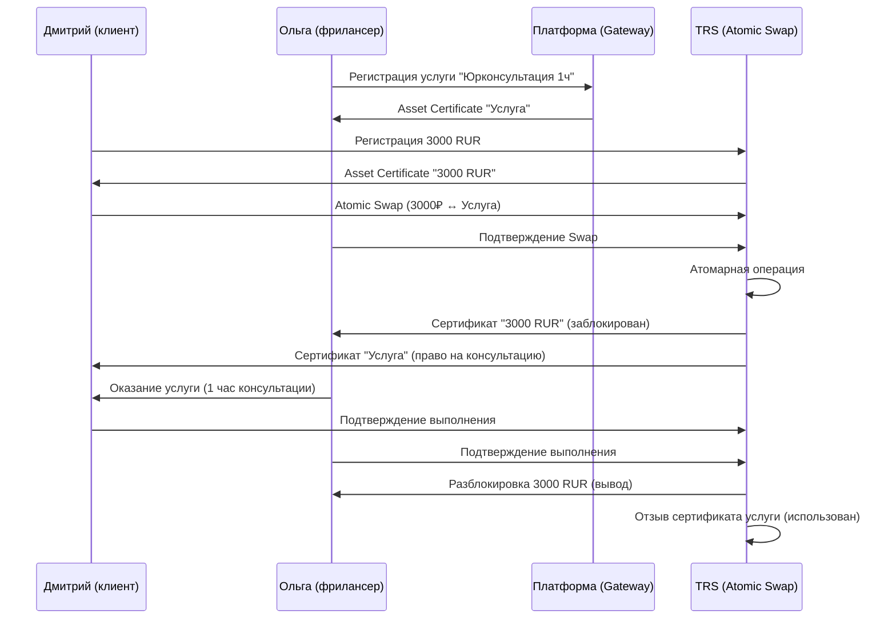
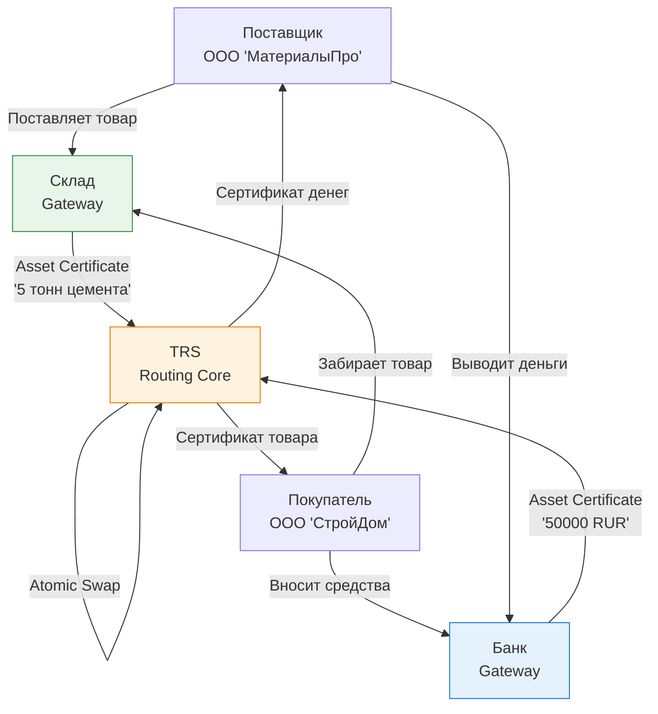

# 11. БИЗНЕС-КЕЙСЫ

[↑ Вернуться к оглавлению](Home.md)

Раздел 11 демонстрирует универсальность TRS - систему можно применить в любой модели обмена, не внося изменений в технический уровень. Все описанные кейсы реализуются через одни и те же принципы Value Routing и атомарные транзакции X.509.

> TRS - это не специализированная платёжная система или блокчейн для конкретной отрасли. Это **универсальная инфраструктура обмена**, где актив может быть деньгами, товаром, услугой, правом или цифровым предметом. Механизм Atomic Swap работает одинаково для всех типов активов.

------------------------------------------------------------------------

## 11.1. Обмен между физическими лицами (P2P)

### 11.1.1. Универсальный обмен активами

#### Концепция

TRS обеспечивает прямой обмен **любыми типами активов** между физическими лицами без посредников. В отличие от платёжных систем (ориентированных только на деньги) или маркетплейсов (ориентированных на товары), TRS поддерживает универсальную модель обмена:

- **Бартер** - товар ↔ товар (велосипед ↔ ноутбук)
- **Классическая торговля** - товар ↔ деньги (песок ↔ рубли)
- **Услуги** - право/услуга ↔ деньги или товар (консультация ↔ оплата)
- **Денежные переводы** - деньги ↔ деньги (частный случай обмена активов одного типа)

> Ключевое отличие TRS: система не делает различий между типами активов. **Механизм Atomic Swap универсален** - те же самые X.509 сертификаты и те же процессы работают для любых комбинаций обмена.

#### Традиционные подходы и их ограничения

| Тип сделки        | Традиционный подход                         | Проблемы                                                          |
|-------------------|---------------------------------------------|-------------------------------------------------------------------|
| Бартер            | Личная встреча, обмен на честность          | Риск обмана, нет гарантий, невозможно офлайн-проверку             |
| Товар↔Деньги      | Предоплата / Постоплата / Эскроу            | Риск для одной стороны; эскроу дорог (2-3%) и медленный (1-3 дня) |
| Услуга↔Деньги     | Платформы-посредники (Upwork, Freelance.ru) | Комиссия 10-20%, задержки выплат, зависимость от платформы        |
| Денежные переводы | Банки, платёжные системы                    | Комиссии 1-3%, задержки, требуется интернет и карты               |

#### Решение TRS

TRS устраняет все эти проблемы через единый механизм:

1. **Атомарность** - Atomic Swap гарантирует "всё или ничего" для любых типов активов  
2. **Офлайн-возможность** - QR/NFC позволяют обмениваться без интернета  
3. **Прозрачность** - цепочка сертификатов фиксирует происхождение активов  
4. **Минимальные комиссии** - нет посредников, только CA (0.1-0.5%)  
5. **Скорость** - 5-20 секунд вместо часов/дней

------------------------------------------------------------------------

#### Сценарий 1: Бартер (товар ↔ товар)

**Участники:**

- **Иван** - владелец велосипеда (стоимость ~15000 руб)
- **Мария** - владелица ноутбука (стоимость ~15000 руб)

**Проблема:**  
Иван и Мария хотят обменяться вещами через C2C платформу (Avito). Традиционно:

- Риск обмана - один передаёт вещь, другой может не передать свою
- Нет доверия между незнакомцами
- Платформа не гарантирует честность при бартере
- Невозможно проверить подлинность до встречи

**Решение через TRS:**

    

**Как это работает:**

1. **Регистрация активов**  
* Иван размещает велосипед на платформе с фото и описанием  
* Платформа (Gateway) выпускает Asset Certificate на велосипед  
* Мария делает то же самое для ноутбука

2. **Поиск и договорённость**  
* Иван и Мария договариваются об обмене через платформу  
* Видят историю сертификатов (откуда вещи, были ли споры)

3. **Встреча и обмен (Offline Mode)**  
* Встречаются лично, сканируют QR-коды друг друга  
* Формируют Transaction Record локально (без интернета)  
* Оба подписывают Atomic Swap на своих устройствах

4. **Физический обмен**  
* Обмениваются велосипедом и ноутбуком  
* Уверены, что цифровые сертификаты тоже обменяны

5. **Публикация (при появлении интернета)**  
* Любой из участников публикует Transaction Record  
* CA отзывает старые сертификаты и выпускает новые  
* Иван получает сертификат ноутбука, Мария - велосипеда

**Выгоды:**

| Аспект               | Традиционный бартер       | TRS                              |
|----------------------|---------------------------|----------------------------------|
| Гарантии             | Нет, зависит от честности | Криптографические (Atomic Swap)  |
| Работа без интернета | Да, но нет защиты         | Да, с защитой (Grace Period)     |
| История активов      | Нет                       | Да, вся цепочка владения         |
| Комиссия платформы   | 0% (но нет гарантий)      | 0.1% (с гарантиями)              |
| Риск обмана          | Высокий                   | Исключён (атомарность)           |
| Время                | 30 минут (встреча)        | 30 минут встреча + 15 секунд TRS |

------------------------------------------------------------------------

#### Сценарий 2: Товар на деньги (классическая купля-продажа)

**Участники:**

- **Сергей** - поставщик стройматериалов (песок, 2 тонны)
- **Анна** - строительная компания
- **Склад** - Gateway (подтверждает наличие товара)
- **Банк** - Gateway (подтверждает наличие денег)

**Проблема:**  
Анна покупает 2 тонны песка у Сергея за 5000 рублей. Традиционные варианты:

- **Предоплата** - Анна платит, потом получает товар  
  * Риск: Сергей может не поставить или поставить некачественный товар

- **Отсрочка платежа** - Анна получает товар, потом платит  
  * Риск: Анна может не заплатить

- **Эскроу** - третья сторона держит деньги до поставки  
  * Комиссия: 2-3% (150 рублей)  
  * Время: 1-3 дня на проверку и перевод  
  * Риск: зависимость от эскроу-агента

**Решение через TRS:**

**Как это работает:**

1. **Регистрация активов**  
* Сергей привозит песок на склад  
* Склад (Gateway) подтверждает наличие, качество, вес  
* TRS выпускает Asset Certificate "2 тонны песка, склад №5"  
* Анна вносит 5000 рублей через банк  
* Банк (Gateway) подтверждает средства  
* TRS выпускает Asset Certificate "5000 RUR"

2. **Формирование сделки**  
* Анна и Сергей договариваются о цене  
* Анна формирует Atomic Swap: "отдаю 5000 RUR, получаю 2т песка"  
* Сергей подтверждает: "отдаю 2т песка, получаю 5000 RUR"

3. **Атомарный обмен**  
* TRS проверяет подписи обеих сторон  
* CA отзывает оба исходных сертификата  
* CA выпускает новые сертификаты:  
* Анне - "2 тонны песка, склад №5"  
* Сергею - "5000 RUR"  
* Время операции: **15 секунд**

4. **Получение активов**  
* Анна приезжает на склад, предъявляет сертификат  
* Склад отдаёт песок (проверяет сертификат через CRL)  
* Сергей выводит 5000 рублей на карту через банк

**Сравнение решений:**

| Метрика                        | Предоплата | Постоплата | Эскроу            | TRS                        |
|--------------------------------|------------|------------|-------------------|----------------------------|
| Риск для покупателя            | Высокий    | Нет        | Низкий            | Нет                        |
| Риск для продавца              | Нет        | Высокий    | Низкий            | Нет                        |
| Комиссия                       | 0%         | 0%         | 2-3% (150₽)       | 0.1% (5₽)                  |
| Время сделки                   | Мгновенно  | Мгновенно  | 1-3 дня           | 15 секунд                  |
| Зависимость от третьей стороны | Нет        | Нет        | Да (эскроу-агент) | Нет (только CA)            |
| Прозрачность                   | Нет        | Нет        | Частичная         | Полная (Public Repository) |

**Выгоды для участников:**

**Для Анны (покупатель):**

- Нет риска - деньги и товар обмениваются атомарно
- Прозрачная история песка (откуда, когда, качество)
- Возможность проверки до оплаты (сертификат публичен)

**Для Сергея (продавец):**

- Нет риска неплатежа
- Мгновенное получение денег (15 секунд вместо дней)
- Минимальная комиссия (в 20-30 раз меньше эскроу)

**Для Склада:**

- Дополнительный доход от услуг Gateway
- Автоматизация выдачи (проверка сертификата)
- Репутация за честные подтверждения

------------------------------------------------------------------------

#### Сценарий 3: Денежный перевод (частный случай)

**Участники:**

- **Алиса** - отправитель (1200 RUR на счету)
- **Боб** - получатель (друг/родственник)

**Проблема:**  
Алиса хочет отправить 500 рублей Бобу. Традиционные способы:

- **Банковский перевод** - комиссия 1-3%, задержка до часа
- **Платёжные системы** (ЮMoney, Qiwi) - комиссия 1-2%, нужен интернет
- **Наличные** - нужна личная встреча, неудобно для крупных сумм

**Решение через TRS:**

> Денежный перевод - это **частный случай Asset Transfer**, где актив имеет тип CURRENCY. TRS работает с деньгами так же, как с товарами или услугами - через Asset Certificate и Atomic Swap.

**Как это работает:**

1. **У Алисы есть Asset Certificate на 1200 RUR** (cert C001)

2. **Алиса формирует перевод:**  
* Открывает приложение TRS  
* Сканирует QR Боба или вводит его client_id  
* Указывает сумму: 500 RUR

3. **TRS автоматически делит актив:**  
* Отзывает cert C001 (1200 RUR)  
* Выпускает cert C002 (700 RUR) на Алису  
* Выпускает cert B001 (500 RUR) на Боба

4. **Боб получает деньги:**  
* Push-уведомление на телефон  
* Новый сертификат B001 в его кошельке  
* Может сразу использовать для других операций

**Офлайн-вариант (встреча лично):**

1. Алиса и Боб встречаются  
2. Алиса сканирует QR Боба через камеру  
3. Формирует Transaction Record локально (без интернета)  
4. Передаёт через QR обратно  
5. Боб подписывает получение  
6. При появлении интернета любой публикует транзакцию

**Сравнение с традиционными методами:**

| Метрика          | Банк (онлайн) | ЮMoney     | Наличные  | TRS Online     | TRS Offline    |
|------------------|---------------|------------|-----------|----------------|----------------|
| Комиссия         | 1-3% (15₽)    | 1-2% (10₽) | 0%        | 0.1% (0.5₽)    | 0.1% (0.5₽)    |
| Время            | 5-60 минут    | 1-5 минут  | Мгновенно | 5-15 секунд    | 5-15 секунд    |
| Нужен интернет   | Да            | Да         | Нет       | Да             | Нет            |
| Нужна карта/счёт | Да            | Да         | Нет       | Нет            | Нет            |
| Лимиты           | Есть (часто)  | Есть       | Нет       | Минимальные    | Минимальные    |
| Анонимность      | Нет           | Частичная  | Да        | Псевдонимность | Псевдонимность |

**Выгоды:**

**Для отправителя (Алиса):**

- Минимальная комиссия
- Мгновенное исполнение
- Работает без карт и счетов
- Возможность офлайн (QR/NFC)

**Для получателя (Боб):**

- Получает мгновенно
- Может сразу использовать дальше
- Не нужно иметь банковский счёт
- Прозрачная история средств

> **Важно:** Хотя TRS может работать как платёжная система для денежных переводов, это лишь **один из сценариев**. Тот же механизм Asset Transfer работает для любых активов - товаров, услуг, прав, виртуальных предметов.

------------------------------------------------------------------------

#### Сценарий 4: Услуга на деньги

**Участники:**

- **Ольга** - юрист-фрилансер
- **Дмитрий** - клиент (нужна консультация)
- **Платформа** - маркетплейс фриланса (опционально)

**Проблема:**  
Дмитрий заказывает юридическую консультацию (1 час) у Ольги за 3000 рублей. Традиционные варианты:

- **Предоплата** - Дмитрий платит, потом получает услугу  
  * Риск: услуга может быть некачественной, Ольга может не оказать её

- **Постоплата** - Дмитрий получает услугу, потом платит  
  * Риск: Дмитрий может не заплатить после консультации

- **Фриланс-платформа** (Upwork, FL.ru)  
  * Комиссия: 10-20% (300-600 рублей)  
  * Задержка выплаты: 5-14 дней  
  * Зависимость от платформы (может заблокировать средства)

**Решение через TRS:**

**Как это работает:**

1. **Регистрация услуги**  
* Ольга создаёт Asset Certificate "Юридическая консультация 1 час"  
* Платформа (опционально) подтверждает квалификацию (лицензия, рейтинг)  
* Описание услуги, цена, условия фиксируются в сертификате

2. **Регистрация оплаты**  
* Дмитрий регистрирует 3000 рублей в TRS  
* Получает Asset Certificate "3000 RUR"

3. **Atomic Swap**  
* Дмитрий: "отдаю 3000 RUR, получаю право на консультацию"  
* Ольга: "отдаю право на консультацию, получаю 3000 RUR"  
* TRS выполняет атомарно:  
* Дмитрию - сертификат услуги  
* Ольге - сертификат 3000 RUR (заблокирован до подтверждения)

4. **Оказание услуги**  
* Ольга проводит консультацию (Zoom, встреча, чат)  
* Дмитрий получает услугу

5. **Подтверждение**  
* Дмитрий подтверждает: "услуга получена"  
* Ольга подтверждает: "услуга оказана"  
* TRS разблокирует 3000 RUR для Ольги  
* Сертификат услуги Дмитрия отзывается (использован)

**Вариант с арбитражем (спор):**

Если Дмитрий недоволен качеством:

- Дмитрий отказывается подтверждать выполнение
- Открывается диспут
- Арбитр (назначенный заранее или платформой) проверяет:  
  * Была ли консультация проведена?  
  * Соответствует ли качество описанию?
- Арбитр принимает решение:  
  * В пользу Ольги - разблокирует деньги  
  * В пользу Дмитрия - возвращает деньги, отзывает сертификат услуги

**Сравнение решений:**

| Метрика             | Предоплата | Постоплата | Фриланс-платформа | TRS                                   |
|---------------------|------------|------------|-------------------|---------------------------------------|
| Риск для клиента    | Высокий    | Нет        | Низкий            | Нет (Atomic Swap + арбитраж)          |
| Риск для фрилансера | Нет        | Высокий    | Низкий            | Нет (Atomic Swap + арбитраж)          |
| Комиссия            | 0%         | 0%         | 10-20% (600₽)     | 0.5% (15₽)                            |
| Задержка выплаты    | Нет        | -          | 5-14 дней         | Мгновенно (после подтверждения)       |
| Арбитраж            | Нет        | Нет        | Да (платформа)    | Да (независимый или платформа)        |
| Прозрачность        | Нет        | Нет        | Частичная         | Полная (история услуг в сертификатах) |

**Выгоды:**

**Для Дмитрия (клиент):**

- Защита от некачественной услуги (арбитраж)
- Прозрачная история фрилансера (рейтинг через сертификаты)
- Минимальная комиссия (в 20-40 раз меньше платформ)

**Для Ольги (фрилансер):**

- Защита от неплатежа (Atomic Swap)
- Мгновенное получение денег (без задержки 5-14 дней)
- Комиссия 0.5% вместо 10-20%
- Репутация через цепочку сертификатов (прозрачный рейтинг)

**Для платформы (если используется):**

- Доход от комиссий Gateway (регистрация услуг)
- Доход от арбитража (при спорах)
- Снижение нагрузки (автоматизация через TRS)

------------------------------------------------------------------------

#### Ключевые преимущества TRS в P2P обмене

| Преимущество           | Описание                                | Измеримая выгода                                    |
|------------------------|-----------------------------------------|-----------------------------------------------------|
| **Универсальность**    | Одна система для любых типов активов    | Не нужны разные платформы для денег, товаров, услуг |
| **Атомарность**        | Atomic Swap для любых комбинаций обмена | Риск обмана = 0%                                    |
| **Скорость**           | Онлайн-транзакции за 5-20 секунд        | В 100-1000 раз быстрее эскроу                       |
| **Стоимость**          | Комиссия 0.1-0.5%                       | В 20-200 раз дешевле посредников                    |
| **Офлайн-возможность** | QR/NFC обмен без интернета              | Работает везде, даже в удалённых местах             |
| **Прозрачность**       | Public Repository с историей активов    | Проверка репутации участников                       |
| **Независимость**      | Нет зависимости от платформ             | Участники владеют своими активами                   |

#### Применимость по типам обмена

| Тип обмена           | Примеры                         | Основные выгоды TRS                    |
|----------------------|---------------------------------|----------------------------------------|
| Бартер (товар↔товар) | Велосипед↔ноутбук, книги↔одежда | Атомарность, офлайн, история активов   |
| Товар↔Деньги         | Стройматериалы, техника, мебель | Без эскроу, мгновенно, дёшево          |
| Услуга↔Деньги        | Фриланс, консультации, ремонт   | Без платформ (комиссия 0.5% vs 10-20%) |
| Деньги↔Деньги        | P2P переводы, валютообмен       | Без банков, офлайн, мгновенно          |
| Право↔Деньги         | Лицензии, подписки, доступ      | Прозрачность прав, автоматизация       |

------------------------------------------------------------------------

## 11.2. Торговые платформы (B2B и B2C)

### 11.2.1. B2B обмен материалами и сырьём

#### Контекст

Рынок B2B торговли материалами (стройматериалы, металлы, химреактивы, продовольствие) характеризуется:

- **Высокие суммы сделок** - от 50 тыс. до миллионов рублей
- **Множество участников** - производители, дистрибьюторы, подрядчики
- **Логистическая сложность** - склады, доставка, таможня
- **Кредитные риски** - отсрочки платежей, неплатежи

**Проблемы традиционных подходов:**

- **Предоплата** - риск для покупателя (не поставят или некачественный товар)
- **Отсрочка** - риск для поставщика (не заплатят)
- **Аккредитивы** - дорого (1-3% суммы), медленно (3-10 дней), банковская бюрократия
- **Факторинг** - комиссия 5-15%, зависимость от факторинговой компании

**Статистика:**

- 30% B2B сделок срываются из-за недоверия
- Средняя комиссия аккредитива: 1.5-3% от суммы
- Среднее время оформления аккредитива: 5-7 дней

#### Решение через TRS

TRS устраняет необходимость в банковских аккредитивах через механизм Atomic Swap с участием Gateway (складов, логистических компаний).

**Участники:**

- **Поставщик** - производитель/дистрибьютор материалов
- **Покупатель** - строительная компания/завод
- **Склад** - Gateway (подтверждает наличие и качество товара)
- **Банк** - Gateway (подтверждает наличие средств)

#### Пример: Закупка цемента

**Участники:**

- **ООО "СтройДом"** - строительная компания (покупатель)
- **ООО "МатериалыПро"** - производитель цемента (поставщик)
- **Склад "Логистика+"** - Gateway (хранение и проверка качества)
- **Банк "Финанс"** - Gateway (подтверждение средств)

**Условия сделки:**

- Товар: 5 тонн цемента М500
- Цена: 50,000 рублей
- Доставка: самовывоз со склада
- Проверка качества: лабораторный анализ склада

**Процесс:**

**Шаг 1: Поставка товара на склад**

- "МатериалыПро" привозит 5 тонн цемента на склад "Логистика+"
- Склад проводит приёмку:  
  * Взвешивание (точный вес)  
  * Лабораторный анализ (марка цемента, качество)  
  * Упаковка, маркировка
- Склад (Gateway) формирует CSR с параметрами:  
  * Товар: цемент М500  
  * Количество: 5000 кг  
  * Качество: соответствует ГОСТ  
  * Местонахождение: ячейка A-15, склад "Логистика+"
- TRS выпускает Asset Certificate "5 тонн цемента М500"
- Сертификат передаётся "МатериалыПро"

**Шаг 2: Внесение средств покупателем**

- "СтройДом" переводит 50,000 рублей на счёт в банке "Финанс"
- Банк (Gateway) подтверждает наличие средств
- TRS выпускает Asset Certificate "50,000 RUR"
- Сертификат передаётся "СтройДом"

**Шаг 3: Atomic Swap**

- "СтройДом" и "МатериалыПро" договариваются о сделке
- Обе стороны формируют Atomic Swap:  
  * "СтройДом": отдаю 50,000 RUR → получаю 5т цемента  
  * "МатериалыПро": отдаю 5т цемента → получаю 50,000 RUR
- Обе стороны подписывают Transaction Record
- TRS выполняет атомарно (15-20 секунд):  
  * Отзыв старых сертификатов  
  * Выпуск новых:  
  * "СтройДом" → сертификат "5 тонн цемента М500, ячейка A-15"  
  * "МатериалыПро" → сертификат "50,000 RUR"

**Шаг 4: Получение активов**

- "СтройДом" приезжает на склад
- Предъявляет Asset Certificate (QR-код)
- Склад проверяет сертификат через CRL (не отозван)
- Выдаёт цемент
- "МатериалыПро" выводит 50,000 рублей на расчётный счёт

**Сравнение с аккредитивом:**

| Параметр            | Банковский аккредитив             | TRS                              |
|---------------------|-----------------------------------|----------------------------------|
| Комиссия            | 1.5-3% (750-1500₽)                | 0.1-0.2% (50-100₽)               |
| Время оформления    | 5-7 дней                          | 1-2 часа (подготовка документов) |
| Время расчёта       | 3-5 дней (после поставки)         | 15-20 секунд                     |
| Бюрократия          | Высокая (банковские формы)        | Минимальная (цифровые подписи)   |
| Риск для покупателя | Низкий (банк проверяет документы) | Нет (Atomic Swap)                |
| Риск для поставщика | Низкий (банк гарантирует платёж)  | Нет (Atomic Swap)                |
| Прозрачность        | Частичная (только через банк)     | Полная (Public Repository)       |

**Выгоды:**

**Для "СтройДом" (покупатель):**

- Экономия: 700-1400 рублей на комиссиях
- Скорость: деньги заморожены максимум на день (вместо недели)
- Уверенность: товар проверен складом, сертификат гарантирует качество
- Прозрачность: история цемента (откуда, когда произведён, как хранился)

**Для "МатериалыПро" (поставщик):**

- Экономия: 700-1400 рублей на комиссиях
- Мгновенный расчёт: деньги в тот же день (вместо 3-5 дней)
- Нет риска неплатежа: Atomic Swap гарантирует
- Упрощённый документооборот: цифровые подписи вместо банковских форм

***Для склада [Логистика+](*)**

- Новый источник дохода: комиссия за услуги Gateway
- Автоматизация выдачи: проверка сертификата вместо звонков банку
- Репутация: прозрачная история подтверждений

***Для банка [Финанс](*)**

- Сохранение клиента: "СтройДом" всё равно использует счёт
- Упрощение процессов: нет сложных аккредитивных операций
- Новый продукт: Gateway-услуги для TRS

#### Масштабирование: Цепочки поставок

TRS позволяет выстраивать сложные цепочки обмена:

**Пример: Производство → Дистрибьютор → Подрядчик → Застройщик**

1. **Завод** производит цемент → Asset Certificate "50 тонн, партия №123"  
2. **Дистрибьютор** покупает оптом → Atomic Swap (деньги ↔ цемент)  
3. **Дистрибьютор** делит партию:  
* 10 тонн → подрядчик A  
* 15 тонн → подрядчик B  
* 25 тонн → подрядчик C  
4. **Подрядчики** используют в проектах → передача застройщикам  
5. **Застройщики** отслеживают происхождение материалов → вся цепочка в сертификатах

**Преимущества цепочек в TRS:**

- Каждый сертификат хранит `parentCertSerial` и `totalOriginal`
- Можно отследить происхождение от завода до конечного объекта
- Контроль качества на всех этапах
- Прозрачность для регуляторов (налоговая, Ростехнадзор)

------------------------------------------------------------------------

### 11.2.2. C2C маркетплейсы (торговля между частными лицами)

#### Контекст

C2C платформы (Avito, OLX, Craigslist, Leboncoin) объединяют миллионы пользователей, продающих б/у товары, услуги и ручную работу. Основные проблемы:

- **Мошенничество** - 15-20% объявлений содержат обман (фейковые фото, несуществующий товар)
- **Отсутствие гарантий** - платформы не отвечают за качество и честность продавцов
- **Риски оплаты** - предоплата опасна, встреча с наличными неудобна для дорогих товаров
- **Фейковые отзывы** - накрутка рейтингов, невозможно проверить историю

**Текущие решения платформ:**

- Доставка с проверкой - комиссия 5-10%, работает только для небольших товаров
- Безопасная сделка - эскроу, комиссия 3-5%, доступна не везде
- Рейтинги - легко накручиваются, нет прозрачности

#### Решение через TRS

TRS превращает C2C платформу в прозрачную среду обмена с защитой обеих сторон через Asset Certificate и Atomic Swap.

#### Пример: Продажа ноутбука на Avito

**Участники:**

- **Максим** - продавец (ноутбук MacBook Pro, 2 года использования)
- **Екатерина** - покупатель
- **Avito** - платформа (Gateway для подтверждения товаров)

**Условия:**

- Товар: MacBook Pro 14" M1, 2022 год
- Цена: 85,000 рублей
- Состояние: хорошее, царапина на корпусе
- Встреча: лично в Москве

**Проблема традиционного подхода:**

- Екатерина боится: заплатить и получить сломанный ноутбук или вообще ничего
- Максим боится: отдать ноутбук и не получить деньги
- Встреча с наличными 85,000₽ небезопасна
- Безопасная сделка Avito: комиссия 4,250₽ (5%), срок 3-5 дней

**Процесс через TRS:**

**Шаг 1: Размещение объявления**

- Максим фотографирует ноутбук (все стороны, включая царапину)
- Загружает на Avito с описанием
- Avito (как Gateway) формирует Asset Certificate:  
  * Товар: MacBook Pro 14" M1  
  * Состояние: б/у, царапина на корпусе (фото прикреплены)  
  * Продавец: Максим, рейтинг через предыдущие сертификаты  
  * Местонахождение: Москва
- Максим получает сертификат на ноутбук

**Шаг 2: Екатерина регистрирует деньги**

- Екатерина вносит 85,000₽ через банк или Avito-кошелёк
- Получает Asset Certificate "85,000 RUR"

**Шаг 3: Встреча и проверка**

- Максим и Екатерина встречаются лично
- Екатерина проверяет ноутбук:  
  * Включает, проверяет работу  
  * Сверяет с фото в сертификате  
  * Всё соответствует описанию

**Шаг 4: Atomic Swap**

- Оба достают телефоны, сканируют QR друг друга
- Подписывают Atomic Swap локально (офлайн, за 15 секунд):  
  * Максим → Екатерине: ноутбук  
  * Екатерина → Максиму: 85,000₽
- Обмениваются ноутбуком и цифровыми сертификатами

**Шаг 5: Публикация**

- При появлении интернета (можно сразу на месте) транзакция публикуется
- Максим получает 85,000₽ на счёт
- Екатерина получает сертификат ноутбука (с полной историей владения)

**Сравнение решений:**

| Параметр        | Встреча с наличными    | Безопасная сделка Avito       | TRS                           |
|-----------------|------------------------|-------------------------------|-------------------------------|
| Комиссия        | 0%                     | 5% (4,250₽)                   | 0.1% (85₽)                    |
| Безопасность    | Риск грабежа, подделки | Высокая                       | Высокая (Atomic Swap)         |
| Время           | Встреча 1-2 часа       | 3-5 дней (доставка)           | Встреча 1-2 часа + 15 сек TRS |
| Проверка товара | Да (на месте)          | Частичная (курьер не эксперт) | Да (на месте)                 |
| История товара  | Нет                    | Нет                           | Да (вся цепочка владения)     |
| Работа офлайн   | Да                     | Нет                           | Да                            |

**Выгоды:**

**Для Екатерины (покупатель):**

- Видит товар вживую перед обменом
- Гарантия: либо получает ноутбук, либо деньги остаются
- История: откуда ноутбук, сколько владельцев, были ли проблемы
- Экономия: 4,165₽ на комиссиях

**Для Максима (продавец):**

- Нет риска неплатежа: Atomic Swap гарантирует
- Мгновенная оплата (15 секунд вместо 3-5 дней)
- Экономия: 4,165₽ на комиссиях
- Репутация: честные сертификаты создают доверие

**Для Avito:**

- Снижение мошенничества: прозрачная история товаров
- Новый доход: комиссия Gateway за подтверждение товаров
- Конкурентное преимущество: безопаснее и дешевле конкурентов
- Меньше жалоб: споры решаются прозрачно через арбитраж

#### Расширенный сценарий: Торговля автомобилями

**Особенность:** Автомобили - дорогие активы (500,000 - 3,000,000₽) с высоким риском мошенничества (скрученный пробег, юридические проблемы, залог).

**Как работает TRS:**

1. **Продавец регистрирует автомобиль**  
* Проходит проверку в сервисном центре (Gateway)  
* Сервис подтверждает: VIN, пробег, техническое состояние, юридическую чистоту  
* Asset Certificate содержит всю историю: ДТП, ремонты, владельцы

2. **Покупатель регистрирует деньги**  
* Вносит сумму через банк (например, 1,200,000₽)  
* Получает Asset Certificate на деньги

3. **Atomic Swap**  
* Встреча, покупатель осматривает автомобиль  
* Проверяет Asset Certificate через Public Repository (история прозрачна)  
* Подписывают обмен: автомобиль ↔ деньги  
* Переоформление в ГИБДД: новый сертификат в TRS автоматически обновляется

**Преимущества:**

- Невозможно продать залоговый автомобиль (будет в сертификате)
- Невозможно скрутить пробег (история в сертификатах сервисов)
- Полная юридическая чистота (прозрачность владения)
- Экономия на посредниках (автосалоны берут 3-5% комиссии)

------------------------------------------------------------------------

### 11.2.3. Товарные биржи

#### Контекст

Товарные биржи (Московская биржа, Chicago Mercantile Exchange) торгуют стандартизированными товарами: нефть, металлы, зерно, сахар. Особенности:

- **Высокая частота сделок** - тысячи операций в день
- **Клиринг между участниками** - взаимозачёты обязательств
- **Гарантийные обеспечения** - залоги для страховки сделок
- **Сложная инфраструктура** - депозитарии, клиринговые центры, регистраторы

**Проблемы текущих систем:**

- Высокие издержки инфраструктуры (IT, персонал, помещения)
- Медленные расчёты (T+2, T+3 - сделка сегодня, расчёт через 2-3 дня)
- Зависимость от клирингового центра (монополия)
- Сложность для малых участников (высокий порог входа)

#### Решение через TRS

TRS может выступать как альтернативная инфраструктура для товарной биржи, снижая издержки и ускоряя расчёты.

#### Пример: Торговля металлом

**Участники:**

- **Металлургический завод** - производитель (продавец)
- **Машиностроительный завод** - покупатель
- **Склад ответственного хранения** - Gateway (подтверждает наличие металла)
- **Банк** - Gateway (подтверждает средства)

**Традиционная схема (через биржу):**

1. Завод-продавец размещает заявку на продажу 100 тонн стали  
2. Завод-покупатель размещает заявку на покупку  
3. Биржа сводит заявки (матчинг)  
4. Клиринговый центр:  
* Фиксирует сделку  
* Рассчитывает взаимозачёты (если есть встречные обязательства)  
* Блокирует гарантийное обеспечение  
5. Депозитарий переоформляет право собственности  
6. Расчёты через 2-3 дня (T+2)  
7. Комиссии: биржа 0.1-0.3, клиринг 0.05-0.1, депозитарий 0.05%

**Схема через TRS:**

1. **Регистрация активов:**  
* Завод-продавец: 100 тонн стали на складе → Asset Certificate  
* Завод-покупатель: деньги в банке → Asset Certificate

2. **Матчинг заявок:**  
* Биржа сводит заявки (как обычно)  
* Вместо клирингового центра - TRS Routing Core

3. **Atomic Swap:**  
* Обе стороны подписывают обмен  
* TRS выполняет атомарно (15-20 секунд)  
* Новые сертификаты:  
* Покупателю - 100 тонн стали  
* Продавцу - деньги

4. **Получение товара:**  
* Покупатель забирает сталь со склада (предъявляет сертификат)  
* Продавец получает деньги на счёт

**Сравнение:**

| Параметр                | Традиционная биржа                   | TRS                        |
|-------------------------|--------------------------------------|----------------------------|
| Комиссии                | 0.2-0.5% (биржа+клиринг+депозитарий) | 0.05-0.1% (только CA)      |
| Время расчёта           | T+2 (2 дня)                          | T+0 (мгновенно, 15-20 сек) |
| Инфраструктура          | Клиринг, депозитарий, регистратор    | Только Routing Core + CA   |
| Гарантийное обеспечение | Требуется (блокировка средств)       | Не требуется (Atomic Swap) |
| Риск контрагента        | Есть (до расчёта)                    | Нет (атомарность)          |
| Прозрачность            | Частичная                            | Полная (Public Repository) |

**Выгоды для участников:**

**Для заводов (покупатели и продавцы):**

- Снижение комиссий в 2-5 раз
- Мгновенные расчёты (оборачиваемость капитала)
- Не нужно блокировать гарантийное обеспечение
- Прозрачная история сделок (аудит, налоговая)

**Для биржи:**

- Снижение затрат на инфраструктуру (не нужен клиринговый центр)
- Привлечение малых участников (низкий порог входа)
- Конкурентное преимущество (быстрее и дешевле)

**Для склада:**

- Автоматизация выдачи (проверка сертификата вместо звонков)
- Новый доход (Gateway-комиссии)

#### Клиринг и неттинг в TRS

**Особенность:** На товарных биржах участники часто имеют встречные обязательства. TRS поддерживает клиринг через механизм Settlement.

**Пример:**

Три участника за день совершили сделки:

- Завод A продал 50 тонн металла Заводу B
- Завод B продал 30 тонн металла Заводу C
- Завод C продал 20 тонн металла Заводу A

**Без неттинга (6 операций):**

- A → B: 50 тонн
- B → A: деньги за 50 тонн
- B → C: 30 тонн
- C → B: деньги за 30 тонн
- C → A: 20 тонн
- A → C: деньги за 20 тонн

**С неттингом в TRS (3 операции):**

- TRS рассчитывает чистые позиции:  
  * Завод A: отдал 50т, получил 20т → чистая позиция: -30т (должен получить деньги)  
  * Завод B: получил 50т, отдал 30т → чистая позиция: +20т (должен заплатить)  
  * Завод C: получил 30т, отдал 20т → чистая позиция: +10т (должен заплатить)
- TRS выпускает финальные сертификаты по чистым позициям
- Settlement: 1 операция вместо 6

**Выгоды неттинга:**

- Снижение числа операций в 2-10 раз
- Уменьшение объёма перемещения товаров
- Снижение комиссий
- Упрощение учёта

------------------------------------------------------------------------

## 11.3. Цифровые активы и виртуальные экономики

### 11.3.1. Игровые экономики

#### Контекст

Игровая индустрия - это рынок более $200 млрд, где внутриигровые активы (скины, оружие, валюта, персонажи) имеют реальную ценность. Проблемы:

- **Закрытые экосистемы** - нельзя вывести активы из игры
- **Монополия платформ** - Steam, Epic, PlayStation берут 30% комиссии
- **Невозможность P2P торговли** - все сделки через платформу
- **Мошенничество** - фейковые обмены, кража аккаунтов
- **Блокчейн-игры** - медленно, дорого (gas fees), сложно для обычных игроков

#### Решение через TRS

TRS позволяет создать открытую игровую экономику, где активы принадлежат игрокам и могут обмениваться между играми.

#### Пример 1: Торговля скинами CS:GO

**Участники:**

- **Игрок A** - владелец редкого скина (AWP Dragon Lore)
- **Игрок B** - покупатель (хочет купить за реальные деньги)
- **Steam** - платформа (Gateway, подтверждает наличие скина на аккаунте)

**Традиционная схема (Steam Market):**

- Продажа через Steam Market
- Комиссия Steam: 5% (платформа) + 10% (игра) = 15%
- Скин стоит 50,000₽ → комиссия 7,500₽
- Деньги заморожены в Steam Wallet (нельзя вывести)

**Схема через TRS:**

1. **Регистрация скина:**  
* Игрок A: скин AWP Dragon Lore на аккаунте Steam  
* Steam (Gateway) подтверждает наличие скина  
* Asset Certificate: "AWP Dragon Lore, Factory New, Float 0.01"

2. **Регистрация денег:**  
* Игрок B: 50,000₽ через банк  
* Asset Certificate: "50,000 RUR"

3. **Atomic Swap:**  
* Игрок A: отдаю скин → получаю 50,000₽  
* Игрок B: отдаю 50,000₽ → получаю скин  
* TRS выполняет обмен (15 секунд)  
* Steam API переносит скин на аккаунт Игрока B

4. **Результат:**  
* Игрок B получает скин в инвентаре  
* Игрок A получает 50,000₽ на карту (не Steam Wallet)

**Сравнение:**

| Параметр         | Steam Market                     | TRS                |
|------------------|----------------------------------|--------------------|
| Комиссия         | 15% (7,500₽)                     | 0.5% (250₽)        |
| Вывод денег      | Невозможен (только Steam Wallet) | Прямо на карту     |
| P2P торговля     | Нет (только через Market)        | Да (напрямую)      |
| Время            | Мгновенно                        | Мгновенно (15 сек) |
| Межигровой обмен | Невозможен                       | Возможен           |

**Выгоды:**

**Для игроков:**

- Экономия на комиссиях в 30 раз
- Реальный вывод денег (не виртуальный кошелёк)
- P2P обмены без посредников

**Для Steam:**

- Новая модель дохода: Gateway-комиссии вместо 15% монополии
- Конкурентное преимущество (открытая экономика привлекает игроков)

#### Пример 2: Межигровой обмен активами

**Инновация TRS:** Активы могут обмениваться между разными играми.

**Сценарий:**

- Игрок продаёт редкого персонажа в WoW (World of Warcraft)
- Покупает скин в Fortnite
- Всё через один Atomic Swap

**Как это работает:**

1. **Регистрация активов:**  
* WoW (Gateway): персонаж уровня 80 с эпическим снаряжением → Asset Certificate  
* Fortnite (Gateway): скин "Rare Outfit" → Asset Certificate

2. **Atomic Swap:**  
* Игрок A (WoW): отдаю персонажа → получаю скин Fortnite  
* Игрок B (Fortnite): отдаю скин → получаю персонажа WoW

3. **Результат:**  
* Персонаж WoW переходит к Игроку B  
* Скин Fortnite переходит к Игроку A  
* Обе игры получают Gateway-комиссии

**Выгоды межигрового обмена:**

- Игроки могут монетизировать время, потраченное в одной игре
- Игры получают новую аудиторию (игроки переходят за активами)
- Открытая экосистема вместо закрытых садов

------------------------------------------------------------------------

### 11.3.2. Фриланс-биржи и гонорары

#### Контекст

Рынок фриланса - $1.5 трлн глобально. Основные платформы: Upwork, Fiverr, Freelance.ru, Kwork. Проблемы:

- **Высокие комиссии** - 10-20% с фрилансера + 3-5% с заказчика
- **Задержки выплат** - 5-14 дней после завершения работы
- **Риски обеих сторон** - заказчик боится некачественной работы, фрилансер - неплатежа
- **Зависимость от платформы** - может заблокировать аккаунт или средства

#### Решение через TRS

TRS заменяет фриланс-платформу на децентрализованный обмен услуг с минимальными комиссиями.

#### Пример: Разработка логотипа

**Участники:**

- **Анна** - дизайнер-фрилансер
- **Компания "СтартапХ"** - заказчик
- **Портфолио-платформа** - Gateway (подтверждает квалификацию Анны)

**Условия:**

- Услуга: разработка логотипа
- Цена: 15,000₽
- Срок: 5 дней
- Правки: 2 раунда бесплатно

**Традиционная схема (Upwork):**

- Компания платит 15,000₽ + 5% комиссия = 15,750₽
- Upwork блокирует средства
- Анна выполняет работу
- Upwork удерживает 20% комиссию = 3,000₽
- Анна получает 12,000₽ через 7 дней после завершения
- Итого комиссии: 3,750₽ (25% от стоимости)

**Схема через TRS:**

1. **Регистрация услуги:**  
* Анна создаёт Asset Certificate "Разработка логотипа"  
* Портфолио (Gateway) подтверждает квалификацию (предыдущие работы, рейтинг)

2. **Регистрация оплаты:**  
* Компания регистрирует 15,000₽  
* Asset Certificate "15,000 RUR"

3. **Atomic Swap с условием:**  
* Компания: отдаю 15,000₽ → получаю логотип  
* Анна: отдаю услугу → получаю 15,000₽  
* Условие: деньги заблокированы до подтверждения выполнения

4. **Выполнение работы:**  
* Анна разрабатывает логотип (5 дней)  
* Отправляет результат компании

5. **Подтверждение:**  
* Компания проверяет работу  
* Подтверждает качество (цифровая подпись)  
* TRS разблокирует 15,000₽  
* Анна получает деньги мгновенно

6. **В случае спора:**  
* Привлекается арбитр (назначен заранее)  
* Арбитр проверяет работу относительно ТЗ  
* Принимает решение (обычно 1-3 дня)

**Сравнение:**

| Параметр            | Upwork         | TRS                             |
|---------------------|----------------|---------------------------------|
| Комиссия заказчика  | 5% (750₽)      | 0%                              |
| Комиссия фрилансера | 20% (3,000₽)   | 0.5% (75₽)                      |
| Итого комиссии      | 3,750₽ (25%)   | 75₽ (0.5%)                      |
| Задержка выплаты    | 7 дней         | Мгновенно (после подтверждения) |
| Арбитраж            | Да (платформа) | Да (независимый или платформа)  |
| Блокировка аккаунта | Риск есть      | Невозможна (децентрализация)    |

**Выгоды:**

**Для Анны (фрилансер):**

- Получает 14,925₽ вместо 12,000₽ (на 2,925₽ больше)
- Мгновенная выплата (вместо 7 дней)
- Невозможно заблокировать средства

**Для компании:**

- Платит 15,075₽ вместо 15,750₽ (экономия 675₽)
- Защита через арбитраж (как на Upwork)
- Прозрачная история фрилансера (сертификаты предыдущих работ)

------------------------------------------------------------------------

### 11.3.3. Контент-платформы и донаты

#### Контекст

Стримеры, блогеры, музыканты зарабатывают на донатах и подписках. Платформы: Twitch, YouTube, Patreon, Boosty. Проблемы:

- **Высокие комиссии** - 20-30% (Twitch 50, YouTube 30, Patreon 12%)
- **Задержки выплат** - 30-60 дней
- **Блокировки** - платформа может заблокировать канал и невыплаченные деньги
- **Зависимость от платформы** - нет переносимости аудитории

#### Решение через TRS

Прямые донаты между зрителями и авторами без посредников.

#### Пример: Донат стримеру

**Участники:**

- **Дмитрий** - стример (прямой эфир на Twitch)
- **Зрители** - 1000 человек смотрят стрим
- **Твич** - платформа (опционально, только как интерфейс)

**Традиционная схема (Twitch):***

- Зритель донатит 100₽
- Twitch берёт 50% = 50₽
- Стример получает 50₽ через 30-60 дней

**Схема через TRS:**

1. **Зритель регистрирует донат:**  
* 100₽ через банк или крипту  
* Asset Certificate "100 RUR"

2. **Прямой перевод стримеру:**  
* Зритель сканирует QR стримера (показан в трансляции)  
* Atomic Swap: 100₽ → стримеру  
* Время: 5 секунд

3. **Стример получает:**  
* 99.5₽ (комиссия TRS 0.5%)  
* Мгновенно, прямо во время стрима

**Сравнение:**

| Параметр           | Twitch     | YouTube    | Patreon   | TRS         |
|--------------------|------------|------------|-----------|-------------|
| Комиссия платформы | 50%        | 30%        | 8-12%     | 0.5%        |
| Задержка выплаты   | 30-60 дней | 30-60 дней | 1 месяц   | Мгновенно   |
| Риск блокировки    | Высокий    | Высокий    | Средний   | Нет         |
| Анонимность доната | Нет        | Нет        | Частичная | Опционально |

**Пример масштаба:**

Стример за месяц получает донатов на 100,000₽:

- Через Twitch: получит 50,000₽ через 30-60 дней
- Через TRS: получит 99,500₽ мгновенно

**Разница: 49,500₽ в месяц** (почти удвоение дохода)

**Выгоды для стримеров:**

- Доход увеличивается в 2 раза
- Мгновенные выплаты
- Независимость от платформы (можно стримить где угодно)
- Прямая связь с аудиторией

**Выгоды для зрителей:**

- Стример получает больше → качественнее контент
- Прозрачность (видно, сколько реально получил стример)
- Возможность анонимных донатов

------------------------------------------------------------------------

## 11.4. Корпоративные и государственные системы

### 11.4.1. Лицензирование программного обеспечения

#### Контекст

Рынок корпоративного ПО - это миллиарды долларов, где лицензии передаются между компаниями, подразделениями и странами. Проблемы:

- **Сложный учёт** - кто использует какую лицензию, где и когда
- **Вторичный рынок** - нелегальная перепродажа лицензий
- **Аудит** - дорого и долго проверять использование
- **Фрагментация** - разные системы у разных вендоров (Microsoft, Adobe, SAP)

#### Решение через TRS

TRS превращает лицензию в Asset Certificate, который можно передавать, делить (для плавающих лицензий) и проверять.

#### Пример: Лицензия Microsoft Office для корпорации

**Участники:**

- **Корпорация A** - купила 1000 лицензий Office 365
- **Корпорация B** - нужно 200 лицензий на 1 год

**Традиционная схема:**

- Корпорация A купила 1000 лицензий у Microsoft
- Использует 800, 200 простаивают
- Нельзя легально передать неиспользуемые лицензии Корпорации B
- Microsoft не разрешает вторичный рынок

**Схема через TRS:**

1. **Microsoft регистрирует лицензии:**  
* Продаёт 1000 лицензий Office 365 Корпорации A  
* Выпускает Asset Certificate "1000 лицензий Office 365, срок 1 год"

2. **Корпорация A делит лицензии:**  
* Использует 800 для себя (Asset Split: 800 лицензий)  
* Остаток 200 лицензий - отдельный сертификат

3. **Передача Корпорации B:**  
* Atomic Swap: 200 лицензий ↔ деньги (например, 50% от розничной цены)  
* Корпорация B получает Asset Certificate на 200 лицензий  
* Microsoft видит передачу в Public Repository (прозрачность)

4. **Активация:**  
* Корпорация B активирует лицензии через Microsoft (предъявляет сертификат)  
* Microsoft проверяет сертификат через CRL (действителен)

**Выгоды:**

**Для Корпорации A:**

- Монетизация неиспользуемых лицензий (возврат части затрат)
- Гибкость (можно перераспределять между подразделениями)

**Для Корпорации B:**

- Покупка лицензий дешевле (вторичный рынок легален)
- Прозрачная история (откуда лицензия, не пиратская ли)

**Для Microsoft:**

- Контроль вторичного рынка (все сделки в Public Repository)
- Новый доход (комиссия Gateway за регистрацию лицензий)
- Снижение пиратства (легальный вторичный рынок выгоднее)
- Лояльность клиентов (гибкость использования)

------------------------------------------------------------------------

### 11.4.2. Реестры собственности (недвижимость, земля)

#### Контекст

Государственные реестры недвижимости (Росреестр, Title Companies в США) хранят данные о праве собственности. Проблемы:

- **Бюрократия** - переоформление занимает 7-30 дней
- **Коррупция** - возможны махинации с записями
- **Дублирование** - параллельные системы (Росреестр, БТИ, налоговая)
- **Непрозрачность** - сложно проверить историю владения

#### Решение через TRS

TRS может выступать как прозрачный публичный реестр прав на недвижимость, где каждая передача фиксируется сертификатом.

#### Пример: Покупка квартиры

**Участники:**

- **Иванов** - продавец (владелец квартиры 10 лет)
- **Петрова** - покупатель
- **Росреестр** - Gateway (подтверждает право собственности)
- **Банк** - Gateway (ипотека или подтверждение средств)

**Традиционная схема:**

- Предварительный договор
- Росреестр проверяет документы (3-7 дней)
- Подписание договора у нотариуса
- Регистрация права собственности (7-10 дней)
- Итого: 10-17 дней

**Схема через TRS:**

1. **Регистрация права собственности:**  
* Иванов: квартира, кадастровый номер, адрес  
* Росреестр (Gateway) подтверждает право собственности  
* Asset Certificate "Квартира, адрес, кадастр, владелец Иванов"

2. **Регистрация денег:**  
* Петрова: 5,000,000₽ через банк (или ипотека)  
* Asset Certificate "5,000,000 RUR"

3. **Atomic Swap:**  
* Иванов: отдаю квартиру → получаю 5,000,000₽  
* Петрова: отдаю 5,000,000₽ → получаю квартиру  
* Обе стороны подписывают у нотариуса (или цифровые подписи)  
* TRS выполняет обмен (15 секунд)

4. **Росреестр обновляет записи:**  
* Видит новый сертификат в Public Repository  
* Автоматически обновляет базу данных (новый владелец - Петрова)

**Преимущества:**

| Параметр                | Традиционная схема                          | TRS                                            |
|-------------------------|---------------------------------------------|------------------------------------------------|
| Время сделки            | 10-17 дней                                  | 1 день (подготовка) + 15 сек (Atomic Swap)     |
| Риск для покупателя     | Средний (проверка Росреестра)               | Низкий (прозрачная история в сертификатах)     |
| Риск для продавца       | Средний (может не заплатить после договора) | Нет (Atomic Swap)                              |
| Прозрачность истории    | Частичная (нужно запрашивать выписки)       | Полная (вся цепочка владельцев в сертификатах) |
| Защита от мошенничества | Частичная (зависит от проверки)             | Высокая (невозможно подделать сертификат)      |

**Дополнительные выгоды:**

- История квартиры прозрачна (кто владел, были ли споры, залоги, аресты)
- Невозможно продать заложенную квартиру (будет в сертификате)
- Автоматизация для банков (проверка залога за секунды)
- Снижение коррупции (все сделки публичны и проверяемы)

------------------------------------------------------------------------

### 11.4.3. Внутрикорпоративный клиринг

#### Контекст

Крупные корпорации (холдинги, сети магазинов, банковские группы) имеют десятки или сотни подразделений, которые постоянно обмениваются активами: деньги, товары, услуги. Проблемы:

- **Множество встречных потоков** - подразделение A продаёт B, B продаёт C, C продаёт A
- **Неэффективность** - множество реальных переводов денег и товаров
- **Сложный учёт** - финансовый департамент тратит недели на сверку
- **Задержки** - внутренние расчёты занимают дни

#### Решение через TRS

TRS автоматизирует внутрикорпоративный клиринг через механизм Settlement (взаимозачёты).

#### Пример: Сеть магазинов

**Участники:**

- **Магазин "Москва"** - розничная точка
- **Магазин "Санкт-Петербург"** - розничная точка
- **Склад "Подмосковье"** - логистический центр
- **Головной офис** - управляющая компания

**Операции за день:**  
1. Склад отгрузил товар на 500,000₽ в магазин "Москва"  
2. Магазин "Москва" продал товар на 700,000₽, перечислил выручку в Головной офис  
3. Головной офис перечислил 300,000₽ на склад (закупка нового товара)  
4. Склад отгрузил товар на 200,000₽ в магазин "СПб"  
5. Магазин "СПб" перечислил 250,000₽ в Головной офис

**Традиционная схема (без неттинга):**

- 5 реальных перемещений денег и товаров
- Множество документов (накладные, платёжки)
- Комиссии банков за каждый перевод
- Задержки (деньги идут 1-2 дня)

**Схема через TRS с неттингом:**

1. **Регистрация всех активов:**  
* Каждое подразделение регистрирует свои активы (товары, деньги)  
* Asset Certificates для всех операций

2. **Накопление транзакций за день:**  
* Все 5 операций фиксируются как Transaction Records  
* Не выполняются сразу, копятся до конца дня

3. **Клиринг (расчёт чистых позиций):**  
* TRS анализирует все операции  
* Рассчитывает, кто кому должен по итогу:  
* Склад: отгрузил 700,000₽, получил 300,000₽ → должен получить 400,000₽  
* Магазин "Москва": получил 500,000₽, отдал 700,000₽ → должен получить 200,000₽  
* Головной офис: получил 950,000₽, отдал 300,000₽ → должен отдать 650,000₽  
* Магазин "СПб": получил 200,000₽, отдал 250,000₽ → чистая позиция -50,000₽

4. **Settlement (финальный расчёт):**  
* TRS выпускает финальные сертификаты по чистым позициям  
* Вместо 5 операций - 1 финальный расчёт  
* Все подразделения получают итоговые активы одновременно

**Выгоды:**

| Метрика                     | Без неттинга              | С неттингом TRS                         |
|-----------------------------|---------------------------|-----------------------------------------|
| Количество операций         | 5                         | 1                                       |
| Комиссии банков             | 5 x 0.1% = 0.5%           | 1 x 0.1% = 0.1%                         |
| Время расчёта               | 1-2 дня                   | 15 секунд                               |
| Документов                  | 10 (накладные + платёжки) | 2 (1 Transaction Record + 1 Settlement) |
| Время бухгалтерии на сверку | 2-3 часа                  | 0 (автоматически)                       |

**Для крупной сети (100 магазинов):**

- Без неттинга: тысячи операций в день
- С неттингом TRS: 1 Settlement в конце дня
- Экономия времени бухгалтерии: 80-90%
- Снижение комиссий: в 5-10 раз

------------------------------------------------------------------------

## 11.5. Сравнительная таблица применимости

### Общая таблица применимости TRS

| Сфера применения          | Типы активов                     | Основные выгоды                       | Экономия                                        | Пример кейса                    |
|---------------------------|----------------------------------|---------------------------------------|-------------------------------------------------|---------------------------------|
| **P2P обмен (физлица)**   | Товары, деньги, услуги           | Атомарность, офлайн, без посредников  | 90-99% на комиссиях                             | Бартер велосипеда на ноутбук    |
| **B2B торговля**          | Материалы, сырьё, оборудование   | Без аккредитивов, мгновенно           | 70-90% на комиссиях, 95% на времени             | Закупка 5 тонн цемента          |
| **C2C маркетплейсы**      | Б/у товары, автомобили           | Без эскроу, прозрачная история        | 85-95% на комиссиях                             | Продажа MacBook за 85,000₽      |
| **Товарные биржи**        | Металлы, нефть, зерно            | T+0 вместо T+2, неттинг               | 50-80% на комиссиях, 100% на времени расчётов   | Торговля 100 тоннами стали      |
| **Игровые экономики**     | Скины, валюта, персонажи         | Открытая экономика, межигровой обмен  | 90-95% на комиссиях (Steam 15% → TRS 0.5%)      | Скин AWP Dragon Lore за 50,000₽ |
| **Фриланс**               | Услуги (дизайн, код, тексты)     | Без платформ, мгновенные выплаты      | 95-98% на комиссиях (Upwork 25% → TRS 0.5%)     | Логотип за 15,000₽              |
| **Контент и донаты**      | Подписки, донаты                 | Прямые переводы, без блокировок       | 90-99% на комиссиях (Twitch 50% → TRS 0.5%)     | Донат стримеру 100₽             |
| **Лицензирование**        | ПО, медиа-контент                | Легальный вторичный рынок, аудит      | Монетизация неиспользуемых лицензий             | 200 лицензий Office 365         |
| **Реестры собственности** | Недвижимость, земля              | Прозрачность, защита от мошенничества | 90-95% на времени (10-17 дней → 1 день)         | Покупка квартиры за 5 млн ₽     |
| **Корпоративный клиринг** | Деньги, товары (внутри холдинга) | Неттинг, автоматизация учёта          | 80-90% на операциях, 80% на времени бухгалтерии | Сеть из 100 магазинов           |

### Сравнение TRS с альтернативами по сферам

| Критерий                       | Традиционные системы         | Блокчейн (Ethereum, NFT)                | TRS                              |
|--------------------------------|------------------------------|-----------------------------------------|----------------------------------|
| **Комиссии**                   | Высокие (2-30%)              | Средние-высокие (gas fees $5-50)       | Минимальные (0.1-0.5%)           |
| **Скорость**                   | Медленно (часы-дни)          | Средне (минуты-часы)                    | Быстро (5-20 секунд)             |
| **Сложность внедрения**        | Высокая (инфраструктура)     | Очень высокая (блокчейн-ноды, кошельки) | Низкая (стандартные PKI)         |
| **Офлайн-работа**              | Невозможна                   | Невозможна                              | Возможна (QR/NFC)                |
| **Прозрачность**               | Низкая                       | Высокая                                 | Высокая                          |
| **Масштабируемость**           | Средняя                      | Низкая (10-30 tx/сек)                   | Высокая (тысячи tx/сек)          |
| **Экологичность**              | Средняя                      | Низкая (PoW энергозатратен)             | Высокая (PKI минимальны)         |
| **Порог входа**                | Высокий (нужны счета, карты) | Очень высокий (крипто-кошельки, токены) | Низкий (смартфон + PKCS#12)      |
| **Регуляторная совместимость** | Высокая                      | Низкая (неопределённость)               | Высокая (стандарты PKI)          |
| **Межплатформенность**         | Низкая (закрытые экосистемы) | Средняя (между блокчейнами сложно)      | Высокая (универсальный стандарт) |

### Рекомендации по выбору решения

**Когда TRS - оптимальный выбор:**

- Нужна атомарность обмена (защита обеих сторон)
- Важны низкие комиссии (< 1%)
- Требуется скорость (секунды, а не дни)
- Необходима офлайн-возможность
- Нужна прозрачная история активов
- Важна масштабируемость (тысячи операций в секунду)
- Требуется регуляторная совместимость

**Когда традиционные системы лучше:**

- Законодательные ограничения требуют использования банков
- Очень высокая критичность (банковские переводы > $1 млн)
- Нет возможности внедрять новые технологии

**Когда блокчейн лучше:**

- Нужна полная децентрализация (нет доверия даже к CA)
- Критична иммутабельность (записи нельзя изменить физически)
- Аудитория уже использует крипту (криптовалютное комьюнити)

------------------------------------------------------------------------

## Итог раздела 11

Раздел продемонстрировал универсальность TRS через 10 бизнес-кейсов из разных отраслей - от P2P обмена между частными лицами до корпоративного клиринга.

**Ключевые выводы:**

**Универсальность архитектуры:**

- Одна и та же техническая база (X.509, Atomic Swap, Public Repository) работает для любых типов активов и любых отраслей
- Не нужны отдельные блокчейны для каждой индустрии

**Измеримые выгоды:**

- Снижение комиссий: 70-99% (в среднем в 10-50 раз)
- Ускорение расчётов: 90-99% (дни → секунды)
- Снижение рисков: атомарность гарантирует "всё или ничего"

**Применимость:**

- От мелких P2P сделок (100₽) до крупных B2B контрактов (миллионы ₽)
- От офлайн-обменов (QR/NFC) до высокочастотных бирж (тысячи операций/сек)
- От простых денежных переводов до сложных цепочек поставок

**Конкурентное преимущество:**

- TRS не конкурирует с банками, платформами или блокчейном - она дополняет их, предоставляя универсальный слой обмена
- Участники сохраняют свои бизнес-модели, но получают новый инструмент для снижения издержек и рисков

> TRS доказывает, что **одна универсальная инфраструктура Value Routing может заменить десятки специализированных систем обмена**, снижая издержки для всех участников без ущерба безопасности и надёжности.

> TRS демонстрирует технологическую нейтральность: все типы сделок, от бартерных до клиринговых, реализуются одним и тем же механизмом доверия - X.509 и Atomic Swap.

------------------------------------------------------------------------

[↓ Перейти к следующему разделу](TRS_12.md)

[↑ Вернуться к оглавлению](Home.md)