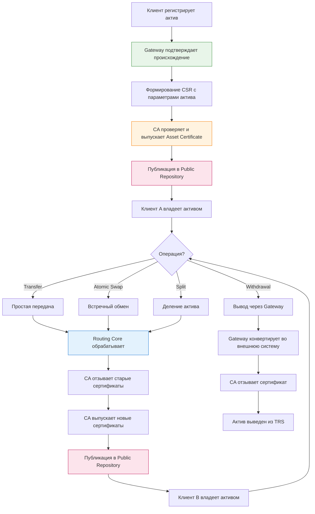
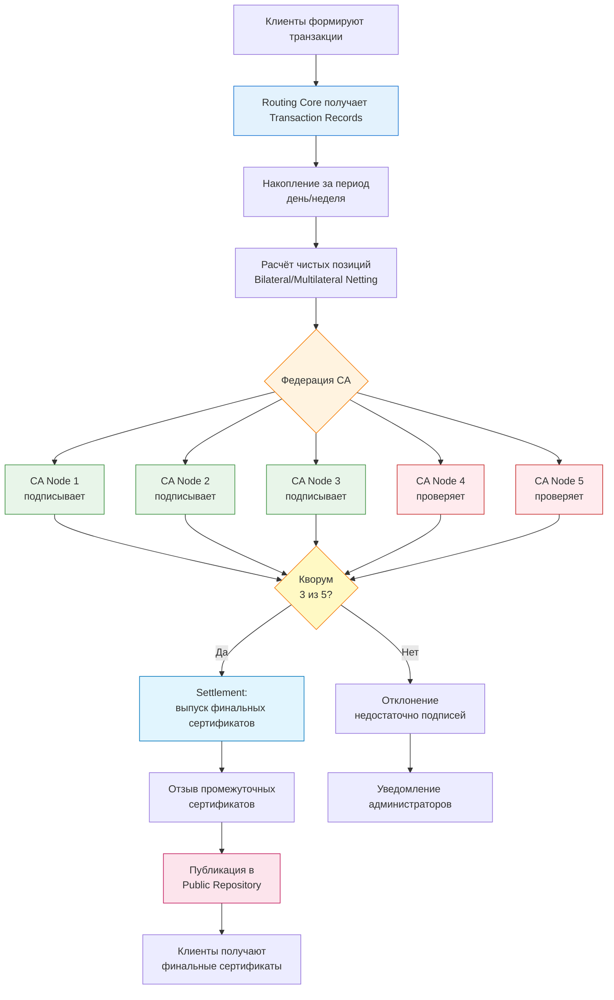

# 13. ПРИЛОЖЕНИЯ

[↑ Вернуться к оглавлению](Home.md)

------------------------------------------------------------------------

## 13.1. CLI и API пример взаимодействия

Данный раздел демонстрирует практические примеры взаимодействия с TRS через командную строку (OpenSSL) и API (curl, Python).

------------------------------------------------------------------------

### Пример 1: Генерация клиентского сертификата (OpenSSL)

**Задача:** Создать PKCS#12 контейнер для нового клиента.

**Шаги:**

    # 1. Генерация приватного ключа (ECDSA, P-256)
    openssl ecparam -genkey -name prime256v1 -out client-key.pem

    # 2. Создание CSR (Certificate Signing Request)
    openssl req -new -key client-key.pem -out client-csr.pem 
      -subj "/CN=alice@example.com/O=TRS Client"

    # 3. Подпись CSR через CA (выпуск сертификата)
    openssl ca -config openssl-ca.cnf 
      -extensions v3_client_cert 
      -days 365 
      -in client-csr.pem 
      -out client-cert.pem

    # 4. Создание PKCS#12 контейнера (wallet)
    openssl pkcs12 -export 
      -in client-cert.pem 
      -inkey client-key.pem 
      -certfile ca-cert.pem 
      -out alice.p12 
      -passout pass:SecurePassword123

    # 5. Проверка содержимого контейнера
    openssl pkcs12 -in alice.p12 -nokeys -info

**Результат:** Файл `alice.p12` содержит приватный ключ, Client Certificate и цепочку CA. Клиент может использовать его для аутентификации и подписания транзакций.

------------------------------------------------------------------------

### Пример 2: Регистрация актива через REST API (curl)

**Задача:** Зарегистрировать 5000 рублей через банк-Gateway.

**Предусловие:**

- Клиент Alice имеет PKCS#12 контейнер `alice.p12`
- Банк (Gateway) подтвердил платёж и подписал CSR

**Запрос:**

    curl -X POST https://api.trs/v1/register_asset 
      --cert alice.p12:SecurePassword123 
      --cert-type P12 
      -H "Content-Type: application/json" 
      -d '{
        "registration_id": "reg_12345",
        "timestamp": "2025-10-13T14:00:00Z",
        "client_id": "alice@example.com",
        "gateway_id": "bank.gateway",
        "asset_type": "CURRENCY",
        "asset_subtype": "RUR",
        "unit": "RUR",
        "quantity": 5000,
        "source_transaction": {
          "external_id": "bank_tx_67890",
          "payment_method": "card",
          "proof_url": "https://bank.com/receipt/67890"
        },
        "csr": "-----BEGIN CERTIFICATE REQUEST-----nMIICZjCCAU4CAQAw...",
        "gateway_signature": "MEUCIQDx7sN3k2vP8tF6lG9hJ4mR5qT7u..."
      }'

**Ответ (успех):**

    {
      "status": "success",
      "registration_id": "reg_12345",
      "asset_certificate": {
        "serial": "A001",
        "asset_id": "asset_5000_rur_001",
        "asset_type": "CURRENCY",
        "asset_subtype": "RUR",
        "quantity": 5000,
        "owner": "alice@example.com",
        "gateway": "bank.gateway",
        "issued_at": "2025-10-13T14:00:05Z",
        "expires_at": "2026-10-13T14:00:05Z",
        "download_url": "https://repo.trs/certs/A001.crt"
      },
      "published_at": "2025-10-13T14:00:06Z"
    }

**Результат:** Alice получила Asset Certificate серийный номер A001, подтверждающий владение 5000 рублями. Сертификат опубликован в Public Repository.

------------------------------------------------------------------------

### Пример 3: Atomic Swap через Python (requests)

**Задача:** Alice обменивает 500 рублей с Bob на 2 кг песка.

**Код (Python):**

    import requests
    import json
    from cryptography.hazmat.primitives import serialization, hashes
    from cryptography.hazmat.primitives.asymmetric import ec
    from cryptography import x509

    # Загрузка PKCS#12 контейнера Alice
    with open('alice.p12', 'rb') as f:
        p12 = serialization.pkcs12.load_key_and_certificates(
            f.read(), 
            b'SecurePassword123'
        )
        alice_key = p12[0]  # Приватный ключ
        alice_cert = p12[1]  # Клиентский сертификат

    # Формирование Transaction Record
    transaction = {
        "transaction_id": "tx_swap_001",
        "timestamp": "2025-10-13T15:00:00Z",
        "type": "ATOMIC_SWAP",
        "mode": "ONLINE",
        "party_a": {
            "client_id": "alice@example.com",
            "gives": {
                "asset_type": "CURRENCY",
                "quantity": 500,
                "cert_serial": "A001",
                "csr_base64": "MIICZjCCAU4CAQAw..."  # CSR для нового сертификата с остатком
            },
            "receives": {
                "asset_type": "COMMODITY",
                "asset_subtype": "SAND",
                "quantity": 2
            }
        },
        "party_b": {
            "client_id": "bob@example.com",
            "gives": {
                "asset_type": "COMMODITY",
                "asset_subtype": "SAND",
                "quantity": 2,
                "cert_serial": "S001",
                "csr_base64": "MIICZjCCAU4CAQAw..."
            },
            "receives": {
                "asset_type": "CURRENCY",
                "quantity": 500
            }
        }
    }

    # Подпись транзакции Alice
    transaction_bytes = json.dumps(transaction, sort_keys=True).encode()
    signature = alice_key.sign(
        transaction_bytes,
        ec.ECDSA(hashes.SHA256())
    )

    # Добавление подписи Alice
    transaction["party_a"]["signature"] = {
        "algorithm": "ES256",
        "value": signature.hex(),
        "cert_thumbprint": x509.Certificate.fingerprint(alice_cert, hashes.SHA256()).hex()
    }

    # Отправка запроса в Routing Core
    response = requests.post(
        'https://api.trs/v1/atomic_swap',
        cert=('alice.pem', 'alice-key.pem'),  # X.509 ClientAuth
        json=transaction
    )

    # Обработка ответа
    if response.status_code == 200:
        result = response.json()
        print(f"Swap успешен!")
        print(f"Alice получила сертификат: {result['new_certificates']['party_a']['serial']}")
        print(f"Bob получил сертификат: {result['new_certificates']['party_b']['serial']}")
    else:
        print(f"Ошибка: {response.json()['message']}")

**Результат:**

- Alice получила новый сертификат на 2 кг песка
- Bob получил новый сертификат на 500 рублей
- Старые сертификаты A001 и S001 отозваны

------------------------------------------------------------------------

## 13.2. Сводные схемы процессов

### Схема 1: Общий поток Value Routing

Итоговая схема демонстрирует, как активы "маршрутизируются" через TRS от регистрации до передачи между клиентами.

**Ключевые этапы:**  
1. **Registration** - Gateway подтверждает, CA выпускает Asset Certificate  
2. **Circulation** - активы обмениваются через Atomic Swap, Transfer, Split  
3. **Settlement** - Routing Core координирует операции, CA обновляет сертификаты  
4. **Transparency** - все операции публикуются в Public Repository  
5. **Exit** - Gateway конвертирует актив обратно во внешнюю систему

------------------------------------------------------------------------

### Схема 2: Federated Clearing (распределённый клиринг)

Схема демонстрирует, как работает федеративная архитектура с несколькими CA и кворумом подписей.

**Ключевые особенности федеративного клиринга:**  
1. **Routing Core** собирает транзакции за период и рассчитывает неттинг  
2. **Федерация CA** - несколько независимых узлов проверяют операции  
3. **Кворум** - требуется минимум M из N подписей (например, 3 из 5)  
4. **Settlement** - выпуск финальных сертификатов только при достижении кворума  
5. **Прозрачность** - все результаты публикуются в общий Public Repository

**Преимущества:**

- Защита от компрометации одного CA
- Повышенная надёжность (нет единой точки отказа)
- Распределённое доверие между участниками
- Подходит для государственных реестров и крупных бирж

------------------------------------------------------------------------

## 13.3. Тестовые сценарии

Базовые тестовые сценарии для проверки корректности работы TRS.

------------------------------------------------------------------------

### Сценарий 1: Asset Registration (регистрация актива)

**Цель:** Проверить процесс ввода нового актива в систему через Gateway.

**Предусловия:**

- Клиент Alice имеет Client Certificate
- Gateway (банк) готов подтвердить платёж
- CA работает и доступен

**Шаги:**  
1. Alice вносит 5000₽ через банк  
2. Банк подтверждает платёж (external_id: bank_tx_12345)  
3. Alice формирует CSR с параметрами актива (5000 RUR)  
4. Банк (Gateway) подписывает CSR своим ключом  
5. Alice отправляет CSR + Gateway signature в Routing Core  
6. Routing Core проверяет подпись Gateway  
7. CA выпускает Asset Certificate (serial: A001)  
8. CA публикует сертификат в Public Repository  
9. Alice получает уведомление и загружает сертификат

**Ожидаемый результат:**

- ✅ Asset Certificate A001 выпущен
- ✅ Сертификат содержит: assetType=CURRENCY, quantity=5000, gateway=bank.gateway
- ✅ Статус сертификата: ACTIVE (проверка через CRL)
- ✅ Сертификат доступен по URI: https://repo.trs/certs/A001.crt

**Проверки:**

- Gateway signature валидна
- CSR подписан приватным ключом Alice
- Сертификат подписан CA
- Сертификат отсутствует в CRL

------------------------------------------------------------------------

### Сценарий 2: Asset Transfer (простая передача)

**Цель:** Проверить передачу актива от Alice к Bob.

**Предусловия:**

- Alice владеет Asset Certificate A001 (1200 RUR)
- Bob имеет Client Certificate
- Routing Core и CA доступны

**Шаги:**  
1. Alice формирует Transaction Record:  
* Отправитель: alice@example.com, сертификат A001  
* Получатель: bob@example.com  
* Количество: 500 RUR  
* Остаток: 700 RUR (Alice)  
2. Alice подписывает Transaction Record  
3. Bob подписывает подтверждение получения  
4. Routing Core проверяет обе подписи  
5. CA отзывает сертификат A001  
6. CA выпускает два новых сертификата:  
* A002 (700 RUR) → Alice  
* B001 (500 RUR) → Bob  
7. Публикация в Public Repository

**Ожидаемый результат:**

- ✅ Сертификат A001 отозван (в CRL)
- ✅ Сертификат A002 (700 RUR) принадлежит Alice
- ✅ Сертификат B001 (500 RUR) принадлежит Bob
- ✅ Сумма сохранена: 700 + 500 = 1200

**Проверки:**

- A001 присутствует в CRL
- A002 и B001 отсутствуют в CRL (статус ACTIVE)
- Подписи обеих сторон валидны
- Transaction Record опубликован в Audit Log

------------------------------------------------------------------------

### Сценарий 3: Atomic Swap (встречный обмен)

**Цель:** Проверить атомарный обмен активами между Alice и Bob.

**Предусловия:**

- Alice владеет Asset Certificate A001 (5000 RUR)
- Bob владеет Asset Certificate S001 (2000 кг песка)
- Обе стороны согласны на обмен

**Шаги:**  
1. Alice формирует CSR для получения песка (2000 кг)  
2. Bob формирует CSR для получения денег (5000 RUR)  
3. Обе стороны обмениваются CSR и проверяют хеши  
4. Alice подписывает Transaction Record с хешем CSR_B  
5. Bob подписывает Transaction Record с хешем CSR_A  
6. Routing Core получает оба CSR + подписи  
7. CA проверяет взаимность (хеши совпадают)  
8. CA выполняет атомарную операцию:  
* BEGIN TRANSACTION  
* Отзыв A001 и S001  
* Выпуск новых по CSR_A (Alice получает песок) и CSR_B (Bob получает деньги)  
* COMMIT  
9. Публикация результатов

**Ожидаемый результат:**

- ✅ A001 и S001 отозваны одновременно
- ✅ Alice получила сертификат песка (serial: S002)
- ✅ Bob получил сертификат денег (serial: R001)
- ✅ Операция атомарна (либо оба, либо никто)

**Проверки:**

- Хеши CSR в Transaction Record совпадают
- Обе подписи валидны
- Старые сертификаты в CRL
- Новые сертификаты опубликованы одновременно (один timestamp)

------------------------------------------------------------------------

### Сценарий 4: Offline Mode (офлайн-обмен)

**Цель:** Проверить работу системы без подключения к интернету.

**Предусловия:**

- Alice и Bob встречаются лично
- Оба имеют активные Asset Certificate
- Интернета нет (офлайн-режим)

**Шаги:**  
1. Alice и Bob сканируют QR-коды друг друга (обмен публичными сертификатами)  
2. Alice формирует Transaction Record локально  
3. Alice подписывает Transaction Record своим ключом (из PKCS#12)  
4. Bob проверяет подпись Alice локально  
5. Bob подписывает Transaction Record своим ключом  
6. Alice проверяет подпись Bob локально  
7. Обе стороны сохраняют Transaction Record в локальной очереди  
8. **Через час появляется интернет**  
9. Alice (или Bob) публикует Transaction Record в Routing Core  
10. Routing Core проверяет подписи и Grace Period (< 24 часов)  
11. CA выполняет операцию

**Ожидаемый результат:**

- ✅ Транзакция выполнена без интернета (локально)
- ✅ При публикации транзакция принята
- ✅ Grace Period не истёк
- ✅ Обе стороны получили новые сертификаты

**Проверки:**

- Подписи валидны
- Timestamp в пределах Grace Period
- Сертификаты не были отозваны до публикации
- Нет конфликтующих транзакций (double-spending)

------------------------------------------------------------------------

### Сценарий 5: Revocation Check (проверка отзыва)

**Цель:** Убедиться, что отозванные сертификаты нельзя использовать.

**Предусловия:**

- Alice владеет Asset Certificate A001
- CA доступен

**Шаги:**  
1. Alice передаёт актив Bob (A001 → B001)  
2. CA отзывает A001, выпускает B001  
3. Alice пытается повторно использовать A001 в новой транзакции  
4. Routing Core проверяет статус A001 через CRL  
5. CRL показывает, что A001 отозван  
6. Routing Core отклоняет транзакцию

**Ожидаемый результат:**

- ✅ Транзакция отклонена
- ✅ Ошибка: "Certificate A001 has been revoked (ERR_REVOKED)"
- ✅ Попытка зафиксирована в Audit Log

**Проверки:**

- CRL содержит A001
- OCSP возвращает статус "Revoked"
- Routing Core не принимает транзакцию
- Alice получает уведомление об ошибке

------------------------------------------------------------------------

### Сценарий 6: Split Asset (деление актива)

**Цель:** Проверить корректное деление делимого актива.

**Предусловия:**

- Alice владеет Asset Certificate S000 (5000 кг песка, divisible=true)

**Шаги:**  
1. Alice формирует запрос на Split:  
* Исходный сертификат: S000 (5000 кг)  
* Часть 1: 2000 кг  
* Часть 2: 3000 кг  
2. Alice генерирует два CSR для новых сертификатов  
3. Routing Core проверяет: 2000 + 3000 = 5000 ✓  
4. CA выполняет операцию:  
* Отзыв S000  
* Выпуск S001 (2000 кг, parentCertSerial=S000, totalOriginal=5000)  
* Выпуск S002 (3000 кг, parentCertSerial=S000, totalOriginal=5000)  
5. Публикация в Public Repository

**Ожидаемый результат:**

- ✅ S000 отозван
- ✅ S001 и S002 выпущены
- ✅ Сумма сохранена: 2000 + 3000 = 5000
- ✅ Оба новых сертификата содержат: totalOriginal=5000, parentCertSerial=S000

**Проверки:**

- Сумма частей равна исходному количеству
- parentCertSerial корректен
- totalOriginal сохранён
- Все сертификаты содержат divisible=true

------------------------------------------------------------------------

## Итог раздела 13

Раздел предоставляет практические примеры для работы с TRS:

- **CLI и API** - готовые команды OpenSSL, curl и Python для быстрого старта
- **Сводные схемы** - визуализация общего потока Value Routing и федеративного клиринга
- **Тестовые сценарии** - 6 базовых проверок для валидации корректности работы системы

Эти материалы позволяют:

- Развернуть пилотную реализацию TRS
- Протестировать основные процессы
- Интегрировать TRS с существующими системами
- Проверить безопасность и корректность операций

> Полная документация API доступна в **разделе 9.6 API-интерфейсы**. Детальное описание процессов см. **раздел 7. ОСНОВНЫЕ ПРОЦЕССЫ**.

---
Test30

[↑ Вернуться к оглавлению](Home.md)
