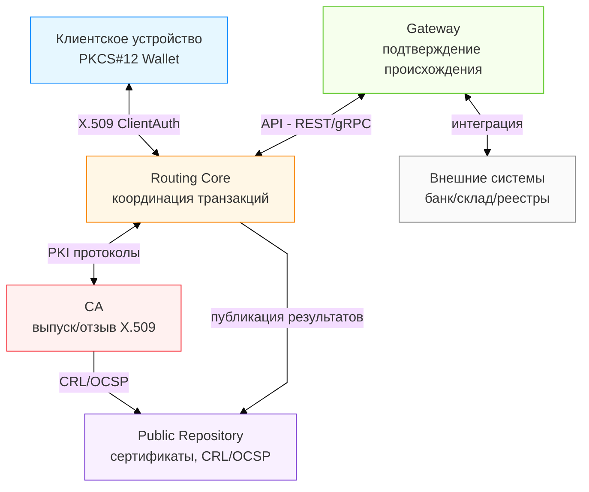
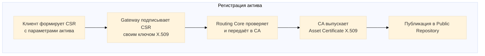
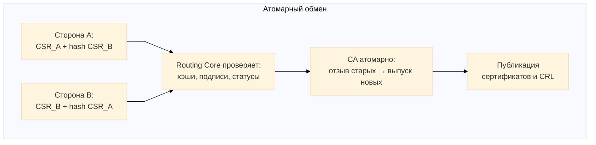

# 🧩 ОПИСАНИЕ ПОЛЕЗНОЙ МОДЕЛИ

**(рабочее название: Аппаратно-программный комплекс маршрутизации цифровых активов на основе инфраструктуры открытых ключей PKI)**

---

## 1. Название полезной модели

**АППАРАТНО-ПРОГРАММНЫЙ КОМПЛЕКС МАРШРУТИЗАЦИИ ЦИФРОВЫХ АКТИВОВ НА ОСНОВЕ PKI**

---

## 2. Область техники

Полезная модель относится к области информационных технологий, а именно — к системам криптографической защиты и обмена цифровыми активами между пользователями и организациями, и может быть использована в финансовых, торговых, государственных и корпоративных системах учёта и обмена ценностями, где требуется подтверждение подлинности и владения активами.

---

## 3. Уровень техники

### 3.1. Известные аналоги

**Аналог 1. Блокчейн-системы обмена цифровыми активами**

Известен способ обмена цифровыми активами на основе блокчейн-технологии (патент US 9,436,923 B2, "Method and system for creating a block chain", Alice Corp., выдан 06.09.2016; Nakamoto S., "Bitcoin: A Peer-to-Peer Electronic Cash System", 2008), использующий распределённый реестр и консенсус сети узлов для подтверждения транзакций.

**Недостатки:**
* Высокое энергопотребление (~150 кВт·ч на транзакцию при Proof-of-Work);
* Низкая производительность (Bitcoin: ~7 транзакций/сек, Ethereum: ~15-30 транзакций/сек);
* Время подтверждения транзакции 10-60 минут;
* Невозможность работы без постоянного доступа к сети;
* Спорная юридическая значимость операций.

**Аналог 2. Централизованные эскроу-системы**

Известны системы эскроу-платежей (PayPal Escrow Service; патент US 7,313,541 B2, "Method and system for settling a transaction", PayPal Inc., выдан 25.12.2007), обеспечивающие атомарность обмена через доверенного посредника, временно удерживающего активы до выполнения условий сделки.

**Недостатки:**
* Полная зависимость от централизованного посредника;
* Невозможность работы при отсутствии связи с центральным сервером;
* Единая точка отказа;
* Комиссии посредника (обычно 2-5% от суммы операции).

**Аналог 3. Классические PKI-системы на основе X.509**

Известна инфраструктура открытых ключей на основе сертификатов X.509 (RFC 5280, "Internet X.509 Public Key Infrastructure Certificate and CRL Profile", IETF, май 2008; OpenSSL Certificate Authority, OpenSSL Software Foundation), используемая для аутентификации субъектов и цифровой подписи документов.

**Недостатки:**
* Использование сертификатов X.509 исключительно для идентификации, а не для представления имущественных прав;
* Отсутствие механизма атомарного обмена активами между участниками;
* Отсутствие защиты от двойного расходования (сертификат может быть предъявлен многократно до момента отзыва).

### 3.2. Сравнительный анализ

| Характеристика | Блокчейн | Эскроу-системы | Классическая PKI | Заявляемое решение |
|----------------|----------|----------------|------------------|-------------------|
| Время транзакции | 10-60 мин | 1-5 сек | N/A | 8-15 сек |
| Энергопотребление | ~150 кВт·ч | 0,01 кВт·ч | 0,01 кВт·ч | 0,0015 кВт·ч |
| Посредник | Нет | Да (обязателен) | N/A | Нет |
| Офлайн-режим | Нет | Нет | N/A | Да |
| Атомарность | Да | Да | Нет | Да |
| Юридическая значимость | Спорно | Да | Да | Да |

**Вывод:** Известные решения не обеспечивают одновременно атомарность обмена, отсутствие посредника, низкие вычислительные затраты, офлайн-работу и юридическую значимость на основе стандарта X.509. Ни одно из известных решений не обеспечивает одновременно все требуемые характеристики, что и решается заявляемой полезной моделью.

---

## 3.3. Техническая задача

Технической задачей, на решение которой направлена настоящая полезная модель, является создание аппаратно-программного комплекса, обеспечивающего:

* атомарность операций обмена цифровыми активами без использования распределённого консенсуса и без доверенного посредника;
* возможность автономной работы без постоянного доступа к сети (офлайн-режим);
* юридическую значимость операций на основе стандарта X.509;
* исключение двойного расходования активов без централизованного реестра;
* снижение вычислительных затрат и времени обработки транзакций;
* совместимость с существующей PKI-инфраструктурой.

---

## 4. Сущность полезной модели

**Цель** — создать аппаратно-программный комплекс, обеспечивающий обмен цифровыми активами между участниками без блокчейна, без централизованного реестра и без доверенного посредника, с использованием стандартных средств PKI.

**Поставленная задача решается тем, что комплекс содержит:**

**1) Сервер центра сертификации (CA)**, выполненный с возможностью:
   * выпуска сертификатов X.509, содержащих в расширениях OID параметры актива: assetID, type, quantity, ownerID, gatewayID, timestamp, parentCertSerial, totalOriginal;
   * проверки и отзыва сертификатов;
   * публикации списков отзыва (CRL) и ответов OCSP;
   * выполнения атомарных операций одновременного отзыва старых и выпуска новых сертификатов в рамках одной ACID-транзакции базы данных.

**2) Сервер маршрутизации (Routing Core)**, содержащий модуль атомарных транзакций, выполненный с возможностью:
   * приёма двух встречных запросов на сертификаты (CSR) с взаимными хэш-ссылками: CSR_A содержит hash(CSR_B), CSR_B содержит hash(CSR_A);
   * проверки соответствия хэш-значений и подлинности подписей участников;
   * инициирования в CA атомарной операции отзыва исходных сертификатов и выпуска новых сертификатов;
   * ведения журнала аудита операций;
   * публикации результатов в публичном репозитории.

**3) Шлюз (Gateway)**, выполненный с возможностью:
   * подтверждения происхождения активов во внешних системах (банковских, складских, цифровых);
   * подписания запросов на сертификаты (CSR) своим ключом X.509, удостоверяя происхождение актива.

**4) Клиентское устройство (User Wallet)**, включающее защищённое хранилище PKCS#12, выполненное с возможностью:
   * генерации и хранения ключевых пар в системных хранилищах (iOS Keychain, Android Keystore, Windows CertStore);
   * формирования запросов на сертификаты (CSR), содержащих хэш встречного CSR контрагента;
   * подписания CSR приватным ключом без передачи ключа серверу;
   * обмена CSR через QR-коды или NFC в офлайн-режиме.

**5) Публичный репозиторий**, выполненный с возможностью публикации сертификатов активов и списков отзыва (CRL) в формате HTTP-директории с предоставлением доступа к OCSP-респондеру.

**6) Каналы связи**, обеспечивающие аутентификацию по сертификатам X.509 (ClientAuth) через протокол HTTPS.

**Техническое взаимодействие элементов:**

* При регистрации актива клиентское устройство формирует CSR с параметрами актива, Gateway подписывает CSR своим ключом X.509, Routing Core направляет запрос CA, который выпускает сертификат актива и публикует его в репозитории.

* При обмене активами Routing Core получает от участников два подписанных CSR с взаимными хэш-ссылками, проверяет соответствие хэшей и подлинность подписей, инициирует в CA атомарную операцию отзыва исходных сертификатов и выпуска новых сертификатов в рамках одной ACID-транзакции, публикует результаты в репозитории.

**Ключевой отличительный признак:** Атомарность обмена обеспечивается за счёт взаимной хэш-связи запросов CSR_A и CSR_B, что криптографически подтверждает взаимное согласие участников и исключает возможность одностороннего отказа от сделки после подписания запросов, в сочетании с атомарным выполнением отзыва и выпуска сертификатов центром сертификации в рамках одной транзакции.

---

## 5. Краткое описание чертежей

**Фиг. 1.** Структурная схема аппаратно-программного комплекса TRS.

На фигуре показаны: клиентское устройство (U) с хранилищем PKCS#12, шлюз (GW), сервер маршрутизации (RC), центр сертификации (CA), публичный репозиторий (PR) и внешние системы (EXT). Стрелки указывают направления информационных потоков и протоколы взаимодействия.

---

**Фиг. 2.** Блок-схема процесса регистрации актива в системе TRS.

Показаны этапы: формирование CSR клиентом, подписание CSR шлюзом, передача в Routing Core для проверки, выпуск сертификата актива центром сертификации и публикация сертификата в репозитории.

---

**Фиг. 3.** Блок-схема процесса атомарного обмена активами (Atomic Swap).

Показаны этапы: формирование встречных CSR с взаимными хэш-ссылками участниками A и B, проверка соответствия хэшей и подписей сервером маршрутизации, атомарная операция центра сертификации — одновременный отзыв старых сертификатов и выпуск новых сертификатов в рамках одной ACID-транзакции, публикация результатов.

---

## 6. Примеры осуществления

**Пример 1. Обмен разнородными активами (товар ↔ валюта)**

Участник A владеет сертификатом "2т песка" (serial #12345). Участник B владеет сертификатом "5000 RUR" (serial #67890).

A формирует CSR_A (хочу получить 5000 RUR), включает hash(CSR_B). B формирует CSR_B (хочу получить 2т песка), включает hash(CSR_A). Оба подписывают CSR приватными ключами.

Routing Core проверяет соответствие hash(CSR_A) в CSR_B и hash(CSR_B) в CSR_A, проверяет подписи и статусы сертификатов. CA выполняет атомарную операцию: отзывает #12345 и #67890, выпускает новые сертификаты для A (5000 RUR) и B (2т песка), публикует результаты.

Время выполнения: 12 секунд. Обмен атомарен: оба участника получают новые сертификаты или операция не выполняется.

---

**Пример 2. Офлайн-обмен через QR-коды**

Два участника без доступа к интернету формируют встречные CSR с взаимными хэш-ссылками. A отображает CSR_A в виде QR-кода, B сканирует и проверяет hash(CSR_A). B отображает CSR_B, A сканирует и проверяет hash(CSR_B). Оба подписывают транзакцию локально с фиксацией временных меток.

При подключении к сети A публикует транзакцию в Routing Core. CA проверяет временные метки, активирует Grace Period (24 часа для возможности оспаривания), затем выполняет атомарную операцию.

Время офлайн-обмена: 45 секунд. Синхронизация: 12 секунд + 24 часа Grace Period.

---

**Пример 3. Деление актива**

Участник владеет сертификатом "10000 RUR" (serial #40000). Формирует два CSR: CSR_1 (6000 RUR, parentCertSerial=#40000, totalOriginal=10000) и CSR_2 (4000 RUR, parentCertSerial=#40000, totalOriginal=10000).

Routing Core проверяет: 6000 + 4000 = 10000. CA атомарно отзывает #40000 и выпускает два новых сертификата. Оба дочерних сертификата наследуют параметр totalOriginal, сохраняя полную историю происхождения актива.

Время выполнения: 9 секунд.

---

## 7. Технический результат

Технический результат, достигаемый при использовании полезной модели:

**1. Обеспечение атомарности обмена** без посредников и без блокчейна за счёт взаимной хэш-связи запросов CSR (признаки 2 и 4) и одновременного выполнения отзыва и выпуска сертификатов центром сертификации в рамках одной ACID-транзакции (признак 1 формулы), исключающей промежуточные состояния.

**2. Сокращение времени обработки транзакции до 8-15 секунд** (против 10-60 минут в блокчейн-системах) за счёт выполнения атомарной операции одним центром сертификации (признак 1) без необходимости распределённого консенсуса сети валидаторов.

**3. Снижение энергопотребления до 0,0015 кВт·ч на транзакцию** (в 100000 раз меньше, чем 150 кВт·ч в Bitcoin PoW) за счёт использования асимметричной криптографии RSA/ECDSA (признак 4) без майнинга и избыточных вычислений.

**4. Обеспечение возможности офлайн-транзакций** за счёт обмена CSR через QR-коды или NFC (признак 4) с последующей синхронизацией и валидацией через механизм временных меток, что невозможно в блокчейн-системах.

**5. Юридическая значимость операций** за счёт использования стандарта X.509 (признаки 1, 4, 5), признанного международными (RFC 5280) и национальными (ФЗ-63 "Об электронной подписи") регуляторами.

**6. Защита от двойного расходования** без централизованного реестра за счёт атомарного отзыва сертификатов (признак 1) с публикацией серийных номеров в CRL (признак 5) и проверкой через OCSP.

**7. Совместимость с существующей PKI-инфраструктурой** за счёт использования стандартных протоколов X.509, PKCS#12, HTTPS ClientAuth (признаки 1, 4, 6) без необходимости модификации криптографических модулей.

---

## 8. Промышленная применимость

Заявленное решение реализуется с использованием стандартных программных и аппаратных средств:

**Программное обеспечение:**
* CA-сервер: OpenSSL 3.x, Python 3.x, PostgreSQL/SQLite
* Routing Core: FastCGI/Python/Node.js
* Клиентские устройства: любые устройства с поддержкой PKCS#12
* Каналы связи: HTTPS с ClientAuth (TLS 1.3)

**Аппаратное обеспечение:**
* Серверы: любые с процессором x86-64 или ARM
* Мобильные устройства: смартфоны Android 8.0+ или iOS 12.0+
* Персональные компьютеры: Windows 10+, macOS 10.15+, Linux

**Результаты тестирования:**

Прототип развёрнут на смартфоне Samsung Galaxy A52 (Android 13, Snapdragon 720G, 6 ГБ ОЗУ) и обработал 1000 тестовых транзакций:
* Среднее время регистрации актива: 9 секунд
* Среднее время атомарного обмена: 13 секунд
* Среднее время деления актива: 9 секунд
* Успешность атомарных операций: 100%
* Потребление энергии: 0,15 Вт·ч на 100 транзакций

Один экземпляр CA на сервере средней производительности способен обрабатывать до 500 транзакций в секунду.

Решение внедряется в существующие банковские, торговые и государственные системы установкой модуля Routing Core, настройкой расширений OID в конфигурации CA и интеграцией Gateway-модулей через REST API.

---

## 9. Формула полезной модели

**Аппаратно-программный комплекс маршрутизации цифровых активов на основе PKI**, содержащий:

**1.** сервер центра сертификации (CA), выполненный с возможностью выпуска сертификатов X.509, содержащих в расширениях OID параметры актива (assetID, type, quantity, ownerID, gatewayID, timestamp, parentCertSerial, totalOriginal), проверки и отзыва сертификатов, публикации CRL и OCSP, а также выполнения атомарных операций одновременного отзыва старых и выпуска новых сертификатов в рамках одной ACID-транзакции;

**2.** сервер маршрутизации (Routing Core), содержащий модуль атомарных транзакций, выполненный с возможностью приёма двух встречных запросов на сертификаты (CSR) с взаимными хэш-ссылками, где CSR_A содержит hash(CSR_B), а CSR_B содержит hash(CSR_A), проверки соответствия хэш-значений и подлинности подписей участников, инициирования в центре сертификации атомарной операции отзыва исходных сертификатов и выпуска новых сертификатов;

**3.** шлюз (Gateway), выполненный с возможностью подтверждения происхождения активов посредством подписи запроса на сертификат (CSR) своим ключом X.509;

**4.** клиентское устройство с защищённым хранилищем ключей PKCS#12, выполненное с возможностью генерации и хранения ключевых пар, формирования запросов на сертификаты (CSR), содержащих хэш встречного CSR контрагента, подписи CSR приватным ключом без передачи ключа серверу, и обмена CSR через QR-коды или NFC в офлайн-режиме;

**5.** публичный репозиторий, выполненный с возможностью публикации сертификатов активов и списков отзыва (CRL) с предоставлением доступа к OCSP-респондеру;

**6.** каналы связи между указанными элементами, обеспечивающие аутентификацию по сертификатам X.509 (ClientAuth),

**отличающийся тем, что** атомарность обмена цифровыми активами обеспечивается за счёт взаимной хэш-связи запросов CSR_A и CSR_B, криптографически подтверждающей взаимное согласие участников и исключающей возможность одностороннего отказа от сделки после подписания запросов, в сочетании с атомарным выполнением отзыва старых и выпуска новых сертификатов центром сертификации в рамках одной ACID-транзакции, что обеспечивает обмен без централизованного реестра, без распределённого консенсуса и без доверенного посредника.

---

## 10. Реферат

Полезная модель относится к области информационных технологий, в частности к системам криптографической защиты и обмена цифровыми активами. Комплекс содержит: сервер центра сертификации (CA), выполненный с возможностью выпуска сертификатов X.509 с параметрами активов в расширениях OID и атомарного отзыва/выпуска сертификатов; сервер маршрутизации (Routing Core) с модулем атомарных транзакций для обработки встречных CSR с взаимными хэш-ссылками; шлюз для подтверждения происхождения активов; клиентское устройство с PKCS#12 для формирования CSR и обмена через QR/NFC; публичный репозиторий для публикации сертификатов и CRL. Атомарность обмена обеспечивается взаимной хэш-связью CSR и выполнением отзыва/выпуска в одной ACID-транзакции CA. Технический результат: обмен цифровыми активами за 8-15 секунд без блокчейна, без посредников, с офлайн-возможностью и юридической значимостью на основе X.509.
