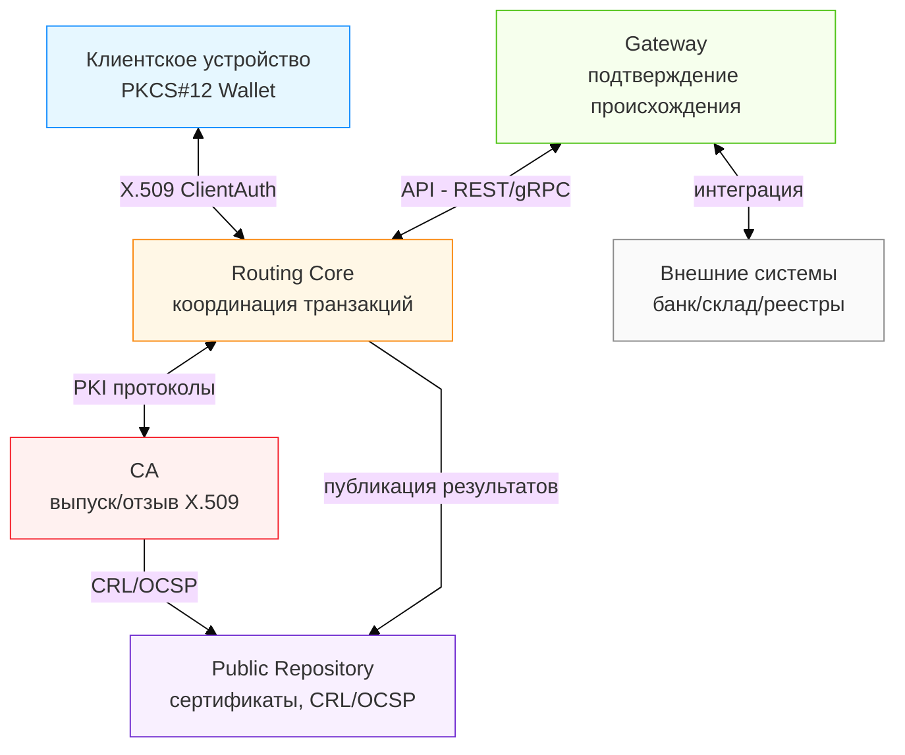
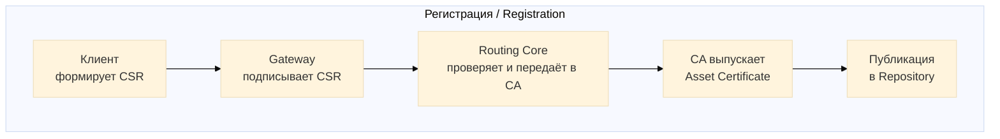
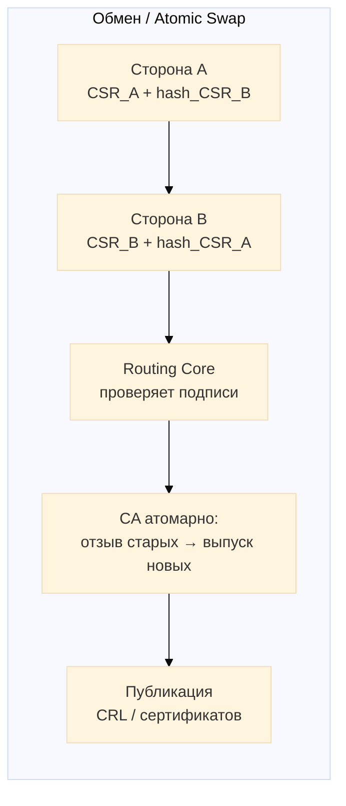

# Черновик описания в официальной структуре, принятой Роспатентом.

## 🧩 ЧЕРНОВИК ОПИСАНИЯ ПОЛЕЗНОЙ МОДЕЛИ

с разделами *Название, Область техники, Уровень техники, Сущность полезной модели, Краткое описание чертежей, Примеры осуществления, Технический результат, Формула полезной модели.*


**(рабочее название: Аппаратно-программный комплекс маршрутизации цифровых активов на основе инфраструктуры открытых ключей PKI)**

---

### 1. Название полезной модели

**АППАРАТНО-ПРОГРАММНЫЙ КОМПЛЕКС МАРШРУТИЗАЦИИ ЦИФРОВЫХ АКТИВОВ НА ОСНОВЕ PKI**

---

### 2. Область техники

Полезная модель относится к области информационных технологий, а именно — к системам криптографической защиты и обмена цифровыми активами между пользователями и организациями, и может быть использована в финансовых, торговых, государственных и корпоративных системах учёта и обмена ценностями, где требуется подтверждение подлинности и владения активами.

---

### 3. Уровень техники

Известны технические решения, реализующие обмен цифровыми активами через централизованные серверы (банковские и платёжные системы), а также решения на основе распределённых реестров (блокчейн).
Недостатками указанных решений являются:

* высокая зависимость от централизованной базы данных или консенсуса сети;
* невозможность автономной (офлайн) работы;
* низкая производительность из-за избыточных вычислений (майнинг, валидация блоков);
* отсутствие юридической совместимости с инфраструктурой открытых ключей (PKI).

---

### 4. Сущность полезной модели

**Цель** — создать универсальный аппаратно-программный комплекс, обеспечивающий обмен цифровыми активами между пользователями без блокчейна и без центрального реестра, с использованием стандартных средств PKI.

**Комплекс содержит**:

1. **Сервер центра сертификации (CA)**, выполненный с возможностью:

   * выпуска, проверки и отзыва сертификатов X.509,
   * публикации списков отзыва (CRL) и ответов OCSP.

2. **Сервер маршрутизации (Routing Core)**, выполненный с возможностью:

   * приёма и проверки подписанных транзакций обмена активами,
   * взаимодействия с CA для отзыва старых и выпуска новых сертификатов,
   * ведения аудита и публикации результатов в публичном репозитории.

3. **Шлюз (Gateway)**, выполненный с возможностью подтверждения происхождения активов во внешних системах (банковских, складских, цифровых).

4. **Клиентское устройство (User Wallet)**, включающее защищённое хранилище PKCS#12, выполненное с возможностью:

   * генерации и хранения ключевых пар,
   * формирования и подписания запросов на сертификаты (CSR),
   * локального хранения сертификатов активов,
   * подписи транзакций без передачи приватного ключа.

5. **Публичный репозиторий (Public Repository)**, выполненный с возможностью публикации сертификатов активов и списков отзыва для проверки третьими сторонами.

6. **Каналы связи** между указанными элементами, поддерживающие аутентификацию по X.509 (ClientAuth).

**Техническое взаимодействие элементов:**

* Клиентское устройство формирует CSR с параметрами актива и подписывает его приватным ключом.
* Gateway подтверждает происхождение актива своей подписью.
* Routing Core направляет запрос CA.
* CA выпускает Asset Certificate и публикует его в репозитории.
* При обмене активами Routing Core получает от участников подписанные транзакции, проверяет их подлинность и инициирует атомарный отзыв и выпуск новых сертификатов.

**Результат** — регистрация, передача и подтверждение владения активами обеспечиваются без централизованного реестра, с сохранением юридической значимости подписи X.509.

---

### 5. Краткое описание чертежей


Взаимодействие элементов (высокоуровневая архитектура -структура комплекса и взаимодействие элементов)



Процесс работы 
Последовательность действий:
* регистрация актива через Gateway и CA;


* обмен активами между сторонами через Atomic Swap с атомарным отзывом и выпуском сертификатов.

---

### 6. Примеры осуществления

**Пример 1.** Пользователь через банк-Gateway регистрирует актив “5000 RUR”.
CA выпускает X.509-сертификат, фиксирующий право владения активом.

**Пример 2.** Два пользователя совершают обмен активами: “песок ↔ рубли”.
Routing Core принимает два подписанных CSR, CA отзывает исходные сертификаты и выпускает новые, обеспечивая атомарность обмена.

**Пример 3.** Офлайн-обмен. Устройства пользователей обмениваются сертификатами через NFC или QR, формируя транзакцию без подключения к сети. При синхронизации транзакция публикуется, и CA выполняет обмен.

---

### 7. Технический результат

Технический результат, достигаемый при использовании полезной модели:

* обеспечение атомарного обмена цифровыми активами без блокчейна;
* возможность автономной (офлайн) работы;
* повышение производительности и снижения вычислительных затрат;
* совместимость с международными криптографическими стандартами (X.509, PKCS#12, CRL, OCSP);
* повышение доверия за счёт прозрачности и юридической значимости операций.
* Комплекс может быть интегрирован в существующие корпоративные или государственные ИТ-системы без изменения их внутренней архитектуры, так как использует стандартные протоколы PKI (X.509, HTTPS ClientAuth, OCSP).

---

### 8. Формула полезной модели

**Аппаратно-программный комплекс маршрутизации цифровых активов на основе PKI**,
содержащий:

1. сервер центра сертификации (CA), выполненный с возможностью выпуска, проверки и отзыва сертификатов X.509;
2. сервер маршрутизации (Routing Core), выполненный с возможностью обработки подписанных транзакций обмена активами и взаимодействия с центром сертификации;
3. шлюз (Gateway), выполненный с возможностью подтверждения происхождения активов;
4. клиентское устройство с защищённым хранилищем ключей PKCS#12, выполненное с возможностью генерации, хранения и использования ключей и сертификатов;
5. публичный репозиторий сертификатов и списков отзыва;
6. каналы связи между указанными элементами, обеспечивающие аутентификацию по сертификатам X.509,
   при этом указанные элементы функционально связаны между собой таким образом, что при обмене активами Routing Core инициирует отзыв старых и выпуск новых сертификатов через CA, обеспечивая атомарный обмен активами и контроль их статуса через Public Repository.


---

## 🧠 ЧЕРНОВИК ОПИСАНИЯ ИЗОБРЕТЕНИЯ

**(рабочее название: Способ атомарного обмена цифровыми активами на основе сертификатов X.509)**
сосредоточен на **способе**, а не на устройстве.
---

### 1. Название изобретения

**СПОСОБ АТОМАРНОГО ОБМЕНА ЦИФРОВЫМИ АКТИВАМИ НА ОСНОВЕ СЕРТИФИКАТОВ X.509**

---

### 2. Область техники

Изобретение относится к области информационных технологий, в частности к системам обмена цифровыми активами и криптографической защите данных, и может применяться в финансовых, торговых, государственных и корпоративных платформах, где требуется надёжная передача имущественных прав в цифровой форме без участия посредников и без централизованных реестров.

---

### 3. Уровень техники

Известны технические решения, реализующие обмен цифровыми активами с использованием:

* **распределённых реестров (блокчейн)** — обеспечивающих атомарность за счёт консенсуса, но требующих значительных вычислительных ресурсов и не поддерживающих офлайн-работу;
* **централизованных платёжных шлюзов (эскроу)** — гарантирующих исполнение сделки, но требующих доверия к посреднику и не обеспечивающих криптографического доказательства владения;
* **инфраструктуры открытых ключей (PKI)** — обеспечивающих аутентификацию и подписи, но не предназначенных для одновременной передачи прав собственности.

Недостаток существующих решений — невозможность атомарного обмена активами между сторонами без участия посредников и без централизованной базы данных, при сохранении юридически значимого криптографического уровня защиты.

---

### 4. Сущность изобретения

**Цель изобретения** — обеспечить атомарный (неразделимый) обмен цифровыми активами между пользователями на основе стандартных сертификатов X.509, без использования блокчейна и без централизованного реестра.

---

#### Способ включает следующие этапы:

1. **Формирование исходных сертификатов активов:**
   Для каждого участника обмена формируется действующий сертификат X.509 (Asset Certificate), содержащий параметры актива — идентификатор, тип, количество, владельца (CN) и происхождение (gatewayID). Сертификаты подписаны центром сертификации (CA) и опубликованы в публичном репозитории.

2. **Формирование встречных запросов (CSR):**
   Каждый участник формирует запрос на выпуск нового сертификата (Certificate Signing Request, CSR), указывающий актив, который он должен получить по сделке, и включает в CSR хэш встречного CSR контрагента.
   Оба запроса подписываются приватными ключами участников.

3. **Проверка запросов центром сертификации (CA):**
   CA проверяет подписи участников и соответствие хэшей CSR, подтверждая взаимность намерений.
   Если оба запроса корректны, CA инициирует атомарную операцию.

4. **Атомарное обновление сертификатов:**
   В рамках одной транзакции:

   * исходные сертификаты активов обоих участников **отзываются**,
   * выпускаются новые сертификаты X.509, отражающие смену владельцев,
   * операции записи выполняются атомарно (ACID), без промежуточных состояний.

5. **Публикация результатов и проверка:**
   Новые сертификаты публикуются в публичном репозитории; старые серийные номера добавляются в список отзыва (CRL).
   Любая третья сторона может проверить факт передачи через OCSP или хэш-цепочку.

6. **Дополнительно (вариант offline):**
   В случае отсутствия связи CSR-документы подписываются и обмениваются локально (QR/NFC).
   При появлении соединения любой участник публикует транзакцию; CA выполняет проверку и выпуск сертификатов с учётом временной метки (timestamp) и механизма Grace Period.

---

### 5. Отличительные признаки изобретения

В отличие от известных решений, способ:

* использует **стандартную инфраструктуру X.509** не только для идентификации, но и для представления имущественных прав;
* обеспечивает **атомарность обмена** без распределённого консенсуса — только за счёт действий CA;
* реализует **двустороннюю криптографическую валидацию** через взаимные CSR с хэш-взаимосвязью;
* поддерживает **офлайн-режим** с последующей публикацией и временной защитой (Grace Period);
* обеспечивает **совместимость с существующими PKI-средствами**, без изменения стандарта ASN.1 и DER-кодировок.

---

### 6. Технический результат

Достигаемый технический результат:

* обеспечение целостности и неразделимости обмена активами (“всё или ничего”) без посредников и без блокчейна;
* снижение вычислительных и сетевых затрат;
* сохранение юридически значимого формата X.509;
* возможность автономного (офлайн) обмена;
* защита от двойного расходования (double-spending) за счёт атомарного отзыва и перевыпуска сертификатов;
* прозрачность и проверяемость через CRL/OCSP.
* Описанный способ совместим с существующей инфраструктурой открытых ключей и может быть встроен в банковские, торговые и государственные платформы, использующие стандарт PKI, без модификации их криптографических модулей.

---

### 7. Краткое описание чертежей

**Фиг. 1** — блок-схема последовательности этапов атомарного обмена:

```
Формирование CSR A ↔ Формирование CSR B → Проверка CA → Отзыв старых → Выпуск новых → Публикация
```

**Фиг. 2** — схема офлайн-варианта обмена через QR/NFC с отложенной публикацией.

---

### 8. Примеры осуществления

**Пример 1.** Обмен цифровыми активами (товар ↔ деньги).

* Участник A владеет сертификатом “2 т песка”, участник B — “5000 RUR”.
* Формируются встречные CSR, содержащие хэши друг друга.
* CA проверяет подписи, отзывает старые сертификаты, выпускает новые.
* Обмен завершается за 15 секунд, без участия третьей стороны.

**Пример 2.** Офлайн-обмен (QR).

* Участники обмениваются CSR через QR-код, подписывают их локально.
* При подключении к сети CA выполняет проверку и атомарный выпуск.
* При конфликте транзакций учитывается первый по timestamp.

**Пример 3.** Многосторонний обмен (м-of-n участников).

* CA формирует транзакцию, содержащую несколько пар CSR.
* Все операции выполняются в одном атомарном пакете; при сбое одного участника весь обмен откатывается.

---

### 9. Формула изобретения

**1. Способ атомарного обмена цифровыми активами на основе сертификатов X.509**,
включающий этапы:

* формирование каждым участником действующих сертификатов активов, подписанных центром сертификации;
* формирование каждым участником запроса на выпуск нового сертификата (CSR), включающего хэш встречного CSR контрагента;
* проверку центром сертификации подписей участников и соответствия хэшей CSR;
* отзыв исходных сертификатов активов и одновременный выпуск новых сертификатов X.509, удостоверяющих переход прав собственности;
* публикацию новых сертификатов и отзывов в публичном репозитории,
  **отличающийся тем, что** все указанные операции выполняются атомарно в рамках одной транзакции, обеспечивая целостность обмена и предотвращение двойного расходования активов, при этом обмен CSR может осуществляться как в онлайн-, так и в офлайн-режиме с последующей публикацией и проверкой по временной метке.

**2.** Способ по пункту 1, отличающийся тем, что обмен CSR в офлайн-режиме осуществляется посредством QR-кодов или NFC.

**3.** Способ по пункту 1, отличающийся тем, что центр сертификации использует механизм Grace Period для временной защиты от конфликтующих транзакций.

**4.** Способ по пункту 1, отличающийся тем, что проверка статусов сертификатов выполняется через CRL и OCSP.

---

### 10. Реферат

Изобретение относится к области информационных технологий.
Предложен способ атомарного обмена цифровыми активами на основе сертификатов X.509, при котором участники обмениваются взаимно подписанными запросами на сертификаты (CSR), содержащими хэш встречного запроса, после чего центр сертификации отзывает исходные и выпускает новые сертификаты, удостоверяющие переход прав собственности.
Способ обеспечивает атомарность обмена, защиту от двойного расходования и возможность работы без блокчейна и без централизованного реестра.

---


