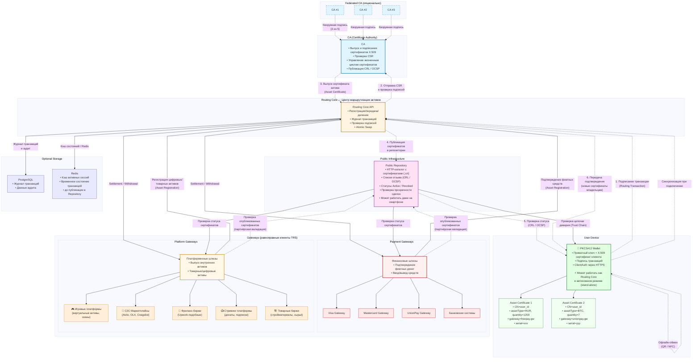

# 3. РОЛИ И ПРИМЕНЕНИЕ

[↑ Вернуться к оглавлению](Home.md)

------------------------------------------------------------------------

## 3.1. Роли в системе

TRS построена на принципе равноправия участников. Основной учётной единицей системы является **Client (Клиент)** — любой участник обмена активами, имеющий сертификат X.509 и взаимодействующий с системой по единым правилам PKI.

> **Client — обобщающая роль.**  
> **User, Gateway, CA, Validator и Arbitrator — типы клиентов, выполняющие специализированные функции.**  
> **User — частный тип Client (физическое лицо), использующий PKCS#12 Wallet для участия в обмене активами.**

Клиентами TRS являются физические лица, организации, сервисы и шлюзы (включая банковские и платёжные). Каждый клиент аутентифицируется через контейнер PKCS#12 и может выполнять операции регистрации, передачи и проверки активов.

------------------------------------------------------------------------

### Client — Клиент

**Определение:** Основная учётная единица TRS — физическое лицо, организация, сервис или шлюз.  
**Описание:** Каждый клиент имеет собственный сертификат X.509 и участвует в операциях по единым правилам PKI. Все участники системы — от частного лица до банковского шлюза — рассматриваются как клиенты и взаимодействуют на равных основаниях.

**Общие характеристики:**

- сертификат X.509;
- PKCS#12-контейнер для ключей;
- возможность регистрировать, передавать и проверять активы;
- участие в операциях через цифровые подписи.

------------------------------------------------------------------------

### User — Пользователь

**Определение:** Частный тип Client — физическое лицо, использующее PKCS#12 Wallet для участия в обмене активами.  
**Функции:**

- регистрация активов через Gateway;
- P2P-передача активов другим клиентам;
- деление активов (Split);
- проверка подлинности сертификатов через Public Repository;
- работа в online и offline режимах.

**Особенности:**

- полный контроль над приватными ключами;
- независимость от централизованных хранилищ;
- возможность офлайн-операций с последующей синхронизацией.

------------------------------------------------------------------------

### Gateway — Шлюз

**Определение:** Доверенная точка входа и выхода активов, подтверждающая их происхождение.  
**Описание:** Gateway является клиентом TRS и действует по тем же правилам, что и остальные участники.

**Функции:**

- подтверждение происхождения активов при регистрации (подписание CSR);
- конвертация активов между TRS и внешними системами;
- участие в процессах регистрации и вывода активов;
- обеспечение репутационной гарантии для подтверждённых активов.

------------------------------------------------------------------------

### CA (Certificate Authority) — Центр сертификации

**Определение:** Доверенный узел, выпускающий, проверяющий и отзывающий сертификаты X.509.  
**Роль:** CA выполняет функцию нотариуса, удостоверяющего факты владения и передачи активов, но не владеет ими.

**Функции:**

- выпуск сертификатов активов на основе подписанных CSR;
- проверка подлинности запросов от клиентов и шлюзов;
- отзыв сертификатов при завершении операций или по требованию;
- публикация CRL и обеспечение OCSP;
- ведение журнала аудита (Audit Log).

------------------------------------------------------------------------

### Routing Core — Центр маршрутизации активов

**Определение:** Основной сервис TRS, управляющий регистрацией, передачей и проверкой активов.  
**Функции:**

- обработка запросов на регистрацию и передачу активов;
- координация Atomic Swap и Split операций;
- взаимодействие с CA для выпуска и отзыва сертификатов;
- публикация результатов операций в Public Repository;
- фиксация всех операций в журнале транзакций.

------------------------------------------------------------------------

### Validator — Валидатор

**Определение:** Независимый узел, проверяющий подписи и целостность транзакций.  
**Функции:**

- проверка корректности цифровых подписей;
- валидация цепочек доверия сертификатов;
- контроль соответствия транзакций правилам системы;
- участие в кворуме федерации (при федеративной архитектуре).

**Особенности:** Валидаторы повышают надёжность системы через независимую проверку и не требуются в stand-alone конфигурации.

------------------------------------------------------------------------

### Arbitrator — Арбитр

**Определение:** Независимая сторона, назначаемая для разрешения спорных ситуаций между клиентами TRS.  
**Функции:**

- рассмотрение споров по транзакциям;
- вынесение подписанных решений для CA;
- инициирование отзыва или перевыпуска сертификатов при необходимости.

**Особенности:**  
Арбитр — опциональная роль, решения которой оформляются как подписанные документы. Может быть внешним юридическим лицом или доверенным сервисом.

------------------------------------------------------------------------

## 3.2. Сферы использования

TRS применима в любых системах, где требуется учёт и обмен ценностями между участниками. Универсальность архитектуры позволяет внедрять систему в разных отраслях без изменения базовых принципов.

> **TRS — это межсистемный доверительный мост.**  
> **Перемещение ценностей между несвязанными площадками осуществляется на основе доверия между участниками, подтверждённого цифровыми подписями.**  
> Такой подход обеспечивает безопасный обмен активами без необходимости единого центра или глобального реестра.  
> Каждая платформа сохраняет автономность, но может взаимодействовать с другими через проверяемые сертификаты X.509 и Trust Chain.

------------------------------------------------------------------------

### Финансовые и расчётные платформы

**Применение:**

- P2P-переводы между физическими лицами;
- межплатформенные расчёты между различными платёжными системами;
- микрофинансирование и кредитование;
- денежные переводы без посредников;
- взаимозачёты между компаниями.

**Преимущества:**

- прозрачность через Public Repository;
- низкие комиссии и отсутствие майнинга;
- мгновенные расчёты (5–20 секунд);
- поддержка офлайн-режима;
- совместимость с банковскими шлюзами;
- возможность кросс-системного обмена между независимыми платформами на основе доверительных подписей.

------------------------------------------------------------------------

### Торговые платформы и маркетплейсы

**Применение:**  
B2B-торговля, C2C-маркетплейсы, системы лояльности, управление поставками.

**Преимущества:**  
делимые активы (Split), Escrow для защиты сделок, проверяемая история происхождения, интеграция с логистикой, клиринг взаиморасчётов.

------------------------------------------------------------------------

### Цифровые активы и развлечения

**Применение:**  
Игровые валюты, фриланс, стриминг, NFT, цифровые права.

**Преимущества:**  
кроссплатформенный обмен, подтверждённое владение, независимость от платформ, P2P-торговля без посредников.

------------------------------------------------------------------------

### Корпоративные и государственные реестры

**Применение:**  
Документооборот, лицензирование, корпоративные активы, реестры прав собственности.

**Преимущества:**  
юридическая проверяемость через PKI, неизменяемый журнал (Audit Log), федеративная модель доверия, работа в закрытых сетях.

------------------------------------------------------------------------

## 3.3. Преимущества для B2C и B2B

### B2C (Business-to-Consumer)

**Для бизнеса:**  
низкие комиссии, прямая работа с клиентами, прозрачность для регуляторов, офлайн-продажи.

**Для пользователей:**  
контроль над активами, P2P-обмен без посредников, защита от блокировки, история владения.

------------------------------------------------------------------------

### B2B (Business-to-Business)

**Оптимизация расчётов:**  
клиринг и неттинг, мгновенные расчёты, прозрачность обязательств.

**Эффективность:**  
автоматизация сверок, единая система учёта, интеграция с ERP.

**Безопасность:**  
криптографическая защита, аудит, возможность арбитража.

------------------------------------------------------------------------

## 3.4. Коммерческая модель (краткий обзор)

TRS поддерживает гибкую монетизацию в зависимости от роли и конфигурации системы.

**Основные источники дохода:**

- комиссии за операции (регистрация, передача, вывод активов);
- лицензии на развёртывание узлов CA и Routing Core;
- подписки на расширенные функции и API;
- консалтинг, техническая поддержка, интеграция Gateway.

**Модели распределения доходов:**

- stand-alone — вся комиссия у владельца инфраструктуры;
- федеративная — распределение между CA и участниками кворума;
- партнёрская — доля Gateway за приведённых клиентов.

------------------------------------------------------------------------

---------

[↓ Перейти к следующему разделу](TRS_4.md)

[↑ Вернуться к оглавлению](Home.md)