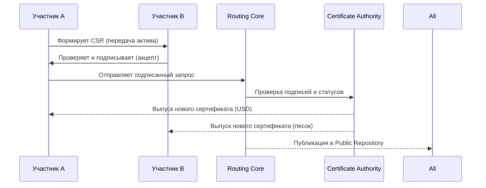

# 4. ТЕХНИЧЕСКОЕ ОБЪЯСНЕНИЕ (упрощённое)

[↑ Вернуться к оглавлению](Home.md)


Этот раздел объясняет, как TRS заменяет привычные блоки «счёт–платёж–реестр» простой процедурой обмена сертификатами и ключевые технические концепции TRS, без углубления в детали реализации.

------------------------------------------------------------------------

## 4.1. Актив = Сертификат X.509

### Межсистемный доверительный мост

> **TRS — это межсистемный доверительный мост, обеспечивающий перемещение ценностей между независимыми площадками на основе доверительных подписей X.509, без централизованного реестра.**

В отличие от традиционных PKI-систем (где сертификаты используются для шифрования и аутентификации), TRS использует X.509 как универсальный формат учёта собственности и обмена активами между различными платформами.

### Сертификат как единица учёта

В TRS каждый актив представлен цифровым сертификатом формата X.509 — того самого формата, который используется для защиты веб-сайтов (HTTPS) и цифровых подписей по всему миру.

**Принципиальное отличие:** В TRS сертификат X.509 используется не для шифрования соединений, а как **базовая единица учёта собственности**.

### Что хранится в сертификате актива

Сертификат содержит:

**Основные поля (стандартные X.509):**

- Subject (владелец актива)
- Issuer (CA, выпустивший сертификат)
- Serial Number (уникальный идентификатор)
- Validity Period (срок действия)
- Public Key (открытый ключ владельца)
- Signature (цифровая подпись CA)

**Дополнительные поля (расширения через OID):**

- Asset Type (тип актива: валюта, товар, цифровой объект, право)
- Quantity (количество или объём)
- Asset ID (идентификатор конкретного актива)
- Gateway ID (источник происхождения)
- Parent Certificate Serial (связь с предыдущим владельцем)
- Split Information (информация о делении актива)
- Total Original (изначальный объём при делении)

### Пример: Сертификат товара

Сертификат №: 1A2B3C4D5E6F
Владелец: CN=ООО "Строймастер", O=Company
Выпущен: CA=TRS Root CA
Срок: 2025-01-01 до 2026-01-01

Расширения (OID):
assetType: "commodity.building_materials.sand"
assetID: "sand_batch_2025_001"
quantity: "5000"
unit: "kg"
gatewayID: "gateway_stroymasterltd"
sourceReference: "invoice_2025_001"
timestamp: 2025-01-15T10:30:00Z

**Смысл:** Этот сертификат подтверждает, что ООО “Строймастер” владеет 5000 кг песка, зарегистрированного через шлюз gateway_stroymasterltd.

### Ключевые свойства

**Доказуемость владения:** Только владелец приватного ключа может подписать транзакцию с этим активом.

**Неизменяемость:** После выпуска CA содержимое сертификата нельзя изменить — любое изменение нарушит цифровую подпись.

**Проверяемость:** Любой участник может проверить подлинность сертификата через цепочку доверия к CA.

**Прозрачность:** Все сертификаты публикуются в открытом репозитории вместе со списками отзыва.

------------------------------------------------------------------------

## 4.2. Транзакция = Подписанный обмен

Транзакция в TRS — это **подписанный всеми участниками документ**, описывающий условия обмена активами.

### Структура транзакции

Каждая транзакция содержит:

**Идентификация:**

- Уникальный номер транзакции
- Точное время создания (timestamp)
- Тип операции (передача, деление, регистрация)

**Участники:**

- Данные отправителя (владелец актива)
- Данные получателя (новый владелец)
- Gateway (если требуется подтверждение)

**Активы:**

- Входящие сертификаты (которые будут отозваны)
- Запросы на новые сертификаты (для каждой стороны)

**Подписи:**

- Цифровая подпись отправителя
- Цифровая подпись получателя
- Подпись Gateway (если требуется)

### Пример: P2P обмен

Рассмотрим пример атомарного обмена (Atomic Swap) между двумя участниками — строительной компанией и поставщиком.

**Исходная ситуация:**

- Участник A имеет сертификат актива на 3000 кг песка
- Участник B имеет сертификат актива на 45 000 USD

**Процесс обмена:**

1. Участник A формирует запрос (CSR) на передачу своего актива участнику B и подписывает его своим ключом

2. Участник B проверяет подпись, акцептует запрос и подписывает его своим ключом

3. Любая из сторон отправляет подписанный запрос в Routing Core

4. Routing Core проверяет подписи обеих сторон и передаёт запрос в CA

5. CA отзывает исходные сертификаты и выпускает два новых:
* сертификат на 3000 кг песка — на имя участника B
* сертификат на 45 000 USD — на имя участника A

6. Новые сертификаты публикуются в Public Repository, а старые попадают в CRL

**Результат:** Обмен происходит одновременно и гарантированно — обе стороны получают подтверждённые CA сертификаты, а исходные становятся недействительными.


### Атомарность обмена

**Принцип “всё или ничего”:** Транзакция либо выполняется полностью (оба получают новые сертификаты), либо не выполняется вообще.

Routing Core проверяет:

- Обе подписи валидны
- Входящие сертификаты существуют и не отозваны
- Суммы сходятся (количество на входе = количество на выходе)

Если все проверки пройдены — старые сертификаты отзываются, новые выпускаются и публикуются.

Если хотя бы одна проверка не пройдена — транзакция отклоняется, ничего не меняется.

------------------------------------------------------------------------

## 4.3. Как работает обмен (краткая схема)

Таким образом, каждая транзакция в TRS — это документ, который порождает новые сертификаты активов. Следующий шаг — понять, как этот обмен выполняется на практике.

Обмен активами в TRS проходит по единой схеме, независимо от типа активов.

### Схема онлайн-обмена (Atomic Swap)

```
Шаг 1: ПОДГОТОВКА
├─ Участник A: имеет сертификат актива #1
├─ Участник B: имеет сертификат актива #2
└─ Обе стороны согласовывают условия обмена

Шаг 2: СОЗДАНИЕ ТРАНЗАКЦИИ
├─ Формируется документ обмена
├─ Указываются входящие сертификаты (#1, #2)
├─ Указываются получатели новых сертификатов
└─ Обе стороны подписывают документ

Шаг 3: ОТПРАВКА В ROUTING CORE
└─ Подписанная транзакция отправляется в систему

Шаг 4: ПРОВЕРКА ROUTING CORE
├─ Проверка подписей участников
├─ Проверка статусов сертификатов (не отозваны?)
├─ Проверка балансов (количество сходится?)
└─ Проверка правил системы

Шаг 5: ВЗАИМОДЕЙСТВИЕ С CA
├─ Routing Core отправляет запрос в CA
└─ CA выполняет обмен (см. механизм в разделе 6)

Шаг 6: ПУБЛИКАЦИЯ
├─ Новые сертификаты добавляются в Public Repository
├─ Транзакция записывается в Audit Log
└─ Участники получают новые сертификаты в кошельки

✓ ЗАВЕРШЕНО
└─ Обмен подтверждён, активы переданы
```

### Схема офлайн-обмена (встречные сертификаты)

```
Шаг 1: ВСТРЕЧА БЕЗ ИНТЕРНЕТА
├─ Участники показывают друг другу сертификаты (QR-коды)
└─ Каждый проверяет сертификат контрагента локально

Шаг 2: СОЗДАНИЕ ВСТРЕЧНЫХ ЗАПРОСОВ
├─ Участник A создаёт CSR: передать актив #1 участнику B
├─ Участник B создаёт CSR: передать актив #2 участнику A
└─ Обе стороны подписывают полный пакет документов

Шаг 3: ЛОКАЛЬНАЯ БЛОКИРОВКА
├─ Приложение у A автоматически блокирует сертификат #1
├─ Приложение у B автоматически блокирует сертификат #2
└─ Заблокированные сертификаты нельзя использовать повторно

Шаг 4: ФИЗИЧЕСКИЙ ОБМЕН
├─ Участники обмениваются активами в реальном мире
└─ Обе стороны подтверждают получение

Шаг 5: СИНХРОНИЗАЦИЯ (ПОЗЖЕ, ПРИ ПОЯВЛЕНИИ СЕТИ)
├─ Любой из участников публикует транзакцию в Routing Core
└─ Routing Core и CA обрабатывают как обычную транзакцию

✓ ЗАВЕРШЕНО
└─ Офлайн-обмен подтверждён в системе
```

### Время выполнения

**Online режим:** 5-20 секунд от подписания до получения новых сертификатов

**Offline режим:**

- Локальная часть (обмен): мгновенно
- Синхронизация с системой: 5-20 секунд при появлении сети

------------------------------------------------------------------------

## 4.4. Безопасность и прозрачность

Безопасность TRS строится на трёх столпах: криптографии, прозрачности и нотариальной функции CA.
TRS обеспечивает безопасность обмена активами через комбинацию криптографических механизмов и прозрачной публикации всех операций.

### Прозрачность как основа доверия

TRS создаёт межсистемный мост доверия, где прозрачность достигается без глобального реестра:

**Public Repository:**

- Все активные сертификаты публикуются в открытом репозитории
- Любой участник может скачать и проверить сертификаты
- CRL обновляется в реальном времени

**Audit Log:**

- Все операции фиксируются в неизменяемом журнале
- Включает: выпуск, передачу, деление, отзыв сертификатов
- Используется для аудита и расследований

**Проверяемость:**

- История каждого актива прослеживается до источника
- Поле parentCertSerial связывает сертификаты в цепочку
- Можно проверить весь путь актива от регистрации

**Отсутствие скрытых операций:**

- CA не может выпустить сертификат без CSR от клиента и Gateway
- Routing Core не может изменить транзакцию без подписей участников
- Все действия CA публикуются в репозитории

### Криптографические гарантии

**Цифровые подписи:**

- Каждая транзакция подписывается приватными ключами всех участников
- Подпись невозможно подделать без доступа к приватному ключу
- Любой может проверить подлинность подписи через открытый ключ

**Цепочка доверия:**

- Каждый сертификат подписан CA
- CA имеет корневой сертификат, известный всем участникам
- Проверка цепочки: Сертификат актива ← CA ← Root CA

**Хеширование:**

- Транзакции имеют уникальные хеши (SHA-256)
- Изменение даже одного байта меняет весь хеш
- Невозможно изменить транзакцию после подписания

### Предотвращение двойного расходования

**Проблема:** Как гарантировать, что один актив не будет потрачен дважды?

**Решение в TRS:**

1. **Отзыв при передаче:** При каждой транзакции старый сертификат отзывается

2. **Публикация CRL:** Отозванные сертификаты публикуются в списке отзыва (Certificate Revocation List)

3. **Проверка перед принятием:** Перед принятием актива участник проверяет, не отозван ли сертификат

4. **Локальная блокировка (offline):** В офлайн-режиме приложение автоматически блокирует сертификат локально

5. **Grace Period (offline):** После синхронизации есть период, когда офлайн-сделку можно оспорить

**Пример защиты:**

```
Злоумышленник пытается дважды потратить актив:

Попытка 1: Передача участнику A (online)
└─ ✓ Успешно, сертификат отозван, появился в CRL

Попытка 2: Передача участнику B (через 5 минут)
├─ B проверяет сертификат
├─ B видит, что сертификат в CRL
└─ ✗ ОТКЛОНЕНО — актив уже потрачен
```

### Роль CA — нотариус, не владелец

**Важный принцип:** CA удостоверяет операции, но не контролирует активы.

**CA НЕ МОЖЕТ:**

- Потратить или передать актив без подписи владельца
- Изменить содержимое сертификата после выпуска
- Скрыть транзакцию от публикации
- Получить доступ к приватным ключам участников

**CA МОЖЕТ:**

- Выпустить сертификат по запросу (CSR)
- Отозвать сертификат по запросу владельца или арбитра
- Опубликовать список отозванных сертификатов
- Проверить подлинность запросов

**Аналогия:** CA работает как нотариус — удостоверяет сделки, но не участвует в них как сторона.

------------------------------------------------------------------------

## 4.5. Примеры операций (список)

TRS поддерживает четыре базовых типа операций с активами. Все остальные процессы строятся на их основе.

### 1. Asset Registration — Регистрация актива

**Назначение:** Ввод новой ценности в систему TRS через доверенный Gateway.

**Участники:**

- Клиент (владелец будущего актива)
- Gateway (подтверждает происхождение)
- CA (выпускает сертификат)

**Процесс:**
1. Клиент формирует CSR с параметрами актива
2. Gateway проверяет и подписывает CSR
3. CA выпускает сертификат актива
4. Сертификат публикуется в репозитории

**Примеры:**

- Ввод денег через банковский шлюз
- Регистрация товарной партии через торговую площадку
- Выпуск игровых предметов через игровой Gateway

------------------------------------------------------------------------

### 2. Asset Transfer — Передача актива

**Назначение:** Перемещение права собственности между клиентами TRS.

**Варианты:**

- **P2P Transfer:** Простая передача от A к B
- **Atomic Swap:** Одновременный взаимный обмен между A и B

**Участники:**

- Отправитель (владелец актива)
- Получатель (новый владелец)
- Routing Core (координирует обмен)
- CA (выполняет обмен сертификатов)

**Процесс (Atomic Swap):**
1. Обе стороны подписывают документ обмена
2. Routing Core проверяет подписи и статусы
3. CA выполняет обмен (см. механизм в разделе 6)
4. Новые сертификаты публикуются

**Примеры:**

- Обмен валюты между пользователями
- Покупка товара за деньги
- Обмен игровыми предметами

------------------------------------------------------------------------

### 3. Asset Split — Деление актива

**Назначение:** Разделение одного сертификата на несколько дочерних при сохранении общей величины.

**Участники:**

- Владелец актива
- CA (выполняет деление)

**Процесс:**
1. Владелец создаёт запрос на деление с указанием частей
2. CA проверяет: сумма частей = исходной величине
3. CA выполняет деление (см. механизм в разделе 6)
4. Все дочерние сертификаты наследуют totalOriginal

**Правила:**

- Сумма частей должна равняться исходному объёму
- Тип и свойства актива сохраняются
- Цепочка происхождения фиксируется в parentCertSerial
- Все части наследуют параметр totalOriginal (изначальный объём)

**Примеры:**

- Разделение 10000 USD на 10 частей по 1000 USD
- Деление товарной партии 5000 кг на 5 партий по 1000 кг
- Дробление акций или токенов

------------------------------------------------------------------------

### 4. Asset Revocation — Отзыв актива

**Назначение:** Аннулирование сертификата актива, делающее его недействительным.

**Участники:**

- Инициатор отзыва (владелец, Gateway или арбитр)
- CA (выполняет отзыв)

**Причины отзыва:**

- Вывод актива из системы (Withdrawal через Gateway)
- Завершение операции обмена (автоматический отзыв при передаче)
- Компрометация приватного ключа
- Решение арбитра при спорах
- Истечение срока действия сертификата

**Процесс:**
1. Инициатор отправляет запрос на отзыв (подписанный)
2. CA проверяет право на отзыв
3. CA добавляет сертификат в CRL
4. CRL публикуется в репозитории
5. Статус сертификата обновляется в OCSP

**Публикация:**

- Отозванные сертификаты появляются в Certificate Revocation List
- CRL доступен всем участникам для проверки
- Любая попытка использовать отозванный сертификат отклоняется

**Примеры:**

- Вывод денег из системы через банк
- Автоматический отзыв при передаче актива
- Отзыв украденного актива по решению арбитра

------------------------------------------------------------------------

### Комбинированные операции

Базовые операции могут комбинироваться для более сложных сценариев:

**Деление + Передача:**
Разделить актив на части и передать их разным получателям

**Регистрация + Деление:**
Зарегистрировать крупную партию и сразу разделить на меньшие части

**Atomic Swap + Split:**
Обменять часть актива, разделив его предварительно

**Передача + Вывод:**
Передать актив Gateway и вывести из системы

------------------------------------------------------------------------

## Итог раздела 4

Раздел 4 описывает логику работы TRS на базовом уровне. Каждая операция — это проверяемый обмен цифровыми сертификатами, а Routing Core и CA вместе обеспечивают нотариальное подтверждение без глобального реестра.

Ключевые выводы:

- Актив = Сертификат X.509 с расширениями
- Транзакция = Подписанный документ обмена
- Обмен = Отзыв старых + Выпуск новых сертификатов
- Безопасность = Криптография + Прозрачность + Роль CA как нотариуса

Далее (в разделе 5) раскрывается архитектура, которая делает эти процессы технически осуществимыми.

---------

[↓ Перейти к следующему разделу](TRS_5.md)

[↑ Вернуться к оглавлению](Home.md)