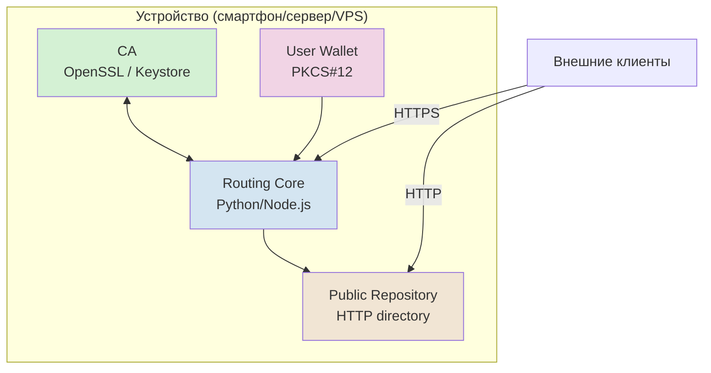
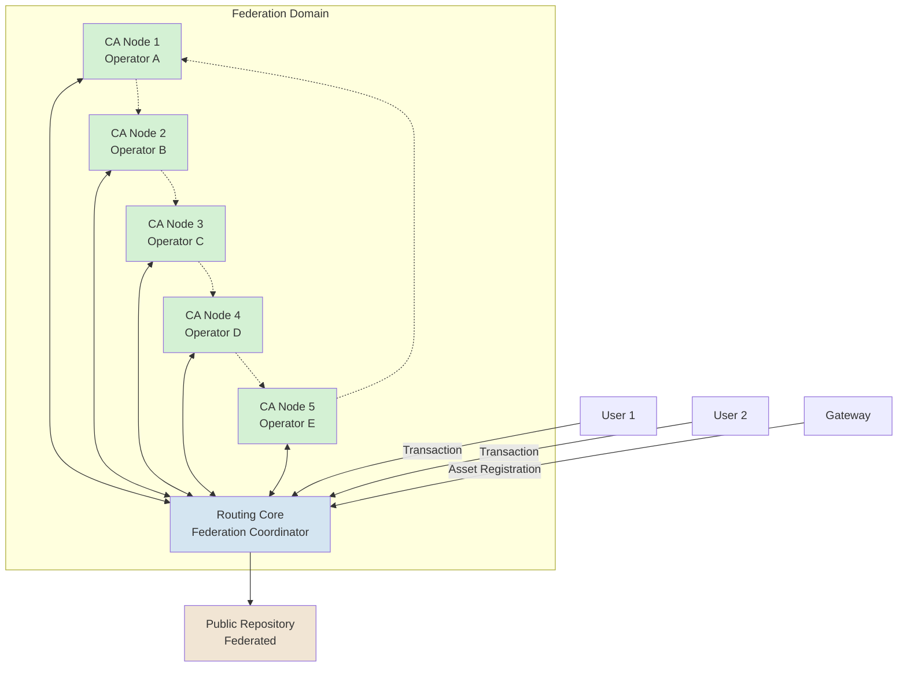
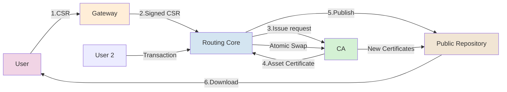

# 5. АРХИТЕКТУРА

[↑ Вернуться к оглавлению](Home.md)


------------------------------------------------------------------------

## 5.1. Принцип простоты

TRS построена на идеологии **максимальной доступности развёртывания** — система использует только стандартные механизмы PKI, которые присутствуют на 99% устройств.

> **Ключевой принцип:** Нет специализированного оборудования, проприетарных SDK или блокчейн-инфраструктуры. Только встроенные средства операционных систем, браузеров и мобильных платформ.

### Философия архитектуры

**Что НЕ требуется:**

- Специализированные серверы или дата-центры
- Блокчейн-ноды или майнинговое оборудование
- Проприетарные библиотеки или SDK
- Специфические базы данных или хранилища
- Выделенные сетевые каналы или VPN

**Что используется:**

- PKCS#12 — встроенная поддержка в ОС (iOS Keychain, Android Keystore, Windows CertStore, macOS Keychain)
- X.509 — стандарт, поддерживаемый всеми браузерами и системами
- HTTPS с ClientAuth — стандартный механизм аутентификации
- OpenSSL / BoringSSL — базовые криптографические библиотеки
- Обычный веб-сервер (Nginx, Apache) или встроенный FastCGI

### Смартфон как сервер

TRS спроектирована так, что **полноценный узел системы может работать на обычном смартфоне**.

Смартфон способен выполнять функции:

- **CA** — выпуск и отзыв сертификатов через встроенный Keystore
- **Routing Core** — обработка транзакций и ведение журнала операций
- **Public Repository** — публикация сертификатов через встроенный HTTP-сервер
- **Gateway** — подтверждение происхождения активов (при наличии соответствующей авторизации)

Это возможно благодаря тому, что современные мобильные платформы имеют полноценные PKI-механизмы:

- **Android Keystore** — аппаратная защита ключей, генерация и управление сертификатами
- **iOS Keychain** — защищённое хранилище с поддержкой X.509 и PKCS#12
- Встроенные криптографические библиотеки
- Возможность запуска локальных HTTP-серверов

------------------------------------------------------------------------

## 5.2. Компоненты системы

TRS состоит из минимального набора взаимодействующих компонентов, каждый из которых может работать на любом устройстве с поддержкой PKI.

### Таблица компонентов

| Компонент| Назначение | Реализация / окружение |
|--------------------------------|----------------------------------------------------------------------------|----------------------------------------------------------------------------------------------------------|
| **CA (Certificate Authority)** | Выпуск, проверка и отзыв сертификатов X.509; публикация CRL/OCSP | Может работать на обычном сервере, VPS или смартфоне с OpenSSL / Python / AndroidKeyStore|
| **Routing Core** | Обрабатывает регистрацию, передачу, деление активов; ведёт журнал операций | Лёгкий FastCGI / Python / Node-сервис. Может быть встроен в мобильное приложение |
| **Gateway**| Подтверждает происхождение ценностей (финансовых, товарных, цифровых)| REST API или локальный модуль платформы; может быть клиентом TRS |
| **User Wallet (PKCS#12)**| Хранит ключи и сертификаты клиента, используется для подписи транзакций| Реализуется через системные хранилища: iOS Keychain, Android Keystore, Windows CertStore, macOS Keychain |
| **Redis / PostgreSQL** | Журнализация и быстрая проверка состояния активов| Необязательные компоненты; могут быть заменены локальными файлами или SQLite |
| **Public Repository**| Публикует сертификаты и статусы (Active / Revoked) | Простая HTTP-директория с .crt и .crl файлами; доступ через URI|

### Детальное описание компонентов

#### CA (Certificate Authority) — Нотариус системы

**Роль:**
CA выполняет функцию нотариуса — удостоверяет происхождение активов и подтверждает право владения, но **не владеет активами** и **не контролирует транзакции**.

**Функции:**

- Выпуск Asset Certificate на основе проверенного CSR
- Отзыв сертификатов (по запросу владельца, Gateway или арбитра)
- Публикация CRL (Certificate Revocation List)
- Предоставление OCSP-ответов для проверки статуса сертификатов
- Ведение логов всех операций для аудита

**Технические требования:**

- OpenSSL или аналог (BoringSSL, LibreSSL)
- Хранилище приватного ключа CA (защищённое PKCS#12 или HSM)
- Веб-сервер для публикации CRL и OCSP
- База данных или файловая система для учёта выпущенных сертификатов

**Возможности развёртывания:**

- Сервер (Linux, Windows, macOS)
- VPS или облачный инстанс
- Смартфон (Android с Keystore API)
- Raspberry Pi или аналогичное устройство

------------------------------------------------------------------------

#### Routing Core — Центр маршрутизации активов

**Роль:**
Routing Core — это сердце системы, управляющее потоками активов между клиентами. Он принимает запросы на операции, проверяет их корректность, координирует действия с CA и публикует результаты.

**Функции:**

- Приём и валидация Transaction Record (подписанных документов обмена)
- Координация Atomic Swap — отзыв старых и выпуск новых сертификатов
- Обработка Asset Registration через Gateway
- Управление процессом Asset Split
- Ведение Audit Log — неизменяемого журнала операций, используемого для проверки целостности и расследований (подробнее в разделе 8 «Безопасность»)
- Публикация результатов в Public Repository

**API методы (основные):**

1. `/register_asset` — регистрация нового актива через Gateway
2. `/transfer_asset` — инициация передачи актива (Atomic Swap)
3. `/split_asset` — деление актива на части
4. `/revoke_asset` — отзыв сертификата актива
5. `/get_asset_status` — проверка статуса сертификата
6. `/get_transaction_history` — получение истории операций

**Технические требования:**

- Python / Node.js / Go или аналог
- HTTPS-сервер с поддержкой X.509 ClientAuth
- Взаимодействие с CA (вызов OpenSSL команд или API)
- Доступ к Public Repository (для публикации результатов)
- Опционально: Redis для кеша, PostgreSQL для журнала

**Возможности развёртывания:**

- FastCGI приложение на любом веб-сервере
- Docker-контейнер
- Микросервис в облаке
- Локальный сервис в мобильном приложении
- Standalone daemon на смартфоне

------------------------------------------------------------------------

#### Gateway — Оракул происхождения активов

**Роль:**
Gateway выступает доверенной точкой входа активов в систему TRS. Он подтверждает, что ценность действительно существует во внешнем мире (банковский счёт, склад, игровая платформа) и даёт право на выпуск соответствующего Asset Certificate.

**Функции:**

- Проверка происхождения актива (депозит на счёт, поступление товара на склад, зачисление виртуальных активов)
- Подписание CSR своим ключом (подтверждение Asset Registration)
- Обработка Withdrawal — конвертация Asset Certificate обратно во внешнюю ценность
- Интеграция с внешними системами (банки, платёжные системы, товарные биржи, игровые платформы)
- KYC/AML проверки (при необходимости)

**Типы Gateway:**

- **Финансовые** — банки, платёжные системы, обменники (ввод/вывод фиатных денег)
- **Товарные** — склады, логистические операторы, биржи (подтверждение наличия материальных активов)
- **Цифровые** — игровые платформы, стриминговые сервисы, маркетплейсы (виртуальные активы, лицензии, подписки)

**Технические требования:**

- REST API для взаимодействия с Routing Core
- PKCS#12 контейнер Gateway (для подписи CSR)
- Интеграция с внешними системами (банковские API, складские системы, игровые серверы)
- Проверка доступности активов перед подписанием

**Возможности развёртывания:**

- Модуль банковской системы
- API-сервис платёжной платформы
- Плагин к CRM или ERP системе
- Микросервис в облаке
- Встроенный модуль игрового сервера

Gateway является **равноправным клиентом TRS**, но выполняет специфическую функцию подтверждения происхождения активов.

------------------------------------------------------------------------

#### User Wallet (PKCS#12) — Кошелёк клиента

**Роль:**
User Wallet — защищённый контейнер, хранящий приватный ключ и сертификаты клиента. Это единственное место, где клиент контролирует свои активы.

**Содержимое кошелька:**

- Приватный ключ клиента (RSA/ECDSA)
- Client Certificate — сертификат X.509 клиента для аутентификации
- Asset Certificates — сертификаты активов, которыми владеет клиент
- Цепочка доверия CA (корневые и промежуточные сертификаты)

**Операции с кошельком:**

- Подписание Transaction Record своим приватным ключом
- Генерация CSR для новых активов
- Проверка подлинности полученных сертификатов
- Экспорт/импорт кошелька (для резервного копирования или смены устройства)

**Системные хранилища:**

- **iOS**: Keychain Services (аппаратная защита через Secure Enclave)
- **Android**: Android Keystore System (защита через TEE/StrongBox)
- **Windows**: Certificate Store (CertStore API)
- **macOS**: Keychain Access
- **Linux**: NSS Database или файловое хранилище PKCS#12

**Безопасность:**

- Приватный ключ **никогда не покидает устройство**
- Доступ к кошельку защищён паролем, PIN-кодом или биометрией
- Возможность использования аппаратных модулей безопасности (HSM) для критических клиентов

------------------------------------------------------------------------

#### Public Repository — Хранилище прозрачности

**Роль:**
Public Repository обеспечивает прозрачность системы — любой участник может проверить подлинность сертификата и его текущий статус (Active / Revoked).

**Содержимое репозитория:**

- Активные сертификаты активов (.crt файлы)
- Certificate Revocation List (CRL) — список отозванных сертификатов (формат X.509 CRL, подробнее в разделе 6.6)
- OCSP Responder — служба проверки статуса в реальном времени (Online Certificate Status Protocol, альтернатива CRL)
- Корневые сертификаты CA
- Audit Log (опционально, для публичного аудита)

> CRL обновляется периодически (ежедневно или чаще), OCSP предоставляет мгновенный статус по запросу. Оба механизма обеспечивают защиту от использования отозванных сертификатов.

**Структура каталогов:**
```
/repository/
├── /certs/                 # Активные сертификаты активов
│   ├── /2025/
│   │   ├── /10/
│   │   │   ├── asset_12345.crt
│   │   │   └── asset_12346.crt
│   │   └── /11/
│   │       └── asset_12347.crt
│   └── /2026/
│       └── /01/
│           └── asset_12348.crt
├── /crl/                   # Списки отзыва
│   ├── ca_crl_2025-10-12.crl
│   ├── ca_crl_2025-10-13.crl
│   └── ca_crl_2025-10-14.crl
├── /ca/                    # Корневые сертификаты
│   ├── root_ca.crt
│   └── intermediate_ca.crt
└── /ocsp/                  # OCSP Responder
    └── ocsp.cgi
```

**Доступ:**

- HTTP/HTTPS (публичный доступ на чтение)
- Структурированные URI для каждого сертификата
- Поддержка индексации и поиска

**Технические требования:**

- Веб-сервер (Nginx, Apache)
- Файловая система или объектное хранилище (S3-compatible)
- OCSP Responder (OpenSSL ocsp daemon)
- Опционально: CDN для ускорения доступа

------------------------------------------------------------------------

#### Redis / PostgreSQL (опционально)

**Роль:**
Вспомогательные хранилища для оптимизации работы Routing Core.

**Redis:**

- Кеширование статусов сертификатов (Active / Revoked)
- Быстрая проверка наличия актива перед операцией
- Временное хранилище pending транзакций
- Pub/Sub для уведомлений между компонентами

**PostgreSQL:**

- Audit Log — неизменяемый журнал всех операций
- Индексирование сертификатов по различным атрибутам
- Хранение метаданных транзакций
- Аналитика и отчётность

**Замена:**

- Redis → локальный кеш в памяти, SQLite
- PostgreSQL → SQLite, JSON-файлы, локальная БД

> **Важно:** Эти компоненты **необязательны**. Минимальная конфигурация TRS может работать только с файловой системой и локальными структурами данных.

------------------------------------------------------------------------

## 5.3. Stand-alone архитектура

Stand-alone режим — это минимальная конфигурация TRS, работающая на одном устройстве без внешних зависимостей.

### Минимальные требования

**Что нужно для развёртывания:**

1.**CA** — OpenSSL или встроенный Keystore
2.**Routing Core** — скрипт на Python/Node.js или встроенный сервис
3.**Public Repository** — локальная директория с HTTP-доступом
4.**User Wallet** — PKCS#12 контейнер в системном хранилище

**Оборудование:**

- Любое устройство с ОС (смартфон, ноутбук, Raspberry Pi, VPS)
- 512 МБ RAM минимум (1 ГБ рекомендуется)
- 1-5 ГБ дискового пространства (в зависимости от количества сертификатов)
- Сетевое подключение (для синхронизации и публикации)

### Схема Stand-alone узла



### Процесс работы Stand-alone узла

**1. Инициализация:**

- Создание корневого CA (генерация приватного ключа и самоподписанного сертификата)
- Запуск Routing Core (прослушивание порта, например 8443)
- Настройка Public Repository (монтирование директории в веб-сервер)
- Создание первого User Wallet (генерация Client Certificate)

**2. Регистрация актива:**

- Gateway (или сам владелец узла) создаёт CSR
- Routing Core валидирует запрос и передаёт CA
- CA выпускает Asset Certificate
- Сертификат публикуется в Public Repository
- Запись в Audit Log (локальный файл или SQLite)

**3. Передача актива:**

- Два клиента формируют Transaction Record
- Routing Core проверяет подписи и статусы сертификатов
- CA отзывает исходные сертификаты (добавляет в CRL)
- CA выпускает новые сертификаты для получателей
- Новые сертификаты публикуются в Public Repository

**4. Проверка статуса:**

- Любой участник скачивает CRL из Public Repository
- Проверяет, не отозван ли сертификат
- Опционально: запрос OCSP Responder

### Использование смартфона как Stand-alone узла

**Пример: Android устройство**

**Компоненты:**

- **CA**: Android Keystore API (генерация ключей, подписание сертификатов)
- **Routing Core**: локальное Android приложение (Kotlin/Java)
- **Public Repository**: встроенный HTTP-сервер (NanoHTTPD или аналог)
- **User Wallet**: хранилище в Android Keystore

**Возможности:**

- Выпуск сертификатов активов
- P2P обмен через QR-коды или NFC (Offline Mode)
- Синхронизация с другими узлами при наличии сети
- Публикация сертификатов через локальный HTTP-сервер (доступен в локальной сети или через Tor/VPN)

**Преимущества смартфона:**

- Всегда с владельцем (мобильность)
- Аппаратная защита ключей (TEE, StrongBox)
- Биометрическая аутентификация
- Низкое энергопотребление
- Встроенные средства коммуникации (NFC, QR-коды, Bluetooth)

------------------------------------------------------------------------

## 5.4. Федеративная архитектура

Федеративный режим — это распределённая сеть доверенных узлов TRS, работающих по единым правилам и обеспечивающих повышенную надёжность и отказоустойчивость.

### Концепция федерации

**Определение:**
Федерация TRS — это группа CA, объединённых общими правилами доверия. Валидация операций требует **кворума подписей** от нескольких CA, что исключает монополию одного центра и повышает устойчивость к атакам.

**Ключевые принципы:**

- Несколько независимых CA (3-7 узлов типично)
- Кворум подписей для критических операций (например, 3 из 5)
- Единый Public Repository или федеративная репликация
- Взаимная проверка и аудит между узлами

### Схема федеративной архитектуры



### Кворум подписей

**Модель M-of-N:**

- **N** — общее количество CA в федерации
- **M** — минимальное количество подписей для валидации (M ≤ N)

**Типичные конфигурации:**

- **3 из 5** — баланс между безопасностью и доступностью (рекомендуется)
- **2 из 3** — минимальная федерация (для тестирования)
- **5 из 7** — повышенная безопасность (для критичных применений)

**Процесс подписания с кворумом:**

1.Routing Core получает Transaction Record
2.Отправляет запрос на подписание всем CA в федерации
3.Собирает подписи от CA (каждый CA проверяет транзакцию независимо)
4.Если получено ≥ M подписей → транзакция валидна
5.Если получено < M подписей → транзакция отклонена
6.Результат публикуется в Public Repository с указанием подписавших CA

### Распределение ролей

| Роль| Функция | Количество|
|-----------------------|---------------------------------------------------|-----------------------------|
| **CA Operator** | Управляет одним CA узлом| N (3-7) |
| **Routing Core**| Координирует транзакции, собирает подписи кворума | 1 (с репликацией) |
| **Public Repository** | Публикует сертификаты и статусы | 1 (федеративная репликация) |
| **Gateway** | Подтверждает происхождение активов| M+ (множество)|
| **User**| Участвует в обмене активами | Неограничено|

### Преимущества федеративной модели

**Безопасность:**

- Компрометация одного CA не приводит к компрометации системы
- Коллективное доверие вместо единой точки отказа
- Взаимный аудит между узлами

**Отказоустойчивость:**

- Система работает даже при отказе (N - M) узлов
- Например, при конфигурации 3 из 5, система устойчива к отказу 2 узлов

**Прозрачность:**

- Каждый CA ведёт независимый Audit Log
- Возможность сравнения логов для выявления расхождений
- Публичная проверка кворума подписей

**Децентрализация:**

- Операторы CA могут быть независимыми организациями
- Географическое распределение узлов
- Юридическая независимость (разные юрисдикции)

### Синхронизация федерации

**Публикация сертификатов:**

1.CA выпускает сертификат
2.Сертификат публикуется в локальном Public Repository узла
3.Federated Replication синхронизирует сертификат между узлами
4.Единый федеративный репозиторий агрегирует данные от всех узлов

**Отзыв сертификатов:**

1.CA отзывает сертификат (добавляет в локальный CRL)
2.CRL реплицируется на другие узлы
3.Федеративный CRL агрегирует данные от всех узлов
4.Любой участник может проверить статус через любой узел

**Разрешение конфликтов:**

- Если разные CA выдали противоречивые решения → применяется правило кворума
- Timestamp используется для разрешения гонок (race conditions)
- В случае равенства голосов → транзакция откладывается до достижения кворума

------------------------------------------------------------------------

## 5.5. Потоки данных

Потоки данных в TRS строятся вокруг жизненного цикла Asset Certificate — от регистрации до отзыва.

### Общая схема потоков



### Поток 1: Регистрация актива (Asset Registration)

**Участники:** User, Gateway, Routing Core, CA, Public Repository

**Шаги:**

1. **User → Gateway**: Пользователь вносит депозит (деньги на счёт, товар на склад, виртуальные активы в игре)
2. **Gateway → Routing Core**: Gateway формирует и подписывает CSR, отправляет запрос на Asset Registration
3. **Routing Core → CA**: Валидирует запрос (проверяет подпись Gateway, корректность данных), передаёт CA
4. **CA**: Выпускает Asset Certificate, подписывает своим приватным ключом
5. **CA → Routing Core**: Возвращает подписанный сертификат
6. **Routing Core → Public Repository**: Публикует сертификат в открытом репозитории
7. **Routing Core → User**: Уведомляет пользователя о готовности сертификата
8. **User → Public Repository**: Скачивает Asset Certificate в свой PKCS#12 Wallet

**Данные:**

- **Входящие**: Информация о депозите от Gateway
- **Промежуточные**: CSR с параметрами актива
- **Исходящие**: Asset Certificate (DER/PEM)

**Время выполнения:**

- Online: 5-20 секунд
- Включает проверки, подписание, публикацию

------------------------------------------------------------------------

### Поток 2: Передача актива (Asset Transfer / Atomic Swap)

**Участники:** User A, User B, Routing Core, CA, Public Repository

**Шаги:**

### Поток 2: Передача актива (Asset Transfer / Atomic Swap)

**Участники:** User A, User B, Routing Core, CA, Public Repository

**Шаги:**

1. **User A ↔ User B**: Согласование условий сделки (какой актив на какой меняется)
2. **User A + User B → Routing Core**: Формирование Transaction Record, подписание обеими сторонами
3. **Routing Core**: Валидация Transaction Record:
   - Проверка подписей User A и User B
   - Проверка статусов сертификатов активов (не отозваны ли)
   - Проверка соответствия условий сделки
4. **Routing Core → CA**: Запрос на Atomic Swap:
   - Отзыв исходных Asset Certificates (A → B, C → D)
   - Выпуск новых Asset Certificates (B → A, D → B)
5. **CA**: Выполнение атомарной операции:
   - BEGIN TRANSACTION
   - Отзыв старых сертификатов (добавление в CRL)
   - Выпуск новых сертификатов
   - COMMIT (или ROLLBACK при ошибке)
6. **CA → Routing Core**: Возврат новых сертификатов
7. **Routing Core → Public Repository**: Публикация:
   - Новых сертификатов
   - Обновлённого CRL
8. **Routing Core → User A, User B**: Уведомление о завершении
9. **User A, User B → Public Repository**: Скачивание новых Asset Certificates

**Данные:**

- **Входящие**: Transaction Record (подписанный JSON)
- **Промежуточные**: Запрос на Atomic Swap
- **Исходящие**: Новые Asset Certificates, обновлённый CRL

**Время выполнения:**

- Online: 5-20 секунд
- Offline: 1-12 минут локально + 15 секунд на публикацию при синхронизации

------------------------------------------------------------------------

### Поток 3: Деление актива (Asset Split)

**Участники:** User, Routing Core, CA, Public Repository

**Шаги:**

**Шаги:**

1. **User → Routing Core**: Запрос на деление актива (указывает сертификат и пропорции деления)
2. **Routing Core**: Валидация запроса:
   - Проверка подписи User
   - Проверка статуса исходного сертификата
   - Проверка корректности пропорций (сумма частей = исходное количество)
3. **Routing Core → CA**: Запрос на Split:
   - Отзыв исходного Asset Certificate
   - Выпуск дочерних Asset Certificates (с наследованием totalOriginal и цепочки происхождения)
4. **CA**: Выполнение операции:
   - Отзыв родительского сертификата
   - Создание дочерних сертификатов (указание parentCertSerial)
   - Подписание новых сертификатов
5. **CA → Routing Core**: Возврат дочерних сертификатов
6. **Routing Core → Public Repository**: Публикация:
   - Дочерних сертификатов
   - Обновлённого CRL (с родительским сертификатом)
7. **Routing Core → User**: Уведомление о завершении
8. **User → Public Repository**: Скачивание дочерних Asset Certificates

**Данные:**

- **Входящие**: Запрос на деление с пропорциями
- **Промежуточные**: CSR для дочерних сертификатов
- **Исходящие**: Дочерние Asset Certificates

**Время выполнения:**

- Online: 5-15 секунд

------------------------------------------------------------------------

### Поток 4: Проверка статуса сертификата

**Участники:** User, Public Repository, OCSP Responder (опционально)

**Вариант 1: Проверка через CRL**

1. **User → Public Repository**: Скачивание CRL (Certificate Revocation List)
2. **User (локально)**: Поиск serial number сертификата в CRL
3. **Результат**: Если найден → сертификат отозван, если не найден → активен

**Вариант 2: Проверка через OCSP**

1. **User → OCSP Responder**: Запрос статуса конкретного сертификата (по serial number)
2. **OCSP Responder → User**: Ответ (good / revoked / unknown)
3. **Результат**: Мгновенный статус сертификата

**Данные:**

-  **Входящие**: Serial number сертификата
-  **Исходящие**: Статус (Active / Revoked)

**Время выполнения:**

- CRL: 1-5 секунд (скачивание и парсинг файла)
- OCSP: < 1 секунды (прямой запрос)

------------------------------------------------------------------------

### Поток 5: Вывод актива (Withdrawal через Gateway)

**Участники:** User, Gateway, Routing Core, CA, Public Repository

**Шаги:**

1. **User → Gateway**: Запрос на вывод актива (конвертация Asset Certificate во внешнюю ценность)
2. **Gateway → Routing Core**: Запрос на отзыв сертификата (с подтверждением выплаты)
3. **Routing Core → CA**: Запрос на отзыв Asset Certificate
4. **CA**: Добавление сертификата в CRL
5. **CA → Routing Core**: Подтверждение отзыва
6. **Routing Core → Public Repository**: Публикация обновлённого CRL
7.**Routing Core → Gateway**: Подтверждение завершения
8. **Gateway → User**: Перевод внешней ценности (деньги на счёт, отправка товара, зачисление виртуальных активов)

**Данные:**

-  **Входящие**: Asset Certificate для вывода
-  **Промежуточные**: Запрос на отзыв
-  **Исходящие**: Обновлённый CRL

**Время выполнения:**

- 10-60 секунд (в зависимости от скорости обработки Gateway)

------------------------------------------------------------------------

## 5.6. Масштабирование

TRS спроектирована для линейного масштабирования без фундаментальных ограничений на количество участников или операций.

### Вертикальное масштабирование

**Stand-alone узел:**

- Увеличение ресурсов устройства (CPU, RAM, SSD)
- Оптимизация базы данных (индексы, партиционирование)
- Использование Redis для кеширования

**Типичная производительность Stand-alone узла:**
| Конфигурация | Транзакций/сек | Одновременных клиентов |
|------------------------|-----------------------|--------------------------|
| Смартфон (средний) | 10-50 | 100-500 |
| VPS (1 CPU, 2GB RAM) | 50-200 | 500-2000 |
| Dedicated server (4 CPU, 8GB RAM) | 200-1000 | 2000-10000 |
| High-end server (16 CPU, 64GB RAM) | 1000-5000 | 10000-50000 |

> **Примечание:** Производительность зависит от сложности операций (Atomic Swap медленнее Asset Registration) и использования криптографических ускорителей (HSM).

------------------------------------------------------------------------

### Горизонтальное масштабирование

**Федеративная модель:**

- Добавление новых CA узлов в федерацию
- Распределение нагрузки между узлами (load balancing)
- Географическое распределение (latency optimization)

**Routing Federation — федерация маршрутизации:**
Помимо федерации CA (кворум подписей), TRS поддерживает федерацию на уровне Routing Core. Несколько Routing Core узлов объединяются в Routing Federation, где каждый узел может обрабатывать транзакции независимо, но результаты синхронизируются между узлами. Это обеспечивает горизонтальное масштабирование обработки транзакций без единой точки отказа.

**Масштабирование Routing Core:**

- Реплика Routing Core с балансировщиком нагрузки (Nginx, HAProxy)
- Sharding по доменам (разные группы активов обрабатывают разные Routing Core)
- Асинхронная обработка транзакций (очереди сообщений: RabbitMQ, Kafka)

**Масштабирование Public Repository:**

- CDN для статического контента (сертификаты, CRL)
- Объектное хранилище (S3-compatible) вместо файловой системы
- Распределённая репликация между узлами федерации

------------------------------------------------------------------------

### Масштабирование по типам активов

TRS поддерживает **sharding по типам активов** — разные классы активов могут обслуживаться отдельными CA и Routing Core:

| Тип актива | CA Domain | Gateway|
|------------------------|-----------------------|--------------------------|
| Финансовые (фиат)| financial.trs.example | Банки, платёжные системы |
| Товарные (материалы) | commodity.trs.example | Склады, биржи|
| Цифровые (игры)| digital.trs.example | Игровые платформы|
| Юридические (лицензии) | legal.trs.example | Госреестры, нотариусы|

**Преимущества:**

- Независимые CA для разных сфер (специализация)
- Разные правила валидации для разных типов активов
- Юридическая изоляция (разные юрисдикции)
- Параллельная обработка без конкуренции

**Межсистемный обмен:**

- Gateway может быть участником нескольких CA Domains
- Atomic Swap между доменами через посредника (Gateway)
- Федеративный Public Repository для кросс-проверки

------------------------------------------------------------------------

### Оценка масштаба

**Примерная вместимость системы:**

| Метрика | Stand-alone| Федерация (5 узлов)| Распределённая сеть (20+ узлов) |
|-----------------------|--------------------------|----------------------|---------------------------------|
| Пользователей | 10,000-50,000| 50,000-500,000 | 500,000+|
| Активных сертификатов | 100,000-1,000,000| 1,000,000-10,000,000 | 10,000,000+ |
| Транзакций/день | 10,000-100,000 | 100,000-1,000,000| 1,000,000+|
| География | Локальная (город/регион) | Национальная | Глобальная|

**Факторы, влияющие на масштабируемость:**

- Размер сертификатов (типичный Asset Certificate: 2-5 KB)
- Частота обновления CRL (ежедневно, ежечасно, в реальном времени)
- Использование OCSP вместо CRL (снижает трафик)
- Аппаратное ускорение криптографии (HSM, GPU)
- Сетевая инфраструктура (пропускная способность, latency)

------------------------------------------------------------------------

## 5.7. Хранение данных и журналирование

TRS использует модель хранения, оптимизированную для профиля нагрузки с преобладанием операций чтения. Система обеспечивает целостность данных, возможность восстановления состояния и защиту от манипуляций через механизмы Event Log и опциональный Hash Chaining.

------------------------------------------------------------------------

### 5.7.1. Профиль нагрузки TRS

Анализ типичных операций показывает значительное преобладание чтения над записью:

| Операция | Тип | Относительная частота |
|-------------------------------------------|---------|------------------------|
| Проверка статуса сертификата (CRL/OCSP) | Чтение | Очень высокая |
| Скачивание сертификата из репозитория | Чтение | Высокая |
| Проверка цепочки доверия | Чтение | Высокая |
| Регистрация актива | Запись | Средняя |
| Atomic Swap | Запись | Средняя |
| Деление актива | Запись | Низкая |
| Отзыв сертификата | Запись | Низкая |

**Типичное соотношение:** На одну операцию записи (транзакцию) приходится 10-100 операций чтения (проверки статусов участниками и третьими сторонами).

**Следствия для архитектуры:**

- **Запись** — узкое место, требует оптимизации и атомарности
- **Чтение** — масштабируется горизонтально через репликацию Public Repository
- **Разделение** — операции записи направляются в CA/Routing Core, операции чтения — в реплики репозитория

------------------------------------------------------------------------

### 5.7.2. Event Log (журнал событий)

**Event Log** — хронологический журнал всех событий системы, служащий источником истины для восстановления состояния и аудита.

#### Принцип Event Sourcing

В TRS состояние системы (множество активных сертификатов) является **производным** от последовательности событий:

```
Состояние(t) = Применить(Событие[1], Событие[2], ..., Событие[t])
```

Это означает, что:
- Текущее состояние можно восстановить, повторно применив все события
- История изменений сохраняется полностью
- Любое изменение состояния фиксируется как событие

#### Типы событий

| Тип события | Описание | Результат |
|------------------------|------------------------------------------|-------------------------------------|
| `ASSET_REGISTERED` | Регистрация нового актива через Gateway | Выпуск Asset Certificate |
| `ASSET_TRANSFERRED` | Atomic Swap между участниками | Отзыв старых, выпуск новых сертификатов |
| `ASSET_SPLIT` | Деление актива на части | Отзыв родительского, выпуск дочерних |
| `ASSET_REVOKED` | Отзыв сертификата (вывод, утеря) | Добавление в CRL |
| `CERTIFICATE_ISSUED` | Выпуск любого сертификата CA | Публикация в репозитории |
| `CERTIFICATE_REVOKED` | Отзыв любого сертификата CA | Обновление CRL |

#### Структура записи Event Log

```json
{
  "event_id": "evt_20251012_143000_001",
  "event_type": "ASSET_TRANSFERRED",
  "timestamp": "2025-10-12T14:30:00.123Z",
  "sequence": 1847293,
  "data": {
    "transaction_id": "tx_20251012_001",
    "participants": ["alice_001", "bob_002"],
    "certificates_revoked": ["AA:BB:CC:DD", "11:22:33:44"],
    "certificates_issued": ["AA:11:22:33", "BB:22:33:44"],
    "asset_types": ["currency:RUB", "material:sand"]
  },
  "signatures": {
    "routing_core": "3046022100...",
    "ca": "3045022100..."
  },
  "hash": "a3f5d8e9c2b1..."
}
```

**Обязательные поля:**

- `event_id` — уникальный идентификатор события
- `event_type` — тип события из предопределённого списка
- `timestamp` — время события (см. раздел 8.5 Timestamp)
- `sequence` — порядковый номер события (монотонно возрастающий)
- `data` — специфичные для типа события данные
- `signatures` — подписи компонентов, обработавших событие
- `hash` — хеш содержимого записи (SHA-256)

#### Связь с Audit Log

Event Log и Audit Log (раздел 8.4) — взаимодополняющие механизмы:

| Характеристика | Event Log | Audit Log |
|----------------|-----------|-----------|
| Назначение | Восстановление состояния | Расследование и compliance |
| Содержимое | Минимум данных для replay | Полный контекст операции |
| Доступ | Внутренний (Routing Core, CA) | Аудиторы, регуляторы |
| Хранение | Обязательное, долгосрочное | Обязательное, архивное |

> **Примечание:** В простых конфигурациях Event Log и Audit Log могут быть объединены в единый журнал.

------------------------------------------------------------------------

### 5.7.3. State Replay (восстановление состояния)

**State Replay** — механизм восстановления текущего состояния системы путём последовательного применения всех событий из Event Log.

#### Принцип строгого детерминизма

**Требование:** Повторное применение одной и той же последовательности событий должно давать **идентичное** состояние.

Это достигается за счёт:

- Фиксированного порядка событий (поле `sequence`)
- Отсутствия внешних зависимостей при обработке события
- Детерминированных алгоритмов (без random, без текущего времени)

#### Применение State Replay

**1. Disaster Recovery:**

При потере состояния (сбой базы данных, повреждение файлов):

1. Загрузить Event Log из резервной копии или реплики
2. Инициализировать пустое состояние
3. Последовательно применить все события
4. Получить восстановленное состояние

**2. Аудит и верификация:**

Проверка корректности текущего состояния:

1. Запустить State Replay параллельно с основной системой
2. Сравнить полученное состояние с текущим
3. Расхождения указывают на ошибки или манипуляции

**3. Миграция и обновление:**

При изменении формата хранения:

1. Сохранить Event Log
2. Реализовать новую логику применения событий
3. Выполнить State Replay в новом формате

#### Оптимизация: Snapshots

Для больших систем полный replay может занимать значительное время. Решение — периодические снимки состояния (snapshots):

```
Состояние(t) = Snapshot(t₀) + Применить(Событие[t₀+1], ..., Событие[t])
```

**Рекомендуемая частота snapshots:**

| Объём событий | Частота snapshot |
|---------------|------------------|
| < 10,000/день | Еженедельно |
| 10,000-100,000/день | Ежедневно |
| > 100,000/день | Каждые 4-6 часов |

------------------------------------------------------------------------

### 5.7.4. Идемпотентность операций

**Идемпотентность** — свойство операции, при котором повторное выполнение с теми же параметрами даёт тот же результат без побочных эффектов.

#### Проблема сетевых retry

При сетевых сбоях клиент может не получить ответ на запрос и повторить его:

```
Клиент → Routing Core: POST /transfer_asset {...}
Routing Core: обработал, выпустил сертификаты
Routing Core → Клиент: [сетевой сбой, ответ потерян]
Клиент → Routing Core: POST /transfer_asset {...}  // повтор
```

Без защиты повторный запрос может привести к:
- Двойному выполнению операции
- Ошибке "сертификат уже отозван"
- Несогласованному состоянию

#### Механизм idempotency_key

Каждый запрос на изменение состояния должен содержать уникальный ключ идемпотентности:

```json
{
  "idempotency_key": "client-uuid-20251012-143000-abc123",
  "operation": "transfer_asset",
  "csr_a": "...",
  "csr_b": "..."
}
```

**Алгоритм обработки:**

1. Routing Core получает запрос с `idempotency_key`
2. Проверяет, есть ли запись с таким ключом в кеше/хранилище
3. **Если есть** → возвращает сохранённый результат (без повторного выполнения)
4. **Если нет** → выполняет операцию, сохраняет результат с ключом, возвращает результат

**Реализация:**

```
Хранилище idempotency_key:
┌─────────────────────────────────┬─────────────────┬──────────────┐
│ idempotency_key                 │ result          │ expires_at   │
├─────────────────────────────────┼─────────────────┼──────────────┤
│ client-uuid-20251012-143000-... │ {success: true} │ 2025-10-13   │
│ client-uuid-20251012-143500-... │ {error: ...}    │ 2025-10-13   │
└─────────────────────────────────┴─────────────────┴──────────────┘
```

**Параметры:**

- **TTL (время жизни):** 24-48 часов (достаточно для retry, не перегружает хранилище)
- **Хранилище:** Redis (быстрый доступ) или SQLite (простота)
- **Область:** Один Routing Core или федерация (при распределённом хранилище)

#### Методы API с идемпотентностью

| Метод | Требует idempotency_key | Причина |
|-------|-------------------------|---------|
| `POST /register_asset` | Да | Изменяет состояние |
| `POST /transfer_asset` | Да | Изменяет состояние |
| `POST /split_asset` | Да | Изменяет состояние |
| `POST /revoke_asset` | Да | Изменяет состояние |
| `GET /asset_status` | Нет | Только чтение |
| `GET /transaction_history` | Нет | Только чтение |

------------------------------------------------------------------------

### 5.7.5. Hash Chaining (опционально)

**Hash Chaining** — механизм криптографической связи последовательных записей Event Log, обеспечивающий защиту от манипуляций с историей.

> **Статус:** Опциональный механизм, рекомендуется для публичных и федеративных конфигураций TRS.

#### Назначение

Hash Chaining защищает от следующих угроз:

| Угроза | Без Hash Chaining | С Hash Chaining |
|--------|-------------------|-----------------|
| Удаление записи из лога | Возможно незаметно | Обнаруживается (разрыв цепочки) |
| Изменение записи | Возможно незаметно | Обнаруживается (несовпадение хеша) |
| Вставка записи | Возможно незаметно | Обнаруживается (конфликт sequence) |
| Подмена всего лога | Требует доступа | Требует пересчёта всей цепочки |

#### Принцип работы

Каждая запись Event Log содержит хеш предыдущей записи:

```
┌─────────────┐    ┌─────────────┐    ┌─────────────┐
│ Event #N-1  │    │ Event #N    │    │ Event #N+1  │
│             │    │             │    │             │
│ hash: H(N-1)│◄───│ prev_hash   │    │ prev_hash   │◄───┐
│             │    │ hash: H(N)  │◄───│ hash: H(N+1)│    │
└─────────────┘    └─────────────┘    └─────────────┘    │
                                                         │
                   H(N) = SHA256(Event #N content)───────┘
```

#### Структура записи с Hash Chaining

```json
{
  "event_id": "evt_20251012_143000_001",
  "event_type": "ASSET_TRANSFERRED",
  "timestamp": "2025-10-12T14:30:00.123Z",
  "sequence": 1847293,
  "data": { ... },
  "signatures": { ... },
  "prev_hash": "7b2c4f6d8a1e9f3c5b7d2a4e6f8c1d3b5a7e9f2c4d6b8a1e3f5c7d9b2a4e6f8",
  "hash": "a3f5d8e9c2b14f6a8c3d5e7b9a1c3f5d7e9b2a4c6d8f1a3e5c7b9d2f4a6c8e1"
}
```

**Вычисление hash:**

```
hash = SHA256(
  event_id + 
  event_type + 
  timestamp + 
  sequence + 
  canonical_json(data) + 
  canonical_json(signatures) + 
  prev_hash
)
```

#### Верификация целостности

**Полная проверка цепочки:**

1. Загрузить все записи Event Log
2. Для каждой записи (начиная со второй):
   - Вычислить хеш предыдущей записи
   - Сравнить с `prev_hash` текущей записи
3. Если все совпадают → цепочка целостна

**Частичная проверка (при наличии доверенных checkpoint):**

1. Получить доверенный хеш записи #N (например, из федерации)
2. Проверить цепочку от #N до текущей записи

#### Применение в федерации

При федеративной архитектуре Hash Chaining обеспечивает согласованность между узлами:

**Вариант A: Единая цепочка (централизованный Event Log)**

```
┌─────────────────────────────────────────────────┐
│              Federated Event Log                │
│  ┌───┐   ┌───┐   ┌───┐   ┌───┐   ┌───┐        │
│  │ 1 │──▶│ 2 │──▶│ 3 │──▶│ 4 │──▶│ 5 │──▶ ... │
│  └───┘   └───┘   └───┘   └───┘   └───┘        │
└─────────────────────────────────────────────────┘
       ▲           ▲           ▲
       │           │           │
   Node A      Node B      Node C
```

- Все узлы пишут в единый лог
- Требуется координация (очередь, лидер)
- Простая верификация

**Вариант B: Связанные цепочки (per-node Event Log)**

```
Node A:  ┌───┐──▶┌───┐──▶┌───┐──▶...
         │A1 │   │A2 │   │A3 │
         └───┘   └───┘   └───┘
           │               │
           ▼               ▼
Node B:  ┌───┐──▶┌───┐──▶┌───┐──▶...
         │B1 │   │B2 │   │B3 │
         └───┘   └───┘   └───┘
```

- Каждый узел ведёт свой лог
- Кросс-доменные транзакции связывают цепочки (ссылка на хеш события другого узла)
- Сложнее верификация, выше автономность

**Рекомендация:** Для большинства федеративных конфигураций подходит **Вариант A** с выделенным узлом Event Log или round-robin записью.

#### Когда использовать Hash Chaining

| Конфигурация | Рекомендация | Причина |
|--------------|--------------|---------|
| Stand-alone (корпоративный) | Опционально | Доверие к администратору |
| Stand-alone (публичный) | Рекомендуется | Защита от манипуляций |
| Федерация (доверенная) | Рекомендуется | Согласованность между узлами |
| Федерация (публичная) | Обязательно | Минимизация доверия |

------------------------------------------------------------------------

### 5.7.6. Масштабирование хранения

Архитектура хранения TRS оптимизирована для разделения операций чтения и записи.

#### Модель Primary + Replicas

```
                    ┌─────────────────────┐
                    │  CA + Routing Core  │
                    │      (Primary)      │
                    │   - Event Log       │
                    │   - Выпуск/отзыв    │
                    └──────────┬──────────┘
                               │
              репликация (push/pull)
                               │
       ┌───────────────────────┼───────────────────────┐
       │                       │                       │
       ▼                       ▼                       ▼
┌─────────────┐         ┌─────────────┐         ┌─────────────┐
│  Replica 1  │         │  Replica 2  │         │  Replica N  │
│ (Region A)  │         │ (Region B)  │         │ (Region C)  │
│ - CRL       │         │ - CRL       │         │ - CRL       │
│ - Certs     │         │ - Certs     │         │ - Certs     │
│ - OCSP      │         │ - OCSP      │         │ - OCSP      │
└─────────────┘         └─────────────┘         └─────────────┘
```

**Характеристики:**

- **Primary:** Обрабатывает все операции записи, ведёт Event Log
- **Replicas:** Обслуживают операции чтения, географически распределены
- **Репликация:** Асинхронная (eventual consistency) или синхронная (strong consistency)

#### CDN для Public Repository

Статический контент (сертификаты, CRL) эффективно кешируется на CDN:

| Контент | TTL кеширования | Инвалидация |
|---------|-----------------|-------------|
| Asset Certificate | Долгий (дни) | При отзыве |
| CRL | Короткий (минуты) | При обновлении |
| Root CA Certificate | Очень долгий (месяцы) | При ротации |

**Преимущества CDN:**

- Снижение нагрузки на Primary
- Уменьшение latency для географически распределённых клиентов
- Устойчивость к DDoS

#### Региональное распределение

Для глобальных конфигураций реплики размещаются в разных регионах:

| Регион | Назначение | Приоритет трафика |
|--------|------------|-------------------|
| Основной (Primary) | Запись + чтение | Локальные клиенты |
| Региональный (Replica) | Только чтение | Клиенты региона |
| Edge (CDN) | Кеширование | Все клиенты |

------------------------------------------------------------------------

### 5.7.7. Федеративное хранение

При федеративной архитектуре возникают дополнительные требования к хранению и синхронизации данных.

#### Изолированные домены vs общее пространство

**Изолированные домены (рекомендуется):**

```
┌─────────────────┐     ┌─────────────────┐     ┌─────────────────┐
│   Domain A      │     │   Domain B      │     │   Domain C      │
│  (Финансы)      │     │  (Товары)       │     │  (Цифровые)     │
│                 │     │                 │     │                 │
│  CA_A           │     │  CA_B           │     │  CA_C           │
│  Event_Log_A    │     │  Event_Log_B    │     │  Event_Log_C    │
│  Repository_A   │     │  Repository_B   │     │  Repository_C   │
└────────┬────────┘     └────────┬────────┘     └────────┬────────┘
         │                       │                       │
         └───────────────────────┼───────────────────────┘
                                 │
                    ┌────────────▼────────────┐
                    │  Federated Directory   │
                    │  (кросс-ссылки, поиск) │
                    └─────────────────────────┘
```

**Преимущества:**
- Независимое масштабирование каждого домена
- Изоляция сбоев
- Разные политики хранения для разных типов активов

**Общее пространство:**

Все узлы федерации работают с единым Event Log и репозиторием.

**Преимущества:**
- Простота кросс-доменных операций
- Единая точка верификации

**Недостатки:**
- Сложность координации
- Единая точка отказа

#### Синхронизация Event Log между узлами

При кросс-доменных транзакциях (Atomic Swap между доменами) требуется синхронизация:

**Протокол кросс-доменной транзакции:**

1. **Инициация:** User A (Domain A) инициирует обмен с User B (Domain B)
2. **Подготовка:** 
   - Domain A создаёт событие `CROSS_DOMAIN_PREPARE` в своём Event Log
   - Domain B создаёт аналогичное событие со ссылкой на хеш события Domain A
3. **Фиксация:**
   - Оба домена проверяют готовность
   - Domain A создаёт `CROSS_DOMAIN_COMMIT`
   - Domain B создаёт `CROSS_DOMAIN_COMMIT` со ссылкой
4. **Завершение:**
   - Сертификаты отзываются/выпускаются в обоих доменах

**Защита от рассогласования:**

- Timeout на этапе подготовки (если Domain B не отвечает → откат)
- Арбитраж при конфликтах
- Grace Period для оспаривания

#### Разрешение конфликтов

При федеративном хранении возможны конфликты:

| Тип конфликта | Причина | Разрешение |
|---------------|---------|------------|
| Дублирование sequence | Сетевая задержка | Приоритет по timestamp + node_id |
| Конфликт Hash Chain | Форк цепочки | Выбор ветки большинством узлов |
| Рассогласование состояния | Частичный сбой | State Replay из согласованной точки |

**Механизм разрешения:**

1. Обнаружение конфликта при синхронизации
2. Запрос состояния у всех узлов федерации
3. Определение консенсуса (большинство или кворум)
4. Откат несогласованных узлов к консенсусному состоянию
5. Повторное применение событий

------------------------------------------------------------------------

## Итог раздела 5

Архитектура TRS спроектирована с приоритетом **простоты развёртывания и универсальности**.

**Ключевые выводы:**

1. **Минимализм** — система работает на любом устройстве с поддержкой PKI, включая смартфоны
2. **Модульность** — каждый компонент может быть заменён или масштабирован независимо
3. **Федеративность** — опциональная распределённая модель для повышения надёжности
4. **Масштабируемость** — от автономного узла на смартфоне до глобальной федерации
5. **Прозрачность** — Public Repository обеспечивает открытую проверку всех операций
6. **Целостность данных** — Event Log, State Replay и опциональный Hash Chaining обеспечивают восстановление состояния и защиту от манипуляций

TRS не требует специализированного оборудования, блокчейн-нод или проприетарных технологий — только стандартные механизмы PKI, доступные на 99% устройств.

Следующий раздел (6. СЕРТИФИКАТЫ И АКТИВЫ) раскроет детальную структуру Asset Certificate и процессы работы с активами.

-----

[↓ Перейти к следующему разделу](TRS_6.md)

[↑ Вернуться к оглавлению](Home.md)
