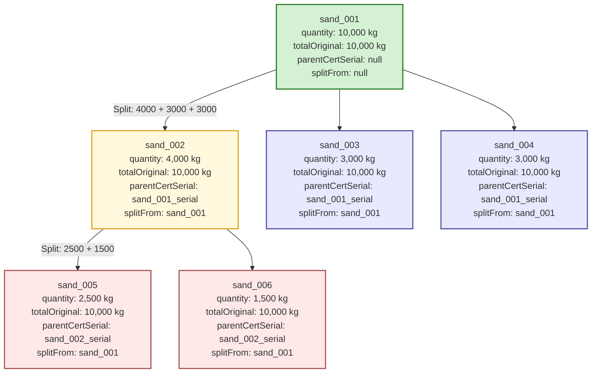
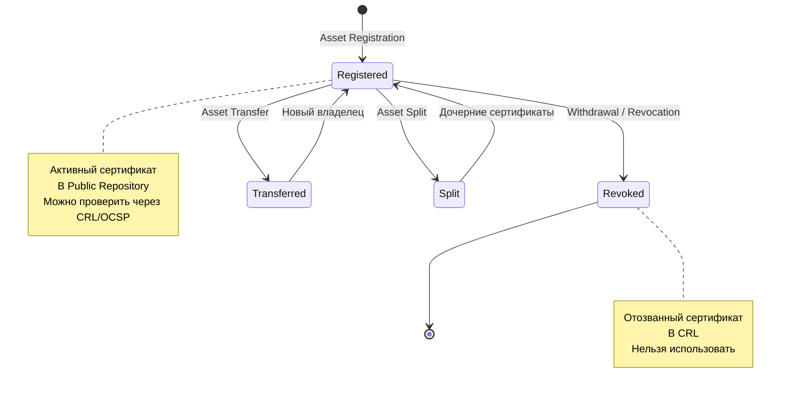

# 6. СЕРТИФИКАТЫ И АКТИВЫ

[↑ Вернуться к оглавлению](Home.md)


------------------------------------------------------------------------

## 6.1. Формат X.509 в TRS

X.509 — международный стандарт цифровых сертификатов, широко используемый в PKI-инфраструктуре для аутентификации и шифрования. В TRS формат X.509 применяется **не как компонент TLS**, а как **базовая единица учёта собственности и обмена активами**.

### Почему X.509, а не JSON или собственный формат?

| Критерий | X.509| JSON/Proprietary|
|------------------------------|------------------------------------------|-------------------------------------|
| **Стандартизация** | Международный стандарт ITU-T | Требует разработки и документации |
| **Криптографическая защита** | Встроенная цифровая подпись| Требует реализации подписи отдельно |
| **Совместимость**| Поддержка всеми ОС и браузерами| Требует установки SDK |
| **Верификация**| Стандартные инструменты (OpenSSL)| Требует собственных валидаторов |
| **Отзыв**| CRL/OCSP из коробки| Требует разработки механизма|
| **Цепочка доверия**| Встроенная иерархия CA | Требует создания с нуля |
| **Хранение** | Системные хранилища (Keychain, Keystore) | Требует собственного хранилища|

> **Ключевое преимущество:** X.509 — это готовая инфраструктура доверия, доступная на 99% устройств без установки дополнительного ПО.

### X.509 в TRS: Сертификат = Актив

В TRS каждый Asset Certificate — это цифровой сертификат X.509, где:

- **Subject** — владелец актива (User ID)
- **Issuer** — CA, выпустивший сертификат
- **Serial Number** — уникальный идентификатор актива
- **Extensions** — произвольные поля с параметрами актива (тип, количество, источник)

Сертификат подписывается приватным ключом CA, что делает его:

- **Неподделываемым** — изменение любого байта нарушит подпись
- **Проверяемым** — любой участник может проверить подлинность через публичный ключ CA
- **Отзываемым** — CA может аннулировать сертификат через CRL/OCSP

### Роль X.509 в маршрутизации активов

В отличие от традиционного использования (аутентификация в TLS), в TRS сертификат X.509 выполняет функцию **цифрового доказательства владения**:

- Сертификат **не** используется для установки защищённого соединения
- Сертификат **не** шифрует данные
- Сертификат **является самим активом** — документом, подтверждающим право владения

Это аналогично **банкноте** — не просто бумага, а носитель ценности. Asset Certificate в TRS — не просто файл, а цифровой актив, подтверждённый CA.

------------------------------------------------------------------------

## 6.2. Структура сертификата актива

Asset Certificate состоит из стандартных полей X.509 и произвольных расширений, специфичных для TRS.

### Базовая структура X.509

| Поле| Назначение| Пример значения|
|-----------------------------|-----------------------------------------|------------------------------------------|
| **Version** | Версия формата X.509| 3 (v3 с поддержкой extensions) |
| **Serial Number** | Уникальный идентификатор сертификата| 1A:2B:3C:4D:5E:6F|
| **Signature Algorithm** | Алгоритм подписи| sha256WithRSAEncryption|
| **Issuer**| CA, выпустивший сертификат| CN=TRS CA, O=Example Corp|
| **Validity**| Период действия (Not Before, Not After) | 2025-01-01 до 2026-01-01 |
| **Subject** | Владелец актива | CN=user_12345, O=TRS Client|
| **Subject Public Key Info** | Публичный ключ владельца| RSA 2048-bit / ECDSA P-256 |
| **Extensions**| Дополнительные атрибуты | Стандартные + произвольные |
| **Signature** | Цифровая подпись CA | 256 байт (RSA 2048) / 64-72 байт (ECDSA) |

### Subject и Issuer в TRS

**Subject (владелец актива):**

- `CN (Common Name)` — идентификатор клиента (user_id)
- `O (Organization)` — тип клиента (User, Gateway, Platform)
- `OU (Organizational Unit)` — опционально, группа или роль

**Пример:**

Subject: CN=alice_001, O=TRS User, OU=Premium

**Issuer (CA):**

- `CN` — имя центра сертификации
- `O` — организация, управляющая CA
- `C` — страна юрисдикции CA

**Пример:**
```
Issuer: CN=TRS Root CA, O=TRS Federation, C=NL
```

### Validity — срок действия

В TRS сертификаты активов обычно имеют **долгий срок действия** (1-10 лет), так как актив может храниться и передаваться длительное время.

**Типичные сроки:**

- Финансовые активы (фиат) — 1-3 года
- Товарные активы — 1-5 лет (зависит от срока годности товара)
- Цифровые активы (игровые, лицензии) — 1-10 лет
- Юридические активы (права) — до истечения права

> **Важно:** Срок действия сертификата не означает автоматическое уничтожение актива. После истечения сертификат может быть перевыпущен (renewal) с сохранением цепочки владения.

------------------------------------------------------------------------

## 6.3. Расширения (OID) для типов активов

Расширения X.509 (Extensions) позволяют добавлять произвольные атрибуты в сертификат. В TRS используются как **стандартные** расширения (для PKI-функций), так и **произвольные** расширения (для параметров активов).

### Стандартные расширения X.509

| Расширение | Назначение в TRS| Критичность|
|----------------------------------|-------------------------------------------------------------------|--------------|
| **Basic Constraints**| Указывает, что сертификат НЕ является CA| Critical |
| **Key Usage**| Разрешённые операции с ключом (digitalSignature, keyEncipherment) | Critical |
| **Extended Key Usage** | Применение: clientAuth, assetOwnership (custom OID) | Non-critical |
| **Subject Key Identifier** | Идентификатор публичного ключа владельца| Non-critical |
| **Authority Key Identifier** | Идентификатор ключа CA, подписавшего сертификат | Non-critical |
| **CRL Distribution Points**| URI для скачивания CRL (списка отзыва)| Non-critical |
| **Authority Information Access** | URI для OCSP Responder и сертификатов CA| Non-critical |

### Произвольные расширения для активов

TRS использует **зарегистрированный OID** (Object Identifier) для хранения параметров актива в расширении сертификата.

**Структура OID:**
```
1.3.6.1.4.1.XXXXX.1.1
│││││ │ └─ Тип расширения (1 = Asset Certificate)
│││││ └─── Категория (1 = TRS)
││││└───────── Номер организации (присваивается IANA)
│││└──────────── Private Enterprise (частные OID)
││└─────────────── Internet
│└────────────────── ISO identified organization
└───────────────────── ISO assigned OIDs
```
> **Примечание:** Для тестирования и закрытых систем можно использовать временный OID. Для публичных систем необходима регистрация через IANA.

#### Регистрация OID и независимость системы

TRS поддерживает два подхода к использованию OID для расширений активов:

**1. Публичная регистрация через IANA**

- Подача заявки на получение Private Enterprise Number (PEN)
- Получение официального OID вида 1.3.6.1.4.1.XXXXX
- Публичная документация структуры расширений
- Совместимость с внешними системами и федерациями

**2. Внутренние пространства OID**

- Использование локальных OID без регистрации (например, 1.3.6.1.4.1.99999.1.1 для тестирования)
- Полная автономность системы без зависимости от внешних организаций
- Подходит для закрытых корпоративных или государственных систем
- Возможность перехода на публичный OID в будущем (миграция сертификатов)

Это позволяет строить **полностью независимую систему TRS** без необходимости взаимодействия с глобальными регистраторами, сохраняя при этом возможность интеграции с внешними федерациями в будущем.

### Поля произвольного расширения Asset Certificate

| Поле| Тип| Назначение| Пример|
|-------------------------|----------|-----------------------------------------------------|---------------------------------|
| `assetID` | String | Уникальный идентификатор актива | “asset_20251012_001”|
| `assetType` | String | Тип актива (currency, commodity, digital, right)| “currency”|
| `assetSubtype`| String | Подтип (например, валюта: RUR, USD, BTC)| “RUR” |
| `quantity`| Decimal| Текущее количество актива | 1200.00 |
| `unit`| String | Единица измерения | “RUR”, “kg”, “units”, “license” |
| `totalOriginal` | Decimal| Исходное количество при первой регистрации| 1200.00 |
| `divisible` | Boolean| Можно ли делить актив | true|
| `gateway` | String | Gateway, подтвердивший происхождение| “freepay.gw”|
| `gatewaySignature`| String | Подпись Gateway на CSR (hex)| “3045022100…” |
| `registrationTimestamp` | ISO 8601 | Время регистрации актива в TRS| “2025-01-15T10:30:00Z”|
| `parentCertSerial`| String | Serial Number родительского сертификата (для Split) | “1A:2B:3C:4D:5E:6F” |
| `splitFrom `| String | assetID исходного актива (для отслеживания деления) | “asset_20251012_000”|
| `metadata`| JSON | Дополнительные атрибуты (опционально) | {[color]("red"), [size]("L"}) |

### Пример произвольного расширения (текстовое представление)
```
X509v3 extensions:
    1.3.6.1.4.1.XXXXX.1.1:
        assetID: asset_20251012_001
        assetType: currency
        assetSubtype: RUR
        quantity: 1200.00
        unit: RUR
        totalOriginal: 1200.00
        divisible: true
        gateway: freepay.gw
        gatewaySignature: 3045022100ab3f...
        registrationTimestamp: 2025-01-15T10:30:00Z
        parentCertSerial: null
        splitFrom: null
        metadata: {}
```

### Типы активов и их расширения

**1. Финансовые активы (currency)**

| Поле | Значение|
|----------------|---------------------------------|
| `assetType`| “currency”|
| `assetSubtype` | Код валюты (RUR, USD, EUR, BTC) |
| `quantity` | Сумма с точностью до копеек |
| `unit` | Название валюты |
| `divisible`| true (всегда делимы)|
| `gateway`| Банк или платёжная система|

**Пример:** Сертификат на 1200 рублей

**2. Товарные активы (commodity)**

| Поле | Значение |
|----------------|----------------------------------------------------------|
|`assetType`| “commodity”|
| `assetSubtype` | Название товара (sand, steel, wheat) |
| `quantity` | Масса или объём|
| `unit` | Единица измерения (kg, ton, m³)|
| `divisible`| true (если товар однородный) |
| `gateway`| Склад, биржа, логистический оператор |
| `metadata` | Дополнительные свойства (сорт, качество, местоположение) |

**Пример:** Сертификат на 5000 кг песка

**3. Цифровые активы (digital)**

| Поле | Значение|
|----------------|---------------------------------------------------|
| `assetType`| “digital” |
| `assetSubtype` | Категория (game_item, license, subscription, nft) |
| `quantity` | Количество единиц (1 для уникальных)|
| `unit` | “units”, “license”, “subscription”|
| `divisible`| false (обычно неделимы) |
| `gateway`| Игровая платформа, маркетплейс, сервис|
| `metadata` | Атрибуты (rarity, level, expiration)|

**Пример:** Сертификат на игровой скин (уникальный)

**4. Юридические активы (right)**

| Поле | Значение|
|----------------|---------------------------------------------------------|
| `assetType`| “right” |
| `assetSubtype` | Тип права (copyright, patent, access_right, membership) |
| `quantity` | 1 (обычно единичные)|
| `unit` | “right” |
| `divisible`| false (обычно неделимы) |
| `gateway`| Госреестр, нотариус, организация-эмитент|
| `metadata` | Юридические реквизиты, срок действия|

**Пример:** Сертификат на доступ к закрытому сообществу

------------------------------------------------------------------------

## 6.4. Делимые активы

Делимость — ключевая характеристика активов в TRS, определяющая возможность разделения одного сертификата на несколько дочерних без потери общей ценности.

### Концепция делимости

**Делимый актив (Divisible Asset)** — актив, который можно разделить на части, сохранив:

- Тип и свойства исходного актива
- Общую величину (totalOriginal)
- Цепочку происхождения

**Правило сохранения ценности:**
```
Σ(quantity дочерних сертификатов) = quantity родительского сертификата
```

**Пример:**
```
Родительский сертификат: 5000 кг песка
↓ Split
Дочерний 1: 3000 кг песка
Дочерний 2: 2000 кг песка
---
3000 + 2000 = 5000 ✓
```

### Типы делимости

| Тип актива| Делимость | Примеры|
|-------------------------|-----------------|------------------------------------------------|
| **Финансовые**| Всегда делимы | Деньги, токены |
| **Товарные однородные** | Делимы| Песок, зерно, нефть, металлы |
| **Товарные штучные**| Условно делимы| Партия кирпичей (можно разделить на подпартии) |
| **Цифровые массовые** | Делимы| Пакеты игровой валюты, лицензии на ПО (volume) |
| **Цифровые уникальные** | Неделимы| NFT, уникальные скины, именные лицензии|
| **Юридические** | Обычно неделимы | Патенты, членство, права доступа |

### Поля для отслеживания деления

При делении актива дочерние сертификаты наследуют и дополняют информацию:

| Поле | В родительском сертификате | В дочерних сертификатах|
|--------------------|--------------------------------------|------------------------------------------|
|` assetID`| Исходный ID| Новые уникальные ID|
|` quantity` | Исходное количество| Части от исходного |
|` totalOriginal`| Исходное количество| **То же значение** (неизменно!)|
|`parentCertSerial` | null или serial предыдущего родителя | Serial Number родительского сертификата|
| `splitFrom`| null или assetID предка| assetID исходного актива (корень дерева) |

> **Ключевое свойство:** totalOriginal **никогда не меняется** при делении. Это позволяет отследить всю цепочку деления до первоначальной регистрации актива.

### Пример: дерево деления актива

**Сценарий:** Регистрация 10,000 кг песка → деление на 3 партии → одна из партий делится ещё раз



**Проверка:**

- Уровень 1: 4000 + 3000 + 3000 = 10,000 ✓
- Уровень 2: 2500 + 1500 = 4000 ✓
- totalOriginal на всех уровнях = 10,000 ✓
- splitFrom на всех уровнях = sand_001 ✓

### Валидация деления

При операции Split Routing Core и CA проверяют:

1. **Делимость актива:** divisible = true
2. **Сохранение ценности:** Σ (дочерние quantity) = родительский quantity
3. **Владение:** Запрос подписан владельцем родительского сертификата
4. **Статус:** Родительский сертификат активен (не отозван)
5. **Корректность пропорций:** Все дочерние quantity > 0
6. **Соблюдение единиц измерения:** Для некоторых активов есть минимальные порции (например, копейки для валют)

После успешной валидации:

- Родительский сертификат **отзывается** (добавляется в CRL)
- Выпускаются дочерние сертификаты с новыми Serial Numbers
- Дочерние сертификаты публикуются в Public Repository

------------------------------------------------------------------------

## 6.5. Жизненный цикл актива (4 процесса кратко)

Актив в TRS проходит через несколько стадий, каждая из которых фиксируется цифровыми сертификатами.

### Схема жизненного цикла



### 1. Asset Registration — Регистрация актива

**Назначение:** Ввод новой ценности в систему TRS (cash-in).

**Участники:**

- User — владелец актива
- Gateway — подтверждает происхождение ценности
- Routing Core — координирует процесс
- CA — выпускает сертификат

**Процесс:**

1. User вносит ценность во внешнюю систему (депозит в банк, товар на склад, покупка виртуальных активов)
2. Gateway проверяет и подтверждает поступление, формирует CSR с параметрами актива
3. Gateway подписывает CSR своим ключом
4. Routing Core получает подписанный CSR, валидирует подпись Gateway
5. Routing Core передаёт запрос CA
6. CA выпускает Asset Certificate, подписывает своим ключом
7. Сертификат публикуется в Public Repository
8. User скачивает сертификат в свой PKCS#12 Wallet

**Результат:** Активный Asset Certificate с parentCertSerial = null

> Подробнее: раздел 7.1 «Регистрация актива через шлюз»

------------------------------------------------------------------------

### 2. Asset Transfer — Передача актива

**Назначение:** Перемещение права собственности между клиентами TRS.

**Участники:**

- User A — отправитель актива
- User B — получатель актива
- Routing Core — координирует Atomic Swap
- CA — отзывает старые и выпускает новые сертификаты

**Процесс:**

1. User A и User B согласовывают условия обмена
2. Формируют Transaction Record, подписывают обе стороны
3. Routing Core проверяет подписи и статусы сертификатов
4. CA выполняет Atomic Swap:
- Отзыв исходных сертификатов (добавление в CRL)
- Выпуск новых сертификатов для получателей
5. Новые сертификаты публикуются в Public Repository
6. User A и User B скачивают новые сертификаты

**Результат:** Новые Asset Certificates с указанием на предыдущих владельцев (через parentCertSerial)

**Режимы:**

- **Online** — мгновенная синхронизация через Routing Core (5-20 сек)
- **Offline** — обмен локально через QR/NFC, синхронизация позже (1-12 мин + 15 сек публикации)

> Подробнее: раздел 7.2 «Режимы обмена»

------------------------------------------------------------------------

### 3. Asset Split — Деление актива

**Назначение:** Разделение одного сертификата на несколько дочерних без смены владельца.

**Участники:**

- User — владелец актива
- Routing Core — валидирует запрос
- CA — отзывает родительский, выпускает дочерние сертификаты

**Процесс:**

1. User запрашивает деление, указывает пропорции
2. Routing Core проверяет:
- `divisible = true`
- Сумма частей = исходное количество
- Подпись владельца
3. CA отзывает родительский сертификат
4. CA выпускает дочерние сертификаты с:
- `parentCertSerial = serial` родительского
- `splitFrom = assetID` корневого актива
- `totalOriginal` = неизменное значение от корня
5. Дочерние сертификаты публикуются в Public Repository

**Результат:** Несколько дочерних Asset Certificates, владелец остаётся тем же

> Подробнее: раздел 7.3 «Деление активов»

------------------------------------------------------------------------

### 4. Asset Revocation — Отзыв актива

**Назначение:** Аннулирование сертификата актива, делающее его недействительным.

**Участники:**

- Инициатор отзыва (владелец, Gateway или арбитр)
- CA — выполняет отзыв

**Причины отзыва:**

- Вывод актива из системы (Withdrawal через Gateway)
- Завершение операции обмена (автоматический отзыв при передаче)
- Компрометация приватного ключа
- Решение арбитра при спорах
- Истечение срока действия сертификата

**Процесс:**

1. Инициатор отправляет запрос на отзыв (подписанный)
2. CA проверяет право на отзыв
3. CA добавляет сертификат в CRL
4. CRL публикуется в Public Repository
5. Статус сертификата обновляется в OCSP

**Результат:** Сертификат становится недействительным, любая попытка использовать его отклоняется

**Публикация:**

- Отозванные сертификаты появляются в Certificate Revocation List
- CRL доступен всем участникам для проверки
- Любая попытка использовать отозванный сертификат отклоняется

**Примеры:**

- Вывод денег из системы через банк
- Автоматический отзыв при передаче актива
- Отзыв украденного актива по решению арбитра

------------------------------------------------------------------------

## 6.6. CRL / OCSP

Для предотвращения использования отозванных сертификатов TRS использует стандартные механизмы PKI: **CRL** (Certificate Revocation List) и **OCSP** (Online Certificate Status Protocol).

### CRL (Certificate Revocation List) — Список отзыва сертификатов

**Определение:**
CRL — это подписанный CA список серийных номеров отозванных сертификатов. Публикуется в Public Repository и доступен для скачивания всем участникам.

**Структура CRL:**
```
Certificate Revocation List (CRL):
    Version: 2 (0x1)
    Signature Algorithm: sha256WithRSAEncryption
    Issuer: CN=TRS Root CA, O=TRS Federation, C=NL
    Last Update: Oct 12 10:00:00 2025 GMT
    Next Update: Oct 13 10:00:00 2025 GMT
    CRL extensions:
        X509v3 CRL Number: 1234
    Revoked Certificates:
        Serial Number: 1A2B3C4D5E6F
            Revocation Date: Oct 10 12:30:00 2025 GMT
            CRL entry extensions:
                X509v3 CRL Reason Code: Key Compromise
        Serial Number: 2B3C4D5E6F7A
            Revocation Date: Oct 11 08:15:00 2025 GMT
            CRL entry extensions:
                X509v3 CRL Reason Code: Cessation Of Operation
    Signature Algorithm: sha256WithRSAEncryption
        [подпись CA]
```
**Причины отзыва (CRL Reason Code):**

- unspecified — Не указана конкретная причина
- keyCompromise — Компрометация приватного ключа владельца
- affiliationChanged — Изменение принадлежности (смена владельца через Transfer)
- superseded — Замена сертификата новым (Split или Renewal)
- cessationOfOperation — Прекращение операций (Withdrawal)
- certificateHold — Временная блокировка (редко используется в TRS)

**Периодичность обновления:**

- Высоконагруженные системы — каждый час
- Типичные системы — ежедневно
- Низконагруженные системы — еженедельно

**Время жизни CRL:**
Указывается в поле Next Update. Клиенты должны скачивать новый CRL до истечения этого времени.

### Проверка сертификата через CRL

**Процесс:**

1. Client скачивает CRL с URI, указанного в расширении CRL Distribution Points сертификата
2. Парсит CRL (проверяет подпись CA)
3. Ищет Serial Number проверяемого сертификата в списке отозванных
4. Если найден → сертификат отозван (использовать нельзя)
5. Если не найден и Next Update не истёк → сертификат активен

**Преимущества CRL:**

- Работает офлайн (скачал один раз — проверяй многократно)
- Стандартный формат X.509
- Не требует постоянного подключения к сети

**Недостатки CRL:**

- Размер файла растёт с количеством отозванных сертификатов
- Задержка актуализации (обновляется периодически, не в реальном времени)
- Трафик при скачивании больших CRL

------------------------------------------------------------------------

### OCSP (Online Certificate Status Protocol) — Протокол проверки статуса онлайн

**Определение:**
OCSP — протокол для мгновенной проверки статуса конкретного сертификата. Клиент отправляет запрос OCSP Responder с Serial Number сертификата и получает ответ: `good`, `revoked` или `unknown`.

**Процесс OCSP-запроса:**

1. Client формирует OCSP-запрос с Serial Number проверяемого сертификата
2. Отправляет запрос на URI, указанный в расширении Authority Information Access сертификата
3. OCSP Responder проверяет статус сертификата в реальном времени (обращается к базе CA)
4. Возвращает подписанный ответ:
- `good` — сертификат активен
- `revoked` — сертификат отозван (с указанием причины и времени отзыва)
- `unknown` — сертификат неизвестен Responder

**Структура OCSP-ответа:**
```
OCSP Response Status: successful (0x0)
Response Type: Basic OCSP Response
Version: 1 (0x0)
Responder ID: CN=TRS OCSP Responder
Produced At: Oct 12 10:05:00 2025 GMT
Responses:
    Certificate ID:
        Hash Algorithm: sha256
        Issuer Name Hash: A1B2C3D4...
        Issuer Key Hash: E5F6A7B8...
        Serial Number: 1A2B3C4D5E6F
    Cert Status: good
    This Update: Oct 12 10:05:00 2025 GMT
    Next Update: Oct 12 11:05:00 2025 GMT
Signature Algorithm: sha256WithRSAEncryption
    [подпись OCSP Responder]
```


**Преимущества OCSP:**

- Мгновенная проверка (актуальный статус в реальном времени)
- Малый размер запроса и ответа (сотни байт)
- Точность (нет задержки обновления, как у CRL)

**Недостатки OCSP:**

- Требует подключение к сети при каждой проверке
- Зависимость от доступности OCSP Responder
- Раскрытие информации о проверках (CA видит, кто и когда проверяет сертификаты)

------------------------------------------------------------------------

### Сравнение CRL и OCSP

| Критерий| CRL| OCSP |
|-------------------------|--------------------------------------|------------------------------------------|
| **Режим работы**| Offline (скачать и кешировать) | Online (запрос каждый раз) |
| **Актуальность**| Периодическое обновление (часы/дни)| Реальное время (секунды) |
| **Размер данных** | Растёт с количеством отозванных| Фиксированный (один сертификат)|
| **Зависимость от сети** | Низкая (скачал — используешь офлайн) | Высокая (нужна сеть при каждой проверке) |
| **Приватность** | Высокая (CA не знает, кто проверяет) | Низкая (CA видит все проверки) |
| **Производительность**| Парсинг большого файла | Быстрый запрос/ответ |
| **Применимость в TRS**| Offline-режим, кеширование | Online-режим, критичные операции |

### Стратегии использования в TRS

**Гибридный подход (рекомендуется):**

1. **CRL для рутинных проверок:**
- Клиент скачивает CRL раз в день и кеширует
- Проверяет сертификаты локально без запросов к CA
- Подходит для Offline Mode
2. **OCSP для критичных операций:**
- Перед крупными сделками (high-value transactions)
- При подозрении на компрометацию
- Когда требуется гарантия актуальности

**Online Mode:**

- По умолчанию используется OCSP (мгновенная проверка)
- Fallback на CRL, если OCSP Responder недоступен

**Offline Mode:**

- Используется только CRL (скачанный заранее)
- Grace Period учитывает возможную неактуальность CRL
- После синхронизации — проверка через OCSP

------------------------------------------------------------------------

### Защита от атак через отзыв

**Атака: использование отозванного сертификата**

- **Вектор:** Злоумышленник пытается использовать сертификат, который уже отозван (например, после вывода актива из системы)
- **Защита:** Routing Core и участники проверяют статус через CRL/OCSP перед принятием транзакции
- **Результат:** Транзакция отклоняется, если сертификат в CRL или OCSP возвращает revoked

**Атака: подделка CRL**

- **Вектор:** Злоумышленник создаёт фальшивый CRL, исключая из него свой отозванный сертификат
- **Защита:** CRL подписан приватным ключом CA. Клиент проверяет подпись перед использованием CRL
- **Результат:** Поддельный CRL отклоняется (подпись не совпадает)

**Атака: блокировка доступа к CRL/OCSP**

- **Вектор:** Злоумышленник блокирует доступ жертвы к Public Repository (DDoS, сетевая блокировка)
- **Защита:**
   - Федеративная репликация CRL на нескольких узлах (Federated CRL/OCSP, см. раздел 5.4 «Федеративная архитектура»)
   - Кеширование CRL на клиенте
   - Fallback механизмы (CRL → OCSP или наоборот)
- **Результат:** Клиент может проверить статус через альтернативные источники

#### Federated CRL/OCSP в распределённой архитектуре

В федеративной конфигурации TRS (см. раздел 5.4) каждый CA узел публикует собственный CRL и предоставляет OCSP Responder. Federated CRL/OCSP обеспечивает:

- **Распределённую публикацию** — CRL реплицируются между узлами федерации
- **Множественные OCSP Responders** — клиент может запросить статус у любого узла
- **Агрегированный CRL** — федеративный репозиторий объединяет CRL от всех CA
- **Отказоустойчивость** — недоступность одного узла не блокирует проверку статусов

Это повышает надёжность и защищает от цензуры или блокировки доступа к информации об отозванных сертификатах.

------------------------------------------------------------------------

## Итог раздела 6

Раздел 6 раскрывает, как TRS использует стандарт X.509 для представления активов в виде цифровых сертификатов.

**Ключевые выводы:**

1. **X.509 как актив** — сертификат не для аутентификации, а как носитель ценности (аналог банкноты)
2. **Произвольные расширения** — OID позволяет хранить произвольные атрибуты активов (тип, количество, происхождение)
3. **Делимость активов** — механизм Split с сохранением totalOriginal и цепочки происхождения
4. **Жизненный цикл** — 4 базовых процесса (Registration, Transfer, Split, Revocation)
5. **CRL и OCSP** — стандартные механизмы PKI для защиты от использования отозванных сертификатов

> **Подробнее о применении механизмов CRL/OCSP в контексте безопасности — см. раздел 8 «Безопасность».**

Следующий раздел (7. ОСНОВНЫЕ ПРОЦЕССЫ) подробно раскроет каждый из процессов жизненного цикла актива с примерами и диаграммами.

[↓ Перейти к следующему разделу](TRS_7.md)

[↑ Вернуться к оглавлению](Home.md)