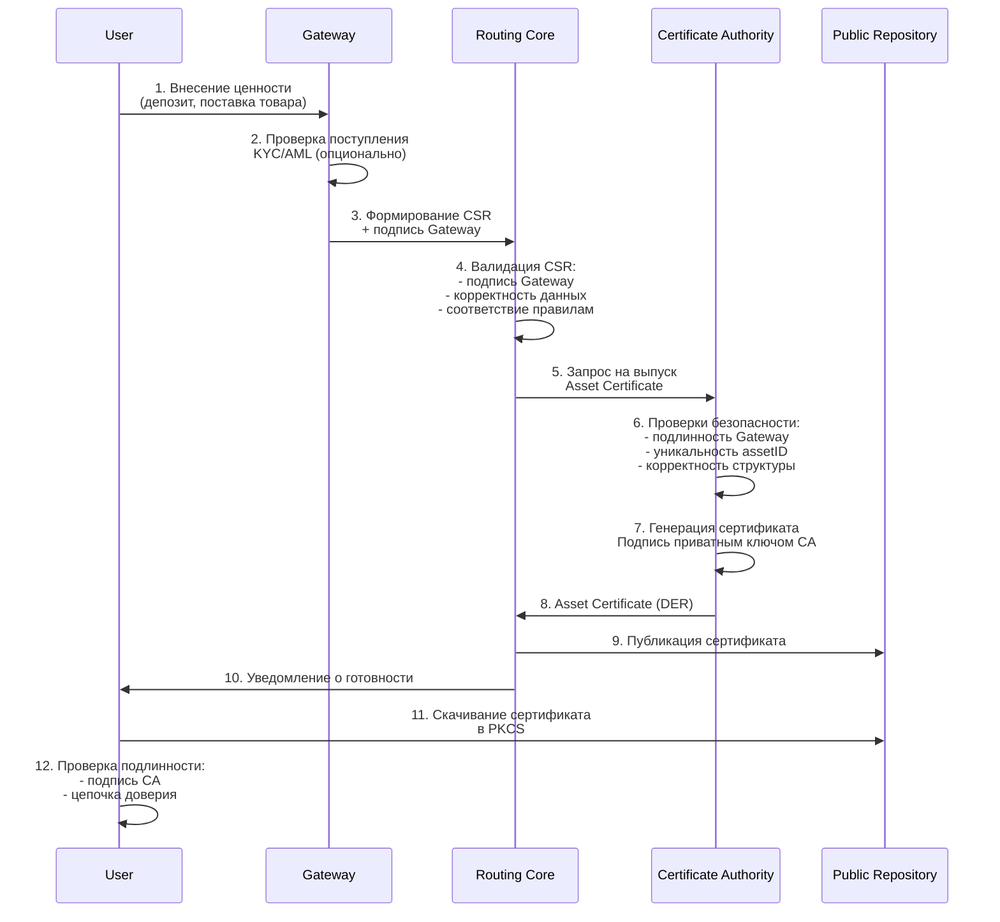
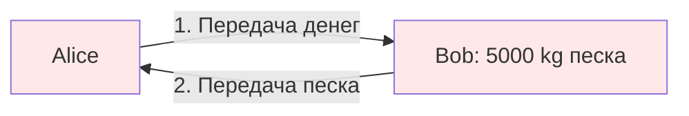
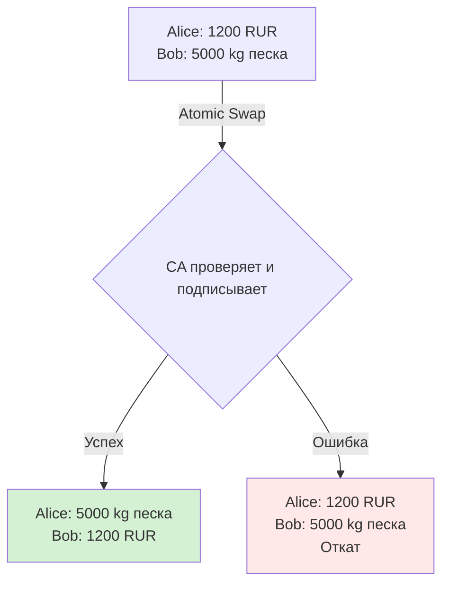
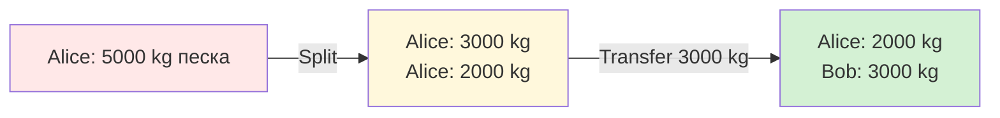
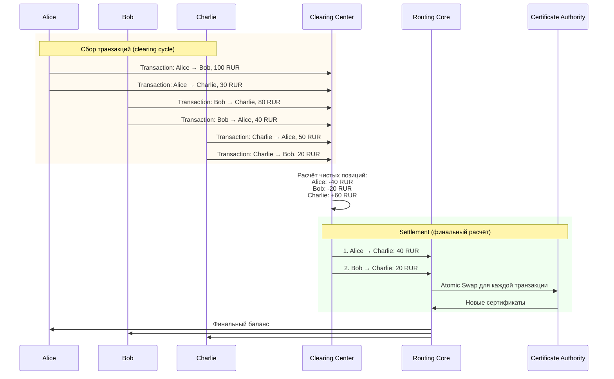

# 7. ОСНОВНЫЕ ПРОЦЕССЫ (подробно)

[↑ Вернуться к оглавлению](Home.md)


------------------------------------------------------------------------

## 7.1. Регистрация актива через шлюз

Asset Registration - процесс ввода новой ценности в систему TRS (cash-in). Это первая операция в жизненном цикле актива, создающая исходный Asset Certificate.

### Роль Gateway в регистрации

Gateway выполняет функцию **оракула происхождения** - подтверждает, что ценность действительно существует во внешнем мире и даёт право на выпуск соответствующего сертификата.

**Типы Gateway и их функции:**

| Тип Gateway | Подтверждаемые активы| Проверка происхождения |
|-----------------|------------------------------------|----------------------------------------------------|
| **Финансовый**| Фиатные деньги, криптовалюты | Зачисление на счёт, блокчейн-транзакция|
| **Товарный**| Материалы, товары, сырьё | Поступление на склад, документы о происхождении|
| **Цифровой**| Игровые активы, лицензии, подписки | Покупка в магазине платформы, выдача системой|
| **Юридический** | Права, патенты, членство | Государственная регистрация, документы организации |

> Gateway является **равноправным клиентом TRS** с собственным PKCS#12 контейнером, но выполняет специфическую роль подтверждения происхождения активов.

### Процесс Asset Registration



### Детальные шаги процесса

**Шаг 1: Внесение ценности**
User вносит ценность во внешнюю систему, контролируемую Gateway:

- Финансовый Gateway - пополнение банковского счёта, депозит в платёжную систему
- Товарный Gateway - поставка товара на склад, передача документов о праве собственности
- Цифровой Gateway - покупка виртуальных активов на платформе, выдача лицензии
- Юридический Gateway - регистрация права в государственном реестре, оформление членства

**Шаг 2: Проверка поступления**
Gateway подтверждает фактическое поступление ценности:

- Проверка зачисления средств на счёт
- Приёмка товара на склад (количество, качество, соответствие спецификации)
- Подтверждение выдачи цифровых активов системой
- Опционально: проведение KYC/AML проверок (для финансовых Gateway)

**Шаг 3: Формирование CSR (Certificate Signing Request)**
Gateway создаёт CSR с параметрами актива:

```
CSR содержит:
- Subject: CN=user_12345, O=TRS User
- Public Key: публичный ключ User (из его PKCS#12)
- Extensions (OID):
  * assetID: уникальный идентификатор
  * assetType: currency/commodity/digital/right
  * assetSubtype: RUR/sand/game_item/license
  * quantity: 1200.00
  * unit: RUR/kg/units/license
  * totalOriginal: 1200.00
  * divisible: true/false
  * gateway: freepay.gw
  * gatewaySignature: [подпись Gateway на CSR]
  * registrationTimestamp: 2025-10-12T10:30:00Z
  * parentCertSerial: null
  * splitFrom: null
  * metadata: {}
```

Gateway подписывает CSR своим приватным ключом, подтверждая происхождение актива.

**Шаг 4: Валидация CSR в Routing Core**
Routing Core проверяет полученный CSR:

- Проверка подписи Gateway (Gateway должен быть доверенным)
- Корректность структуры CSR (все обязательные поля заполнены)
- Уникальность `assetID` (не должен дублировать существующий)
- Соответствие правилам системы (например, минимальная сумма, допустимые типы активов)

**Шаг 5-6: Выпуск сертификата CA**
CA получает запрос от Routing Core и выполняет финальные проверки:

- Проверка подлинности Gateway (сертификат Gateway действителен, не отозван)
- Проверка уникальности `assetID` в базе выпущенных сертификатов
- Валидация структуры расширений (соответствие OID-схеме)

CA генерирует Asset Certificate:

- Присваивает уникальный Serial Number
- Копирует данные из CSR в сертификат
- Устанавливает срок действия (Validity: Not Before, Not After)
- Добавляет стандартные расширения (Key Usage, CRL Distribution Points, OCSP URI)
- Подписывает сертификат своим приватным ключом

**Шаг 7-9: Публикация сертификата**

- CA возвращает подписанный Asset Certificate в Routing Core
- Routing Core публикует сертификат в Public Repository
- Сертификат становится доступен для скачивания по URI

**Шаг 10-12: Получение сертификата User**

- User получает уведомление о готовности сертификата (email, push, webhook)
- User скачивает Asset Certificate из Public Repository
- User проверяет подлинность сертификата:
    - Проверка подписи CA (используя публичный ключ CA из цепочки доверия)
    - Проверка соответствия данных (Subject, количество, тип актива)
    - Проверка статуса через CRL/OCSP (не отозван ли)
    - User импортирует сертификат в свой PKCS#12 Wallet

### Время выполнения Asset Registration

| Этап | Время| Зависит от |
|----------------------------|------------------------|----------------------------------------|
| Внесение ценности| 1 сек - несколько дней | Тип Gateway, метод пополнения|
| Формирование CSR | < 1 сек | Производительность Gateway |
| Валидация в RC | 1-3 сек| Сложность проверок |
| Выпуск CA| 2-10 сек | Алгоритм подписи (RSA/ECDSA), нагрузка |
| Публикация | 1-5 сек| Скорость сети, репликация|
| Скачивание User| 1-3 сек| Размер сертификата, скорость сети|
| **Итого (после внесения)** | **5-20 сек** | Типичное время в online-режиме |

### Безопасность процесса Asset Registration

**Защита от мошенничества:**

1. **Подделка CSR:** Gateway подписывает CSR своим приватным ключом. Routing Core проверяет подпись. Без приватного ключа Gateway невозможно создать валидный CSR.
2. **Повторное использование CSR:** `assetID` должен быть уникальным. CA проверяет отсутствие дубликатов. Попытка зарегистрировать актив дважды будет отклонена.
3. **Подделка Gateway:** Routing Core проверяет сертификат Gateway через цепочку доверия CA. Поддельный Gateway не пройдёт проверку подписи.
4. **Регистрация без реального актива:** Gateway несёт ответственность за подтверждение происхождения. При обнаружении фальсификации Gateway может быть исключён из системы (отзыв сертификата Gateway).

**Audit Log:**
Все операции Asset Registration фиксируются в неизменяемом журнале:

- Timestamp запроса
- Идентификаторы User и Gateway
- Параметры актива (assetID, type, quantity)
- Подписи участников
- Serial Number выпущенного сертификата

Это обеспечивает полную прозрачность и возможность аудита.

### Пример: Регистрация 1200 RUR через финансовый Gateway

**Сценарий:** Alice вносит 1200 рублей через Gateway "freepay.gw"

1. Alice переводит 1200 RUR на счёт в системе "freepay.gw"
2. Gateway "freepay.gw" подтверждает зачисление, проводит KYC
3. Gateway формирует CSR:
```
assetID: rub_20251012_001
assetType: currency
assetSubtype: RUR
quantity: 1200.00
unit: RUR
gateway: freepay.gw
```

4.Gateway подписывает CSR своим ключом
5.Routing Core проверяет подпись Gateway, передаёт CA
6.CA выпускает сертификат с Serial Number `1A:2B:3C:4D:5E:6F`
7.Сертификат публикуется в Public Repository
8.Alice скачивает сертификат, импортирует в свой Wallet
9.Теперь Alice владеет Asset Certificate на 1200 RUR, который она может передавать, делить или выводить

### Регистрация без Gateway (Self-Registration)

В некоторых сценариях TRS позволяет регистрировать активы **без подтверждения внешнего Gateway**. Это применимо в случаях, когда доверие обеспечивается другими механизмами.

#### Сценарии Self-Registration

| Сценарий | Описание | Механизм доверия |
|------------------------------------------|----------------------------------------------|----------------------------------------------|
| **User = Gateway** | Пользователь имеет сертификат Gateway| CA проверяет сертификат Gateway пользователя |
| **Внутрикорпоративные активы** | Токены лояльности, внутренние баллы| Корпоративный CA доверяет сотрудникам|
| **Цифровые активы без внешней ценности** | NFT, созданные пользователем | Подтверждение авторства через подпись|
| **P2P взаимное доверие** | Два участника подтверждают активы друг друга | Взаимные подписи вместо Gateway|
| **Закрытые системы** | Ограниченный круг доверенных участников| Whitelist доверенных пользователей |

#### Процесс Self-Registration

**Отличия от стандартной регистрации:**

1. User формирует CSR самостоятельно (без Gateway)
2. Поле `gateway` может быть пустым или содержать `self`
3. Поле `gatewaySignature` содержит подпись самого User
4. CA проверяет право User на Self-Registration (наличие соответствующего сертификата или нахождение в whitelist)
5. CA выпускает сертификат с пометкой о Self-Registration

**Пример CSR для Self-Registration:**
```
assetID: loyalty_points_001
assetType: digital
assetSubtype: loyalty_token
quantity: 1000
unit: points
gateway: self
gatewaySignature: [подпись User]
metadata: {"issuer": "alice_001", "type": "self_issued"}
```

#### Риски и ограничения

| Риск| Защита |
|-----------------------------------|----------------------------------------------------------------|
| **Создание активов "из воздуха"** | Ограничение типов активов, доступных для Self-Registration |
| **Отсутствие внешней ценности** | Пометка в сертификате, что актив self-issued |
| **Злоупотребление доверием**| Репутационная система, whitelist доверенных участников |
| **Сложность вывода**| Self-issued активы обычно нельзя вывести через обычный Gateway |

#### Применение

**Типичные случаи использования:**

- Корпоративные системы лояльности (баллы, бонусы)
- Внутрикорпоративная валюта для расчётов между подразделениями
- Цифровое искусство и NFT (подтверждение авторства)
- Временные активы для тестирования системы
- P2P IOU (долговые расписки между знакомыми)

> **Важно:** Self-Registration не заменяет Gateway для активов с внешней ценностью (деньги, товары). Это дополнительная возможность для специфических сценариев, где доверие обеспечивается репутацией участников или ограниченным кругом пользователей.

------------------------------------------------------------------------

## 7.2. Режимы обмена

TRS поддерживает два режима обмена активами между клиентами: **Online** и **Offline**. Оба режима используют механизм **Atomic Swap**, но различаются способом координации и временем подтверждения.

### Сравнение режимов

| Критерий | Online Mode | Offline Mode |
|----------------------------|-------------------------------------|------------------------------------------------|
| **Подключение к сети** | Требуется постоянно | Не требуется во время сделки |
| **Координация**| Через Routing Core| Локально (QR, NFC, Bluetooth)|
| **Время подтверждения**| 5-20 секунд | 1-12 минут локально + 15 сек при синхронизации |
| **Атомарность**| Гарантируется CA в реальном времени | Гарантируется взаимным заложничеством|
| **Защита от double-spend** | Мгновенная (проверка статуса в CA)| Grace Period + последующая проверка|
| **Применение** | Стандартные транзакции| Места без интернета, P2P встречи |
| **Риск** | Минимальный | Возможен спор при одновременной публикации |

> Оба режима используют **Atomic Swap** - обмен активами происходит атомарно (всё или ничего). Различие в способе обеспечения атомарности.

------------------------------------------------------------------------

## 7.2.1. Online: Atomic Swap

Online режим - стандартный способ обмена активами в TRS. Участники взаимодействуют через Routing Core, который координирует операцию и обеспечивает мгновенную атомарность.

### Концепция Atomic Swap

**Atomic Swap** - одновременная взаимная передача активов между участниками с гарантией целостности. Либо оба участника получают новые сертификаты, либо операция не происходит (откат).

**Проблема традиционного подхода (2 отдельные транзакции):**



**Риски:**

- Alice передала деньги, но Bob не передал песок → Alice потеряла деньги
- Bob передал песок, но Alice не передала деньги → Bob потерял песок
- Одна из транзакций может быть отклонена → несбалансированный обмен

**Решение: Atomic Swap (одна транзакция)**



**Гарантии:**

- Обе стороны подписывают одну транзакцию
- CA выполняет операции атомарно (BEGIN TRANSACTION … COMMIT)
- При ошибке на любом этапе - полный откат (ROLLBACK)
- Невозможен частичный обмен

### Процесс Online Atomic Swap

```mermaid
sequenceDiagram
    participant A as Alice
    participant B as Bob
    participant RC as Routing Core
    participant CA as Certificate Authority
    participant PR as Public Repository

    A->>B: 1. Согласование условий обмена<br/>(1200 RUR ↔ 5000 kg песка)
    
    rect rgb(240, 248, 255)
    Note over A,B: Формирование Transaction Record
    A->>A: 2a. Создание CSR для песка<br/>(Subject: Alice, quantity: 5000 kg)
    B->>B: 2b. Создание CSR для денег<br/>(Subject: Bob, quantity: 1200 RUR)
    A->>A: 3a. Подпись CSR Alice
    B->>B: 3b. Подпись CSR Bob
    end
    
    A->>RC: 4. Отправка Transaction Record<br/>(Alice's CSR + Bob's CSR + подписи)
    B->>RC: (или Bob отправляет)
    
    RC->>RC: 5. Валидация Transaction Record:<br/>- подписи обеих сторон<br/>- статусы исходных сертификатов<br/>- соответствие условий
    
    RC->>CA: 6. Запрос Atomic Swap:<br/>- отзыв: Alice RUR, Bob песок<br/>- выпуск: Alice песок, Bob RUR
    
    rect rgb(255, 250, 240)
    Note over CA: Атомарная операция CA
    CA->>CA: 7. BEGIN TRANSACTION
    CA->>CA: 8. Проверка статусов (не отозваны ли)
    CA->>CA: 9. Отзыв исходных сертификатов<br/>(добавление в CRL)
    CA->>CA: 10. Выпуск новых сертификатов<br/>(подпись приватным ключом)
    CA->>CA: 11. COMMIT / ROLLBACK
    end
    
    CA->>RC: 12. Новые сертификаты:<br/>- Alice: песок<br/>- Bob: деньги
    
    RC->>PR: 13. Публикация:<br/>- новые сертификаты<br/>- обновлённый CRL
    
    RC->>A: 14. Уведомление о завершении
    RC->>B: 
    
    A->>PR: 15. Скачивание нового сертификата (песок)
    B->>PR: 15. Скачивание нового сертификата (деньги)
 ```

### Структура Transaction Record

Transaction Record - подписанный документ, описывающий условия обмена.


```
{
  "transaction_id": "tx_20251012_001",
  "timestamp": "2025-10-12T14:30:00Z",
  "type": "atomic_swap",
  
  "party_a": {
    "user_id": "alice_001",
    "gives": {
      "cert_serial": "1A:2B:3C:4D:5E:6F",
      "asset_id": "rub_20251012_001",
      "asset_type": "currency",
      "quantity": 1200.00,
      "unit": "RUR"
    },
    "receives_csr": {
      "subject": "CN=alice_001, O=TRS User",
      "public_key": "...",
      "extensions": {
        "assetID": "sand_20251012_001",
        "assetType": "commodity",
        "quantity": 5000.00,
        "unit": "kg"
      }
    },
    "signature": "3045022100alice_signature..."
  },
  
  "party_b": {
    "user_id": "bob_002",
    "gives": {
      "cert_serial": "2B:3C:4D:5E:6F:7A",
      "asset_id": "sand_20251011_005",
      "asset_type": "commodity",
      "quantity": 5000.00,
      "unit": "kg"
    },
    "receives_csr": {
      "subject": "CN=bob_002, O=TRS User",
      "public_key": "...",
      "extensions": {
        "assetID": "rub_20251012_002",
        "assetType": "currency",
        "quantity": 1200.00,
        "unit": "RUR"
      }
    },
    "signature": "3046022100bob_signature..."
  },
  
  "conditions": {
    "all_or_nothing": true,
    "timeout": "2025-10-12T15:00:00Z"
  }
}
```

### Атомарность на уровне CA

CA обеспечивает атомарность через механизм транзакций базы данных (концептуально):

```
BEGIN TRANSACTION

  -- Проверка статусов
  IF cert_alice_rur.status != 'active' OR cert_bob_sand.status != 'active' THEN
    ROLLBACK
    RETURN error("One of certificates is already revoked")
  END IF
  
  -- Отзыв исходных сертификатов
  UPDATE certificates SET status='revoked', revocation_date=NOW()
    WHERE serial IN ('1A:2B:3C:4D:5E:6F', '2B:3C:4D:5E:6F:7A')
  
  -- Добавление в CRL
  INSERT INTO crl (serial, reason, date) VALUES
    ('1A:2B:3C:4D:5E:6F', 'affiliationChanged', NOW()),
    ('2B:3C:4D:5E:6F:7A', 'affiliationChanged', NOW())
  
  -- Выпуск новых сертификатов
  new_cert_alice_sand = generate_certificate(alice_csr_sand)
  new_cert_bob_rur = generate_certificate(bob_csr_rur)
  
  -- Сохранение новых сертификатов
  INSERT INTO certificates (serial, owner, asset, status) VALUES
    (new_cert_alice_sand.serial, 'alice_001', 'sand_20251012_001', 'active'),
    (new_cert_bob_rur.serial, 'bob_002', 'rub_20251012_002', 'active')

COMMIT
```

**Ключевое свойство:** Если любая операция внутри транзакции завершается ошибкой - выполняется ROLLBACK, и состояние системы возвращается к исходному.

### Криптографические гарантии Atomic Swap

| Гарантия | Механизм| Защита от |
|----------------------------|-------------------------------------------|-------------------------------------|
| **Взаимное согласие**| Подписи обеих сторон в Transaction Record | Односторонняя операция без согласия |
| **Владение активами**| Подпись CSR приватным ключом владельца| Передача чужого актива|
| **Атомарность выполнения** | Транзакция CA с ROLLBACK| Частичный обмен |
| **Неизменность условий** | Подписи на хеше Transaction Record| Изменение условий после согласия|
| **Прозрачность** | Публикация в Public Repository| Скрытые операции|

### Защита от мошенничества в Online Mode

**1. Double-Spend (двойное расходование)**

- **Атака:** Alice пытается одновременно обменять один и тот же сертификат с Bob и Charlie
- **Защита:** Routing Core проверяет статус сертификата перед операцией. CA отзывает сертификат атомарно при первом успешном обмене. Вторая попытка отклоняется, так как сертификат уже отозван.
- **Результат:** Успешна только одна транзакция

**2. Подделка сертификата**

- **Атака:** Alice пытается создать поддельный сертификат с большей суммой
- **Защита:** Routing Core и CA проверяют подпись сертификата. Поддельный сертификат не пройдёт проверку (подпись не совпадёт с публичным ключом CA).
- **Результат:** Транзакция отклонена

**3. Отзыв после подписания Transaction Record**

- **Атака:** Alice подписывает Transaction Record, но затем пытается отозвать свой сертификат до выполнения обмена
- **Защита:** CA проверяет статус сертификатов непосредственно перед началом атомарной операции. Если сертификат отозван - ROLLBACK.
- **Результат:** Обмен не происходит, обе стороны остаются с исходными активами

**4. Изменение условий**

- **Атака:** Alice изменяет условия Transaction Record после подписания Bob
- **Защита:** Обе стороны подписывают хеш Transaction Record. Любое изменение нарушает подписи. Routing Core отклоняет транзакцию с невалидными подписями.
- **Результат:** Транзакция отклонена

### Преимущества Online Atomic Swap

| Преимущество | Описание|
|------------------|-------------------------------------------------------------|
| **Скорость** | 5-20 секунд от согласования до получения новых сертификатов |
| **Безопасность** | Криптографические гарантии атомарности|
| **Прозрачность** | Все операции фиксируются в Public Repository|
| **Простота** | Не требует эскроу-агентов или посредников |
| **Экономия** | Одна комиссия вместо двух отдельных транзакций|
| **Доверие**| Не нужно доверять контрагенту - CA гарантирует исполнение |

------------------------------------------------------------------------

## 7.2.2. Offline: встречные сертификаты

Offline режим позволяет совершать обмен активами без подключения к интернету. Участники обмениваются подписанными CSR локально (через QR-коды, NFC, Bluetooth), а синхронизация с CA происходит позже.

### Концепция Offline обмена

В Offline режиме атомарность обеспечивается механизмом **взаимного заложничества** - каждая сторона получает подписанный CSR контрагента, который даёт право на получение актива после синхронизации.

**Ключевая идея:**

- Alice и Bob локально обмениваются CSR (встречные сертификаты)
- Каждый CSR подписан приватным ключом владельца актива
- При синхронизации с CA оба CSR публикуются одновременно
- CA выполняет Atomic Swap так же, как в Online режиме

### Процесс Offline Atomic Swap

```mermaid
sequenceDiagram
    participant A as Alice (offline)
    participant B as Bob (offline)
    participant RC as Routing Core (online)
    participant CA as Certificate Authority
    participant PR as Public Repository

    rect rgb(255, 245, 230)
    Note over A,B: Локальный обмен (без интернета)
    
    A->>B: 1. Согласование условий<br/>(1200 RUR ↔ 5000 kg песка)
    
    A->>A: 2a. Создание CSR для песка<br/>(Subject: Alice)
    B->>B: 2b. Создание CSR для денег<br/>(Subject: Bob)
    
    A->>A: 3a. Подпись CSR Alice + подпись Bob's cert для отзыва
    B->>B: 3b. Подпись CSR Bob + подпись Alice's cert для отзыва
    
    A->>B: 4. Обмен CSR (QR-код / NFC / Bluetooth)
    B->>A: 
    
    A->>A: 5a. Сохранение Bob's CSR локально
    B->>B: 5b. Сохранение Alice's CSR локально
    end
    
    rect rgb(240, 255, 240)
    Note over A,B: Grace Period (ожидание синхронизации)
    Note over A,B: Время: от минут до нескольких дней
    end
    
    rect rgb(245, 245, 255)
    Note over A,RC: Синхронизация (когда появился интернет)
    
    A->>RC: 6. Публикация Transaction Record<br/>(Alice's CSR + Bob's CSR)
    
    RC->>RC: 7. Проверка:<br/>- подписи обеих сторон<br/>- Grace Period не истёк<br/>- нет конфликтов
    
    RC->>CA: 8. Запрос Atomic Swap
    
    CA->>CA: 9. Атомарная операция<br/>(так же как в Online)
    
    CA->>RC: 10. Новые сертификаты
    RC->>PR: 11. Публикация
    
    RC->>A: 12. Уведомление
    RC->>B: 
    
    A->>PR: 13. Скачивание нового сертификата
    B->>PR: 
    end
 ```

### Взаимное заложничество

**Что происходит при локальном обмене:**

1. Alice создаёт CSR на получение песка и подписывает запрос на отзыв своего сертификата денег
2. Bob создаёт CSR на получение денег и подписывает запрос на отзыв своего сертификата песка
3. Alice и Bob обмениваются этими документами

**Состояние после локального обмена:**

- Alice имеет:
- Свой исходный сертификат денег (1200 RUR)
- CSR Bob на получение денег (подписанный Bob)
- Запрос на отзыв сертификата песка Bob (подписанный Bob)

- Bob имеет:
- Свой исходный сертификат песка (5000 kg)
- CSR Alice на получение песка (подписанный Alice)
- Запрос на отзыв сертификата денег Alice (подписанный Alice)

**Взаимное заложничество:**

- Если Alice попытается использовать свой сертификат денег где-то ещё, Bob может опубликовать запрос на отзыв и получить деньги
- Если Bob попытается использовать свой сертификат песка где-то ещё, Alice может опубликовать запрос на отзыв и получить песок
- Обе стороны заинтересованы в честной синхронизации

### Grace Period - период отсрочки

**Grace Period** - интервал времени, в течение которого Offline-сделка может быть оспорена или отменена.

**Назначение:**

- Защита от ситуации, когда одна сторона синхронизировалась, а вторая ещё нет
- Возможность разрешения конфликтов при одновременной публикации противоречивых транзакций
- Время на обнаружение мошенничества

**Типичная длительность:**

- Быстрые сделки (малые суммы) - 1-6 часов
- Стандартные сделки - 24-48 часов
- Крупные сделки (высокая стоимость) - до 7 дней

**Механизм работы:**

1.При публикации Offline Transaction Record в Routing Core фиксируется timestamp
2.В течение Grace Period транзакция считается "pending" (ожидает подтверждения)
3.Если за это время не поступило возражений от второй стороны - транзакция подтверждается CA
4.Если поступило возражение - инициируется процедура разрешения спора (арбитраж)

> **Роль Timestamp в Grace Period:** Точная фиксация времени публикации транзакции критична для разрешения конфликтов и определения приоритета операций. Подробнее о механизмах временных меток и их защите - см. раздел 8.5 «Timestamp».

### Локальная защита от double-spending

**Проблема:**
В Offline режиме клиент может попытаться совершить несколько сделок с одним и тем же сертификатом, так как CA не может немедленно отозвать сертификат.

**Защита:**

**1. Локальная маркировка сертификата**

- После Offline обмена клиент маркирует использованный сертификат как "pending revocation" в своём PKCS#12 Wallet
- Wallet блокирует использование этого сертификата в других транзакциях до синхронизации

**2. Timestamp и порядок публикации**

- При синхронизации Routing Core проверяет timestamp Offline транзакций
- Если один сертификат использован в нескольких транзакциях - принимается транзакция с наиболее ранним timestamp
- Остальные транзакции отклоняются (сертификат уже отозван)

**3. Взаимное подтверждение**

- Для успешного Atomic Swap требуются CSR от обеих сторон
- Если Alice опубликовала только свою часть, но Bob не подтвердил - транзакция не выполняется
- Это предотвращает одностороннюю публикацию фальшивых сделок

**4. Репутационная система (опционально)**

- Клиенты, злоупотребляющие Offline режимом для double-spending, могут быть помечены как ненадёжные
- Gateway и другие участники могут отказываться от Offline сделок с такими клиентами

### Сценарии использования Offline режима

| Сценарий | Описание| Преимущество|
|----------------------------|---------------------------------------------|---------------------------|
| **P2P встречи**| Обмен при личной встрече без интернета| Скорость, приватность |
| **Отдалённые регионы** | Населённые пункты без стабильного интернета | Доступность сервиса |
| **Временные ярмарки**| Торговля на выездных мероприятиях | Работа без инфраструктуры |
| **Экстренные ситуации**| Обмен при сбое сети или блокировке| Устойчивость системы|
| **Повышенная приватность** | Минимизация следов в сети до синхронизации| Анонимность контрагентов|

### Риски Offline режима

| Риск| Вероятность| Митигация |
|-------------------------------------------|----------------------|-------------------------------------------------|
| **Double-spending** | Низкая | Grace Period, timestamp, взаимное заложничество |
| **Конфликт при одновременной публикации** | Средняя| Арбитраж, проверка timestamp|
| **Неопубликование одной из сторон** | Средняя| Вторая сторона публикует за обоих |
| **Потеря данных** | Низкая | Резервное копирование Transaction Record|
| **Физическая угроза при встрече** | Зависит от контекста | Публичные места, репутационная система|

### Сравнение с Online режимом

| Аспект | Online | Offline |
|----------------------------|--------------------|-----------------------------------------------|
| **Скорость подтверждения** | 5-20 сек | 1-12 мин локально + часы/дни до синхронизации |
| **Безопасность** | Максимальная | Высокая (с дополнительными проверками)|
| **Удобство** | Требуется интернет | Работает без интернета|
| **Сложность**| Простая| Средняя (Grace Period, разрешение конфликтов) |
| **Применимость** | 90% случаев| Специфические сценарии|

> **Рекомендация:** Использовать Online режим по умолчанию, Offline - только при отсутствии подключения или для специфических сценариев (P2P встречи, повышенная приватность).

------------------------------------------------------------------------

## 7.3. Деление активов

Asset Split - операция разделения одного сертификата на несколько дочерних без смены владельца. Используется для создания частей актива, которые можно передавать независимо.

### Когда используется Split

| Сценарий| Пример | Цель|
|-------------------------------|------------------------------------------------|-----------------------------------------------|
| **Частичная продажа** | Продать часть партии товара| Разделить перед передачей |
| **Распределение** | Разделить актив между несколькими получателями | Одна операция Split, затем несколько Transfer |
| **Создание мелких номиналов** | Разбить 1000 RUR на 10 по100 RUR | Удобство мелких платежей|
| **Выделение резерва** | Отделить часть актива для резервирования | Управление ликвидностью |
| **Подготовка к обмену** | Создать точную сумму для Atomic Swap | Соответствие условиям сделки|

### Процесс Asset Split

```mermaid
sequenceDiagram
    participant U as User
    participant RC as Routing Core
    participant CA as Certificate Authority
    participant PR as Public Repository

    U->>U: 1. Решение о делении<br/>(5000 kg → 3000 + 2000)
    
    U->>RC: 2. Запрос Split:<br/>- parent cert serial<br/>- пропорции деления<br/>- подпись User
    
    RC->>RC: 3. Валидация:<br/>- divisible = true<br/>- сумма частей = parent quantity<br/>- подпись владельца<br/>- статус parent cert
    
    RC->>CA: 4. Запрос на Split:<br/>- отзыв parent<br/>- выпуск child certificates
    
    rect rgb(255, 250, 240)
    Note over CA: Атомарная операция
    CA->>CA: 5. Отзыв parent certificate
    CA->>CA: 6. Генерация child certificates:<br/>- parentCertSerial<br/>- splitFrom<br/>- totalOriginal (неизменно)
    CA->>CA: 7. Подпись child certificates
    end
    
    CA->>RC: 8. Child certificates
    
    RC->>PR: 9. Публикация:<br/>- child certificates<br/>- обновлённый CRL (parent)
    
    RC->>U: 10. Уведомление
    
    U->>PR: 11. Скачивание child certificates<br/>в Wallet
```
### Детальные шаги процесса

**Шаг 1: Решение о делении**
User анализирует необходимость деления:

- Есть сертификат на 5000 kg песка
- Нужно продать 3000 kg, оставить 2000 kg себе
- Решение: Split на две части (3000 + 2000)

**Шаг 2: Формирование запроса Split**
User создаёт запрос с указанием:

- Serial Number родительского сертификата
- Пропорции деления (массив количеств: [3000, 2000])
- CSR для каждого дочернего сертификата (с новыми assetID)
- Подпись запроса своим приватным ключом

**Шаг 3: Валидация в Routing Core**
Routing Core проверяет:

- `divisible = true` в родительском сертификате (можно ли делить)
- Сумма частей: 3000 + 2000 = 5000 ✓
- Подпись User (владелец родительского сертификата)
- Статус родительского сертификата (активен, не отозван)
- Соблюдение минимальных порций (например, для валют - не меньше 0.01)

**Шаг 4-7: Выпуск дочерних сертификатов CA**
CA выполняет атомарную операцию:

```
BEGIN TRANSACTION

  -- Отзыв родительского сертификата
  UPDATE certificates SET status='revoked', reason='superseded'
    WHERE serial='2B:3C:4D:5E:6F:7A'
  
  -- Генерация дочернего сертификата 1
  child_cert_1 = generate_certificate(
    subject: 'CN=alice_001',
    extensions: {
      assetID: 'sand_20251012_002',
      quantity: 3000.00,
      totalOriginal: 5000.00,  // ← Неизменно!
      parentCertSerial: '2B:3C:4D:5E:6F:7A',
      splitFrom: 'sand_20251011_005'
    }
  )
  
  -- Генерация дочернего сертификата 2
  child_cert_2 = generate_certificate(
    subject: 'CN=alice_001',
    extensions: {
      assetID: 'sand_20251012_003',
      quantity: 2000.00,
      totalOriginal: 5000.00,  // ← Неизменно!
      parentCertSerial: '2B:3C:4D:5E:6F:7A',
      splitFrom: 'sand_20251011_005'
    }
  )

COMMIT
```


**Шаг 8-11: Публикация и получение**

- CA возвращает дочерние сертификаты в Routing Core
- Routing Core публикует сертификаты в Public Repository
- Обновляется CRL (родительский сертификат отозван с причиной "superseded")
- User скачивает дочерние сертификаты в свой Wallet
- Родительский сертификат удаляется из Wallet (или маркируется как "revoked")

### Сохранение totalOriginal

**Ключевое свойство делимых активов:** поле `totalOriginal` **никогда не меняется** при делении. Это позволяет отследить всю цепочку деления до первоначальной регистрации актива.

**Пример цепочки:**

```
Регистрация:
  assetID: sand_001
  quantity: 10,000 kg
  totalOriginal: 10,000 kg
  parentCertSerial: null
  
Split 1 (4000 + 6000):
  child_1: quantity=4000, totalOriginal=10,000, parent=sand_001
  child_2: quantity=6000, totalOriginal=10,000, parent=sand_001
  
Split child_1 (2500 + 1500):
  child_1a: quantity=2500, totalOriginal=10,000, parent=child_1, splitFrom=sand_001
  child_1b: quantity=1500, totalOriginal=10,000, parent=child_1, splitFrom=sand_001
```


**Проверка целостности:**

- Все дочерние сертификаты имеют `totalOriginal = 10,000`
- Можно проверить, что изначально было зарегистрировано 10,000 kg
- Даже после многократного деления сохраняется связь с корневым активом

### Ограничения деления

**1. Делимость актива**
Поле `divisible` должно быть `true`. Неделимые активы (уникальные NFT, патенты, именные лицензии) нельзя делить.

**2. Минимальные порции**
Некоторые типы активов имеют минимальные неделимые единицы:

- Валюты - обычно 0.01 (копейка, цент)
- Товары - зависит от свойств (нельзя разделить 1 кирпич на 0.5)
- Цифровые активы - обычно целые числа (не бывает 0.5 лицензии)

**3. Количество частей**
Технически ограничений нет, но практически разумно ограничивать:

- Типичное деление - 2-10 частей
- Массовое дробление (>100 частей) может создать проблемы с управлением сертификатами

**4. Стоимость операции**
Каждый Split - это операция CA с выпуском новых сертификатов. При множественном делении растут комиссии и нагрузка на систему.

### Комбинирование Split и Transfer

Split часто комбинируется с Transfer для частичной передачи активов:

**Сценарий:** Alice продаёт 3000 kg песка из 5000 kg Bob



**Процесс:**

1. Alice выполняет Split: 5000 → 3000 + 2000
2. Alice получает два дочерних сертификата
3. Alice инициирует Transfer сертификата на 3000 kg Bob
4. Atomic Swap: Alice передаёт 3000 kg песка, Bob передаёт деньги

**Альтернатива: Split в процессе Atomic Swap**
Routing Core может выполнить Split автоматически в рамках Atomic Swap, если Alice указала, что хочет передать только часть:

- Alice: "Хочу обменять 3000 kg из моих 5000 kg на деньги Bob"
- Routing Core: автоматически делает Split (3000 + 2000), затем Atomic Swap (3000 kg ↔ деньги)

Это упрощает UX - пользователю не нужно делать Split вручную.

------------------------------------------------------------------------

## 7.4. Клиринг и взаимозачёты

Клиринг (Clearing) и взаимозачёты (Netting) - механизмы оптимизации множественных транзакций между участниками, сокращающие количество операций и объём передаваемых активов.

### Концепция клиринга в TRS

**Клиринг** - процесс централизованной обработки множества транзакций с последующим расчётом чистых позиций участников.

**Проблема без клиринга:**

Пример: 3 участника, 6 транзакций
```
Alice → Bob: 100 RUR
Bob → Charlie: 80 RUR
Charlie → Alice: 50 RUR
Alice → Charlie: 30 RUR
Charlie → Bob: 20 RUR
Bob → Alice: 40 RUR
```

**Без клиринга:** 6 операций Atomic Swap, 12 выпусков сертификатов (отзыв старых + выпуск новых)

**С клирингом:** Рассчитываются чистые позиции, выполняется 1-3 операции вместо 6

### Типы взаимозачётов

#### Bilateral Netting - Двусторонний неттинг

Взаимозачёт обязательств между двумя участниками.

**Пример:**
```
Alice → Bob: 100 RUR
Bob → Alice: 40 RUR
---
Чистая позиция: Alice → Bob: 60 RUR
```

**Результат:** Вместо 2 транзакций выполняется 1

#### Multilateral Netting - Многосторонний неттинг

Взаимозачёт обязательств между несколькими участниками в рамках одного клирингового цикла.

**Пример:**
```
Клиринговый цикл (например, 1 день):
Alice → Bob: 100 RUR
Bob → Charlie: 80 RUR
Charlie → Alice: 50 RUR
---
Чистые позиции на момент Settlement:
Alice: -50 RUR (платит)
Bob: -20 RUR (платит)
Charlie: +70 RUR (получает)
```

**Результат:** Вместо 3 транзакций выполняется 2 (Alice → Charlie: 50, Bob → Charlie: 20)

> Временные границы цикла (например, ежедневный Settlement) определяют, какие транзакции участвуют в расчёте чистых позиций. Транзакции вне цикла обрабатываются в следующем периоде.

### Процесс клиринга в TRS



### Этапы клирингового цикла

**1. Submission Period (Период подачи)**

- Участники подают транзакции в Clearing Center
- Транзакции накапливаются в течение клирингового периода (например, 1 день)
- Каждая транзакция подписана обеими сторонами, но не выполнена немедленно

**2. Netting Calculation (Расчёт неттинга)**

- Clearing Center анализирует все транзакции
- Вычисляет чистые позиции каждого участника (кто кому и сколько должен в итоге)
- Оптимизирует граф платежей (минимизация количества транзакций)

**3. Settlement (Расчёт)**

- Routing Core выполняет минимальный набор Atomic Swap для реализации чистых позиций
- CA выпускает финальные сертификаты активов
- Все промежуточные обязательства аннулируются

**4. Confirmation (Подтверждение)**

- Участники получают уведомления о финальных балансах
- Новые сертификаты публикуются в Public Repository
- Audit Log фиксирует весь клиринговый цикл

### Novation - замена обязательств

**Novation** - замена цепочки промежуточных обязательств одним итоговым.

**Пример:**
```
До новации:
Alice обязуется передать Bob 100 RUR
Bob обязуется передать Charlie 100 RUR

После новации:
Alice обязуется передать Charlie 100 RUR
(промежуточное обязательство Bob аннулируется)
```

**Преимущества:**

- Сокращение объёма хранимых данных (меньше промежуточных сертификатов)
- Упрощение аудита (прямая цепочка вместо сложного графа)
- Снижение рисков (Bob не участвует в финальной транзакции)

### Применение клиринга в TRS

| Сценарий| Описание| Частота клиринга|
|-----------------------------|-------------------------------------------------|-------------------------|
| **Торговые платформы**| Множество мелких сделок между участниками | Ежедневно, еженедельно|
| **Корпоративные расчёты** | Взаиморасчёты между подразделениями | Ежемесячно|
| **Межплатформенные обмены** | Обмен активами между разными Gateway| По требованию |
| **B2B материалы** | Поставки между компаниями с отложенным расчётом | Еженедельно, ежемесячно |

### Преимущества клиринга

| Преимущество| Описание| Экономия|
|-------------------------------|-----------------------------------------------------|-------------------------|
| **Снижение числа транзакций** | Вместо N операций - M операций (M << N) | 50-90% транзакций |
| **Экономия комиссий** | Меньше операций CA = меньше комиссий| 50-90% комиссий |
| **Оптимизация ликвидности** | Участники держат меньше активов "в процессе"| Улучшение cash flow |
| **Упрощение аудита**| Чистые позиции вместо сложного графа операций | Сокращение объёма логов |
| **Снижение риска**| Меньше промежуточных операций = меньше точек отказа | Повышение надёжности|

### Ограничения клиринга

| Ограничение | Описание | Решение |
|-------------------------------------------|--------------------------------------------------|---------------------------------------------------------|
| **Задержка расчёта**| Settlement происходит в конце клирингового цикла | Для срочных сделок использовать немедленный Atomic Swap |
| **Необходимость доверия Clearing Center** | Участники должны доверять расчётам | Публичный аудит, репутация Clearing Center|
| **Сложность разрешения споров** | При ошибке в неттинге сложно откатить операции | Аудит Log, процедуры разрешения споров|
| **Не подходит для всех активов**| Некоторые активы требуют немедленной передачи| Комбинирование клиринга и прямых Atomic Swap|

> **Clearing Center в TRS** - опциональный компонент. Система может работать без клиринга, используя только прямые Atomic Swap. Клиринг целесообразен при большом объёме повторяющихся транзакций.

### Итог: единая модель маршрутизации

TRS объединяет все процессы - регистрацию, обмен, деление и клиринг - в единую модель маршрутизации активов, обеспечивая юридическую прозрачность и автономность системы. Каждый процесс фиксируется цифровыми сертификатами и подписями участников, создавая непрерывную цепочку доказательств владения и передачи.

> Подробнее о предотвращении двойного расходования и временных метках - см. раздел 8 «Безопасность».

------------------------------------------------------------------------

## 7.5. Проверка владения

Проверка владения - процесс подтверждения, что определённый Asset Certificate действительно принадлежит заявленному владельцу и является активным (не отозван).

### Цели проверки

| Кто проверяет | Зачем | Когда|
|-----------------------|---------------------------------------------------------|----------------------|
| **Получатель актива** | Убедиться, что контрагент действительно владеет активом | Перед Atomic Swap|
| **Gateway** | Подтвердить владение перед Withdrawal | При выводе актива|
| **Clearing Center** | Проверить активность сертификатов перед Settlement| В процессе клиринга|
| **Арбитр**| Разрешить спор о владении | При конфликте|
| **Аудитор** | Проверить историю владения| Расследование, аудит |

### Методы проверки владения

#### 1. Проверка подписи сертификата

**Цель:** Убедиться, что сертификат выпущен доверенным CA.

**Процесс:**

1. Получить Asset Certificate
2. Извлечь подпись сертификата
3. Получить публичный ключ CA (из цепочки доверия)
4. Проверить подпись: `verify(cert, CA_public_key)`
5. Если подпись валидна → сертификат подлинный

**Инструменты:**
```
# OpenSSL
openssl verify -CAfile root_ca.crt asset_cert.crt

# Результат: OK или ошибка
```

#### 2. Проверка цепочки доверия

**Цель:** Убедиться, что CA, выпустивший сертификат, входит в доверенную цепочку.

**Процесс:**

1.Получить сертификат CA, подписавшего Asset Certificate
2.Проверить, входит ли этот CA в список доверенных (корневые CA)
3.Если используется федерация - проверить, что CA входит в Federation

**Пример цепочки:**
```
Asset Certificate (Serial: 1A:2B:3C:4D)
↑ подписан
Intermediate CA (CN=TRS Intermediate CA)
↑ подписан
Root CA (CN=TRS Root CA) ← доверенный корень
```

#### 3. Проверка статуса через CRL

**Цель:** Убедиться, что сертификат не отозван.

**Процесс:**

1.Скачать CRL с URI, указанного в расширении `CRL Distribution Points` сертификата
2.Проверить подпись CRL (подписан CA)
3.Найти Serial Number проверяемого сертификата в списке
4.Если найден → сертификат отозван
5.Если не найден → сертификат активен

**Инструменты:**
```
# Скачать CRL
wget https://trs.example/crl/ca_crl.crl

# Проверить, отозван ли сертификат
openssl crl -in ca_crl.crl -noout -text | grep "1A:2B:3C:4D"

# Если вывод пустой → не отозван
```

#### 4. Проверка статуса через OCSP

**Цель:** Получить актуальный статус сертификата в реальном времени.

**Процесс:**

1.Получить URI OCSP Responder из расширения `Authority Information Access` сертификата
2.Отправить OCSP-запрос с Serial Number сертификата
3.Получить ответ: `good` / `revoked` / `unknown`
4.Если `good` → сертификат активен
5.Если `revoked` → сертификат отозван

**Инструменты:**
```
# OCSP запрос
openssl ocsp -issuer ca.crt -cert asset_cert.crt 
-url https://ocsp.trs.example -resp_text

# Результат: good / revoked
```

#### 5. Проверка владельца (Subject)

**Цель:** Убедиться, что сертификат выпущен на имя заявленного владельца.

**Процесс:**

1.Извлечь поле `Subject` из сертификата
2.Сравнить с заявленным идентификатором владельца
3.Если совпадает → владелец подтверждён

**Пример:**
```
Сертификат: Subject: CN=alice_001, O=TRS User
Заявленный владелец: alice_001
Результат: Совпадает ✓
```

#### 6. Проверка владения приватным ключом (Challenge-Response)

**Цель:** Убедиться, что заявитель владеет приватным ключом, соответствующим публичному ключу в сертификате.

**Процесс:**

1. Проверяющий генерирует случайное сообщение (challenge)
2. Заявитель подписывает сообщение своим приватным ключом
3. Проверяющий проверяет подпись с использованием публичного ключа из сертификата
4. Если подпись валидна → заявитель владеет приватным ключом

**Применение:**

- При аутентификации в Routing Core API (X.509 ClientAuth)
- При инициации Atomic Swap (подпись Transaction Record)
- При запросе на Withdrawal через Gateway

### Полная процедура проверки владения

**Пример: Bob проверяет сертификат Alice перед Atomic Swap**

1. **Получение сертификата:** Alice отправляет Bob свой Asset Certificate (1200 RUR)
2. **Проверка подписи CA:** Bob проверяет, что сертификат подписан доверенным CA
3. **Проверка цепочки доверия:** Bob проверяет, что CA входит в корневую цепочку
4. **Проверка статуса (OCSP):** Bob отправляет OCSP-запрос, получает ответ `good`
5. **Проверка владельца:** Bob проверяет, что `Subject: CN=alice_001` соответствует заявленному идентификатору Alice
6. **Challenge-Response:** Bob отправляет случайное сообщение Alice, Alice подписывает его своим ключом, Bob проверяет подпись
7. **Результат:** Все проверки пройдены → Bob уверен, что Alice владеет активным сертификатом на 1200 RUR

### Автоматизация проверки

В TRS процесс проверки владения автоматизирован:

- **Routing Core API:** При инициации Atomic Swap автоматически проверяет статусы всех сертификатов
- **PKCS#12 Wallet:** Мобильное приложение автоматически проверяет сертификаты контрагента при сканировании QR-кода
- **Gateway:** Автоматически проверяет владение перед Withdrawal

Пользователю не нужно вручную выполнять криптографические операции - всё происходит в фоновом режиме.

------------------------------------------------------------------------

## 7.6. Пример полного цикла

Рассмотрим полный жизненный цикл актива от регистрации до вывода, с использованием всех основных процессов TRS.

### Сценарий: Покупка песка с делением и частичной продажей

**Участники:**

- Alice - покупатель песка
- Bob - продавец песка (владелец склада)
- Charlie - покупатель части песка у Alice
- Gateway "BuildMart" - товарный шлюз (склад стройматериалов)
- Gateway "FastPay" - финансовый шлюз (платёжная система)

**Сценарий:**

1. Alice покупает 5000 kg песка у Bob за 15,000 RUR
2. Alice делит песок на части: 3000 kg и 2000 kg
3. Alice продаёт 3000 kg песка Charlie за 9,000 RUR
4. Charlie выводит песок со склада

### Шаг 1: Asset Registration - Alice и Bob регистрируют активы

**1.1. Alice регистрирует 15,000 RUR через FastPay**

1. Alice переводит 15,000 RUR на счёт в системе FastPay
2. Gateway FastPay подтверждает зачисление
3. FastPay формирует CSR (assetID: rur_001, quantity: 15000)
4. FastPay подписывает CSR своим ключом
5. Routing Core → CA: запрос на выпуск
6. CA выпускает сертификат `Serial: AA:BB:CC:DD`
7. Alice скачивает сертификат в свой Wallet

**1.2. Bob регистрирует 5000 kg песка через BuildMart**

1. Bob поставляет 5000 kg песка на склад BuildMart
2. Gateway BuildMart подтверждает приёмку товара
3. BuildMart формирует CSR (assetID: sand_001, quantity: 5000)
4. BuildMart подписывает CSR своим ключом
5. Routing Core → CA: запрос на выпуск
6. CA выпускает сертификат `Serial: 11:22:33:44`
7. Bob скачивает сертификат в свой Wallet

**Результат после шага 1:**

- Alice: 15,000 RUR (cert `AA:BB:CC:DD`)
- Bob: 5000 kg песка (cert `11:22:33:44`)

### Шаг 2: Atomic Swap - Alice покупает песок у Bob

**2.1. Согласование условий**
Alice и Bob договариваются: 5000 kg песка ↔ 15,000 RUR

**2.2. Формирование Transaction Record**

1. Alice создаёт CSR на получение песка (Subject: Alice, quantity: 5000)
2. Bob создаёт CSR на получение денег (Subject: Bob, quantity: 15000)
3. Alice подписывает Transaction Record своим ключом
4. Bob подписывает Transaction Record своим ключом

**2.3. Выполнение Atomic Swap**

1. Routing Core получает Transaction Record
2. Проверяет подписи Alice и Bob
3. Проверяет статусы сертификатов (оба активны)
4. Routing Core → CA: запрос Atomic Swap
5. CA выполняет атомарную операцию:
- Отзыв `AA:BB:CC:DD` (деньги Alice) и `11:22:33:44` (песок Bob)
- Выпуск новых сертификатов:
    - Alice: песок `Serial: AA:11:22:33` (assetID: sand_002, quantity: 5000)
    - Bob: деньги `Serial: BB:22:33:44` (assetID: rur_002, quantity: 15000)
6. Публикация новых сертификатов в Public Repository
7. Alice и Bob скачивают новые сертификаты

**Результат после шага 2:**

- Alice: 5000 kg песка (cert `AA:11:22:33`)
- Bob: 15,000 RUR (cert `BB:22:33:44`)

### Шаг 3: Asset Split - Alice делит песок на части

**3.1. Запрос на деление**
Alice хочет разделить песок: 5000 kg → 3000 kg + 2000 kg

**3.2. Формирование запроса Split**

1. Alice создаёт запрос Split:
- Родительский сертификат: `AA:11:22:33`
- Пропорции: [3000, 2000]
2. Alice подписывает запрос своим ключом
3. Routing Core → CA: запрос Split

**3.3. Выполнение Split**

1. CA отзывает родительский сертификат `AA:11:22:33`
2. CA выпускает дочерние сертификаты:
- `Serial: AA:11:00:01` (assetID: sand_003, quantity: 3000, totalOriginal: 5000, parentCertSerial: AA:11:22:33)
- `Serial: AA:11:00:02` (assetID: sand_004, quantity: 2000, totalOriginal: 5000, parentCertSerial: AA:11:22:33)
3. Публикация дочерних сертификатов
4. Alice скачивает дочерние сертификаты

**Результат после шага 3:**

- Alice: 3000 kg песка (cert `AA:11:00:01`) + 2000 kg песка (cert `AA:11:00:02`)

### Шаг 4: Atomic Swap - Alice продаёт 3000 kg Charlie

**4.1. Регистрация денег Charlie**
Charlie регистрирует 9,000 RUR через FastPay → получает сертификат `Serial: CC:DD:EE:FF`

**4.2. Согласование условий**
Alice и Charlie договариваются: 3000 kg песка (Alice) ↔ 9,000 RUR (Charlie)

**4.3. Выполнение Atomic Swap**

1. Alice и Charlie формируют Transaction Record
2. Routing Core → CA: запрос Atomic Swap
3. CA выполняет атомарную операцию:
- Отзыв `AA:11:00:01` (песок Alice) и `CC:DD:EE:FF` (деньги Charlie)
- Выпуск новых сертификатов:
    - Charlie: песок `Serial: CC:11:00:01` (assetID: sand_005, quantity: 3000)
    - Alice: деньги `Serial: AA:DD:EE:FF` (assetID: rur_003, quantity: 9000)
4. Публикация новых сертификатов

**Результат после шага 4:**

- Alice: 2000 kg песка (cert `AA:11:00:02`) + 9,000 RUR (cert `AA:DD:EE:FF`)
- Charlie: 3000 kg песка (cert `CC:11:00:01`)

### Шаг 5: Withdrawal - Charlie выводит песок со склада

**5.1. Запрос на вывод**
Charlie обращается к Gateway BuildMart с запросом на вывод 3000 kg песка

**5.2. Процесс Withdrawal**

1. Charlie отправляет сертификат `CC:11:00:01` Gateway BuildMart
2. BuildMart проверяет сертификат (подпись CA, статус, владелец)
3. BuildMart → Routing Core: запрос на отзыв сертификата
4. Routing Core → CA: отзыв сертификата `CC:11:00:01`
5. CA добавляет сертификат в CRL (причина: cessationOfOperation)
6. BuildMart получает подтверждение отзыва
7. BuildMart выдаёт Charlie 3000 kg песка со склада

**Результат после шага 5:**

-  Charlie: 3000 kg песка (физически, вне системы TRS)
-  Сертификат `CC:11:00:01` отозван

### Итоговое состояние

**Alice:**

- 2000 kg песка в TRS (cert `AA:11:00:02`)
- 9,000 RUR в TRS (cert `AA:DD:EE:FF`)

**Bob:**

- 15,000 RUR в TRS (cert `BB:22:33:44`)

**Charlie:**

- 3000 kg песка (физически, вне TRS)

### Audit Log полного цикла

Все операции зафиксированы в неизменяемом журнале:
```
Timestamp: 2025-10-12T10:00:00Z
Operation: Asset Registration
Actor: Alice
Gateway: FastPay
Asset: rur_001, quantity: 15000
Certificate: AA:BB:CC:DD
---
Timestamp: 2025-10-12T10:05:00Z
Operation: Asset Registration
Actor: Bob
Gateway: BuildMart
Asset: sand_001, quantity: 5000
Certificate: 11:22:33:44
---
Timestamp: 2025-10-12T11:00:00Z
Operation: Atomic Swap
Parties: Alice ↔ Bob
Revoked: AA:BB:CC:DD, 11:22:33:44
Issued: AA:11:22:33 (Alice, sand), BB:22:33:44 (Bob, rur)
---
Timestamp: 2025-10-12T12:00:00Z
Operation: Asset Split
Actor: Alice
Parent: AA:11:22:33
Children: AA:11:00:01 (3000 kg), AA:11:00:02 (2000 kg)
---
Timestamp: 2025-10-12T14:00:00Z
Operation: Atomic Swap
Parties: Alice ↔ Charlie
Revoked: AA:11:00:01, CC:DD:EE:FF
Issued: CC:11:00:01 (Charlie, sand), AA:DD:EE:FF (Alice, rur)
---
Timestamp: 2025-10-12T16:00:00Z
Operation: Withdrawal
Actor: Charlie
Gateway: BuildMart
Revoked: CC:11:00:01
Reason: cessationOfOperation
```
> **Полный аудит:** Любой участник может проследить всю цепочку операций от регистрации до вывода актива.

------------------------------------------------------------------------

## Итог раздела 7

Раздел 7 детально раскрывает основные процессы TRS с примерами и диаграммами.

**Ключевые выводы:**

1. **Asset Registration** - ввод ценности через Gateway с подтверждением происхождения (5-20 сек)
2. **Atomic Swap** - безопасный обмен активами с криптографическими гарантиями (Online: 5-20 сек, Offline: 1-12 мин + синхронизация)
3. **Asset Split** - деление активов с сохранением `totalOriginal` и цепочки происхождения
4. **Клиринг** - оптимизация множественных транзакций через взаимозачёты (экономия 50-90% операций)
5. **Проверка владения** - множество методов валидации (подпись CA, CRL/OCSP, Challenge-Response)
6. **Полный цикл** - от регистрации до вывода актива с полным аудитом всех операций

Следующий раздел (8. БЕЗОПАСНОСТЬ) раскроет механизмы защиты от атак и злоупотреблений в TRS.

-----

[↓ Перейти к следующему разделу](TRS_8.md)

[↑ Вернуться к оглавлению](Home.md)