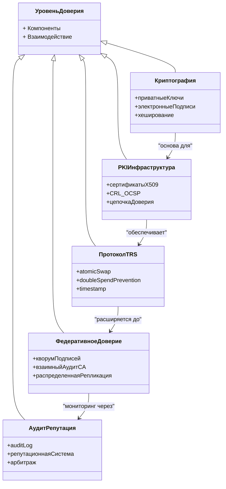
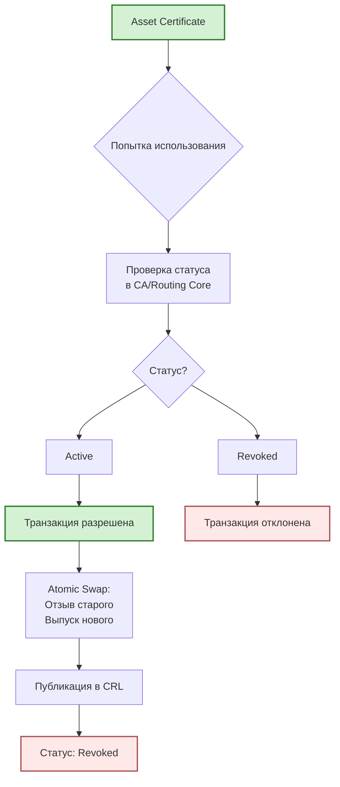
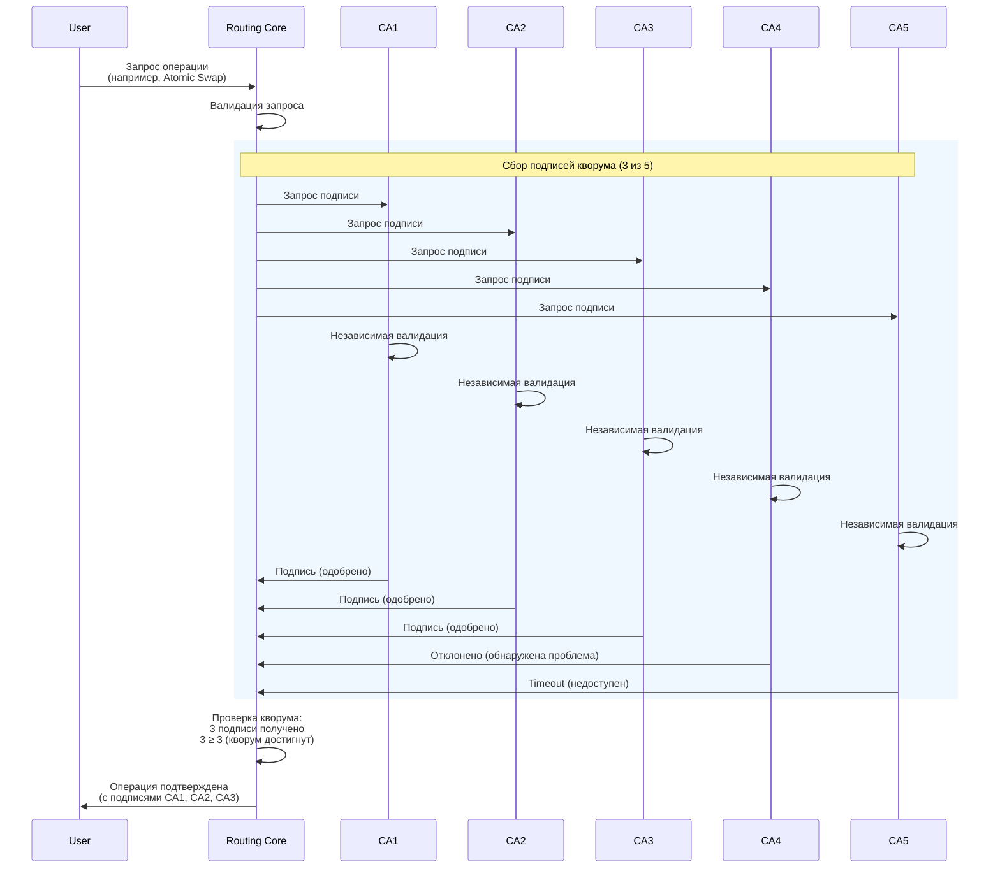
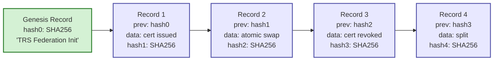
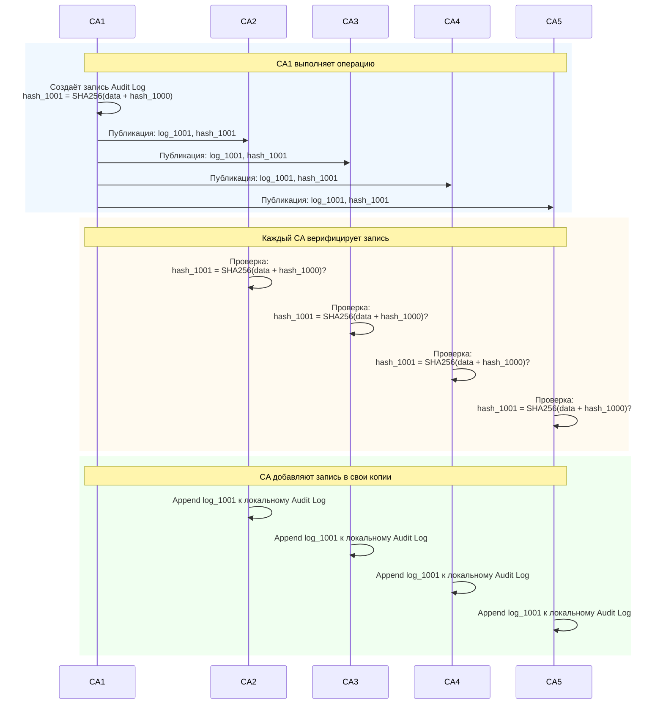

  # 8. БЕЗОПАСНОСТЬ

[↑ Вернуться к оглавлению](Home.md)


------------------------------------------------------------------------

## 8.1. Архитектура PKI

Безопасность TRS основана на инфраструктуре открытых ключей (PKI) — международном стандарте криптографической защиты, используемом во всех современных системах доверия.

### Основные компоненты PKI в TRS

| Компонент | Функция | Назначение в TRS  |
|--------------------------------|-----------------------------------------|-------------------------------------------------|
| **Приватный ключ** | Подпись транзакций и сертификатов  | Доказательство владения активом |
| **Публичный ключ** | Проверка подписей  | Верификация подлинности операций  |
| **Сертификат X.509**  | Связка публичного ключа с владельцем  | Идентификация участника и актива  |
| **CA (Certificate Authority)** | Выпуск и отзыв сертификатов | Нотариальное подтверждение |
| **Цепочка доверия**  | Иерархия CA (Root → Intermediate → End) | Проверка подлинности сертификатов  |
| **CRL / OCSP** | Списки отзыва и проверка статуса  | Защита от использования отозванных сертификатов |

### Криптографические алгоритмы

TRS поддерживает современные криптографические алгоритмы, рекомендованные для PKI:

#### Асимметричное шифрование (для подписей)

| Алгоритм | Длина ключа  | Применение  | Производительность  |
|-------------------|---------------|--------------------------------------|-----------------------------------|
| **RSA**  | 2048-4096 бит | Универсальное, широкая совместимость | Медленнее, больше размер подписи |
| **ECDSA (P-256)** | 256 бит  | Мобильные устройства, IoT  | Быстрее, меньше размер подписи  |
| **Ed25519**  | 256 бит  | Высокая производительность  | Самый быстрый, минимальный размер |

**Рекомендация:**

- **RSA 2048** — для максимальной совместимости (поддержка старых устройств)
- **ECDSA P-256** — для баланса безопасности и производительности
- **Ed25519** — для высоконагруженных систем (требует поддержки OpenSSL 1.1.1+)

#### Хеширование (для целостности)

| Алгоритм  | Длина хеша | Статус  |
|--------------------|------------|-----------------------------------|
| **SHA-256**  | 256 бит  | Рекомендован (стандарт)  |
| **SHA-384**  | 384 бит  | Повышенная безопасность  |
| **SHA-512**  | 512 бит  | Максимальная безопасность |
| ~<sub>SHA-1</sub>~ | 160 бит  | Устарел, не использовать |
| ~<sub>MD5</sub>~  | 128 бит  | Скомпрометирован, не использовать |

**Применение в TRS:**

- Хеширование Transaction Record перед подписью
- Вычисление fingerprint сертификатов
- Проверка целостности данных в Public Repository

### Уровни безопасности

TRS обеспечивает многоуровневую защиту:



### Защита приватных ключей

**Критичность приватного ключа:** Компрометация приватного ключа означает потерю контроля над активами. Защита ключей — приоритет №1 в TRS.

#### Хранение ключей

| Метод  | Безопасность | Применение  |
|-----------------------------------------|--------------|--------------------------------------------------------------------------|
| **Hardware Security Module (HSM)** | Максимальная | CA, крупные Gateway, корпоративные клиенты  |
| **Trusted Execution Environment (TEE)** | Высокая | Мобильные устройства (Android StrongBox, iOS Secure Enclave) |
| **System Keystore** | Средняя | Обычные пользователи (Android Keystore, iOS Keychain, Windows CertStore) |
| **PKCS#12 с паролем**  | Базовая | Резервные копии, экспорт ключей |
| ~<sub>Незащищённый файл</sub>~ | Отсутствует | Не использовать |

#### Доступ к приватному ключу

**Многофакторная защита (рекомендуется):**

1. **Что-то, что ты знаешь** — пароль / PIN-код
2. **Что-то, что ты имеешь** — устройство с ключом (смартфон, HSM)
3. **Что-то, что ты есть** — биометрия (отпечаток пальца, Face ID)

**Типичная конфигурация для User:**

- Приватный ключ хранится в Android Keystore / iOS Keychain
- Доступ защищён биометрией (отпечаток пальца) + PIN-кодом (fallback)
- При подписи транзакции система запрашивает биометрическую аутентификацию
- Ключ никогда не покидает защищённое хранилище

**Типичная конфигурация для CA:**

- Приватный ключ CA хранится в HSM (аппаратный модуль безопасности)
- Доступ требует физического присутствия (smart card) + PIN-код
- Операции подписи логируются (кто, когда, что подписал)
- Резервная копия ключа хранится в сейфе (offline backup)

### Защита от компрометации ключей

**Если приватный ключ скомпрометирован:**

**Для User:**

1. Немедленный отзыв всех Asset Certificates, подписанных скомпрометированным ключом
2. Генерация нового приватного ключа
3. Получение нового Client Certificate от CA
4. Перевыпуск активов на новый ключ (через Atomic Swap с самим собой или через Gateway)

**Для CA:**

1. Немедленное оповещение всех участников системы
2. Отзыв всех сертификатов, выпущенных скомпрометированным CA
3. Генерация нового Root CA (или использование резервного CA из федерации)
4. Перевыпуск всех активных сертификатов новым CA
5. Расследование причин компрометации

> **Федеративная архитектура** значительно снижает риски компрометации CA — даже если один CA скомпрометирован, система продолжает работать через остальные узлы федерации.

------------------------------------------------------------------------

## 8.2. Предотвращение double-spending

**Double-spending (двойное расходование)** — атака, при которой владелец пытается использовать один и тот же актив в нескольких транзакциях одновременно.

### Природа проблемы

В отличие от физических денег (банкноту нельзя передать двум людям одновременно), цифровые активы — это копируемые данные. Без специальных механизмов защиты владелец может попытаться:

- Отправить один сертификат активов двум разным получателям
- Использовать сертификат в транзакции и одновременно вывести актив через Gateway
- Совершить множество Offline-сделок с одним сертификатом до синхронизации

### Механизмы защиты в TRS



### Защита в Online Mode

**Процесс:**

1. User инициирует транзакцию с Asset Certificate
2. Routing Core проверяет статус сертификата через CA (или локальный кеш)
3. Если статус “Active” → транзакция продолжается
4. Если статус “Revoked” → транзакция немедленно отклоняется
5. При успешном Atomic Swap исходный сертификат атомарно отзывается
6. Отзыв публикуется в CRL, обновляется OCSP
7. Повторная попытка использования того же сертификата отклоняется (статус “Revoked”)

**Атомарность — ключевое свойство:**

```
BEGIN TRANSACTION
  IF cert.status != 'active' THEN
    ROLLBACK
    RETURN error("Certificate already revoked")
  END IF
  
  -- Отзыв старого
  UPDATE certificates SET status='revoked' WHERE serial='...'
  
  -- Выпуск нового
  INSERT INTO certificates (serial, owner, asset, status) VALUES (...)
  
COMMIT
```


**Гарантия:** Между проверкой статуса и отзывом нет временного зазора — операция атомарна. Невозможно использовать сертификат дважды.

### Защита в Offline Mode

Offline режим создаёт специфический риск — между локальным обменом и синхронизацией проходит время, в течение которого злоумышленник может попытаться совершить множество сделок с одним сертификатом.

**Механизмы защиты:**

**1. Локальная маркировка (Client-side)**

- После Offline-обмена Wallet маркирует использованный сертификат как “pending revocation”
- Wallet блокирует повторное использование этого сертификата до синхронизации
- Честный участник не может случайно использовать сертификат дважды

**2. Timestamp приоритета**

- При синхронизации Routing Core проверяет timestamp всех транзакций с данным сертификатом
- Принимается транзакция с наиболее ранним timestamp
- Остальные транзакции отклоняются (сертификат уже отозван первой транзакцией)

**3. Grace Period**

- В течение Grace Period (1-48 часов) транзакция находится в статусе “pending”
- Вторая сторона или любой участник может оспорить транзакцию, если обнаружит конфликт
- По истечении Grace Period без возражений транзакция подтверждается окончательно

**4. Взаимное заложничество**

- Каждая сторона Offline-обмена получает подписанный CSR контрагента
- Если злоумышленник попытается совершить double-spending, пострадавший может опубликовать компрометирующие документы
- Репутационный ущерб и арбитраж делают double-spending невыгодным

**Пример атаки и защиты:**

```
Сценарий: Alice совершает Offline обмен с Bob (10:00), 
          затем пытается использовать тот же сертификат с Charlie (10:30)

10:00 — Alice ↔ Bob (Offline): обмен CSR, локальная маркировка
10:30 — Alice ↔ Charlie (Offline): Alice пытается обмен с тем же сертификатом
        → Wallet Alice блокирует (сертификат уже "pending revocation")
        
Если Alice использует другой Wallet (обход защиты):
11:00 — Bob синхронизируется, публикует Transaction Record (timestamp: 10:00)
11:30 — Charlie синхронизируется, публикует Transaction Record (timestamp: 10:30)
        → Routing Core принимает транзакцию Bob (более ранний timestamp)
        → Routing Core отклоняет транзакцию Charlie (сертификат уже отозван)
        → Charlie видит конфликт, инициирует арбитраж против Alice
        → Alice получает репутационный ущерб, возможны санкции
```

### Защита в клиринге

Клиринг создаёт дополнительные риски double-spending из-за отложенного исполнения и множественных взаимосвязанных транзакций (как упоминалось в разделе 7.4).

**Специфика клиринга:**

- Транзакции накапливаются в пуле в течение клирингового цикла (например, 1 день)
- Один сертификат может участвовать в нескольких незавершённых неттингах
- Settlement происходит пакетно, а не мгновенно

**Механизмы защиты:**

**1. Резервирование сертификатов**

- При подаче транзакции в Clearing Center сертификат маркируется как “reserved”
- Зарезервированный сертификат нельзя использовать в других транзакциях до завершения клирингового цикла
- После Settlement резервирование снимается (сертификат отозван или остаётся активным)

**2. Pre-validation при submission**

- Clearing Center проверяет статус сертификата через OCSP/CRL перед принятием транзакции в пул
- Если сертификат уже отозван или зарезервирован в другом клиринговом цикле — транзакция отклоняется

**3. Final validation перед Settlement**

- Непосредственно перед выполнением Settlement Routing Core повторно проверяет статусы всех сертификатов
- Если какой-то сертификат был отозван в процессе клирингового цикла — связанные транзакции исключаются из неттинга
- Пересчёт чистых позиций без скомпрометированных транзакций

**4. Timestamp в Batch Mode**

- Каждая транзакция в клиринговом пуле имеет timestamp подачи
- При конфликте между транзакциями приоритет у более ранней
- Это согласуется с механизмом Timestamp (см. раздел 8.5)

**Пример защиты в клиринге:**

```
Клиринговый цикл 1 день (00:00 - 23:59):

08:00 — Alice подаёт транзакцию: Alice → Bob, 1000 RUR (cert serial: AA:BB:CC:DD)
        → Clearing Center резервирует сертификат AA:BB:CC:DD
        
10:00 — Alice пытается подать вторую транзакцию: Alice → Charlie, 1000 RUR (тот же сертификат)
        → Clearing Center отклоняет (сертификат уже зарезервирован)
        
23:59 — Settlement: проверка статуса AA:BB:CC:DD через OCSP
        → Статус: Active, транзакция Alice → Bob выполняется
        → Сертификат AA:BB:CC:DD отзывается, выпускается новый для Bob
```

> Подробнее о применении временных меток в клиринге и Offline-режиме — см. раздел 8.5 «Timestamp».

### Защита через Public Repository

Public Repository играет ключевую роль в предотвращении double-spending:

- **Прозрачность** — любой участник может проверить статус сертификата
- **CRL** — регулярно обновляемый список отозванных сертификатов
- **OCSP** — мгновенная проверка статуса в реальном времени
- **Audit Log** — полная история операций с сертификатом

**Процедура проверки перед принятием актива:**

1. Получатель запрашивает статус сертификата через OCSP
2. Если статус “good” → проверка цепочки доверия CA
3. Если статус “revoked” → отклонение транзакции
4. Если OCSP недоступен → скачивание CRL и проверка наличия serial number в списке

### Санкции за попытку double-spending

**Автоматические:**

- Отклонение транзакции
- Фиксация попытки в Audit Log
- Снижение репутационного рейтинга

**Ручные (через арбитраж):**

- Временная блокировка аккаунта
- Отзыв всех активов злоумышленника
- Исключение из системы (blacklist)
- Возмещение ущерба пострадавшей стороне

------------------------------------------------------------------------

## 8.3. Защита от манипуляций CA

CA выполняет критичную роль в TRS — подтверждает владение активами и выпускает сертификаты. Компрометация CA или злонамеренные действия CA-оператора могут подорвать доверие к системе.

### Возможные векторы атак

| Атака | Действие злонамеренного CA  | Последствия |
|------------------------------------|----------------------------------------------------------|--------------------------------------------------|
| **Выпуск поддельных сертификатов** | CA выпускает сертификат актива без подтверждения Gateway | Создание активов “из воздуха”  |
| **Отказ в отзыве** | CA отказывается отзывать сертификат по запросу владельца | Невозможность защитить скомпрометированный актив |
| **Необоснованный отзыв**  | CA отзывает действующий сертификат без запроса владельца | Блокировка активов  |
| **Манипуляция timestamp** | CA подделывает время выпуска/отзыва сертификата | Нарушение порядка транзакций |
| **Сговор с Gateway**  | CA и Gateway сговариваются для выпуска фиктивных активов | Инфляция активов |
| **Отказ в обслуживании**  | CA прекращает обработку запросов | Остановка системы  |

### Механизмы защиты

#### 1. Прозрачность операций

**Принцип:** Все действия CA публичны и проверяемы.

- **Public Repository** — все выпущенные сертификаты публикуются открыто
- **Audit Log** — полная история операций CA (выпуск, отзыв, timestamp)
- **CRL с подписью** — каждый CRL подписан CA, подпись проверяется участниками

**Проверка:** 
Любой участник может:

- Скачать все сертификаты из Public Repository
- Проверить соответствие сертификатов запросам Gateway (если Gateway публикует подтверждения)
- Сравнить Audit Log разных CA (в федерации) на предмет расхождений

#### 2. Gateway как независимый оракул

**Принцип:** CA не может выпустить сертификат без подписи Gateway.

**Процесс:**

1. Gateway подтверждает происхождение актива (депозит получен)
2. Gateway подписывает CSR своим приватным ключом
3. CA проверяет подпись Gateway перед выпуском сертификата
4. Если подпись невалидна или Gateway недоверенный → CA отклоняет запрос

**Защита:**

- CA не может создать актив “из воздуха” без сговора с Gateway
- Gateway несёт репутационную ответственность за каждый подписанный CSR
- Gateway может быть исключён из системы при обнаружении фальсификаций

#### 3. Federated CA — распределённое доверие

**Принцип:** Несколько независимых CA совместно подтверждают операции (см. раздел 8.6).

**Модель M-of-N:**

- Транзакция требует подписей M из N доверенных CA (например, 3 из 5)
- Даже если один CA скомпрометирован или действует злонамеренно, ему требуется сговор с другими CA
- Вероятность сговора снижается экспоненциально с ростом N

**Пример:**

```
Федерация: 5 CA (CA1, CA2, CA3, CA4, CA5)
Кворум: 3 из 5

Атака: CA1 пытается выпустить поддельный сертификат без Gateway
→ CA1 подписывает сертификат
→ CA2, CA3, CA4, CA5 отклоняют (нет подписи Gateway)
→ Кворум не достигнут (1 из 5 < 3 из 5)
→ Сертификат не выпускается

Результат: атака провалена
```


#### 4. Взаимный аудит CA

**Принцип:** CA в федерации проверяют друг друга.

**Механизм:**

- Каждый CA публикует свой Audit Log
- Другие CA периодически сверяют логи на предмет расхождений
- При обнаружении несоответствия инициируется расследование
- CA, уличённый в манипуляциях, исключается из федерации

**Пример проверки:**

```
CA1 публикует: "Выпущен сертификат serial=AA:BB:CC:DD, owner=Alice, timestamp=10:00"
CA2 проверяет: 
  - Есть ли подпись Gateway на CSR?
  - Соответствует ли timestamp текущему времени?
  - Не дублирует ли serial другой сертификат?
Если проверки не проходят → CA2 сигнализирует о проблеме
```


#### 5. Разделение ролей (Separation of Duties)

**Принцип:** Критичные операции требуют участия нескольких лиц/систем.

**Применение в CA:**

- Приватный ключ CA требует M-of-N подписей (например, 2 из 3 администраторов) для операций
- Отзыв сертификата требует подтверждения независимого валидатора
- Изменение политики CA требует консенсуса совета CA (в федерации)

#### 6. Технические ограничения CA

**Принцип:** CA не имеет доступа к приватным ключам участников.

**Что CA НЕ может:**

- Подписать Transaction Record от имени участника (нет приватного ключа User)
- Передать актив без согласия владельца (требуется подпись владельца)
- Изменить содержимое сертификата после выпуска (любое изменение нарушает подпись)

**Что CA может:**

- Выпустить сертификат на основе подписанного CSR
- Отозвать сертификат по запросу владельца, Gateway или арбитра
- Отказать в выпуске сертификата (но не украсть активы)

#### 7. Репутация и экономические стимулы

**Принцип:** Злонамеренное поведение CA экономически невыгодно.

**Стимулы честного поведения:**

- Репутация CA определяет количество клиентов и доход
- Обнаружение мошенничества ведёт к потере клиентов и исключению из федераций
- CA-операторы могут нести юридическую ответственность
- Залоговые механизмы (staking) — CA вносит залог, который теряется при нарушениях

### Сценарий защиты: попытка выпуска поддельного сертификата

**Атака:** 
Злонамеренный CA пытается выпустить сертификат на 10,000 RUR без реального депозита, подделав подпись Gateway.

**Защита (Stand-alone CA):**

1. CA формирует CSR с поддельной подписью Gateway
2. CA выпускает сертификат, публикует в Public Repository
3. Gateway или участник проверяет сертификат, обнаруживает поддельную подпись Gateway
4. Инициируется арбитраж, CA уличается в мошенничестве
5. Репутация CA уничтожена, клиенты уходят, возможны юридические последствия

**Защита (Federated CA):**

1. Злонамеренный CA1 формирует CSR с поддельной подписью Gateway
2. CA1 запрашивает подписи других CA для кворума
3. CA2, CA3 проверяют подпись Gateway, обнаруживают подделку
4. CA2, CA3 отклоняют запрос
5. Кворум не достигнут, сертификат не выпускается
6. CA1 автоматически помечается как недоверенный и исключается из федерации

### Восстановление после компрометации CA

**Если CA скомпрометирован (приватный ключ украден):**

**Немедленные действия:**

1. Оповещение всех участников системы
2. Остановка операций скомпрометированного CA
3. Переключение на резервный CA (в федерации) или активация нового CA

**Долгосрочные действия:**

1. Отзыв всех сертификатов, выпущенных скомпрометированным CA
2. Перевыпуск активных сертификатов новым CA
3. Аудит всех операций скомпрометированного CA за период до обнаружения
4. Выявление и отмена поддельных сертификатов
5. Расследование причин компрометации, улучшение процедур безопасности

**Федеративная архитектура минимизирует ущерб:**

- Остальные CA продолжают работу
- Система не останавливается
- Перевыпуск сертификатов происходит постепенно, без паники

------------------------------------------------------------------------

## 8.4. Репутация и аудит

Репутационная система и прозрачный аудит дополняют криптографическую защиту, создавая экономические и социальные стимулы для честного поведения.

### Audit Log — неизменяемый журнал операций

**Audit Log** — полная хронологическая запись всех операций в TRS, фиксирующая:

- Выпуск и отзыв сертификатов
- Atomic Swap и Split операции
- Timestamp каждой операции
- Подписи всех участников
- Результаты валидации

**Свойства Audit Log:**

- **Неизменяемость** — записи нельзя удалить или изменить после фиксации
- **Полнота** — фиксируется каждая операция без исключений
- **Доступность** — журнал доступен для аудита уполномоченными лицами
- **Подписанность** — каждая запись подписана CA или Routing Core

**Структура записи Audit Log:**

```
{
  "log_id": "log_20251012_001",
  "timestamp": "2025-10-12T14:30:00Z",
  "operation_type": "atomic_swap",
  "participants": ["alice_001", "bob_002"],
  "certificates_revoked": ["AA:BB:CC:DD", "11:22:33:44"],
  "certificates_issued": ["AA:11:22:33", "BB:22:33:44"],
  "transaction_id": "tx_20251012_001",
  "routing_core_signature": "3046022100...",
  "ca_signature": "3045022100...",
  "validation_result": "success"
}
```


**Применение Audit Log:**

- Расследование споров между участниками
- Обнаружение аномалий и попыток мошенничества
- Соответствие регуляторным требованиям (compliance)
- Проверка корректности работы CA и Routing Core
- Восстановление состояния системы после сбоя

### Репутационная система

**Репутация** — публичный рейтинг надёжности участника, основанный на истории его операций.

#### Типы участников с репутацией

| Роль  | Критерии репутации | Влияние низкой репутации |
|---------------------|-----------------------------------------------------------------|-----------------------------------------------|
| **User**  | Честность в Offline-сделках, отсутствие попыток double-spending | Ограничение Offline-режима, требование залога |
| **Gateway** | Точность подтверждений, отсутствие фальсификаций  | Исключение из списка доверенных Gateway  |
| **CA** | Корректность выпуска/отзыва, прозрачность операций | Исключение из федерации, потеря клиентов |
| **Clearing Center** | Точность неттинга, своевременность Settlement  | Переход клиентов к конкурентам  |

#### Метрики репутации

**Для User:**

- Количество успешных транзакций
- Отсутствие конфликтов и арбитражей
- Своевременная синхронизация Offline-сделок
- Отклики контрагентов (feedback)

**Для Gateway:**

- Точность подтверждений (соответствие реальным депозитам)
- Скорость обработки Withdrawal
- Отсутствие жалоб от пользователей
- Финансовая устойчивость (покрытие обязательств)

**Для CA:**

- Uptime (доступность сервиса)
- Скорость обработки запросов
- Отсутствие ошибок в сертификатах
- Прозрачность Audit Log
- Корректность CRL/OCSP

#### Градации репутации

| Уровень | Диапазон | Статус | Ограничения |
|------------------|----------|------------|------------------------------------------|
| **Отличная** | 95-100% | Verified  | Нет ограничений |
| **Хорошая** | 80-94%  | Trusted  | Минимальные ограничения |
| **Средняя** | 60-79%  | Standard  | Ограничение крупных сделок  |
| **Низкая**  | 40-59%  | Caution  | Требование залога, ограничение Offline  |
| **Очень низкая** | 0-39%  | Suspicious | Блокировка новых операций, расследование |

#### Публикация репутации

- Репутационные рейтинги публикуются в Public Repository
- Обновление — ежедневно или после каждой операции
- Участники могут проверить репутацию контрагента перед сделкой
- Низкая репутация — сигнал для повышенной осторожности

### Арбитраж — разрешение споров

**Арбитр** — независимая сторона, назначаемая для разрешения конфликтов между участниками.

#### Типы споров

| Тип спора  | Описание  | Процедура разрешения  |
|--------------------------------------|------------------------------------------------------------|--------------------------------------------------------|
| **Конфликт Offline-сделок** | Две стороны заявляют о праве на один актив | Проверка timestamp, Grace Period, взаимные CSR |
| **Отказ от выполнения обязательств** | Одна сторона отказывается синхронизировать Offline-сделку | Принудительная публикация CSR контрагентом |
| **Технический сбой** | Потеря данных, ошибка в сертификате  | Восстановление из Audit Log, перевыпуск  |
| **Мошенничество Gateway**  | Gateway подтвердил несуществующий депозит | Расследование, отзыв сертификатов, санкции |
| **Претензии к CA**  | CA необоснованно отозвал или отказал в выпуске сертификата | Проверка соответствия политике CA, восстановление прав |

#### Процесс арбитража

1. **Инициация:** Пострадавшая сторона подаёт заявку на арбитраж с доказательствами
2. **Назначение арбитра:** Система или стороны выбирают независимого арбитра
3. **Сбор доказательств:** Арбитр запрашивает данные из Audit Log, подписи сторон, показания свидетелей
4. **Анализ:** Арбитр проверяет корректность операций, timestamp, соответствие правилам TRS
5. **Решение:** Арбитр выносит решение, которое оформляется подписанным документом
6. **Исполнение:** Routing Core и CA исполняют решение (отзыв/выпуск сертификатов, компенсация)
7. **Публикация:** Решение арбитража публикуется в Public Repository, влияет на репутацию участников

#### Юридическая сила решений арбитража

- Арбитражное решение может иметь юридическую силу (зависит от юрисдикции)
- Участники могут заранее согласиться на обязательность арбитража (арбитражная оговорка)
- В некоторых случаях арбитражное решение может быть обжаловано в суде

### Социальные механизмы доверия

**Отзывы и рейтинги:**

- После успешной сделки стороны могут оставить отзыв друг о друге
- Положительные отзывы повышают репутацию
- Негативные отзывы снижают репутацию и требуют объяснения

**Whitelist и Blacklist:**

- **Whitelist** — список проверенных, надёжных участников
- **Blacklist** — список участников, уличённых в мошенничестве
- Gateway и Clearing Center могут отказывать в обслуживании участников из Blacklist

**Сообщество и модерация:**

- Открытые форумы для обсуждения проблем
- Голосование сообщества по спорным вопросам (в децентрализованных конфигурациях)
- Модераторы, следящие за соблюдением правил

------------------------------------------------------------------------

## 8.5. Timestamp

**Timestamp (временная метка)** — подтверждённое время совершения операции, критичное для разрешения конфликтов и определения порядка транзакций.

### Роль Timestamp в TRS

Временные метки используются в нескольких контекстах:

| Контекст  | Назначение | Критичность |
|------------------------|------------------------------------------------------------|-------------|
| **Выпуск сертификата** | Фиксация времени регистрации актива  | Средняя |
| **Atomic Swap**  | Определение порядка транзакций | Высокая |
| **Offline-сделки** | Разрешение конфликтов при double-spending | Критическая |
| **Grace Period**  | Определение момента начала/окончания периода оспаривания  | Критическая |
| **Клиринг**  | Определение принадлежности транзакции к клиринговому циклу | Высокая |
| **Audit Log** | Хронологический порядок событий  | Высокая |

### Источники времени

#### 1. Локальное время клиента (Untrusted)

**Использование:**

- Начальный timestamp при создании Transaction Record в Offline-режиме
- Временная метка для локального Wallet

**Проблема:**

- Клиент может манипулировать локальным временем (изменить часы на устройстве)
- Не подходит для разрешения споров

#### 2. Серверное время Routing Core (Semi-Trusted)

**Использование:**

- Timestamp публикации Transaction Record
- Фиксация момента поступления запроса

**Преимущество:**

- Централизованный источник времени
- Сложнее манипулировать (требуется компрометация сервера)

**Недостаток:**

- Зависимость от честности оператора Routing Core
- Возможна манипуляция при сговоре

#### 3. Timestamp от CA (Trusted)

**Использование:**

- Время выпуска сертификата
- Время отзыва сертификата

**Преимущество:**

- CA несёт репутационную ответственность за точность timestamp
- Timestamp включается в подпись сертификата (нельзя изменить)

**Недостаток:**

- Доверие к одному источнику (Stand-alone CA)

#### 4. Федеративный timestamp (Most Trusted)

**Использование:**

- Критичные операции в федеративной архитектуре
- Разрешение споров в арбитраже

**Механизм:**

- Несколько CA проставляют независимые timestamp
- Принимается медианное значение или consensus timestamp
- Манипуляция требует сговора большинства CA

**Пример:**
```
5 CA проставляют timestamp для транзакции:
CA1: 10:30:05
CA2: 10:30:07
CA3: 10:30:06
CA4: 10:30:08
CA5: 10:30:06

Медианное значение: 10:30:06
Consensus timestamp: 10:30:06
```

#### 5. Trusted Time Service (External)

**Использование:**

- Интеграция с внешними службами доверенного времени (NTP, GPS, государственные эталоны времени)
- Повышение надёжности timestamp

**Примеры служб:**

- NTP Pool — сеть публичных серверов точного времени
- GPS Time — время от спутниковых систем
- NIST Time Services — национальные эталоны (США)
- PTB Time Server — национальный эталон (Германия)

### Защита timestamp от манипуляций

#### 1. Подпись timestamp

Timestamp включается в подписываемые данные:

```
Transaction Record:
{
  "transaction_id": "tx_001",
  "timestamp": "2025-10-12T14:30:00Z",
  "parties": [...],
  "assets": [...]
}

Хеш = SHA256(Transaction Record)
Подпись = Sign(Хеш, Private_Key)
```

**Защита:** 
Изменение timestamp нарушит хеш и подпись. Невозможно изменить время без переподписания всех участников.

#### 2. Timestamp в сертификате

Сертификат X.509 содержит поля:

- `Not Before` — время начала действия
- `Not After` — время окончания действия

CA подписывает сертификат вместе с этими полями. Изменение timestamp невозможно без приватного ключа CA.

#### 3. Проверка разумности timestamp

Routing Core и CA проверяют:

- Timestamp не в будущем (не позже текущего времени + допустимое отклонение)
- Timestamp не слишком старый (например, не более 7 дней назад для Offline-сделок)
- Timestamp согласован с другими timestamp в цепочке операций

**Пример проверки:**
```
Текущее время (Routing Core): 2025-10-12 15:00:00
Timestamp транзакции: 2025-10-12 14:30:00

Проверка: 14:30:00 < 15:00:00 ✓ (не в будущем)
Разница: 30 минут < 7 дней ✓ (не слишком старый)
Результат: Timestamp принят
```

#### 4. Множественные timestamp для критичных операций

При разрешении споров используются несколько источников времени:

- Timestamp клиента (для ориентировки)
- Timestamp Routing Core (при публикации)
- Timestamp CA (при выпуске сертификата)
- Внешний Trusted Time Service (для верификации)

Если timestamp согласованы (разница < порогового значения) → время подтверждено.

### Применение Timestamp в Offline Mode

**Сценарий:** Alice и Bob совершают Offline-сделку в 10:00, синхронизация происходит в 14:00.

1. **10:00** — Alice и Bob обмениваются CSR локально 
  #* Alice: timestamp_local = 10:00:00 (устройство Alice) 
  #* Bob: timestamp_local = 10:00:05 (устройство Bob) 
  #* Разница 5 секунд — нормально (часы не идеально синхронизированы)


1. **14:00** — Alice публикует Transaction Record в Routing Core 
  #* Routing Core фиксирует timestamp_publication = 14:00:00 
  #* В Transaction Record указан timestamp_local = 10:00:00 (время локального обмена)


1. **14:00:10** — CA проверяет timestamp 
  #* timestamp_local (10:00:00) указан в Transaction Record 
  #* timestamp_publication (14:00:00) зафиксирован Routing Core 
  #* Разница 4 часа — укладывается в допустимый Grace Period 
  #* CA выпускает сертификат с timestamp_cert = 14:00:10 (время подписи CA)

**Какой timestamp используется для разрешения конфликтов?**

- **Приоритетный** — `timestamp_local` (время локального обмена)
- **Подтверждающий** — `timestamp_publication` (время публикации в системе)
- **Арбитражный** — если `timestamp_local` разных участников сильно расходится, арбитр использует `timestamp_publication` или внешний источник времени

### Защита от атак на timestamp

**Атака 1: Задержка публикации**

- **Сценарий:** Alice совершает Offline-сделку с Bob в 10:00, затем намеренно задерживает публикацию до 18:00, чтобы успеть совершить ещё одну сделку с Charlie и опубликовать её раньше.
- **Защита:** Grace Period учитывает `timestamp_local`. Даже если Alice опубликует позже, приоритет определяется по времени локального обмена. Timestamp_local подписан обеими сторонами и не может быть изменён.

**Атака 2: Подделка timestamp_local**

- **Сценарий:** Alice изменяет часы на устройстве, чтобы указать более ранний `timestamp_local` и получить приоритет.
- **Защита:** Bob подписывает Transaction Record с тем же `timestamp_local`. Если Bob не согласен с timestamp (его часы показывают другое время), он может инициировать арбитраж. Арбитр проверит `timestamp_publication` и внешние источники времени.

**Атака 3: Манипуляция timestamp CA**

- **Сценарий:** Злонамеренный CA подделывает время выпуска сертификата, чтобы изменить порядок транзакций.
- **Защита:**
 - В федерации timestamp подтверждается несколькими CA (consensus)
 - Audit Log фиксирует расхождения timestamp между CA
 - Внешний Trusted Time Service верифицирует timestamp CA

### Точность и синхронизация времени

**Требования к точности:**

| Тип операции  | Требуемая точность | Допустимое отклонение |
|------------------------|--------------------|-----------------------|
| Online Atomic Swap | Секунды  | ±5 секунд |
| Offline Local Exchange | Минуты | ±5 минут |
| Grace Period  | Часы  | ±1 час  |
| Клиринговый цикл  | Минуты | ±10 минут |
| Audit Log | Секунды  | ±1 секунда  |

**Синхронизация времени:**

- Routing Core и CA используют NTP для синхронизации с глобальным временем
- Клиенты (мобильные приложения) автоматически синхронизируются через сеть оператора или NTP
- Периодическая проверка отклонения часов (drift) и коррекция

### Timestamp в Grace Period — приоритет транзакций

**Связь с Grace Period** (подробнее в разделе 7.2.2): временная метка определяет порядок обработки конфликтующих Offline-транзакций.

**Механизм приоритета:**

1. Две Offline-сделки используют один и тот же сертификат
2. Обе публикуются в период Grace Period
3. Routing Core сравнивает `timestamp_local` обеих транзакций
4. Транзакция с более ранним `timestamp_local` получает приоритет
5. Вторая транзакция отклоняется (сертификат уже отозван первой)

**Пример:**

```
Alice совершает две Offline-сделки с одним сертификатом:

Сделка 1 с Bob:
  timestamp_local: 2025-10-12 10:00:00
  timestamp_publication: 2025-10-12 14:00:00
  
Сделка 2 с Charlie:
  timestamp_local: 2025-10-12 10:30:00
  timestamp_publication: 2025-10-12 13:30:00

Хотя Сделка 2 опубликована раньше (13:30 < 14:00),
приоритет у Сделки 1 (10:00 < 10:30 по timestamp_local)

Результат: Сделка 1 подтверждается, Сделка 2 отклоняется
```

> **Критичность точности:** Если `timestamp_local` может быть манипулирован, злоумышленник получает контроль над приоритетом. Поэтому timestamp подписывается обеими сторонами и проверяется арбитром при спорах.

### Timestamp в арбитраже и Audit Log

**Применение в арбитраже:**

Timestamp служит **временной меткой доказательства** — подтверждением того, когда произошло событие:

- Когда была совершена сделка (timestamp_local в Transaction Record)
- Когда была опубликована транзакция (timestamp_publication от Routing Core)
- Когда был выпущен сертификат (timestamp в X.509 Certificate)
- Когда был отозван сертификат (timestamp в CRL entry)

**Использование арбитром:**

1. Стороны предоставляют противоречивые данные о времени событий
2. Арбитр запрашивает Audit Log с неизменяемыми timestamp
3. Арбитр сравнивает timestamp из разных источников (локальный, Routing Core, CA, внешний Trusted Time Service)
4. Арбитр устанавливает фактическую последовательность событий
5. Решение выносится на основе объективных временных меток

**Применение в Audit Log:**

Audit Log хранит хронологическую последовательность всех операций:

```
{
  "log_id": "log_001",
  "timestamp": "2025-10-12T10:00:00Z",
  "event": "certificate_issued",
  "cert_serial": "AA:BB:CC:DD"
}
{
  "log_id": "log_002",
  "timestamp": "2025-10-12T14:30:00Z",
  "event": "atomic_swap_initiated",
  "transaction_id": "tx_001"
}
{
  "log_id": "log_003",
  "timestamp": "2025-10-12T14:30:15Z",
  "event": "certificate_revoked",
  "cert_serial": "AA:BB:CC:DD"
}
```

**Свойства timestamp в Audit Log:**

- **Монотонность** — timestamp каждой записи >= timestamp предыдущей
- **Неизменяемость** — timestamp записи нельзя изменить после фиксации
- **Проверяемость** — timestamp подписан CA или Routing Core
- **Корреляция** — можно восстановить полную последовательность событий

> Audit Log с точными timestamp — ключевой инструмент для расследований, аудита и соответствия регуляторным требованиям.

> Механизмы timestamp формируют основу для раздела 8.6 «Federated Trust Model», где временные метки согласуются через несколько CA для обеспечения консенсуса и предотвращения манипуляций.

------------------------------------------------------------------------

## 8.6. Federated Trust Model — Федеративная модель доверия

**Федеративная модель доверия** — архитектурный подход TRS, где доверие распределяется между несколькими независимыми узлами (CA), работающими по единым правилам и взаимно подтверждающими операции.

> Федеративная архитектура подробно описана в разделе 5.4 «Федеративная архитектура». Здесь рассматриваются механизмы безопасности федерации.

### M-of-N кворум CA

**M-of-N (M из N)** — для подтверждения операции требуется минимум M подписей из N доступных CA.

**Примеры конфигураций:**

| Конфигурация | Описание  | Устойчивость к компрометации  | Сложность достижения кворума |
|--------------|----------------------------|--------------------------------|-------------------------------|
| **2 из 3**  | Минимальная федерация | Устойчива к компрометации 1 CA | Низкая (высокая доступность) |
| **3 из 5**  | Рекомендуемая конфигурация | Устойчива к компрометации 2 CA | Средняя (баланс) |
| **5 из 7**  | Повышенная безопасность  | Устойчива к компрометации 2 CA | Высокая (требует большинства) |
| **7 из 10** | Максимальная безопасность | Устойчива к компрометации 3 CA | Очень высокая |

### Процесс достижения кворума



### Независимая валидация каждым CA

Каждый CA в федерации **независимо проверяет** запрос перед подписью:

**Проверки:**

1. Корректность структуры запроса (CSR в формате PKCS#10 для сертификатов, Transaction Record в согласованном формате — JSON для операций)
2. Подписи участников (User, Gateway) — проверка через цепочку доверия
3. Статусы сертификатов — не отозваны ли активы, участвующие в операции
4. Соответствие правилам системы (например, сумма Split равна исходному количеству)
5. Отсутствие конфликтов (нет попыток double-spending)
6. Разумность timestamp (не в будущем, не слишком старый)

**Если все проверки пройдены:** CA подписывает запрос своим приватным ключом. 
**Если хотя бы одна проверка не пройдена:** CA отклоняет запрос и сообщает причину.

### Достижение и недостижение кворума

**Кворум достигнут (3 из 5):**

```
Запрос: выпуск сертификата на 1000 RUR
CA1: одобрено ✓
CA2: одобрено ✓
CA3: одобрено ✓
CA4: отклонено (нет подписи Gateway)
CA5: timeout (недоступен)

Результат: 3 подписи ≥ 3 (кворум)
Операция: подтверждена, сертификат выпускается
```

**Кворум НЕ достигнут (2 из 5):**

```
Запрос: выпуск сертификата на 1000 RUR
CA1: одобрено ✓
CA2: одобрено ✓
CA3: отклонено (подозрение на double-spending)
CA4: отклонено (нет подписи Gateway)
CA5: timeout (недоступен)

Результат: 2 подписи < 3 (кворум не достигнут)
Операция: отклонена, сертификат не выпускается
```

### Преимущества федеративного кворума

| Преимущество  | Описание  | Пример  |
|-----------------------------|----------------------------------------------------|-------------------------------------------|
| **Защита от компрометации** | Атакующему нужно скомпрометировать M CA, а не один | 3 из 5: нужно взломать 3 CA  |
| **Отказоустойчивость** | Система работает при отказе (N - M) CA | 3 из 5: устойчива к отказу 2 CA  |
| **Защита от сговора**  | Сговор требует участия M CA  | 3 из 5: нужен сговор минимум 3 CA |
| **Распределённое доверие** | Нет единой точки доверия  | Доверие распределено между операторами  |
| **Независимая валидация**  | Каждый CA проверяет запрос самостоятельно | Повышенная вероятность обнаружения ошибок |

### Недостатки и ограничения

| Недостаток  | Влияние  | Митигация |
|--------------------------|--------------------------------------------|----------------------------------------|
| **Снижение скорости**  | Необходимо дождаться M подписей  | Параллельные запросы, таймауты |
| **Сложность управления** | Координация нескольких CA-операторов  | Автоматизация, чёткие протоколы  |
| **Риск недоступности**  | Если доступно < M CA, система блокируется | Выбор N достаточно большим (N >> M) |
| **Стоимость**  | Содержание нескольких CA дороже  | Распределение затрат между участниками |

### Адаптивный кворум

В некоторых конфигурациях TRS кворум может быть **адаптивным** — зависеть от типа операции:

| Тип операции  | Требуемый кворум | Обоснование |
|--------------------------------------------|------------------|-----------------------------------------|
| Рутинные операции (мелкие сделки) | 2 из 5  | Скорость важнее безопасности  |
| Стандартные операции  | 3 из 5  | Баланс скорости и безопасности |
| Крупные сделки (high-value)  | 4 из 5  | Повышенная безопасность |
| Критичные операции (изменение политики CA) | 5 из 5  | Максимальная безопасность (единогласие) |

### Временные ограничения (Timeout)

Для избежания бесконечного ожидания устанавливаются таймауты:

**Типичные значения:**

- Таймаут ответа одного CA: 10-30 секунд
- Таймаут достижения кворума: 60-120 секунд

**Стратегия при таймауте:**

1. Routing Core отправляет запросы всем N CA параллельно
2. Ожидает первые M подписей
3. Если M подписей получено за T секунд → кворум достигнут
4. Если M подписей не получено за T секунд → операция отклонена (кворум не достигнут)

**Пример:**

```
Конфигурация: 3 из 5, таймаут 60 сек

0 сек — запросы отправлены всем 5 CA
5 сек — получена подпись CA1
8 сек — получена подпись CA3
12 сек — получена подпись CA2
→ Кворум достигнут (3 подписи), операция продолжается

CA4, CA5 отвечают позже или не отвечают вообще — не важно, кворум уже есть
```

### Разрешение расхождений

**Что делать, если CA расходятся во мнениях?**

**Сценарий:** 3 CA одобрили операцию, 2 CA отклонили.

1. Кворум достигнут (3 из 5), операция выполняется
2. Routing Core фиксирует расхождение в Audit Log
3. Инициируется автоматическая проверка: 
  #* Почему CA4 и CA5 отклонили запрос? 
  #* Какие проверки не прошли?
4. Если обнаружена ошибка в логике CA4/CA5 → они исправляют правила валидации
5. Если обнаружена реальная проблема в операции → инициируется арбитраж
6. Участники оповещаются о расхождении, могут запросить дополнительную проверку

### Распределённые OCSP/CRL реплики

В федеративной модели каждый CA публикует собственный CRL и предоставляет OCSP Responder, но эти данные реплицируются между узлами для повышения доступности и защиты от цензуры.

#### Архитектура распределённой публикации

| Компонент | Stand-alone  | Федеративная модель  |
|-----------------------|---------------------------------------|----------------------------------------------------------------|
| **CRL Publication**  | Один CA публикует CRL | Каждый CA публикует свой CRL + агрегированный федеративный CRL |
| **OCSP Responder**  | Один OCSP Responder  | N OCSP Responders (по одному на каждый CA) |
| **Public Repository** | Единое хранилище | Распределённое хранилище с репликацией |
| **Точка отказа** | Единая (недоступность CA = остановка) | Отсутствует (N-M узлов могут отказать) |

#### Federated CRL — агрегированный список отзыва

**Концепция:** 
Каждый CA в федерации публикует:

1. **Локальный CRL** — отзывы, выполненные данным CA
2. **Federated CRL** — агрегация отзывов от всех CA в федерации

**Процесс формирования Federated CRL:**

1. CA1 отзывает сертификат → публикует в свой локальный CRL
2. CA1 отправляет уведомление другим CA (CA2, CA3, CA4, CA5)
3. Каждый CA добавляет информацию об отзыве в свой Federated CRL
4. Любой клиент может скачать Federated CRL от любого CA и получить полную информацию

**Пример структуры:**
```
https://ca1.trs.example/crl/local_crl.crl  ← отзывы CA1
https://ca1.trs.example/crl/federated_crl.crl  ← отзывы всех CA

https://ca2.trs.example/crl/local_crl.crl  ← отзывы CA2
https://ca2.trs.example/crl/federated_crl.crl  ← отзывы всех CA (копия)
```

**Преимущества:**

- Клиент может запросить CRL от любого доступного CA
- Если один CA недоступен, клиент обращается к другому
- Защита от цензуры — невозможно скрыть отзыв, заблокировав один CA

#### Distributed OCSP — множественные респондеры

**Концепция:** 
Каждый CA предоставляет OCSP Responder, способный отвечать на запросы о статусе любого сертификата в федерации.

**Процесс:**

1. Клиент формирует OCSP-запрос с serial number сертификата
2. Клиент может отправить запрос любому OCSP Responder (CA1, CA2, …, CA5)
3. OCSP Responder проверяет статус: 
  #* Если сертификат выпущен данным CA → проверяет локальную базу 
  #* Если сертификат выпущен другим CA → проверяет реплицированные данные от федерации
4. OCSP Responder возвращает ответ (good / revoked / unknown)

**Failover стратегия:**

```
Клиент пытается проверить статус сертификата:
1. Запрос к CA1 OCSP → timeout
2. Запрос к CA2 OCSP → ответ получен (good)
3. Результат: сертификат активен

Если бы все OCSP были недоступны → fallback на CRL (скачать и проверить локально)
```

**Преимущества:**

- Высокая доступность (N респондеров вместо одного)
- Географическое распределение (снижение latency)
- Устойчивость к DDoS-атакам (распределённая нагрузка)

### Синхронизация Audit Log через Merkle Hash Chain

**Merkle Hash Chain (цепочка хешей)** — механизм связывания записей Audit Log через криптографические хеши, обеспечивающий неизменяемость и синхронизацию между узлами федерации.

#### Структура Merkle Hash Chain

Каждая запись Audit Log содержит:

- **Данные события** (timestamp, тип операции, участники, сертификаты)
- **Хеш предыдущей записи** (связь с предыдущей записью)
- **Хеш текущей записи** (SHA-256 от данных + хеш предыдущей)



#### Процесс создания записи

```
Record N:
{
  "log_id": "log_N",
  "timestamp": "2025-10-12T14:30:00Z",
  "operation": "atomic_swap",
  "data": {
    "transaction_id": "tx_001",
    "participants": ["alice_001", "bob_002"],
    ...
  },
  "previous_hash": "hash_{N-1}",
  "current_hash": SHA256(data + previous_hash)
}

Вычисление current_hash:
hash_N = SHA256(
  timestamp + operation + data + previous_hash
)
```

#### Свойства Merkle Hash Chain

| Свойство  | Механизм | Гарантия  |
|------------------------|------------------------------------------------------|----------------------------------------|
| **Неизменяемость** | Изменение любой записи нарушает все последующие хеши | Невозможно незаметно изменить историю |
| **Целостность**  | Проверка цепочки хешей от genesis до текущей записи | Обнаружение любых манипуляций |
| **Последовательность** | Каждая запись ссылается на предыдущую  | Невозможно вставить или удалить запись |
| **Верификация**  | Любой участник может проверить полную цепочку  | Публичная проверяемость  |

#### Синхронизация между CA в федерации



#### Обнаружение расхождений

Периодически CA сверяют корневые хеши (hash последней записи):
```
CA1: последняя запись log_1050, hash_1050 = A1B2C3D4...
CA2: последняя запись log_1050, hash_1050 = A1B2C3D4...
CA3: последняя запись log_1050, hash_1050 = A1B2C3D4...
CA4: последняя запись log_1048, hash_1048 = X9Y8Z7W6...  ← расхождение!
CA5: последняя запись log_1050, hash_1050 = A1B2C3D4...

Результат: CA4 отстал или имеет другую версию истории
Действие: CA4 запрашивает недостающие записи (log_1049, log_1050) у других CA
```


**Если хеши не совпадают при одинаковом количестве записей:**

1. Обнаружена попытка манипуляции или форк цепочки
2. Инициируется расследование
3. Участники федерации голосуют, какая цепочка корректна (консенсус большинства)
4. Некорректная цепочка отклоняется, CA с некорректной версией помечается как ненадёжный

#### Преимущества Merkle Hash Chain в федерации

| Преимущество | Описание  |
|----------------------------------|------------------------------------------------------------------------|
| **Взаимная проверка**  | Каждый CA может проверить корректность Audit Log других CA |
| **Обнаружение манипуляций** | Любое изменение истории немедленно обнаруживается при сверке хешей |
| **Распределённое хранение** | Полная копия Audit Log на каждом CA → высокая доступность |
| **Публичная верификация**  | Участники могут скачать Audit Log от любого CA и проверить целостность |
| **Отсутствие центральной точки** | Нет единого “владельца” истории, доверие распределено |

> Merkle Hash Chain обеспечивает такой же уровень неизменяемости истории, как blockchain, но без необходимости в консенсусе proof-of-work или proof-of-stake.

------------------------------------------------------------------------

## 8.7. Восстановление доступа

**Потеря доступа к приватному ключу** — критичная ситуация, приводящая к невозможности распоряжаться активами. TRS предусматривает несколько механизмов восстановления.

### Сценарии потери доступа

| Сценарий  | Причина | Последствия |
|----------------------------|--------------------------------------|--------------------------------------|
| **Утеря устройства**  | Кража, потеря смартфона | Невозможность подписывать транзакции |
| **Забытый пароль** | Пользователь забыл пароль от PKCS#12 | Невозможность извлечь приватный ключ |
| **Повреждение устройства** | Физическое повреждение, сбой ОС | Невозможность доступа к Keystore |
| **Смерть владельца**  | Наследование активов | Необходимость передачи контроля |

### Механизмы восстановления

#### 1. Резервное копирование PKCS#12

**Рекомендуемый метод:** Экспорт PKCS#12 контейнера и хранение в безопасном месте.

**Процесс:**

1. User экспортирует PKCS#12 из системного Keystore
2. PKCS#12 защищается сильным паролем
3. Файл сохраняется в безопасное место: 
  #* Зашифрованное облачное хранилище 
  #* Аппаратный USB-ключ в сейфе 
  #* Бумажная копия (QR-код) в банковской ячейке

**Восстановление:**

1. User получает доступ к резервной копии PKCS#12
2. Импортирует PKCS#12 на новое устройство
3. Вводит пароль
4. Доступ к приватному ключу восстановлен

**Риск:** Компрометация резервной копии → потеря контроля над активами.

#### 2. Мультиподпись (Multi-Signature)

**Концепция:** Актив контролируется несколькими ключами (M-of-N), любые M ключей могут подписать транзакцию.

**Пример конфигурации:**

```
User имеет актив с Multi-Sig 2-of-3:
- Ключ A: на смартфоне User
- Ключ B: на ноутбуке User
- Ключ C: у доверенного лица (друг, семья, нотариус)

Для транзакции нужны любые 2 из 3 ключей
```


**Восстановление:**

1. User теряет смартфон (Ключ A)
2. User использует ключи B (ноутбук) + C (доверенное лицо) для подписи
3. Транзакция проходит (2 из 3 подписей)
4. User генерирует новый ключ A' на новом смартфоне
5. User обновляет Multi-Sig конфигурацию (заменяет A на A')

**Преимущество:** Устойчивость к потере одного ключа. 
**Недостаток:** Сложность управления, необходимость координации с доверенным лицом.

#### 3. Social Recovery (Социальное восстановление)

**Концепция:** Восстановление доступа через группу доверенных лиц (guardians).

**Процесс настройки:**

1. User назначает 5 guardians (друзья, семья, коллеги)
2. Приватный ключ шифруется по схеме Shamir's Secret Sharing (3-of-5)
3. Каждый guardian получает свою часть секрета

**Восстановление:**

1. User теряет доступ к ключу
2. User связывается с guardians, запрашивает части секрета
3. Любые 3 из 5 guardians предоставляют свои части
4. Приватный ключ восстанавливается из 3 частей
5. User импортирует ключ на новое устройство

**Преимущество:** Не требует технических знаний, опирается на социальные связи. 
**Недостаток:** Зависимость от доступности guardians, риск сговора.

#### 4. Trusted Recovery Service

**Концепция:** Профессиональная служба восстановления доступа.

**Процесс:**

1. User регистрируется в Recovery Service, проходит KYC
2. User шифрует резервную копию ключа ключом Recovery Service
3. Зашифрованная копия хранится у Recovery Service

**Восстановление:**

1. User подтверждает личность в Recovery Service (документы, биометрия, видеозвонок)
2. Recovery Service дешифрует резервную копию и передаёт User
3. User импортирует ключ на новое устройство

**Преимущество:** Профессиональный подход, высокая надёжность. 
**Недостаток:** Централизация, доверие к третьей стороне, риск взлома службы.

#### 5. Time-Locked Recovery (Отложенное восстановление)

**Концепция:** Запасной ключ активируется через определённый период неактивности.

**Процесс:**

1. User создаёт запасной ключ (Recovery Key)
2. Recovery Key передаётся доверенному лицу или хранится в сейфе
3. User регулярно подтверждает активность (например, раз в месяц)
4. Если User не подтверждает активность 3 месяца → Recovery Key активируется
5. Доверенное лицо может использовать Recovery Key для доступа к активам

**Применение:** Наследование активов, планирование на случай смерти.

**Преимущество:** Автоматическое восстановление при длительной недоступности. 
**Недостаток:** Необходимость регулярного подтверждения активности.

### Восстановление через CA и Gateway

**Сценарий:** User потерял ключ, но активы зарегистрированы через Gateway с проверкой личности (KYC).

**Процесс:**

1. User обращается к Gateway с документами, подтверждающими личность
2. Gateway проводит повторную идентификацию (KYC)
3. Gateway подтверждает, что User — законный владелец активов
4. Gateway инициирует процедуру перевыпуска: 
  #* CA отзывает старые сертификаты на имя User 
  #* User генерирует новый приватный ключ 
  #* CA выпускает новые сертификаты на новый ключ User
5. User получает контроль над активами с новым ключом

**Преимущество:** Возможность восстановления даже при полной потере ключа. 
**Недостаток:** Зависимость от Gateway, необходимость KYC, возможна задержка.

### Рекомендации по безопасности восстановления

| Метод | Безопасность | Удобство | Рекомендация  |
|-------------------------------|--------------|----------|------------------------------------|
| Резервное копирование PKCS#12 | Средняя | Высокое | Обязательно для всех пользователей |
| Multi-Signature (2-of-3) | Высокая | Среднее | Для крупных активов  |
| Social Recovery  | Средняя | Высокое | Для неопытных пользователей  |
| Trusted Recovery Service | Высокая | Высокое | Для корпоративных клиентов |
| Time-Locked Recovery | Средняя | Низкое  | Для планирования наследства  |
| Восстановление через Gateway | Низкая  | Среднее | Крайний случай при полной потере  |

**Общие рекомендации:**

1. Использовать **несколько методов восстановления** одновременно (диверсификация)
2. Регулярно проверять доступность резервных копий (тестовое восстановление)
3. Не хранить все резервные копии в одном месте
4. Использовать сильные пароли для защиты PKCS#12
5. Документировать процедуры восстановления для семьи/коллег

------------------------------------------------------------------------

## Заключение раздела 8

Безопасность TRS основана на совмещении криптографических, организационных и репутационных механизмов, обеспечивающих доверие без централизации.

Многоуровневая защита включает:

- **Криптографический уровень** — современные алгоритмы PKI, защита приватных ключей, цифровые подписи
- **Протокольный уровень** — атомарность операций, timestamp, предотвращение double-spending
- **Организационный уровень** — федеративный кворум, распределённые OCSP/CRL, Merkle Hash Chain
- **Социальный уровень** — репутационная система, арбитраж, прозрачный Audit Log
- **Операционный уровень** — механизмы восстановления доступа, резервное копирование, Multi-Signature

TRS достигает баланса между **безопасностью** (криптографические гарантии, распределённое доверие) и **удобством** (работа на стандартных устройствах, простота восстановления), делая систему применимой как для индивидуальных пользователей, так и для корпоративных и государственных структур.

------------------------------------------------------------------------

## Итог раздела 8

Безопасность TRS основана на многоуровневой защите — от криптографических алгоритмов до социальных механизмов репутации и арбитража.

**Ключевые выводы:**

1. **Архитектура PKI** — современные алгоритмы (RSA, ECDSA, SHA-256), защита приватных ключей в HSM/TEE/Keystore
2. **Предотвращение double-spending** — атомарность операций, CRL/OCSP, timestamp приоритета, резервирование в клиринге
3. **Защита от манипуляций CA** — прозрачность (Public Repository), Gateway как оракул, федеративный кворум, взаимный аудит
4. **Репутация и аудит** — неизменяемый Audit Log, публичные рейтинги участников, арбитраж для разрешения споров
5. **Timestamp** — доверенные источники времени, защита от манипуляций, разрешение конфликтов в Offline Mode
6. **Федеративный кворум** — модель M-of-N, независимая валидация, устойчивость к компрометации и отказам
7. **Восстановление доступа** — множество методов (резервные копии, Multi-Sig, Social Recovery), баланс безопасности и удобства

TRS обеспечивает безопасность на уровне, сопоставимом с современными финансовыми системами, при этом сохраняя децентрализацию и автономность участников.

Следующий раздел (9. ИНТЕРФЕЙСЫ) раскроет способы взаимодействия пользователей с системой TRS.

-----

[↓ Перейти к следующему разделу](TRS_9.md)

[↑ Вернуться к оглавлению](Home.md)