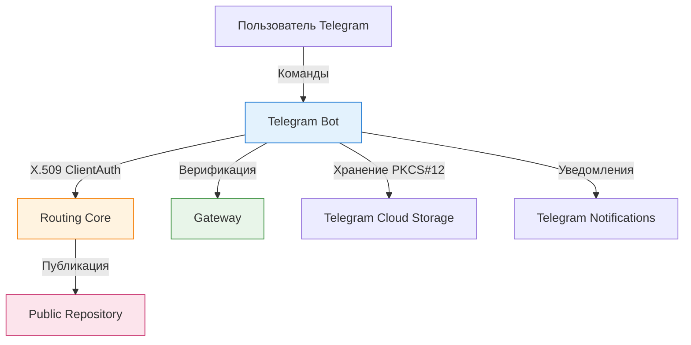
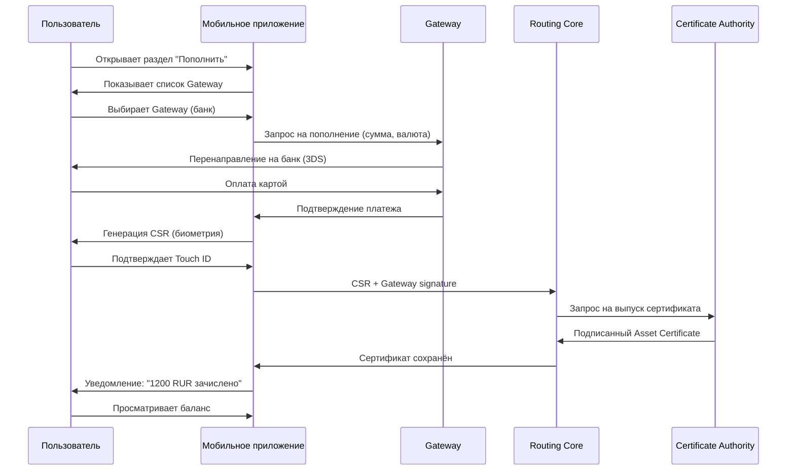
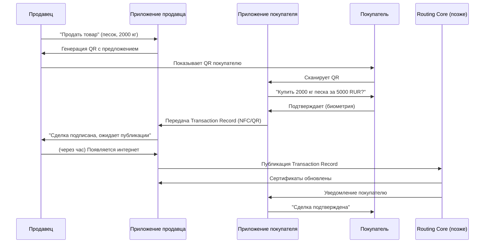
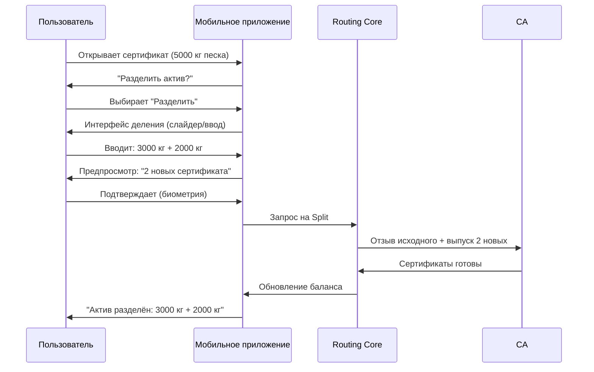
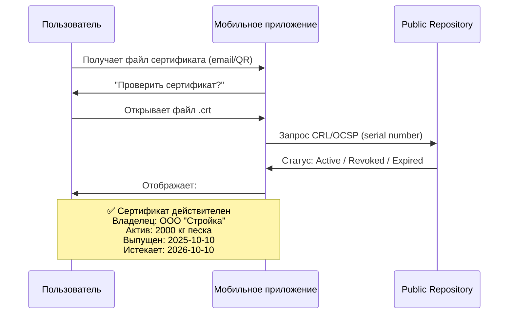
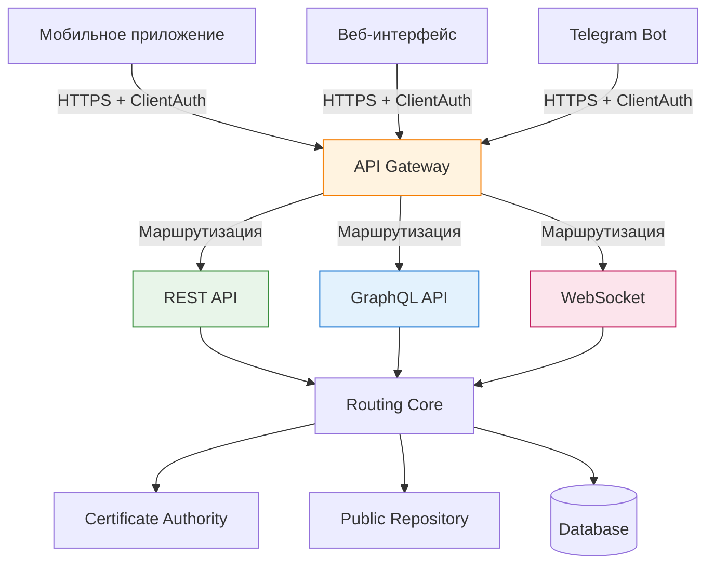

# 9. ИНТЕРФЕЙСЫ

[↑ Вернуться к оглавлению](Home.md)


------------------------------------------------------------------------

## 9.1. Мобильное приложение

Мобильное приложение TRS — основной интерфейс взаимодействия клиента с системой. Приложение использует встроенные механизмы PKI операционной системы и обеспечивает полный спектр операций с активами.

### Функциональные возможности

**Управление сертификатами:**

- Генерация и хранение PKCS#12 Wallet в защищённом хранилище ОС
- Просмотр активных Asset Certificate
- Синхронизация с Public Repository
- Проверка статусов сертификатов через CRL/OCSP

**Операции с активами:**

- Asset Registration через Gateway
- Asset Transfer в режимах Online и Offline
- Asset Split для делимых активов
- Withdrawal активов через Gateway

**Безопасность и аутентификация:**

- Использование биометрии (Touch ID, Face ID, отпечаток пальца)
- PIN-код как альтернатива биометрии
- Локальное хранение приватных ключей в Keychain/Keystore
- Подпись транзакций без передачи ключей

### Архитектурные особенности

> Мобильное приложение TRS не требует постоянного подключения к серверу и может выполнять функции Smartphone Node — полноценного узла системы.

**Встроенная поддержка PKI:**

- **iOS** — iOS Keychain, Secure Enclave
- **Android** — Android Keystore, Hardware Security Module
- **HarmonyOS** — TEE (Trusted Execution Environment)

Приложение взаимодействует с Routing Core через HTTPS с ClientAuth (взаимная аутентификация X.509), что обеспечивает защиту канала связи без дополнительных протоколов.

> Подробнее о stand-alone конфигурации и развёртывании на мобильных устройствах см. **раздел 5.3 Stand-alone архитектура**. О градации уровней безопасности для разных типов операций см. **раздел 8.1 Security Levels**.

### Режимы работы

**Online Mode:**

- Мгновенная валидация транзакций через Routing Core
- Автоматическая публикация в Public Repository
- Среднее время подтверждения: 5–20 секунд

**Offline Mode:**

- Локальное подписание Transaction Record
- Обмен сертификатами через QR-коды или NFC
- Отложенная публикация при восстановлении связи
- Grace Period для проверки и оспаривания

**Гибридный режим:**

- Автоматическое переключение между online/offline
- Буферизация операций при нестабильном соединении
- Приоритизация критичных транзакций

### Интеграция с системными функциями

**Камера:** 
Сканирование QR-кодов для:

- Получения публичных сертификатов контрагентов
- Передачи Transaction Record в Offline Mode
- Верификации подписей через визуальный канал

**NFC:** 
Бесконтактный обмен данными:

- Передача Asset Certificate между устройствами
- Быстрое подтверждение Atomic Swap
- Работа с NFC-картами для дополнительной аутентификации

**Уведомления:**

- Push-уведомления о входящих Asset Transfer
- Напоминания о неопубликованных Offline-транзакциях
- Алерты о критичных изменениях статусов сертификатов

------------------------------------------------------------------------

## 9.2. Telegram-боты

Telegram-боты предоставляют упрощённый интерфейс для базовых операций TRS, ориентированный на широкую аудиторию без технических навыков.

### Основные сценарии использования

**Регистрация и онбординг:**

- Создание учётной записи клиента через Telegram ID
- Генерация PKCS#12 Wallet с сохранением в облачном хранилище Telegram
- Первичная верификация через Gateway (опционально)

**Базовые операции:**

- Проверка баланса активов
- Отправка активов другим пользователям по @username или Telegram ID
- Запрос на Asset Registration через интегрированные Gateway
- Просмотр истории транзакций

**Уведомления:**

- Автоматические сообщения о входящих переводах
- Статусы обработки Transaction Record
- Предупреждения об отзыве сертификатов

### Архитектура взаимодействия



### Ограничения

> Telegram-боты подходят для простых операций, но не заменяют полноценное мобильное приложение при работе с крупными активами или сложными сценариями.

**Что доступно:**

- ✅ Asset Transfer в Online Mode
- ✅ Просмотр баланса и истории
- ✅ Базовая регистрация активов

**Что недоступно:**

- ❌ Offline Mode (нет локального хранения ключей)
- ❌ Asset Split (требует детальная настройка)
- ❌ Прямое взаимодействие с CRL/OCSP
- ❌ Биометрическая аутентификация

### Безопасность

**Хранение ключей:** 
Приватные ключи хранятся в зашифрованном виде в Telegram Cloud Storage. Пользователь получает пароль для доступа к PKCS#12, который не передаётся боту.

**Ограничения доступа:**

- Двухфакторная аутентификация через Telegram 2FA
- Лимиты на сумму переводов без дополнительной верификации
- Временные блокировки при подозрительной активности

------------------------------------------------------------------------

## 9.3. Веб-интерфейс

Веб-интерфейс TRS предназначен для административных задач, детального анализа транзакций и интеграции с корпоративными системами.

### Целевая аудитория

**Gateway и операторы:**

- Управление процессами Asset Registration и Withdrawal
- Мониторинг потоков активов через шлюз
- Генерация отчётности для регуляторов

**Корпоративные клиенты:**

- Массовые операции с активами (batch processing)
- Интеграция с ERP/CRM системами
- Настройка правил автоматизации (auto-settlement)

**Администраторы CA:**

- Управление жизненным циклом сертификатов
- Публикация CRL и настройка OCSP
- Аудит операций и расследование инцидентов

### Функциональные модули

**Dashboard (панель управления):**

- Сводная информация по активам клиента
- Графики движения активов по типам и Gateway
- Статистика по операциям (успешные/отклонённые)

**Transaction Explorer:**

- Детальный поиск по Transaction Record
- Просмотр цепочек Asset Certificate (от оригинального до текущего)
- Проверка подписей и статусов всех участников

**Certificate Manager:**

- Массовый выпуск сертификатов
- Настройка шаблонов для типовых активов
- Планирование отзыва (scheduled revocation)

**Reporting & Analytics:**

- Генерация отчётов для налоговых органов
- Экспорт данных в форматах CSV, JSON, XML
- Интеграция с BI-системами

### Аутентификация и авторизация

**Механизмы входа:**

- X.509 ClientAuth (основной метод)
- OAuth 2.0 / OIDC (для интеграции с корпоративными IdP)
- Multi-factor Authentication (TOTP, hardware tokens)

**Разграничение прав:**

- Role-Based Access Control (RBAC)
- Аудит всех административных действий
- Временные доступы для внешних аудиторов

### Технологический стек

**Frontend:**

- React / Vue.js для интерактивных интерфейсов
- WebCrypto API для работы с сертификатами в браузере
- Progressive Web App (PWA) для офлайн-доступа

**Backend:**

- REST API с ClientAuth
- WebSocket для real-time уведомлений
- GraphQL для сложных запросов (опционально)

------------------------------------------------------------------------

## 9.4. Биометрия, QR, NFC

Дополнительные механизмы аутентификации и обмена данными, повышающие удобство и безопасность операций.

### Биометрическая аутентификация

**Типы биометрии:**

- **Отпечаток пальца** (Touch ID, Android Fingerprint)
- **Распознавание лица** (Face ID, Android Face Unlock)
- **Голос** (для телефонных интерфейсов)
- **Радужка глаза** (в специализированных устройствах)

**Применение в TRS:**

*Разблокировка PKCS#12 Wallet:* 
Вместо ввода пароля пользователь подтверждает доступ к приватным ключам биометрией. Ключи остаются в защищённом хранилище (Keychain/Keystore) и никогда не покидают устройство.

*Подтверждение Transaction Record:* 
Критичные операции (Asset Transfer на крупные суммы, Withdrawal) требуют повторной биометрической аутентификации перед подписью.

*Восстановление доступа:* 
При смене устройства биометрия может использоваться как один из факторов верификации личности (в связке с seed-фразой или backup-ключом).

> Биометрия в TRS — локальный механизм защиты. Биометрические данные не передаются на серверы и не покидают устройство пользователя.

### QR-коды

QR-коды обеспечивают быструю передачу данных между устройствами в Offline Mode без необходимости физического контакта.

**Типы передаваемых данных:**

**Публичный сертификат клиента:** 
```
-----BEGIN CERTIFICATE-----
MIIDXTCCAkWgAwIBAgIJAKoZIh...
-----END CERTIFICATE-----
```

Контрагент сканирует QR и получает публичный ключ для верификации подписи.

**Transaction Record (подписанный JSON):** 
Документ сделки с подписями обеих сторон передаётся для публикации в Public Repository через любое устройство с интернетом.

**Asset Certificate (DER-encoded):** 
При Atomic Swap участники обмениваются сертификатами активов через QR для локальной проверки до отправки в Routing Core.

**Преимущества QR:**

- ✅ Работает без интернета
- ✅ Не требует сопряжения устройств
- ✅ Визуальный контроль передачи данных
- ✅ Совместимость с любыми камерами

**Ограничения:**

- ❌ Объём данных ограничен (до 4 КБ)
- ❌ Требуется хорошее освещение
- ❌ Не подходит для массовых операций

### NFC (Near Field Communication)

NFC обеспечивает бесконтактный обмен данными на расстоянии до 10 см, что удобно для быстрых транзакций face-to-face.

> Детальное описание процесса Offline-обмена с использованием QR и NFC см. **раздел 7.2.2 Offline Mode**.

**Сценарии использования:**

*Offline Atomic Swap:* 
Два пользователя прикладывают смартфоны друг к другу: 
1. Устройства обмениваются публичными сертификатами 
2. Формируется Transaction Record 
3. Обе стороны подписывают документ локально 
4. Сертификаты передаются между устройствами 
5. При появлении интернета любое устройство публикует транзакцию

*NFC-карты для дополнительной аутентификации:* 
Физическая карта с NFC-чипом хранит зашифрованную копию PKCS#12 или seed-фразу. Для доступа к активам требуется:

- Смартфон (что-то, что у тебя есть)
- NFC-карта (что-то, что у тебя есть физически)
- PIN или биометрия (что-то, что ты знаешь/кем являешься)

*Терминалы для Gateway:* 
Платёжные терминалы с NFC могут выступать точками Asset Registration — пользователь прикладывает телефон, подтверждает операцию, и Gateway выпускает сертификат актива.

**Преимущества NFC:**

- ✅ Быстрее QR (1-2 секунды)
- ✅ Больший объём данных (до 32 КБ)
- ✅ Работает в темноте
- ✅ Защита от перехвата (малая дальность)

**Ограничения:**

- ❌ Не все устройства поддерживают NFC
- ❌ Требуется близкое расположение
- ❌ Может не работать в металлических чехлах

### Комбинированные сценарии

**Биометрия + QR:** 
Пользователь разблокирует PKCS#12 биометрией, после чего приложение генерирует QR с подписанным Transaction Record.

**Биометрия + NFC:** 
При прикладывании NFC-карты требуется биометрическое подтверждение для разблокировки зашифрованных данных на карте.

**QR + NFC (fallback):** 
Если NFC недоступен или не работает, система автоматически переключается на передачу через QR.

------------------------------------------------------------------------

## 9.5. Примеры UX-потоков

Типичные пользовательские сценарии с точки зрения интерфейса.

### Сценарий 1: Регистрация актива через Gateway (Cash-in)



**Ключевые элементы UX:**

- Минимум шагов (выбор Gateway → оплата → подтверждение)
- Автоматическая генерация CSR без технических деталей
- Понятное уведомление (“зачислено” вместо “сертификат выпущен”)
- Мгновенное отображение баланса

### Сценарий 2: Передача актива другому пользователю (Online P2P)

 ```mermaid
sequenceDiagram
    participant A as Алиса
    participant MA as Мобильное приложение
    participant RC as Routing Core
    participant MB as Приложение Боба
    participant B as Боб
    
    A->>MA: "Отправить"
    MA->>A: Ввод получателя (ID, @username, QR)
    A->>MA: Сканирует QR Боба
    MA->>A: Отображает данные Боба
    A->>MA: Вводит сумму (500 RUR)
    MA->>A: Предпросмотр: "Боб получит 500 RUR"
    A->>MA: Подтверждает (биометрия)
    MA->>RC: Transaction Record (Алиса→Боб)
    RC->>MA: Транзакция принята
    RC->>MB: Push-уведомление Бобу
    MB->>B: "Получено 500 RUR от Алисы"
    MA->>A: "Отправлено Бобу"
```    

**Ключевые элементы UX:**

- Несколько способов ввода получателя (ID, username, QR)
- Предпросмотр транзакции перед подтверждением
- Мгновенные уведомления обеим сторонам
- Понятный статус (“Отправлено” / “Получено”)

### Сценарий 3: Offline обмен активами (Atomic Swap)



**Ключевые элементы UX:**

- Режим работает без интернета (явно указано)
- Локальное подтверждение сделки
- Автоматическая публикация при появлении сети
- Уведомления обеим сторонам после публикации

### Сценарий 4: Деление актива (Split)



**Ключевые элементы UX:**

- Интуитивный интерфейс деления (слайдер, распределение процентов)
- Валидация суммы (должна равняться исходной)
- Предпросмотр результата
- Понятное уведомление об успехе

### Сценарий 5: Проверка статуса сертификата



**Ключевые элементы UX:**

- Одно действие — открыть файл
- Автоматическая проверка статуса
- Понятное отображение данных сертификата
- Цветовая индикация (зелёный = валиден, красный = отозван)

------------------------------------------------------------------------

## 9.6. Расширения интерфейсов (API)

Все клиентские интерфейсы TRS взаимодействуют с Routing Core через унифицированный API, обеспечивающий единообразие операций независимо от типа интерфейса.

### Архитектура API

**Базовые принципы:**

- **X.509 ClientAuth** — обязательная взаимная аутентификация для всех запросов
- **HTTPS-only** — отсутствие незащищённых каналов связи
- **Stateless** — каждый запрос содержит полный контекст операции
- **Idempotency** — повторные запросы с одним ID не создают дубликатов

**Архитектурные слои:**



### REST API

Основной интерфейс для синхронных операций. Используется мобильными приложениями и веб-интерфейсом для большинства операций.

**Базовые эндпоинты:**

| Метод | Endpoint | Описание | Аутентификация |
|-------|------------------------------|--------------------------------------------|-------------------------------------|
| POST | /api/v1/register_asset | Asset Registration (Cash-in) | X.509 Client + Gateway signature |
| POST | /api/v1/transfer_asset | Asset Transfer (P2P) | X.509 Client |
| POST | /api/v1/split_asset | Asset Split | X.509 Client |
| POST | /api/v1/withdraw_asset | Withdrawal (Cash-out) | X.509 Client + Gateway verification |
| GET | /api/v1/get_asset_status | Проверка статуса конкретного актива | X.509 Client или Public |
| GET | /api/v1/list_certificates | Список сертификатов клиента | X.509 Client |
| GET | /api/v1/transaction_status | Статус Transaction Record | X.509 Client или Public |
| POST | /api/v1/publish_transaction | Публикация Offline-транзакции | X.509 Client |
| GET | /api/v1/certificate_validity | Проверка валидности сертификата (CRL/OCSP) | Public |

### Детальное описание REST-точек

Каждая точка поддерживается всеми типами клиентов с учётом специфики платформы.

| Endpoint | Mobile App | Web Interface | Telegram Bot | Примечания |
|----------------------|--------------------|---------------------|------------------------|---------------------------------------------|
| `/register_asset` | ✓ Полная поддержка | ✓ Полная поддержка | ✓ Упрощённый интерфейс | Требуется Gateway signature |
| `/transfer_asset` | ✓ Online + Offline | ✓ Только Online | ✓ Только Online | Mobile поддерживает QR/NFC |
| `/get_asset_status` | ✓ С кешированием | ✓ Real-time | ✓ По запросу | Public endpoint, аутентификация опциональна |
| `/list_certificates` | ✓ С пагинацией | ✓ Фильтры + экспорт | ✓ Только активные | Web поддерживает CSV/JSON экспорт |

#### POST /api/v1/register_asset — Регистрация актива

Используется для ввода новых активов в систему через Gateway (Cash-in).

**Применение:**

- Мобильное приложение — при пополнении счёта через банк
- Веб-интерфейс — массовая регистрация товаров через Gateway
- Telegram-бот — простое пополнение для базовых пользователей

**Запрос:**

```
POST /api/v1/register_asset
Content-Type: application/json
X-Client-Certificate: [X.509 cert пользователя]
X-Gateway-Signature: [Подпись Gateway]

{
  "registration_id": "reg_67890",
  "timestamp": "2025-10-13T12:00:00Z",
  "client_id": "alice@example.com",
  "gateway_id": "freepay.gateway",
  "asset_type": "RUR",
  "quantity": 5000,
  "source_transaction": {
    "external_id": "bank_tx_12345",
    "payment_method": "card",
    "proof_url": "https://bank.com/receipt/12345"
  },
  "csr": "-----BEGIN CERTIFICATE REQUEST-----...",
  "client_signature": "base64_signature"
}
```


**Ответ (успех):**

```
{
  "status": "success",
  "registration_id": "reg_67890",
  "asset_certificate": {
    "serial": "C001",
    "asset_id": "asset_5000_rur_001",
    "asset_type": "RUR",
    "quantity": 5000,
    "owner": "alice@example.com",
    "gateway": "freepay.gateway",
    "issued_at": "2025-10-13T12:00:05Z",
    "expires_at": "2026-10-13T12:00:05Z",
    "download_url": "https://repo.trs/certs/C001.crt"
  },
  "published_at": "2025-10-13T12:00:06Z"
}
```

**Ответ (ошибка):**

```
{
  "status": "error",
  "error_code": "GATEWAY_SIGNATURE_INVALID",
  "message": "Gateway signature verification failed",
  "details": {
    "gateway_id": "freepay.gateway",
    "signature_checked": true,
    "reason": "Signature does not match Gateway public key"
  }
}
```

------------------------------------------------------------------------

#### POST /api/v1/transfer_asset — Передача актива

Используется для P2P передачи активов между клиентами (Online режим).

**Применение:**

- Мобильное приложение — отправка денег или товаров другому пользователю
- Веб-интерфейс — массовые переводы между счетами
- Telegram-бот — быстрые P2P переводы по @username

**Запрос:**

```
POST /api/v1/transfer_asset
Content-Type: application/json
X-Client-Certificate: [X.509 cert отправителя]

{
  "transaction_id": "tx_11111",
  "timestamp": "2025-10-13T14:30:00Z",
  "sender": {
    "client_id": "alice@example.com",
    "asset_cert_serial": "C001"
  },
  "receiver": {
    "client_id": "bob@example.com",
    "public_cert": "-----BEGIN CERTIFICATE-----..."
  },
  "transfer": {
    "asset_type": "RUR",
    "quantity": 1500
  },
  "change": {
    "quantity": 3500
  },
  "sender_signature": "base64_signature",
  "receiver_agreement": "base64_receiver_signature"
}
```


**Ответ (успех):**

 ```
{
  "status": "success",
  "transaction_id": "tx_11111",
  "atomic_swap": {
    "revoked_certificates": ["C001"],
    "new_certificates": {
      "sender": {
        "serial": "C002",
        "quantity": 3500,
        "asset_type": "RUR",
        "download_url": "https://repo.trs/certs/C002.crt"
      },
      "receiver": {
        "serial": "D001",
        "quantity": 1500,
        "asset_type": "RUR",
        "download_url": "https://repo.trs/certs/D001.crt"
      }
    }
  },
  "published_at": "2025-10-13T14:30:05Z",
  "confirmation_time_ms": 4872
}
```

**Ответ (ошибка — недостаточно средств):**

```
{
  "status": "error",
  "error_code": "INSUFFICIENT_BALANCE",
  "message": "Asset certificate balance insufficient for transfer",
  "details": {
    "requested_quantity": 1500,
    "available_quantity": 1200,
    "asset_cert_serial": "C001"
  }
}
```

------------------------------------------------------------------------

#### GET /api/v1/get_asset_status — Проверка статуса актива

Используется для получения текущего статуса конкретного Asset Certificate.

**Применение:**

- Мобильное приложение — проверка валидности сертификата перед обменом
- Веб-интерфейс — аудит статусов активов компании
- Telegram-бот — быстрая проверка “действителен ли сертификат?”

**Запрос:**
```
GET /api/v1/get_asset_status?serial=C001&check_crl=true
X-Client-Certificate: [X.509 cert] (опционально для публичной проверки)
```

*Параметры:*
* @serial@ — серийный номер сертификата (обязательно)
* @check_crl@ — проверить CRL/OCSP (по умолчанию true)
* @include_history@ — включить историю Split/Transfer (по умолчанию false)

**Ответ (сертификат активен):**

```
{
  "serial": "C001",
  "status": "ACTIVE",
  "asset": {
    "asset_id": "asset_5000_rur_001",
    "asset_type": "RUR",
    "quantity": 5000,
    "total_original": 5000,
    "divisible": true
  },
  "owner": {
    "client_id": "alice@example.com",
    "public_cert_url": "https://repo.trs/clients/alice.crt"
  },
  "lifecycle": {
    "issued_at": "2025-10-13T12:00:05Z",
    "expires_at": "2026-10-13T12:00:05Z",
    "days_until_expiry": 365
  },
  "gateway": {
    "gateway_id": "freepay.gateway",
    "registration_tx": "reg_67890"
  },
  "crl_check": {
    "checked_at": "2025-10-13T15:00:00Z",
    "status": "NOT_REVOKED",
    "crl_url": "https://repo.trs/crl/latest.crl"
  }
}
```

**Ответ (сертификат отозван):**

```
{
  "serial": "C001",
  "status": "REVOKED",
  "revocation": {
    "revoked_at": "2025-10-13T14:30:05Z",
    "reason": "CERTIFICATE_TRANSFERRED",
    "transaction_id": "tx_11111",
    "replaced_by": ["C002", "D001"]
  },
  "crl_check": {
    "checked_at": "2025-10-13T15:00:00Z",
    "status": "REVOKED",
    "crl_url": "https://repo.trs/crl/latest.crl"
  }
}
```

------------------------------------------------------------------------

#### GET /api/v1/list_certificates — Список сертификатов клиента

Используется для получения всех активных сертификатов, принадлежащих клиенту.

**Применение:**

- Мобильное приложение — отображение баланса и списка активов
- Веб-интерфейс — детальный просмотр портфеля активов
- Telegram-бот — команда /balance для проверки состояния счёта

**Запрос:**
```
GET /api/v1/list_certificates?status=ACTIVE&asset_type=RUR&limit=50&offset=0
X-Client-Certificate: [X.509 cert клиента]
```

**Параметры:**

- `status` — фильтр по статусу (ACTIVE, REVOKED, EXPIRED, ALL)
- `asset_type` — фильтр по типу актива (RUR, BTC, SAND, ALL)
- `limit` — количество результатов (по умолчанию 50, max 200)
- `offset` — смещение для пагинации (по умолчанию 0)
- `sort` — сортировка (issued_at_desc, quantity_desc, expires_at_asc)

**Ответ:**

```
{
  "client_id": "alice@example.com",
  "total_certificates": 3,
  "total_assets_value": {
    "RUR": 8500,
    "BTC": 0.5,
    "SAND": 3000
  },
  "certificates": [
    {
      "serial": "C002",
      "status": "ACTIVE",
      "asset_type": "RUR",
      "quantity": 3500,
      "issued_at": "2025-10-13T14:30:05Z",
      "expires_at": "2026-10-13T14:30:05Z",
      "gateway": "freepay.gateway",
      "download_url": "https://repo.trs/certs/C002.crt"
    },
    {
      "serial": "C003",
      "status": "ACTIVE",
      "asset_type": "RUR",
      "quantity": 5000,
      "issued_at": "2025-10-12T10:00:00Z",
      "expires_at": "2026-10-12T10:00:00Z",
      "gateway": "unionpay.gateway",
      "download_url": "https://repo.trs/certs/C003.crt"
    },
    {
      "serial": "S001",
      "status": "ACTIVE",
      "asset_type": "SAND",
      "quantity": 3000,
      "total_original": 5000,
      "issued_at": "2025-10-10T08:00:00Z",
      "expires_at": "2026-10-10T08:00:00Z",
      "gateway": "materials.gateway",
      "parent_cert": "S000",
      "download_url": "https://repo.trs/certs/S001.crt"
    }
  ],
  "pagination": {
    "limit": 50,
    "offset": 0,
    "has_more": false
  }
}
```

**Ответ (нет активных сертификатов):**

```
{
  "client_id": "alice@example.com",
  "total_certificates": 0,
  "total_assets_value": {},
  "certificates": [],
  "message": "No active certificates found for this client"
}
```

**Формат запроса (пример Asset Transfer):**

```
POST /api/v1/transfer_asset
Content-Type: application/json
X-Client-Certificate: [X.509 cert]

{
  "transaction_id": "tx_12345",
  "timestamp": "2025-10-13T10:30:00Z",
  "sender": {
    "client_id": "alice@example.com",
    "asset_cert_serial": "A001"
  },
  "receiver": {
    "client_id": "bob@example.com",
    "public_key": "-----BEGIN CERTIFICATE-----..."
  },
  "amount": 500,
  "asset_type": "RUR",
  "signature": "base64_encoded_signature"
}
```

> Полное описание эндпоинтов `/register_asset`, `/transfer_asset`, `/get_asset_status` и `/list_certificates` с примерами запросов и ответов см. выше в разделе “Детальное описание REST-точек”.

### GraphQL API

Используется для сложных запросов, требующих агрегации данных из нескольких источников. Особенно полезен для веб-интерфейса и аналитических панелей.

**Преимущества:**

- Гибкость выборки данных (запрашиваются только нужные поля)
- Единая точка входа для сложных операций
- Встроенная типизация и документация (introspection)
- Сокращение числа запросов (batch operations)

**Пример запроса (история транзакций с детализацией):**

```
query GetClientHistory {
  client(id: "alice@example.com") {
    id
    certificates(status: ACTIVE) {
      serial
      assetType
      quantity
      issuedAt
      expiresAt
    }
    transactions(limit: 10) {
      id
      timestamp
      type
      counterparty {
        id
        publicKey
      }
      assets {
        before {
          serial
          quantity
        }
        after {
          serial
          quantity
        }
      }
    }
  }
}
```

**Мутации (изменение состояния):**

```
mutation TransferAsset {
  transferAsset(input: {
    transactionId: "tx_12345"
    receiverId: "bob@example.com"
    assetSerial: "A001"
    amount: 500
    signature: "base64_signature"
  }) {
    success
    transaction {
      id
      status
      newCertificates {
        serial
        downloadUrl
      }
    }
    errors {
      field
      message
    }
  }
}
```

### WebSocket (Real-time уведомления)

Используется для мгновенного оповещения клиентов о событиях в системе без постоянного polling.

**События:**

| Событие | Описание | Данные |
|----------------------|----------------------------------|-----------------------------------------------|
| asset.incoming | Входящий Asset Transfer | transaction_id, sender_id, amount, asset_type |
| asset.confirmed | Подтверждение транзакции | transaction_id, new_cert_serial, download_url |
| asset.revoked | Отзыв сертификата актива | cert_serial, revoked_at, reason |
| certificate.expiring | Приближение срока истечения | cert_serial, expires_at, days_left |
| settlement.completed | Завершение Settlement в клиринге | settlement_id, net_position, new_certs |

**Пример подключения (JavaScript):**

```
const ws = new WebSocket('wss://api.trs/v1/events');

ws.on('open', () => {
  ws.send(JSON.stringify({
    type: 'auth',
    client_cert: clientCertificate,
    signature: signedToken
  }));
});

ws.on('message', (event) => {
  const data = JSON.parse(event.data);
  
  switch(data.type) {
    case 'asset.incoming':
      showNotification(`Получено ${data.amount} ${data.asset_type} от ${data.sender_id}`);
      break;
    case 'asset.confirmed':
      updateBalance();
      downloadCertificate(data.download_url);
      break;
  }
});
```

### Интеграция с внешними системами

**Webhook для Gateway:**

Gateway может регистрировать webhook для получения уведомлений о событиях, требующих их участия (Asset Registration, Withdrawal).

```
POST /api/v1/gateways/webhook
Content-Type: application/json
X-Gateway-Certificate: [Gateway X.509]

{
  "url": "https://gateway.example.com/trs-events",
  "events": ["registration.request", "withdrawal.request"],
  "signature_verification": true
}
```

**OAuth 2.0 / OIDC:**

Для корпоративных интеграций поддерживается аутентификация через OAuth 2.0 в дополнение к X.509 ClientAuth. Используется для делегирования доступа внешним системам (ERP, CRM).

**SDK и библиотеки:**

Routing Core предоставляет официальные SDK для основных языков:

- JavaScript/TypeScript (npm: @trs/client)
- Python (pip: trs-client)
- Go (go get github.com/trs/client-go)
- Java (Maven: com.trs:trs-client)

### Безопасность API

**Rate Limiting:**

- Обычные операции: 100 запросов/минуту
- Публикация транзакций: 10 запросов/минуту
- Проверка статусов (public): 1000 запросов/минуту

**Signature Verification:** 
Все запросы, изменяющие состояние, должны содержать подпись от приватного ключа клиента. Routing Core проверяет подпись перед выполнением операции.

**IP Whitelisting (опционально):** 
Gateway и корпоративные клиенты могут ограничить доступ к API только с определённых IP-адресов.

> Подробнее о механизмах безопасности API см. **раздел 8. БЕЗОПАСНОСТЬ**.

------------------------------------------------------------------------

## Итог раздела 9

Раздел описывает пользовательские интерфейсы TRS — от мобильных приложений до вспомогательных механизмов (QR, NFC, биометрия) и программных интерфейсов для интеграции.

**Ключевые выводы:**

- **Мобильное приложение** — основной интерфейс, использующий встроенные PKI-механизмы ОС
- **Telegram-боты** — упрощённый вариант для базовых операций
- **Веб-интерфейс** — административные функции и интеграция с корпоративными системами
- **Биометрия** — локальная защита без передачи данных на серверы
- **QR и NFC** — обеспечивают работу в Offline Mode
- **UX-потоки** — простые сценарии с минимумом шагов и понятными уведомлениями
- **API (REST/GraphQL/WebSocket)** — унифицированный программный интерфейс для всех типов клиентов

Все интерфейсы опираются на единую архитектуру TRS: PKCS#12 Wallet, X.509 ClientAuth, Transaction Record и Public Repository.

Далее (раздел 10) описываются технические форматы и структуры данных.

-----

[↓ Перейти к следующему разделу](TRS_10.md)

[↑ Вернуться к оглавлению](Home.md)